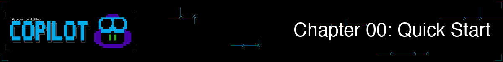
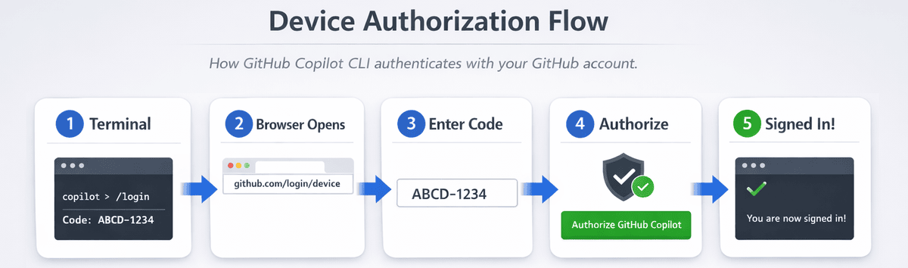

ようこそ。この章では、GitHub Copilot CLI (Command Line Interface) のインストール、GitHub account での sign in、そして正常に動作することの確認までを行います。まずは短い setup 編です。準備ができたら、本格的な demo は Chapter 01 から始まります。

## 🎯 学習目標

この章を終える頃には、次のことができるようになります。

- GitHub Copilot CLI を install する
- GitHub account で sign in する
- 簡単な test で動作確認する

> ⏱️ **想定時間**: 約 10 分 (読む時間 5 分 + hands-on 5 分)

---

## ✅ 前提条件

- **GitHub Account** と Copilot access を持っていること。[subscription options](https://github.com/features/copilot/plans) はこちら。学生・教職員は [GitHub Education](https://education.github.com/pack) 経由で Copilot Pro を無料利用できます。
- **Terminal の基本操作**: `cd` や `ls` のようなコマンドに慣れていること

### 「Copilot Access」とは

GitHub Copilot CLI を使うには、有効な Copilot subscription が必要です。状態は [github.com/settings/copilot](https://github.com/settings/copilot) で確認できます。次のいずれかが表示されているはずです。

- **Copilot Individual** - Personal subscription
- **Copilot Business** - Through your organization
- **Copilot Enterprise** - Through your enterprise
- **GitHub Education** - Free for verified students/teachers

もし "You don't have access to GitHub Copilot" と表示された場合は、free option の利用、plan への subscription、または access を提供している organization への参加が必要です。

---

## Installation

> ⏱️ **目安時間**: Installation は 2〜5 分ほどです。Authentication にはさらに 1〜2 分かかります。

### GitHub Codespaces (Zero Setup)

前提ソフトを local に install したくない場合は、GitHub Codespaces を利用できます。GitHub Copilot CLI がすぐ使える状態で用意されており、Python と pytest もあらかじめ install されています。必要なのは sign in だけです。

1. [Fork this repository](https://github.com/github/copilot-cli-for-beginners/fork) to your GitHub account
2. Select **Code** > **Codespaces** > **Create codespace on main**
3. Wait a few minutes for the container to build
4. You're ready to go! The terminal will open automatically in the Codespace environment.

> 💡 **Verify in Codespace**: Run `cd samples/book-app-project && python book_app.py help` to confirm Python and the sample app are working.

### Local Installation

course sample を使いながら local machine 上で Copilot CLI を動かしたい場合は、次の手順に従ってください。

1. Clone the repo to get the course samples on your machine:

    ```bash
    git clone https://github.com/github/copilot-cli-for-beginners
    cd copilot-cli-for-beginners
    ```

2. Install Copilot CLI using one of the following options.

    > 💡 **Not sure which to pick?** Use `npm` if you have Node.js installed. Otherwise, choose the option that matches your system.

    ### All Platforms (npm)

    ```bash
    # If you have Node.js installed, this is a quick way to get the CLI
    npm install -g @github/copilot
    ```

    ### macOS/Linux (Homebrew)

    ```bash
    brew install copilot-cli
    ```

    ### Windows (WinGet)

    ```bash
    winget install GitHub.Copilot
    ```

    ### macOS/Linux (Install Script)

    ```bash
    curl -fsSL https://gh.io/copilot-install | bash
    ```

---

## Authentication

`copilot-cli-for-beginners` repository の root で terminal を開き、CLI を起動して folder への access を許可します。

```bash
copilot
```

You'll be asked to trust the folder containing the repository (if you haven't already). You can trust it one time or across all future sessions.


folder を trust したら、GitHub account で sign in できます。

```
> /login
```

**このあと起きること:**

1. Copilot CLI が 1 回限りの code (例: `ABCD-1234`) を表示します
2. browser が GitHub の device authorization page を開きます。まだなら GitHub に sign in してください
3. 表示された code を入力します
4. "Authorize" を選んで GitHub Copilot CLI への access を許可します
5. terminal に戻れば sign in 完了です



*device authorization flow では、terminal が code を生成し、それを browser で確認することで Copilot CLI が認証されます。*

**Tip**: sign-in 状態は session をまたいで保持されます。token が期限切れになるか、明示的に sign out しない限り、通常は 1 回だけで大丈夫です。

---

## 動作確認

### Step 1: Copilot CLI を test する

sign in が完了したので、Copilot CLI が正しく動いているか確認しましょう。まだ起動していない場合は terminal で CLI を開始します。

```bash
> Say hello and tell me what you can help with
```

After you receive a response, you can exit the CLI:

```bash
> /exit
```

---

<details>
<summary>🎬 See it in action!</summary>


*Demo output varies. Your model, tools, and responses will differ from what's shown here.*

</details>

---

**期待される出力**: Copilot CLI ができることを案内する、フレンドリーな応答が返ってきます。

### Step 2: Sample Book App を動かす

この course では、CLI を使って継続的に確認・改善していく sample app を用意しています *(code は /samples/book-app-project にあります)*。始める前に、この *Python book collection terminal app* が動くことを確認してください。system に応じて `python` または `python3` を使用します。

> **Note:** The primary examples shown throughout the course use Python (`samples/book-app-project`) so you'll need to have [Python 3.10+](https://www.python.org/downloads/) available on your local machine if you chose that option (the Codespace already has it installed). JavaScript (`samples/book-app-project-js`) and C# (`samples/book-app-project-cs`) versions are also available if you prefer to work with those languages. Each sample has a README with instructions for running the app in that language.

```bash
cd samples/book-app-project
python book_app.py list
```

**期待される出力**: "The Hobbit"、"1984"、"Dune" を含む 5 冊の本の一覧が表示されます。

### Step 3: Book App と一緒に Copilot CLI を試す

Navigate back to the repository root first (if you ran Step 2):

```bash
cd ../..   # Back to the repository root if needed
copilot 
> What does @samples/book-app-project/book_app.py do?
```

**期待される出力**: book app の主な機能と command を要約した説明が返ってきます。

もし error が出た場合は、下の [troubleshooting section](#troubleshooting) を確認してください。

Once you're done you can exit the Copilot CLI:

```bash
> /exit
```

---

## ✅ 準備完了です

installation はこれで完了です。本番は Chapter 01 から始まります。次のことを体験します。

- AI が book app を review して code quality の課題をすぐ見つける
- Copilot CLI の 3 つの使い方を学ぶ
- plain English から動く code を生成する

**[Continue to Chapter 01: First Steps →](../01-setup-and-first-steps/README.md)**

---

## トラブルシューティング

### "copilot: command not found"

The CLI isn't installed. Try a different installation method:

```bash
# If brew failed, try npm:
npm install -g @github/copilot

# Or the install script:
curl -fsSL https://gh.io/copilot-install | bash
```

### "You don't have access to GitHub Copilot"

1. Verify you have a Copilot subscription at [github.com/settings/copilot](https://github.com/settings/copilot)
2. Check that your organization permits CLI access if using a work account

### "Authentication failed"

Re-authenticate:

```bash
copilot
> /login
```

### Browser が自動で開かない場合

Manually visit [github.com/login/device](https://github.com/login/device) and enter the code shown in your terminal.

### Token の期限が切れた場合

Simply run `/login` again:

```bash
copilot
> /login
```

### まだ解決しない場合

- [GitHub Copilot CLI documentation](https://docs.github.com/copilot/concepts/agents/about-copilot-cli) を確認する
- [GitHub Issues](https://github.com/github/copilot-cli/issues) を検索する

---

## 🔑 重要なポイント

1. **GitHub Codespace は最短の始め方です** - Python、pytest、GitHub Copilot CLI が pre-install 済みなので、すぐに demo を始められます
2. **複数の installation 方法があります** - Homebrew、WinGet、npm、install script から環境に合うものを選べます
3. **authentication は基本 1 回です** - token の期限が切れるまで login 状態が保持されます
4. **book app が今後の教材になります** - `samples/book-app-project` を course 全体で使います

> 📚 **Official Documentation**: [Install Copilot CLI](https://docs.github.com/copilot/how-tos/copilot-cli/cli-getting-started) for installation options and requirements.

> 📋 **Quick Reference**: See the [GitHub Copilot CLI command reference](https://docs.github.com/en/copilot/reference/cli-command-reference) for a complete list of commands and shortcuts.

---

**[Continue to Chapter 01: First Steps →](../01-setup-and-first-steps/README.md)**
