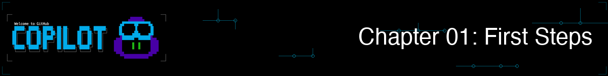

> **看 AI 即时发现 Bug、解释令人困惑的代码并生成可运行的脚本。然后学会三种不同的 GitHub Copilot CLI 使用方式。**

魔法从这章开始！你将亲身体验为何开发者将 GitHub Copilot CLI 描述为"随时待命的高级工程师"。你将看到 AI 在几秒内发现安全漏洞、用简洁的语言解释复杂代码，并即时生成可运行的脚本。然后你将掌握三种交互模式（交互式、计划式和编程式），了解何时使用哪种模式。

> ⚠️ **前置条件**：请确认已完成 **[第 00 章：快速入门](../00-quick-start/README.zh-CN.md)**。运行以下演示前需要安装并认证 GitHub Copilot CLI。

## 🎯 学习目标

完成本章后，你将能够：

- 通过动手演示体验 GitHub Copilot CLI 带来的生产力提升
- 针对不同任务选择正确的模式（交互式、计划式或编程式）
- 使用斜杠命令控制会话

> ⏱️ **预计用时**：约 45 分钟（阅读 15 分钟 + 动手 30 分钟）

---

# 你的第一次 Copilot CLI 体验


直接上手，看看 Copilot CLI 能做什么。

---

## 上手体验：第一批提示词

在深入精彩演示之前，先从一些简单的提示词开始。**不需要任何代码仓库**！只需打开终端并启动 Copilot CLI：

```bash
copilot
```

尝试这些适合初学者的提示词：

```
> Explain what a dataclass is in Python in simple terms

> Write a function that sorts a list of dictionaries by a specific key

> What's the difference between a list and a tuple in Python?

> Give me 5 best practices for writing clean Python code
```

不用 Python？没问题！只需提问你所用语言相关的问题。

注意这种方式有多自然。就像和同事交流一样，直接提问就行。探索完毕后，输入 `/exit` 退出会话。

**核心洞察**：GitHub Copilot CLI 是对话式的。入门不需要特殊语法，用自然语言提问即可。

## 实际演示

现在来看看为何开发者将其称为"随时待命的高级工程师"。

> 📖 **阅读示例说明**：以 `>` 开头的行是你在交互式 Copilot CLI 会话中输入的提示词。没有 `>` 前缀的行是你在终端中运行的 Shell 命令。

> 💡 **关于示例输出**：课程中的示例输出仅供参考。由于 Copilot CLI 每次响应都会有所不同，你的结果在措辞、格式和细节上都会有差异。关注**返回信息的类型**，而不是具体文字。

### 演示 1：即时代码审查

课程包含带有预设代码质量问题的示例文件。来审查一下：

```bash
# 如果本地工作且尚未克隆，先克隆课程仓库
git clone https://github.com/github/copilot-cli-for-beginners
cd copilot-cli-for-beginners

# 启动 Copilot
copilot
```

进入交互式会话后：

```
> Review @samples/book-app-project/book_app.py for code quality issues and suggest improvements
```

> 💡 **`@` 是什么？** `@` 符号告诉 Copilot CLI 读取某个文件。你将在第 02 章全面了解它。现在只需完整复制命令即可。

---

<details>
<summary>🎬 看实际演示！</summary>


*演示输出仅供参考。你的模型、工具和响应将与此处显示的不同。*

</details>

---

**核心要点**：几秒钟内完成专业代码审查。手动审查要花的时间……嗯，肯定比这长！

---

### 演示 2：解释令人困惑的代码

曾经盯着代码发愣，不知道它在做什么？在你的 Copilot CLI 会话中试试：

```
> Explain what @samples/book-app-project/books.py does in simple terms
```

---

<details>
<summary>🎬 看实际演示！</summary>


*演示输出仅供参考。你的模型、工具和响应将与此处显示的不同。*

</details>

---

**发生了什么**：（你的输出可能不同）Copilot CLI 读取文件，理解代码，用简洁的语言进行解释。

```
This is a book collection management module using Python dataclasses.

Think of it like a digital bookshelf:
- Book is a dataclass - a simple way to store book information (title, author, year, read status)
- BookCollection manages the entire collection and handles saving/loading

Key components:

1. @dataclass decorator (line 8)
   - Automatically creates __init__, __repr__, etc.
   - Clean way to define data structures in Python

2. BookCollection class (line 16)
   - Maintains a list of Book objects
   - Handles persistence with JSON file I/O
   - load_books() reads from data.json
   - save_books() writes to data.json using asdict()

3. Book operations:
   - add_book() - creates and saves new books
   - find_book_by_title() - searches collection
   - mark_as_read() - updates read status
   - find_by_author() - filters by author name

Common pattern: Read from JSON → Work with Python objects → Write back to JSON
```

**核心要点**：复杂代码得到如耐心导师般的讲解。

---

### 演示 3：生成可运行代码

需要一个原本要花 15 分钟 Google 的函数？继续在你的会话中：

```
> Write a Python function that takes a list of books and returns statistics: 
  total count, number read, number unread, oldest and newest book
```

---

<details>
<summary>🎬 看实际演示！</summary>


*演示输出仅供参考。你的模型、工具和响应将与此处显示的不同。*

</details>

---

**发生了什么**：几秒钟内生成完整、可运行的函数，可以直接复制粘贴运行。

探索完毕后，退出会话：

```
> /exit
```

**核心要点**：即时满足，而且整个过程始终在一个连续的会话中进行。

---

# 模式与命令


你刚刚看到了 Copilot CLI 的能力。现在来了解*如何*有效使用这些功能。关键在于知道对不同情况使用三种交互模式中的哪一种。

> 💡 **注意**：Copilot CLI 还有一种 **Autopilot** 模式，它会在无需等待你输入的情况下完成任务。它功能强大，但需要授予完整权限并自主使用高级请求。本课程重点介绍以下三种模式。等你熟悉这三种模式后，我们会指引你了解 Autopilot。

---

## 🧩 现实类比：外出就餐

把使用 GitHub Copilot CLI 想象成外出就餐。从计划出行到点菜，不同情况有不同的方式：

| 模式 | 就餐类比 | 使用时机 |
|------|---------|---------|
| **计划式** | 去餐厅的 GPS 路线 | 复杂任务——规划路线、确认节点、达成共识，然后出发 |
| **交互式** | 与服务员交谈 | 探索与迭代——提问、自定义、获取实时反馈 |
| **编程式** | 得来速点餐 | 快速、具体的任务——在你的环境中，快速得到结果 |

就像外出就餐一样，你会自然而然地学会何时使用哪种方式。


*根据任务选择模式：计划式用于事先规划，交互式用于来回协作，编程式用于快速一次性结果*

### 从哪种模式开始？

**从交互式模式开始。**
- 可以实验并提出后续问题
- 上下文在对话中自然积累
- 错误可以用 `/clear` 轻松纠正

熟悉后，尝试：
- **编程模式**（`copilot -p "<提示词>"`）用于快速一次性问题
- **计划模式**（`/plan`）在需要在编码前详细规划时使用

---

## 三种模式

### 模式 1：交互式模式（从这里开始）


**适用于**：探索、迭代、多轮对话。就像与服务员交谈，可以提问、获得反馈并随时调整。

启动交互式会话：

```bash
copilot
```

如你至今已经体验到的，你会看到一个可以自然输入的提示符。要获取可用命令帮助，只需输入：

```
> /help
```

**核心洞察**：交互式模式保持上下文。每条消息都建立在之前内容之上，就像真实的对话。

#### 交互式模式示例

```bash
copilot

> Review @samples/book-app-project/utils.py and suggest improvements

> Add type hints to all functions

> Make the error handling more robust

> /exit
```

注意每个提示词如何建立在前一个答案之上。你在进行对话，而不是每次重新开始。

---

### 模式 2：计划模式


**适用于**：在执行前想要审查方案的复杂任务。类似于出行前用 GPS 规划路线。

计划模式帮助你在编写任何代码之前创建逐步计划。使用 `/plan` 命令或按 **Shift+Tab** 切换到计划模式：

> 💡 **提示**：**Shift+Tab** 循环切换模式：交互式 → 计划式 → Autopilot。在交互式会话中随时按下即可切换模式，无需输入命令。

```bash
copilot

> /plan Add a "mark as read" command to the book app
```

**计划模式输出**：（你的输出可能不同）

```
📋 Implementation Plan

Step 1: Update the command handler in book_app.py
  - Add new elif branch for "mark" command
  - Create handle_mark_as_read() function

Step 2: Implement the handler function
  - Prompt user for book title
  - Call collection.mark_as_read(title)
  - Display success/failure message

Step 3: Update help text
  - Add "mark" to available commands list
  - Document the command usage

Step 4: Test the flow
  - Add a book
  - Mark it as read
  - Verify status changes in list output

Proceed with implementation? [Y/n]
```

**核心洞察**：计划模式让你在编写任何代码之前审查和修改方案。计划完成后，你甚至可以让 Copilot CLI 将其保存到文件中以供日后参考。例如，"Save this plan to `mark_as_read_plan.md`"会创建一个包含计划详情的 Markdown 文件。

> 💡 **想要更复杂的？** 试试：`/plan Add search and filter capabilities to the book app`。计划模式可以从简单功能扩展到完整应用。

> 📚 **Autopilot 模式**：你可能注意到 Shift+Tab 还会循环到第三种叫做 **Autopilot** 的模式。在 Autopilot 模式下，Copilot 会完成整个计划而不需要你在每个步骤后提供输入——就像委托给同事并说"完成后告诉我"。典型工作流是：计划 → 确认 → Autopilot，这意味着你需要先擅长写计划。熟悉交互式和计划模式后，查看[官方文档](https://docs.github.com/copilot/concepts/agents/copilot-cli/autopilot)了解更多。

---

### 模式 3：编程模式


**适用于**：自动化、脚本、CI/CD、单次命令。就像使用得来速快速点餐，无需与服务员交谈。

使用 `-p` 标志执行不需要交互的一次性命令：

```bash
# 生成代码
copilot -p "Write a function that checks if a number is even or odd"

# 快速获取帮助
copilot -p "How do I read a JSON file in Python?"
```

**核心洞察**：编程模式给你快速答案后就退出。没有对话，只有输入 → 输出。

<details>
<summary>📚 <strong>进阶：在脚本中使用编程模式</strong>（点击展开）</summary>

熟悉后，可以在 Shell 脚本中使用 `-p`：

```bash
#!/bin/bash

# 自动生成提交信息
COMMIT_MSG=$(copilot -p "Generate a commit message for: $(git diff --staged)")
git commit -m "$COMMIT_MSG"

# 审查文件
copilot --allow-all -p "Review @myfile.py for issues"
```
> ⚠️ **关于 `--allow-all`**：此标志跳过所有权限提示，允许 Copilot CLI 无需询问即可读取文件、运行命令和访问 URL。这在编程模式（`-p`）中是必需的，因为没有交互式会话来批准操作。仅在你自己编写的提示词和信任的目录中使用 `--allow-all`。切勿在不受信任的输入或敏感目录中使用。

</details>

---

## 基本斜杠命令

这些命令在交互模式下有效。**先掌握这四个** — 它们覆盖 90% 的日常使用场景：

| 命令 | 功能 | 使用时机 |
|------|------|---------|
| `/help` | 显示所有可用命令 | 忘记某个命令时 |
| `/clear` | 清除对话并重新开始 | 切换话题时 |
| `/plan` | 在编码前规划工作 | 处理较复杂的功能时 |
| `/research` | 使用 GitHub 和网络资源进行深度研究 | 需要在编码前调查某个主题时 |
| `/model` | 显示或切换 AI 模型 | 想要更换 AI 模型时 |
| `/exit` | 结束会话 | 完成工作时 |

入门就这些！随着你逐渐熟练，可以探索更多命令。

> 📚 **官方文档**：[CLI 命令参考](https://docs.github.com/copilot/reference/cli-command-reference) 获取完整的命令和标志列表。

<details>
<summary>📚 <strong>更多命令</strong>（点击展开）</summary>

> 💡 上面五个命令覆盖了大量日常使用场景。这里的参考供你准备好进一步探索时使用。

### 智能体环境

| 命令 | 功能 |
|------|------|
| `/init` | 初始化仓库的 Copilot 指令 |
| `/agent` | 浏览并选择可用的智能体 |
| `/skills` | 管理技能以增强能力 |
| `/mcp` | 管理 MCP 服务器配置 |

> 💡 技能在[第 05 章](../05-skills/README.zh-CN.md)详细介绍。MCP 服务器在[第 06 章](../06-mcp-servers/README.zh-CN.md)介绍。

### 模型和子智能体

| 命令 | 功能 |
|------|------|
| `/model` | 显示或切换 AI 模型 |
| `/delegate` | 将任务移交给 GitHub 上的 Copilot 编码智能体（云端智能体）|
| `/fleet` | 将复杂任务拆分为并行子任务以加快完成速度 |
| `/tasks` | 查看后台子智能体和独立 Shell 会话 |

### 代码

| 命令 | 功能 |
|------|------|
| `/diff` | 审查当前目录中的更改 |
| `/review` | 运行代码审查智能体来分析更改 |
| `/research` | 使用 GitHub 和网络资源进行深度研究 |
| `/terminal-setup` | 启用多行输入支持（shift+enter 和 ctrl+enter）|

### 权限

| 命令 | 功能 |
|------|------|
| `/allow-all` | 自动批准本次会话的所有权限提示 |
| `/add-dir <目录>` | 将目录添加到允许列表 |
| `/list-dirs` | 显示所有允许的目录 |
| `/cwd`、`/cd [目录]` | 查看或更改工作目录 |

> ⚠️ **谨慎使用**：`/allow-all` 跳过确认提示。对于受信任的项目很方便，但处理不受信任的代码时要小心。

### 会话

| 命令 | 功能 |
|------|------|
| `/resume` | 切换到不同的会话（可选择指定会话 ID）|
| `/rename` | 重命名当前会话 |
| `/context` | 显示上下文窗口令牌使用情况和可视化 |
| `/usage` | 显示会话使用指标和统计 |
| `/session` | 显示会话信息和工作区摘要 |
| `/compact` | 总结对话以减少上下文使用 |
| `/share` | 将会话导出为 Markdown 文件或 GitHub Gist |

### 帮助与反馈

| 命令 | 功能 |
|------|------|
| `/help` | 显示所有可用命令 |
| `/changelog` | 显示 CLI 版本变更日志 |
| `/feedback` | 向 GitHub 提交反馈 |
| `/theme` | 查看或设置终端主题 |

### 快速 Shell 命令

在命令前加 `!` 直接运行 Shell 命令，绕过 AI：

```bash
copilot

> !git status
# 直接运行 git status，绕过 AI

> !python -m pytest tests/
# 直接运行 pytest
```

### 切换模型

Copilot CLI 支持来自 OpenAI、Anthropic、Google 等的多种 AI 模型。你可用的模型取决于你的订阅级别和地区。使用 `/model` 查看选项并切换：

```bash
copilot
> /model

# 显示可用模型并让你选择。选择 Sonnet 4.5。
```

> 💡 **提示**：有些模型比其他模型消耗更多"高级请求"。标记为 **1x** 的模型（如 Claude Sonnet 4.5）是很好的默认选择。它们功能强大且高效。倍率更高的模型会更快消耗你的高级请求配额，所以留到真正需要时使用。

</details>

---

# 动手练习


将所学付诸实践。

---

## ▶️ 自己试试

### 交互式探索

启动 Copilot 并使用后续提示词迭代改进书籍应用：

```bash
copilot

> Review @samples/book-app-project/book_app.py - what could be improved?

> Refactor the if/elif chain into a more maintainable structure

> Add type hints to all the handler functions

> /exit
```

### 计划一个功能

使用 `/plan` 让 Copilot CLI 在编写任何代码之前规划实现方案：

```bash
copilot

> /plan Add a search feature to the book app that can find books by title or author

# 审查计划
# 批准或修改
# 观察逐步实现
```

### 用编程模式自动化

`-p` 标志让你直接从终端运行 Copilot CLI 而无需进入交互模式。从仓库根目录将以下脚本复制粘贴到终端（不是 Copilot 内部）以审查书籍应用中的所有 Python 文件。

```bash
# 审查书籍应用中的所有 Python 文件
for file in samples/book-app-project/*.py; do
  echo "Reviewing $file..."
  copilot --allow-all -p "Quick code quality review of @$file - critical issues only"
done
```

**PowerShell（Windows）：**

```powershell
# 审查书籍应用中的所有 Python 文件
Get-ChildItem samples/book-app-project/*.py | ForEach-Object {
  $relativePath = "samples/book-app-project/$($_.Name)";
  Write-Host "Reviewing $relativePath...";
  copilot --allow-all -p "Quick code quality review of @$relativePath - critical issues only" 
}
```

---

完成演示后，尝试这些变体：

1. **交互式挑战**：启动 `copilot` 并探索书籍应用。询问 `@samples/book-app-project/books.py` 并连续请求改进 3 次。

2. **计划模式挑战**：运行 `/plan Add rating and review features to the book app`。仔细阅读计划。它有意义吗？

3. **编程模式挑战**：运行 `copilot --allow-all -p "List all functions in @samples/book-app-project/book_app.py and describe what each does"`。第一次尝试就成功了吗？

---

## 📝 作业

### 主要挑战：改进书籍应用工具

动手示例专注于审查和重构 `book_app.py`。现在在另一个文件 `utils.py` 上练习相同的技能：

1. 启动交互式会话：`copilot`
2. 请求 Copilot CLI 总结文件：`@samples/book-app-project/utils.py What does each function in this file do?`
3. 请求添加输入验证："Add validation to `get_user_choice()` so it handles empty input and non-numeric entries"
4. 请求改进错误处理："What happens if `get_book_details()` receives an empty string for the title? Add guards for that."
5. 请求 docstring："Add a comprehensive docstring to `get_book_details()` with parameter descriptions and return values"
6. 观察上下文如何在提示词之间传递。每次改进都建立在前一次的基础上
7. 用 `/exit` 退出

**成功标准**：你应该通过多轮对话得到一个改进后的 `utils.py`，包含输入验证、错误处理和 docstring。

<details>
<summary>💡 提示（点击展开）</summary>

**可以尝试的示例提示词：**
```bash
> @samples/book-app-project/utils.py What does each function in this file do?
> Add validation to get_user_choice() so it handles empty input and non-numeric entries
> What happens if get_book_details() receives an empty string for the title? Add guards for that.
> Add a comprehensive docstring to get_book_details() with parameter descriptions and return values
```

**常见问题：**
- 如果 Copilot CLI 提出澄清性问题，自然地回答就行
- 上下文会延续，所以每个提示词都建立在前一个基础上
- 如果想重新开始，使用 `/clear`

</details>

### 附加挑战：比较三种模式

示例使用了 `/plan` 来规划搜索功能，使用 `-p` 进行批量审查。现在在单个新任务上尝试三种模式：向 `BookCollection` 类添加 `list_by_year()` 方法：

1. **交互式**：`copilot` → 请求它逐步设计和构建方法
2. **计划式**：`/plan Add a list_by_year(start, end) method to BookCollection that filters books by publication year range`
3. **编程式**：`copilot --allow-all -p "@samples/book-app-project/books.py Add a list_by_year(start, end) method that returns books published between start and end year inclusive"`

**反思**：哪种模式感觉最自然？什么时候会使用哪种模式？

---

<details>
<summary>🔧 <strong>常见错误与故障排除</strong>（点击展开）</summary>

### 常见错误

| 错误 | 发生了什么 | 解决方法 |
|------|-----------|---------|
| 输入 `exit` 而不是 `/exit` | Copilot CLI 将"exit"视为提示词，而不是命令 | 斜杠命令总是以 `/` 开头 |
| 用 `-p` 进行多轮对话 | 每次 `-p` 调用都是独立的，不会记住前一次内容 | 需要上下文延续的对话请使用交互模式（`copilot`） |
| 提示词里包含 `$` 或 `!` 却忘了加引号 | Shell 会在 Copilot CLI 看到之前先解释这些特殊字符 | 把提示词放进引号中：`copilot -p "What does $HOME mean?"` |

### 故障排除

**"Model not available"** - 你的订阅可能不包含所有模型。运行 `/model` 查看你当前可用的模型。

**"Context too long"** - 当前对话已经用满了上下文窗口。运行 `/clear` 重置，或者开启一个新会话。

**"Rate limit exceeded"** - 等几分钟后再试。对于批量操作，可以考虑使用带延迟的编程模式。

</details>

---

## 🔑 关键要点

1. **交互模式**适合探索和迭代，前文上下文会持续保留。它就像和一个记得你刚才说过什么的人对话。
2. **计划模式**通常适合更复杂的任务。在真正实现之前先审查方案。
3. **编程模式**适合自动化。不需要交互。
4. **四个核心命令**：`/help`、`/clear`、`/plan` 和 `/exit`，已经覆盖大多数日常场景。

> 📋 **快速参考**：查看 [GitHub Copilot CLI 命令参考](https://docs.github.com/en/copilot/reference/cli-command-reference) 获取完整的命令和快捷键列表。

---

## ➡️ 下一步

现在你已经了解了三种模式，接下来就该学习如何为 Copilot CLI 提供与你代码相关的上下文。

在 **[第 02 章：上下文与对话](../02-context-conversations/README.zh-CN.md)** 中，你将学习：

- 使用 `@` 语法引用文件和目录
- 使用 `--resume` 和 `--continue` 管理会话
- 为什么上下文管理会让 Copilot CLI 变得真正强大

---

**[← 返回课程首页](../README.zh-CN.md)** | **[继续第 02 章 →](../02-context-conversations/README.zh-CN.md)**
