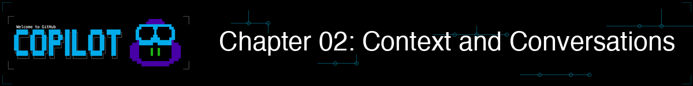
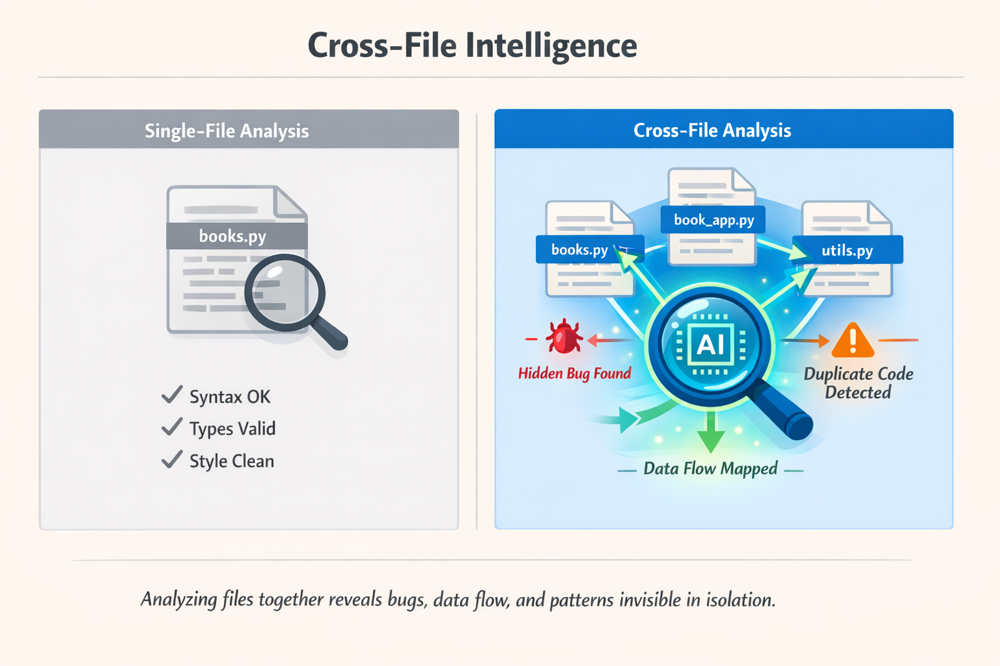

> **如果 AI 能看到你的整个代码库，而不是一次只看一个文件呢？**

在本章中，你将解锁 GitHub Copilot CLI 的真正强大之处：上下文。你将学会使用 `@` 语法引用文件和目录，让 Copilot CLI 深入理解你的代码库。你将了解如何跨会话维持对话，隔几天后精确地从上次中断的地方继续工作，并看到跨文件分析如何发现单文件审查完全无法发现的 Bug。

## 🎯 学习目标

完成本章后，你将能够：

- 使用 `@` 语法引用文件、目录和图片
- 使用 `--resume` 和 `--continue` 恢复之前的会话
- 理解[上下文窗口](../GLOSSARY.md#context-window)的工作原理
- 编写有效的多轮对话
- 管理多项目工作流的目录权限

> ⏱️ **预计用时**：约 50 分钟（阅读 20 分钟 + 动手 30 分钟）

---

## 🧩 现实类比：与同事协作


*就像你的同事一样，Copilot CLI 不会读心术。提供更多信息能帮助人类和 Copilot 一样提供有针对性的支持！*

想象一下，向同事解释一个 Bug：

> **没有上下文**："书籍应用运行不了。"

> **有上下文**："看一下 `books.py`，特别是 `find_book_by_title` 函数。它没有做到大小写不敏感的匹配。"

要向 Copilot CLI 提供上下文，使用 *`@` 语法* 将 Copilot CLI 指向特定的文件。

---

# 基础：基本上下文


本节涵盖有效使用上下文所需的一切。先掌握这些基础知识。

---

## @ 语法

`@` 符号在你的提示词中引用文件和目录。它告诉 Copilot CLI"看这个文件"。

> 💡 **注意**：本课程中的所有示例都使用此仓库中的 `samples/` 文件夹，因此你可以直接尝试每个命令。

### 立即尝试（无需设置）

你可以用计算机上的任何文件试试：

```bash
copilot

# 指向你拥有的任何文件
> Explain what @package.json does
> Summarize @README.md
> What's in @.gitignore and why?
```

> 💡 **没有现成的项目？** 快速创建一个测试文件：
> ```bash
> echo "def greet(name): return 'Hello ' + name" > test.py
> copilot
> > What does @test.py do?
> ```

### 基本 @ 模式

| 模式 | 功能 | 使用示例 |
|------|------|---------|
| `@file.py` | 引用单个文件 | `Review @samples/book-app-project/books.py` |
| `@folder/` | 引用目录中的所有文件 | `Review @samples/book-app-project/` |
| `@file1.py @file2.py` | 引用多个文件 | `Compare @samples/book-app-project/book_app.py @samples/book-app-project/books.py` |

### 引用单个文件

```bash
copilot

> Explain what @samples/book-app-project/utils.py does
```

---

<details>
<summary>🎬 看实际演示！</summary>


*演示输出仅供参考。你的模型、工具和响应将与此处显示的不同。*

</details>

---

### 引用多个文件

```bash
copilot

> Compare @samples/book-app-project/book_app.py and @samples/book-app-project/books.py for consistency
```

### 引用整个目录

```bash
copilot

> Review all files in @samples/book-app-project/ for error handling
```

---

## 跨文件智能分析

这里是上下文成为超级能力的地方。单文件分析很有用；跨文件分析则能改变一切。



### 演示：发现跨多个文件的 Bug

```bash
copilot

> @samples/book-app-project/book_app.py @samples/book-app-project/books.py
>
> How do these files work together? What's the data flow?
```

> 💡 **进阶选项**：对于安全相关的跨文件分析，可以尝试 Python 安全示例：
> ```bash
> > @samples/buggy-code/python/user_service.py @samples/buggy-code/python/payment_processor.py
> > Find security vulnerabilities that span BOTH files
> ```

---

<details>
<summary>🎬 看实际演示！</summary>


*演示输出仅供参考。你的模型、工具和响应将与此处显示的不同。*

</details>

---

**Copilot CLI 的发现**：

```
Cross-Module Analysis
=====================

1. DATA FLOW PATTERN
   book_app.py creates BookCollection instance and calls methods
   books.py defines BookCollection class and manages data persistence

   Flow: book_app.py (UI) → books.py (business logic) → data.json (storage)

2. DUPLICATE DISPLAY FUNCTIONS
   book_app.py:9-21    show_books() function
   utils.py:28-36      print_books() function

   Impact: Two nearly identical functions doing the same thing. If you update
   one (like changing the format), you must remember to update the other.

3. INCONSISTENT ERROR HANDLING
   book_app.py handles ValueError from year conversion
   books.py silently returns None/False on errors

   Pattern: No unified approach to error handling across modules
```

**为什么这很重要**：单文件审查会错过更大的视角。只有跨文件分析才能揭示：
- **重复代码**，应该整合
- **数据流模式**，展示组件如何交互
- **架构问题**，影响可维护性

---

### 演示：60 秒了解一个代码库


对某个项目陌生？使用 Copilot CLI 快速了解它。

```bash
copilot

> @samples/book-app-project/
>
> In one paragraph, what does this app do and what are its biggest quality issues?
```

**你得到的**：
```
This is a CLI book collection manager that lets users add, list, remove, and
search books stored in a JSON file. The biggest quality issues are:

1. Duplicate display logic - show_books() and print_books() do the same thing
2. Inconsistent error handling - some errors raise exceptions, others return False
3. No input validation - year can be 0, empty strings accepted for title/author
4. Missing tests - no test coverage for critical functions like find_book_by_title

Priority fix: Consolidate duplicate display functions and add input validation.
```

**结果**：原本需要一小时阅读代码的工作，压缩到 10 秒内完成。你准确地知道该关注哪里。

---

## 实际示例

### 示例 1：带上下文的代码审查

```bash
copilot

> @samples/book-app-project/books.py Review this file for potential bugs

# Copilot CLI 现在拥有完整的文件内容，可以提供具体反馈：
# "Line 49: Case-sensitive comparison may miss books..."
# "Line 29: JSON decode errors are caught but data corruption isn't logged..."

> What about @samples/book-app-project/book_app.py?

# 现在审查 book_app.py，但仍然了解 books.py 的上下文
```

### 示例 2：了解代码库

```bash
copilot

> @samples/book-app-project/books.py What does this module do?

# Copilot CLI 读取 books.py 并理解 BookCollection 类

> @samples/book-app-project/ Give me an overview of the code structure

# Copilot CLI 扫描目录并总结

> How does the app save and load books?

# Copilot CLI 可以追踪它已经看过的代码
```

<details>
<summary>🎬 看多轮对话的实际演示！</summary>


*演示输出仅供参考。你的模型、工具和响应将与此处显示的不同。*

</details>

### 示例 3：多文件重构

```bash
copilot

> @samples/book-app-project/book_app.py @samples/book-app-project/utils.py
> I see duplicate display functions: show_books() and print_books(). Help me consolidate these.

# Copilot CLI 看到两个文件，可以建议如何合并重复代码
```

---

## 会话管理

会话在工作期间自动保存。你可以恢复之前的会话，从上次停止的地方继续。

### 会话自动保存

每次对话会自动保存。正常退出即可：

```bash
copilot

> @samples/book-app-project/ Let's improve error handling across all modules

[... 做一些工作 ...]

> /exit
```

### 恢复最近的会话

```bash
# 从上次停止的地方继续
copilot --continue
```

### 恢复特定会话

```bash
# 从会话列表中交互式选择
copilot --resume

# 或通过 ID 恢复特定会话
copilot --resume abc123
```

> 💡 **如何找到会话 ID？** 你不需要记住它们。不带 ID 运行 `copilot --resume` 会显示你之前会话的交互列表，包括名称、ID 和最后活跃时间。只需选择你想要的会话即可。
>
> **多个终端呢？** 每个终端窗口都是带有独立上下文的独立会话。如果在三个终端中打开了 Copilot CLI，那就是三个独立的会话。从任何终端运行 `--resume` 可以浏览所有会话。`--continue` 标志会抓取最近关闭的会话，无论它在哪个终端。
>
> **不重启能切换会话吗？** 可以。从活跃会话中使用 `/resume` 斜杠命令：
> ```
> > /resume
> # 显示可切换的会话列表
> ```

### 整理你的会话

给会话起有意义的名称，方便以后查找：

```bash
copilot

> /rename book-app-review
# 会话已重命名，便于识别
```

### 检查和管理上下文

随着添加文件和对话，Copilot CLI 的[上下文窗口](../GLOSSARY.md#context-window)会逐渐填满。两个命令帮你掌控：

```bash
copilot

> /context
Context usage: 45,000 / 128,000 tokens (35%)

> /clear
# 清除上下文并重新开始。切换话题时使用
```

> 💡 **何时使用 `/clear`**：如果你一直在审查 `books.py` 并想切换到讨论 `utils.py`，先运行 `/clear`。否则来自旧话题的过时上下文可能会干扰新的响应。

---

### 从上次停止的地方继续


*退出时会话自动保存。几天后恢复时，文件、问题和进度都被记住。*

想象一个跨多天的工作流：

```bash
# 周一：开始书籍应用审查
copilot

> /rename book-app-review
> @samples/book-app-project/books.py
> Review and number all code quality issues

Quality Issues Found:
1. Duplicate display functions (book_app.py & utils.py) - MEDIUM
2. No input validation for empty strings - MEDIUM
3. Year can be 0 or negative - LOW
4. No type hints on all functions - LOW
5. Missing error logging - LOW

> Fix issue #1 (duplicate functions)
# 处理修复...

> /exit
```

```bash
# 周三：从上次停止的地方精确继续
copilot --continue

> What issues remain unfixed from our book app review?

Remaining issues from our book-app-review session:
2. No input validation for empty strings - MEDIUM
3. Year can be 0 or negative - LOW
4. No type hints on all functions - LOW
5. Missing error logging - LOW

Issue #1 (duplicate functions) was fixed on Monday.

> Let's tackle issue #2 next
```

**强大之处**：几天后，Copilot CLI 仍然记得：
- 你正在处理的确切文件
- 问题的编号列表
- 你已经解决了哪些
- 你的对话上下文

---

🎉 **你现在已经掌握了基础知识！** `@` 语法、会话管理（`--continue`/`--resume`/`/rename`）和上下文命令（`/context`/`/clear`）足以让你高效工作。以下内容都是可选的，准备好后再阅读。

---

# 可选：深入探索


以下主题以上述基础为基础。**选择你感兴趣的，或直接跳到[动手练习](#动手练习)。**

| 我想了解... | 跳转到 |
|------------|--------|
| 通配符模式和高级会话命令 | [其他 @ 模式和会话命令](#additional-patterns) |
| 跨多轮提示词构建上下文 | [上下文感知对话](#context-aware-conversations) |
| 令牌限制和 `/compact` | [了解上下文窗口](#understanding-context-windows) |
| 如何选择要引用的文件 | [选择要引用的内容](#choosing-what-to-reference) |
| 分析截图和原型图 | [处理图片](#working-with-images) |

<details>
<summary><strong>其他 @ 模式和会话命令</strong></summary>
<a id="additional-patterns"></a>

### 其他 @ 模式

对于高级用户，Copilot CLI 支持通配符模式和图片引用：

| 模式 | 功能 |
|------|------|
| `@folder/*.py` | 文件夹中的所有 .py 文件 |
| `@**/test_*.py` | 递归通配符：查找任意位置的所有测试文件 |
| `@image.png` | 用于 UI 审查的图片文件 |

```bash
copilot

> Find all TODO comments in @samples/book-app-project/**/*.py
```

### 查看会话信息

```bash
copilot

> /session
# 显示当前会话详情和工作区摘要

> /usage
# 显示会话指标和统计
```

### 分享你的会话

```bash
copilot

> /share file ./my-session.md
# 将会话导出为 Markdown 文件

> /share gist
# 创建包含会话的 GitHub Gist
```

</details>

<details>
<summary><strong>上下文感知对话</strong></summary>
<a id="context-aware-conversations"></a>

### 上下文感知对话

魔法发生在你进行相互建立的多轮对话时。

#### 示例：渐进式增强

```bash
copilot

> @samples/book-app-project/books.py Review the BookCollection class

Copilot CLI: "The class looks functional, but I notice:
1. Missing type hints on some methods
2. No validation for empty title/author
3. Could benefit from better error handling"

> Add type hints to all methods

Copilot CLI: "Here's the class with complete type hints..."
[显示类型注解版本]

> Now improve error handling

Copilot CLI: "Building on the typed version, here's improved error handling..."
[添加验证和正确的异常]

> Generate tests for this final version

Copilot CLI: "Based on the class with types and error handling..."
[生成全面的测试]
```

注意每个提示词如何建立在之前的工作上。这就是上下文的强大之处。

</details>

<details>
<summary><strong>了解上下文窗口</strong></summary>
<a id="understanding-context-windows"></a>

### 了解上下文窗口

你已经从基础知识中了解了 `/context` 和 `/clear`。这里是上下文窗口如何工作的更深层面貌。

每个 AI 都有一个"上下文窗口"，即它一次可以考虑的文本量。


*上下文窗口就像一张桌子：一次只能放这么多东西。文件、对话历史和系统提示词都占用空间。*

#### 达到限制时发生什么

```bash
copilot

> /context

Context usage: 45,000 / 128,000 tokens (35%)

# 随着添加更多文件和对话，这个数字会增长

> @large-codebase/

Context usage: 120,000 / 128,000 tokens (94%)

# 警告：接近上下文限制

> @another-large-file.py

Context limit reached. Older context will be summarized.
```

#### `/compact` 命令

当上下文快满但不想丢失对话时，`/compact` 会总结历史记录以释放令牌：

```bash
copilot

> /compact
# 总结对话历史，释放上下文空间
# 保留关键发现和决策
```

#### 上下文效率技巧

| 情况 | 操作 | 原因 |
|------|------|------|
| 开始新话题 | `/clear` | 删除不相关的上下文 |
| 长时间对话 | `/compact` | 总结历史，释放令牌 |
| 需要特定文件 | `@file.py` 而不是 `@folder/` | 只加载需要的内容 |
| 达到限制 | 开始新会话 | 全新的 128K 上下文 |
| 多个话题 | 每个话题用 `/rename` | 便于恢复正确的会话 |

#### 大型代码库的最佳实践

1. **具体指定**：`@samples/book-app-project/books.py` 而不是 `@samples/book-app-project/`
2. **话题之间清除**：切换焦点时使用 `/clear`
3. **使用 `/compact`**：总结对话以释放上下文
4. **使用多个会话**：每个功能或话题一个会话

</details>

<details>
<summary><strong>选择要引用的内容</strong></summary>
<a id="choosing-what-to-reference"></a>

### 选择要引用的内容

在上下文方面，并非所有文件都是平等的。以下是明智选择的方法：

#### 文件大小考量

| 文件大小 | 约计[令牌](../GLOSSARY.md#token)数 | 策略 |
|---------|----------------------|------|
| 小（< 100 行）| 约 500-1,500 令牌 | 自由引用 |
| 中（100-500 行）| 约 1,500-7,500 令牌 | 引用特定文件 |
| 大（500+ 行）| 7,500+ 令牌 | 选择性引用 |
| 超大（1000+ 行）| 15,000+ 令牌 | 考虑拆分或针对特定部分 |

**具体示例：**
- 书籍应用的 4 个 Python 文件合计 ≈ 2,000-3,000 令牌
- 典型 Python 模块（200 行）≈ 3,000 令牌
- Flask API 文件（400 行）≈ 6,000 令牌
- 你的 package.json ≈ 200-500 令牌
- 短提示词 + 响应 ≈ 500-1,500 令牌

> 💡 **代码的快速估算：** 将代码行数乘以约 15 得到大致令牌数。请注意这只是估算。

#### 包含什么 vs 排除什么

**高价值**（包含这些）：
- 入口点（`book_app.py`、`main.py`、`app.py`）
- 你正在询问的特定文件
- 目标文件直接导入的文件
- 配置文件（`requirements.txt`、`pyproject.toml`）
- 数据模型或数据类

**低价值**（考虑排除）：
- 生成的文件（编译输出、打包资源）
- node_modules 或 vendor 目录
- 大型数据文件或 fixtures
- 与你的问题无关的文件

#### 特异性范谱

```
不够具体 ────────────────────────► 非常具体
@samples/book-app-project/                      @samples/book-app-project/books.py:47-52
     │                                       │
     └─ 扫描所有内容                          └─ 只要你需要的
        （使用更多上下文）                        （保留上下文）
```

**何时宽泛引用**（`@samples/book-app-project/`）：
- 初始代码库探索
- 查找跨多个文件的模式
- 架构审查

**何时具体引用**（`@samples/book-app-project/books.py`）：
- 调试特定问题
- 审查特定文件
- 询问单个函数

#### 实际示例：分阶段加载上下文

```bash
copilot

# 步骤 1：从结构开始
> @package.json What frameworks does this project use?

# 步骤 2：根据答案缩小范围
> @samples/book-app-project/ Show me the project structure

# 步骤 3：专注于重要内容
> @samples/book-app-project/books.py Review the BookCollection class

# 步骤 4：仅在需要时添加相关文件
> @samples/book-app-project/book_app.py @samples/book-app-project/books.py How does the CLI use the BookCollection?
```

这种分阶段方法使上下文保持聚焦和高效。

</details>

<details>
<summary><strong>处理图片</strong></summary>
<a id="working-with-images"></a>

### 处理图片

你可以使用 `@` 语法在对话中包含图片，或直接**从剪贴板粘贴**（Cmd+V / Ctrl+V）。Copilot CLI 可以分析截图、原型图和图表，帮助进行 UI 调试、设计实现和错误分析。

```bash
copilot

> @images/screenshot.png What is happening in this image?

> @images/mockup.png Write the HTML and CSS to match this design. Place it in a new file called index.html and put the CSS in styles.css.
```

> 📖 **了解更多**：查看[其他上下文功能](../appendices/additional-context.zh-CN.md#working-with-images)了解支持的格式、实际使用案例，以及如何把图片与代码结合起来使用。

</details>

---

# 动手练习


是时候应用你的上下文和会话管理技能了。

---

## ▶️ 自己试试

### 完整项目审查

课程包含可以直接审查的示例文件。启动 copilot 并运行以下提示词：

```bash
copilot

> @samples/book-app-project/ Give me a code quality review of this project

# Copilot CLI 将识别如下问题：
# - 重复的显示函数
# - 缺少输入验证
# - 不一致的错误处理
```

> 💡 **想用你自己的文件试试？** 创建一个小型 Python 项目（`mkdir -p my-project/src`），添加一些 .py 文件，然后使用 `@my-project/src/` 来审查它们。如果需要，可以让 copilot 为你创建示例代码！

### 会话工作流

```bash
copilot

> /rename book-app-review
> @samples/book-app-project/books.py Let's add input validation for empty titles

[Copilot CLI 建议验证方式]

> Implement that fix
> Now consolidate the duplicate display functions in @samples/book-app-project/
> /exit

# 稍后——从上次停下的地方继续
copilot --continue

> Generate tests for the changes we made
```

---

完成演示后，尝试这些变体：

1. **跨文件挑战**：分析 book_app.py 和 books.py 如何协同工作：
   ```bash
   copilot
   > @samples/book-app-project/book_app.py @samples/book-app-project/books.py
   > What's the relationship between these files? Are there any code smells?
   ```

2. **会话挑战**：启动一个会话，用 `/rename my-first-session` 命名它，做一些工作，用 `/exit` 退出，然后运行 `copilot --continue`。它还记得你在做什么吗？

3. **上下文挑战**：在会话中途运行 `/context`。你使用了多少令牌？尝试 `/compact` 然后再检查一次。（更多关于 `/compact` 的内容，请参阅[了解上下文窗口](#understanding-context-windows)。）

**自我检验**：当你能解释为何 `@folder/` 比逐个打开文件更强大时，说明你理解了上下文。

---

## 📝 作业

### 主要挑战：追踪数据流

动手示例专注于代码质量审查和输入验证。现在在不同任务上练习相同的上下文技能——追踪数据如何在应用中流动：

1. 启动交互式会话：`copilot`
2. 同时引用 `books.py` 和 `book_app.py`：
   `@samples/book-app-project/books.py @samples/book-app-project/book_app.py Trace how a book goes from user input to being saved in data.json. What functions are involved at each step?`
3. 引入数据文件作为额外上下文：
   `@samples/book-app-project/data.json What happens if this JSON file is missing or corrupted? Which functions would fail?`
4. 请求跨文件改进：
   `@samples/book-app-project/books.py @samples/book-app-project/utils.py Suggest a consistent error-handling strategy that works across both files.`
5. 重命名会话：`/rename data-flow-analysis`
6. 用 `/exit` 退出，然后用 `copilot --continue` 恢复，并就数据流提出后续问题

**成功标准**：你能跨多个文件追踪数据，恢复命名的会话，并获得跨文件建议。

<details>
<summary>💡 提示（点击展开）</summary>

**入门：**
```bash
cd /path/to/copilot-cli-for-beginners
copilot
> @samples/book-app-project/books.py @samples/book-app-project/book_app.py Trace how a book goes from user input to being saved in data.json.
> @samples/book-app-project/data.json What happens if this file is missing or corrupted?
> /rename data-flow-analysis
> /exit
```

然后用 `copilot --continue` 恢复

**有用的命令：**
- `@file.py` - 引用单个文件
- `@folder/` - 引用文件夹中的所有文件（注意末尾的 `/`）
- `/context` - 检查使用了多少上下文
- `/rename <名称>` - 命名你的会话以便轻松恢复

</details>

### 附加挑战：上下文限制

1. 使用 `@samples/book-app-project/` 一次性引用所有书籍应用文件
2. 就不同文件（`books.py`、`utils.py`、`book_app.py`、`data.json`）提出几个详细问题
3. 运行 `/context` 查看使用情况。填满的速度有多快？
4. 练习使用 `/compact` 回收空间，然后继续对话
5. 尝试更具体的文件引用（例如 `@samples/book-app-project/books.py` 而不是整个文件夹），观察它如何影响上下文使用

---

<details>
<summary>🔧 <strong>常见错误与故障排除</strong>（点击展开）</summary>

### 常见错误

| 错误 | 发生了什么 | 解决方法 |
|------|-----------|---------|
| 文件名前忘记 `@` | Copilot CLI 将"books.py"视为纯文本 | 使用 `@samples/book-app-project/books.py` 引用文件 |
| 期望会话自动持久 | 全新启动 `copilot` 会丢失所有之前的上下文 | 使用 `--continue`（最近的会话）或 `--resume`（选择会话）|
| 引用当前目录之外的文件 | "Permission denied"或"File not found"错误 | 使用 `/add-dir /path/to/directory` 授予访问权限 |
| 切换话题时不使用 `/clear` | 旧上下文干扰新话题的响应 | 在开始不同任务前运行 `/clear` |

### 故障排除

**"File not found"错误** — 确保你在正确的目录中：

```bash
pwd  # 检查当前目录
ls   # 列出文件

# 然后启动 copilot 并使用相对路径
copilot

> Review @samples/book-app-project/books.py
```

**"Permission denied"** — 将目录添加到允许列表：

```bash
copilot --add-dir /path/to/directory

# 或在会话中：
> /add-dir /path/to/directory
```

**上下文填满太快**：
- 更具体地指定文件引用
- 在不同话题之间使用 `/clear`
- 将工作拆分到多个会话中

</details>

---

# 总结

## 🔑 关键要点

1. **`@` 语法**赋予 Copilot CLI 关于文件、目录和图片的上下文
2. **多轮对话**随着上下文积累相互建立
3. **会话自动保存**：使用 `--continue` 或 `--resume` 从上次停止的地方继续
4. **上下文窗口**有限制：使用 `/context`、`/clear` 和 `/compact` 管理它们
5. **权限标志**（`--add-dir`、`--allow-all`）控制多目录访问。明智使用！
6. **图片引用**（`@screenshot.png`）帮助直观调试 UI 问题

> 📚 **官方文档**：[使用 Copilot CLI](https://docs.github.com/copilot/how-tos/copilot-cli/use-copilot-cli) 获取上下文、会话和文件处理的完整参考。

> 📋 **快速参考**：查看 [GitHub Copilot CLI 命令参考](https://docs.github.com/en/copilot/reference/cli-command-reference) 获取完整的命令和快捷键列表。

---

## ➡️ 下一步

现在你能给 Copilot CLI 提供上下文了，让我们把它应用到真实的开发任务中。你刚刚学到的上下文技术（文件引用、跨文件分析和会话管理）是下一章强大工作流的基础。

在 **[第 03 章：开发工作流](../03-development-workflows/README.zh-CN.md)** 中，你将学习：

- 代码审查工作流
- 重构模式
- 调试辅助
- 测试生成
- Git 集成

---

**[← 返回第 01 章](../01-setup-and-first-steps/README.zh-CN.md)** | **[继续第 03 章 →](../03-development-workflows/README.zh-CN.md)**
