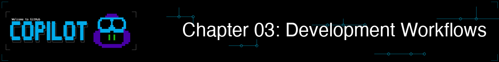
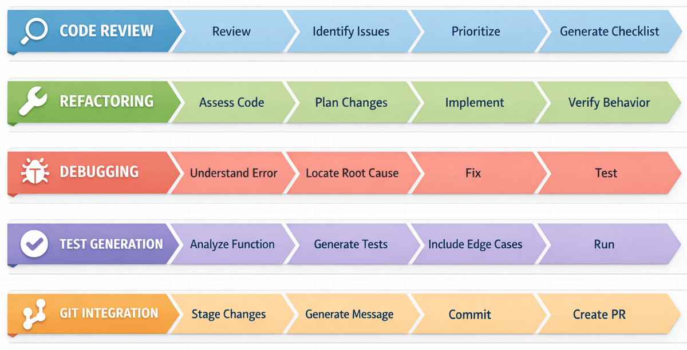

> **如果 AI 能发现你甚至不知道要问的 Bug 呢？**

在本章中，GitHub Copilot CLI 将成为你的日常工具。你将在已经依赖的工作流中使用它：测试、重构、调试和 Git。

## 🎯 学习目标

完成本章后，你将能够：

- 使用 Copilot CLI 进行全面的代码审查
- 安全地重构遗留代码
- 借助 AI 调试问题
- 自动生成测试
- 将 Copilot CLI 集成到 Git 工作流中

> ⏱️ **预计用时**：约 60 分钟（阅读 15 分钟 + 动手 45 分钟）

---

## 🧩 现实类比：木匠的工作流

木匠不只是知道如何使用工具，他们针对不同工作有*工作流*：


类似地，开发者针对不同任务有工作流。GitHub Copilot CLI 增强了这些工作流，让你在日常编码任务中更高效、更有效。

---

# 五大工作流


以下每个工作流都是独立的。选择与你当前需求匹配的工作流，或全部学习。

---

## 自主选择

本章涵盖开发者通常使用的五种工作流。**但是，你不需要一次全部阅读！** 每个工作流都自包含在下方可折叠的部分中。选择与你现在需要的内容最匹配的工作流，以及最适合你当前项目的工作流。你随时可以回来探索其他工作流。



| 我想... | 跳转到 |
|--------|--------|
| 合并前审查代码 | [工作流 1：代码审查](#workflow-1-code-review) |
| 清理混乱或遗留代码 | [工作流 2：重构](#workflow-2-refactoring) |
| 追踪并修复 Bug | [工作流 3：调试](#workflow-3-debugging) |
| 为代码生成测试 | [工作流 4：测试生成](#workflow-4-test-generation) |
| 写出更好的提交和 PR | [工作流 5：Git 集成](#workflow-5-git-integration) |
| 编码前先调研 | [快速技巧：编码前先调研](#quick-tip-research-before-you-plan-or-code) |
| 看完整的 Bug 修复工作流 | [综合运用](#putting-it-all-together-bug-fix-workflow) |

**点击下方展开某个工作流**，了解 GitHub Copilot CLI 如何增强该领域的开发流程。

---

<a id="workflow-1-code-review"></a>
<details>
<summary><strong>工作流 1：代码审查</strong>——审查文件、使用 /review 智能体、创建严重性检查清单</summary>


### 基础审查

此示例使用 `@` 符号引用文件，让 Copilot CLI 直接访问其内容进行审查。

```bash
copilot

> Review @samples/book-app-project/book_app.py for code quality
```

---

<details>
<summary>🎬 看实际演示！</summary>


*演示输出仅供参考。你的模型、工具和响应将与此处显示的不同。*

</details>

---

### 输入验证审查

通过在提示词中列出你关心的类别，让 Copilot CLI 专注于特定关注点（此处为输入验证）。

```text
copilot

> Review @samples/book-app-project/utils.py for input validation issues. Check for: missing validation, error handling gaps, and edge cases
```


### 跨文件项目审查

使用 `@` 引用整个目录，让 Copilot CLI 一次扫描项目中的每个文件。

```bash
copilot

> @samples/book-app-project/ Review this entire project. Create a markdown checklist of issues found, categorized by severity
```

### 交互式代码审查

使用多轮对话深入挖掘。从宏观审查开始，然后提出后续问题，无需重新启动。

```bash
copilot

> @samples/book-app-project/book_app.py Review this file for:
> - Input validation
> - Error handling
> - Code style and best practices

# Copilot CLI 提供详细审查

> The user input handling - are there any edge cases I'm missing?

# Copilot CLI 显示空字符串、特殊字符的潜在问题

> Create a checklist of all issues found, prioritized by severity

# Copilot CLI 生成按优先级排序的行动项
```

### 审查检查清单模板

让 Copilot CLI 以特定格式（此处为按严重性分类的 Markdown 检查清单，可粘贴到 issue 中）构建输出。

```bash
copilot

> Review @samples/book-app-project/ and create a markdown checklist of issues found, categorized by:
> - Critical (data loss risks, crashes)
> - High (bugs, incorrect behavior)
> - Medium (performance, maintainability)
> - Low (style, minor improvements)
```

### 了解 Git 更改（使用 /review 前必读）

使用 `/review` 命令之前，需要了解 Git 中两种类型的更改：

| 更改类型 | 含义 | 如何查看 |
|---------|------|---------|
| **已暂存的更改** | 用 `git add` 标记为下次提交的文件 | `git diff --staged` |
| **未暂存的更改** | 已修改但尚未添加的文件 | `git diff` |

```bash
# 快速参考
git status           # 显示已暂存和未暂存的内容
git add file.py      # 将文件暂存以便提交
git diff             # 显示未暂存的更改
git diff --staged    # 显示已暂存的更改
```

### 使用 /review 命令

`/review` 命令调用内置的**代码审查智能体**，它针对分析已暂存和未暂存的更改进行了优化，输出高质量、低噪音的反馈。使用斜杠命令触发专门的内置智能体，而不是编写自由形式的提示词。

```bash
copilot

> /review
# 对已暂存/未暂存的更改调用代码审查智能体
# 提供聚焦、可操作的反馈

> /review Check for security issues in authentication
# 以特定关注点运行审查
```

> 💡 **提示**：代码审查智能体在有待处理更改时效果最佳。使用 `git add` 暂存文件以获得更聚焦的审查。

</details>

---

<a id="workflow-2-refactoring"></a>
<details>
<summary><strong>工作流 2：重构</strong>——重组代码、分离关注点、改进错误处理</summary>


### 简单重构

> **先试试这个：** `@samples/book-app-project/book_app.py The command handling uses if/elif chains. Refactor it to use a dictionary dispatch pattern.`

从简单的改进开始。在书籍应用上尝试这些。每个提示词都将 `@` 文件引用与具体的重构指令配对，让 Copilot CLI 知道确切要更改什么。

```bash
copilot

> @samples/book-app-project/book_app.py The command handling uses if/elif chains. Refactor it to use a dictionary dispatch pattern.

> @samples/book-app-project/utils.py Add type hints to all functions

> @samples/book-app-project/book_app.py Extract the book display logic into utils.py for better separation of concerns
```

> 💡 **重构新手？** 在尝试复杂的转换之前，先从添加类型注解或改进变量名等简单请求开始。

---

<details>
<summary>🎬 看实际演示！</summary>


*演示输出仅供参考。你的模型、工具和响应将与此处显示的不同。*

</details>

---

### 分离关注点

在单个提示词中使用 `@` 引用多个文件，让 Copilot CLI 可以在重构中在文件间移动代码。

```bash
copilot

> @samples/book-app-project/utils.py @samples/book-app-project/book_app.py
> The utils.py file has print statements mixed with logic. Refactor to separate display functions from data processing.
```

### 改进错误处理

提供两个相关文件并描述横切关注点，让 Copilot CLI 可以建议跨两个文件一致的修复。

```bash
copilot

> @samples/book-app-project/utils.py @samples/book-app-project/books.py
> These files have inconsistent error handling. Suggest a unified approach using custom exceptions.
```

### 添加文档

使用详细的项目符号列表精确指定每个 docstring 应包含的内容。

```bash
copilot

> @samples/book-app-project/books.py Add comprehensive docstrings to all methods:
> - Include parameter types and descriptions
> - Document return values
> - Note any exceptions raised
> - Add usage examples
```

### 安全重构（先生成测试）

在多轮对话中链接两个相关请求。先生成测试，然后以这些测试作为安全网进行重构。

```bash
copilot

> @samples/book-app-project/books.py Before refactoring, generate tests for current behavior

# 先获取测试

> Now refactor the BookCollection class to use a context manager for file operations

# 有了测试保障，重构更有把握——测试验证行为未被破坏
```

</details>

---

<a id="workflow-3-debugging"></a>
<details>
<summary><strong>工作流 3：调试</strong>——追踪 Bug、安全审计、跨文件追踪问题</summary>


### 简单调试

> **先试试这个：** `@samples/book-app-buggy/books_buggy.py Users report that searching for "The Hobbit" returns no results even though it's in the data. Debug why.`

先描述出了什么问题。这里是可以在有 Bug 的书籍应用上尝试的常见调试模式。每个提示词将 `@` 文件引用与清晰的症状描述配对，让 Copilot CLI 能够定位并诊断 Bug。

```bash
copilot

# 模式："期望 X 但得到了 Y"
> @samples/book-app-buggy/books_buggy.py Users report that searching for "The Hobbit" returns no results even though it's in the data. Debug why.

# 模式："意外行为"
> @samples/book-app-buggy/book_app_buggy.py When I remove a book that doesn't exist, the app says it was removed. Help me find why.

# 模式："错误结果"
> @samples/book-app-buggy/books_buggy.py When I mark one book as read, ALL books get marked. What's the bug?
```

> 💡 **调试技巧**：描述*症状*（你看到的）和*期望*（应该发生的）。Copilot CLI 会找出其余的。

---

<details>
<summary>🎬 看实际演示！</summary>


*演示输出仅供参考。你的模型、工具和响应将与此处显示的不同。*

</details>

---

### "Bug 侦探"——AI 发现相关 Bug

这就是上下文感知调试闪光的地方。在有 Bug 的书籍应用上尝试这个场景。通过 `@` 提供整个文件，只描述用户报告的症状。Copilot CLI 将追踪根因，可能还会发现附近的其他 Bug。

```bash
copilot

> @samples/book-app-buggy/books_buggy.py
>
> Users report: "Finding books by author name doesn't work for partial names"
> Debug why this happens
```

**Copilot CLI 的操作**：
```
Root Cause: Line 80 uses exact match (==) instead of partial match (in).

Line 80: return [b for b in self.books if b.author == author]

The find_by_author function requires an exact match. Searching for "Tolkien"
won't find books by "J.R.R. Tolkien".

Fix: Change to case-insensitive partial match:
return [b for b in self.books if author.lower() in b.author.lower()]
```

**为什么这很重要**：Copilot CLI 读取整个文件，理解你 Bug 报告的上下文，并给你具有清晰说明的具体修复。

> 💡 **彩蛋**：因为 Copilot CLI 分析整个文件，它通常会发现你没有询问的*其他*问题。例如，在修复作者搜索时，Copilot CLI 可能还会注意到 `find_book_by_title` 中的大小写敏感 Bug！

### 现实安全侧注

在调试自己的代码时，理解生产应用中的安全漏洞同样关键。试试这个示例：将 Copilot CLI 指向一个陌生的文件，让它进行安全审计。

```bash
copilot

> @samples/buggy-code/python/user_service.py Find all security vulnerabilities in this Python user service
```

这个文件展示了你在生产应用中会遇到的真实世界安全模式。

> 💡 **你会遇到的常见安全术语：**
> - **SQL 注入**：当用户输入直接放入数据库查询时，允许攻击者运行恶意命令
> - **参数化查询**：安全的替代方案——占位符（`?`）将用户数据与 SQL 命令分开
> - **竞争条件**：当两个操作同时发生并相互干扰时
> - **XSS（跨站脚本）**：当攻击者将恶意脚本注入网页时

---

### 理解错误

将堆栈跟踪与 `@` 文件引用一起粘贴到提示词中，让 Copilot CLI 可以将错误映射到源代码。

```bash
copilot

> I'm getting this error:
> AttributeError: 'NoneType' object has no attribute 'title'
>     at show_books (book_app.py:19)
>
> @samples/book-app-project/book_app.py Explain why and how to fix it
```

### 用测试用例调试

描述确切的输入和观察到的输出，给 Copilot CLI 一个具体的、可重现的测试用例来推理。

```bash
copilot

> @samples/book-app-buggy/books_buggy.py The remove_book function has a bug. When I try to remove "Dune",
> it also removes "Dune Messiah". Debug this: explain the root cause and provide a fix.
```

### 跨代码追踪问题

引用多个文件，让 Copilot CLI 追踪数据流，定位问题的源头。

```bash
copilot

> Users report that the book list numbering starts at 0 instead of 1.
> @samples/book-app-buggy/book_app_buggy.py @samples/book-app-buggy/books_buggy.py
> Trace through the list display flow and identify where the issue occurs
```

### 了解数据问题

在代码旁边包含读取它的数据文件，让 Copilot CLI 在建议错误处理改进时了解完整情况。

```bash
copilot

> @samples/book-app-project/data.json @samples/book-app-project/books.py
> Sometimes the JSON file gets corrupted and the app crashes. How should we handle this gracefully?
```

</details>

---

<a id="workflow-4-test-generation"></a>
<details>
<summary><strong>工作流 4：测试生成</strong>——自动生成全面测试和边缘用例</summary>


> **先试试这个：** `@samples/book-app-project/books.py Generate pytest tests for all functions including edge cases`

### "测试爆炸"——2 个测试 vs 15+ 个测试

手动编写测试时，开发者通常只创建 2-3 个基础测试：
- 测试有效输入
- 测试无效输入
- 测试边缘用例

看看当你让 Copilot CLI 生成全面测试时会发生什么！这个提示词使用带有 `@` 文件引用的结构化项目列表，引导 Copilot CLI 进行全面的测试覆盖：

```bash
copilot

> @samples/book-app-project/books.py Generate comprehensive pytest tests. Include tests for:
> - Adding books
> - Removing books
> - Finding by title
> - Finding by author
> - Marking as read
> - Edge cases with empty data
```

---

<details>
<summary>🎬 看实际演示！</summary>


*演示输出仅供参考。你的模型、工具和响应将与此处显示的不同。*

</details>

---

**你得到的**：15+ 个全面测试，包括：

```python
class TestBookCollection:
    # 正常路径
    def test_add_book_creates_new_book(self):
        ...
    def test_list_books_returns_all_books(self):
        ...

    # 查找操作
    def test_find_book_by_title_case_insensitive(self):
        ...
    def test_find_book_by_title_returns_none_when_not_found(self):
        ...
    def test_find_by_author_partial_match(self):
        ...
    def test_find_by_author_case_insensitive(self):
        ...

    # 边缘用例
    def test_add_book_with_empty_title(self):
        ...
    def test_remove_nonexistent_book(self):
        ...
    def test_mark_as_read_nonexistent_book(self):
        ...

    # 数据持久性
    def test_save_books_persists_to_json(self):
        ...
    def test_load_books_handles_missing_file(self):
        ...
    def test_load_books_handles_corrupted_json(self):
        ...

    # 特殊字符
    def test_add_book_with_unicode_characters(self):
        ...
    def test_find_by_author_with_special_characters(self):
        ...
```

**结果**：30 秒内，你得到了手动思考和编写需要一小时的边缘用例测试。

---

### 单元测试

针对单个函数，列举你想要测试的输入类别，让 Copilot CLI 生成聚焦、全面的单元测试。

```bash
copilot

> @samples/book-app-project/utils.py Generate comprehensive pytest tests for get_book_details covering:
> - Valid input
> - Empty strings
> - Invalid year formats
> - Very long titles
> - Special characters in author names
```

### 运行测试

用自然语言向 Copilot CLI 提问关于你工具链的问题。它可以为你生成正确的 Shell 命令。

```bash
copilot

> How do I run the tests? Show me the pytest command.

# Copilot CLI 响应：
# cd samples/book-app-project && python -m pytest tests/
# 或详细输出：python -m pytest tests/ -v
# 查看 print 语句：python -m pytest tests/ -s
```

### 针对特定场景测试

列出你想覆盖的高级或棘手场景，让 Copilot CLI 超越正常路径。

```bash
copilot

> @samples/book-app-project/books.py Generate tests for these scenarios:
> - Adding duplicate books (same title and author)
> - Removing a book by partial title match
> - Finding books when collection is empty
> - File permission errors during save
> - Concurrent access to the book collection
```

### 向现有文件添加测试

为单个函数请求*额外*的测试，让 Copilot CLI 生成补充你现有测试的新用例。

```bash
copilot

> @samples/book-app-project/books.py
> Generate additional tests for the find_by_author function with edge cases:
> - Author name with hyphens (e.g., "Jean-Paul Sartre")
> - Author with multiple first names
> - Empty string as author
> - Author name with accented characters
```

</details>

---

<a id="workflow-5-git-integration"></a>
<details>
<summary><strong>工作流 5：Git 集成</strong>——提交消息、PR 描述、/delegate 和 /diff</summary>


> 💡 **此工作流假设你具备基本的 Git 知识**（暂存、提交、分支）。如果 Git 对你来说是新的，先尝试其他四个工作流。

### 生成提交消息

> **先试试这个：** `copilot -p "Generate a conventional commit message for: $(git diff --staged)"` — 暂存一些更改，然后运行这个命令，让 Copilot CLI 为你写提交消息。

此示例使用 `-p` 内联提示词标志与 Shell 命令替换，将 `git diff` 输出直接传给 Copilot CLI 进行一次性提交消息生成。`$(...)` 语法运行括号内的命令并将其输出插入到外部命令中。

```bash

# 查看更改了什么
git diff --staged

# 使用[约定式提交](../GLOSSARY.md#conventional-commit)格式生成提交消息
# （如"feat(books): add search"或"fix(data): handle empty input"的结构化消息）
copilot -p "Generate a conventional commit message for: $(git diff --staged)"

# 输出："feat(books): add partial author name search
#
# - Update find_by_author to support partial matches
# - Add case-insensitive comparison
# - Improve user experience when searching authors"
```

---

<details>
<summary>🎬 看实际演示！</summary>


*演示输出仅供参考。你的模型、工具和响应将与此处显示的不同。*

</details>

---

### 解释更改

将 `git show` 的输出通过管道传给 `-p` 提示词，获取最近一次提交的简洁英文摘要。

```bash
# 这次提交更改了什么？
copilot -p "Explain what this commit does: $(git show HEAD --stat)"
```

### PR 描述

将 `git log` 输出与结构化提示词模板结合，自动生成完整的 Pull Request 描述。

```bash
# 从分支更改生成 PR 描述
copilot -p "Generate a pull request description for these changes:
$(git log main..HEAD --oneline)

Include:
- Summary of changes
- Why these changes were made
- Testing done
- Breaking changes? (yes/no)"
```

### 推送前审查

在 `-p` 提示词中使用 `git diff main..HEAD` 对所有分支更改进行快速的推送前健全性检查。

```bash
# 推送前的最后检查
copilot -p "Review these changes for issues before I push:
$(git diff main..HEAD)"
```

### 使用 /delegate 处理后台任务

`/delegate` 命令将工作移交给 GitHub 上的 Copilot 编码智能体。使用 `/delegate` 斜杠命令（或 `&` 快捷方式）将定义明确的任务下放给后台智能体。

```bash
copilot

> /delegate Add input validation to the login form

# 或使用 & 前缀快捷方式：
> & Fix the typo in the README header

# Copilot CLI：
# 1. 将你的更改提交到新分支
# 2. 创建草稿 PR
# 3. 在 GitHub 后台工作
# 4. 完成后请求你的审查
```

这对于你想在专注于其他工作时完成的定义明确的任务非常有用。

### 使用 /diff 审查会话更改

`/diff` 命令显示你当前会话中所做的所有更改。在提交之前使用这个斜杠命令查看 Copilot CLI 修改的所有内容的可视化差异。

```bash
copilot

# 做了一些更改之后...
> /diff

# 显示本次会话中修改的所有文件的可视化差异
# 提交前审查的好工具
```

</details>

---

<a id="quick-tip-research-before-you-plan-or-code"></a>
## 快速技巧：编码前先调研

当你需要调查某个库、了解最佳实践或探索不熟悉的主题时，在编写任何代码之前使用 `/research` 进行深度调研：

```bash
copilot

> /research What are the best Python libraries for validating user input in CLI apps?
```

Copilot 搜索 GitHub 仓库和网络资源，然后返回带有参考资料的摘要。当你即将开始新功能并想做出明智决策时，这非常有用。你可以使用 `/share` 分享结果。

---

<a id="putting-it-all-together-bug-fix-workflow"></a>
## ▶️ 自己试试

完成演示后，尝试这些变体：

1. **Bug 侦探挑战**：让 Copilot CLI 调试 `samples/book-app-buggy/books_buggy.py` 中的 `mark_as_read` 函数。它是否解释了为什么该函数将所有书籍都标记为已读，而不仅仅是一本？

2. **测试挑战**：为书籍应用中的 `add_book` 函数生成测试。数一数 Copilot CLI 包含了多少你不会想到的边缘用例。

3. **提交消息挑战**：对某个书籍应用文件进行任何小改动，暂存它（`git add .`），然后运行：
   ```bash
   copilot -p "Generate a conventional commit message for: $(git diff --staged)"
   ```
   这条消息比你快速写出的更好吗？

**自我检验**：当你能解释为什么"调试这个 Bug"比"查找 Bug"更强大时（上下文很重要！），说明你理解了开发工作流。

---

## 📝 作业

### 主要挑战：重构、测试并交付

动手示例专注于 `find_book_by_title` 和代码审查。现在在 `book-app-project` 的不同函数上练习相同的工作流技能：

1. **审查**：让 Copilot CLI 审查 `books.py` 中的 `remove_book()` 的边缘用例和潜在问题：
   `@samples/book-app-project/books.py Review the remove_book() function. What happens if the title partially matches another book (e.g., "Dune" vs "Dune Messiah")? Are there any edge cases not handled?`
2. **重构**：让 Copilot CLI 改进 `remove_book()` 以处理大小写不敏感匹配等边缘用例，并在找不到书时返回有用的反馈
3. **测试**：专门为改进后的 `remove_book()` 函数生成 pytest 测试，覆盖：
   - 删除存在的书
   - 大小写不敏感的标题匹配
   - 找不到书时返回适当的反馈
   - 从空集合中删除
4. **审查**：暂存你的更改并运行 `/review` 检查剩余问题
5. **提交**：生成约定式提交消息：
   `copilot -p "Generate a conventional commit message for: $(git diff --staged)"`

<details>
<summary>💡 提示（点击展开）</summary>

**每步的示例提示词：**

```bash
copilot

# 步骤 1：审查
> @samples/book-app-project/books.py Review the remove_book() function. What edge cases are not handled?

# 步骤 2：重构
> Improve remove_book() to use case-insensitive matching and return a clear message when the book isn't found. Show me the before and after code.

# 步骤 3：测试
> Generate pytest tests for the improved remove_book() function, including:
> - Removing a book that exists
> - Case-insensitive matching ("dune" should remove "Dune")
> - Book not found returns appropriate response
> - Removing from an empty collection

# 步骤 4：审查
> /review

# 步骤 5：提交
> Generate a conventional commit message for this refactor
```

**提示：** 改进 `remove_book()` 后，尝试让 Copilot CLI："Are there any other functions in this file that could benefit from the same improvements?"，它可能会建议对 `find_book_by_title()` 或 `find_by_author()` 进行类似的改进。

</details>

### 附加挑战：用 Copilot CLI 创建应用

> 💡 **注意**：这个 GitHub Skills 练习使用 **Node.js** 而不是 Python。你将练习的 GitHub Copilot CLI 技术——创建 issue、生成代码和从终端协作——适用于任何语言。

这个练习向开发者展示如何使用 GitHub Copilot CLI 创建 issue、生成代码，并在构建 Node.js 计算器应用的过程中从终端进行协作。

#####  [开始"使用 Copilot CLI 创建应用"技能练习](https://github.com/skills/create-applications-with-the-copilot-cli)

---

<details>
<summary>🔧 <strong>常见错误与故障排除</strong>（点击展开）</summary>

### 常见错误

| 错误 | 发生了什么 | 解决方法 |
|------|-----------|---------|
| 使用模糊的提示词如"审查这段代码" | 遗漏特定问题的通用反馈 | 具体说明："Review for SQL injection, XSS, and auth issues" |
| 不使用 `/review` 进行代码审查 | 错过优化的代码审查智能体 | 使用 `/review`，它针对高质量输出进行了调整 |
| 在没有上下文的情况下要求"查找 Bug" | Copilot CLI 不知道你遇到的是什么 Bug | 描述症状："Users report X happens when Y" |
| 生成测试时不指定框架 | 测试可能使用错误的语法或断言库 | 指定："Generate tests using Jest"或"using pytest" |

### 故障排除

**审查似乎不完整** — 更具体地说明要查找什么：

```bash
copilot

# 替代：
> Review @samples/book-app-project/book_app.py

# 尝试：
> Review @samples/book-app-project/book_app.py for input validation, error handling, and edge cases
```

**测试与我的框架不匹配** — 指定框架：

```bash
copilot

> @samples/book-app-project/books.py Generate tests using pytest (not unittest)
```

**重构改变了行为** — 让 Copilot CLI 保持行为不变：

```bash
copilot

> @samples/book-app-project/book_app.py Refactor command handling to use dictionary dispatch. IMPORTANT: Maintain identical external behavior - no breaking changes
```

</details>

---

# 总结

## 🔑 关键要点


1. **代码审查**通过具体的提示词变得全面
2. **重构**在先生成测试时更安全
3. **调试**通过同时向 Copilot CLI 展示错误**和**代码而受益
4. **测试生成**应包含边缘用例和错误场景
5. **Git 集成**自动化提交消息和 PR 描述

> 📋 **快速参考**：查看 [GitHub Copilot CLI 命令参考](https://docs.github.com/en/copilot/reference/cli-command-reference) 获取完整的命令和快捷键列表。

---

## ✅ 检查点：你已掌握基础知识

**恭喜！** 你现在具备了使用 GitHub Copilot CLI 的所有核心技能：

| 技能 | 章节 | 你现在能... |
|------|------|------------|
| 基本命令 | 第 01 章 | 使用交互式模式、计划模式、编程模式（-p）和斜杠命令 |
| 上下文 | 第 02 章 | 用 `@` 引用文件、管理会话、理解上下文窗口 |
| 工作流 | 第 03 章 | 审查代码、重构、调试、生成测试、与 Git 集成 |

第 04-06 章涵盖了更多功能，值得学习。

---

## 🛠️ 构建你的个人工作流

使用 GitHub Copilot CLI 没有唯一"正确"的方式。以下是你发展自己模式时的一些技巧：

> 📚 **官方文档**：[Copilot CLI 最佳实践](https://docs.github.com/copilot/how-tos/copilot-cli/cli-best-practices) 获取 GitHub 推荐的工作流和技巧。

- **对任何非简单的任务都先用 `/plan`**。在执行前完善计划——好计划带来更好的结果。
- **保存运作良好的提示词。** 当 Copilot CLI 出错时，记下出了什么问题。随着时间推移，这将成为你的个人操作手册。
- **自由实验。** 有些开发者喜欢长而详细的提示词。其他人喜欢短提示词加后续问题。尝试不同的方式，注意什么感觉自然。

> 💡 **即将到来**：在第 04 章和第 05 章中，你将学习如何将你的最佳实践编码到 Copilot CLI 自动加载的自定义指令和技能中。

---

## ➡️ 接下来

剩余章节涵盖扩展 Copilot CLI 功能的额外特性：

| 章节 | 内容 | 你什么时候会需要它 |
|------|------|-----------------|
| 第 04 章：智能体 | 创建专门的 AI 角色 | 当你需要领域专家时（前端、安全）|
| 第 05 章：技能 | 自动加载任务指令 | 当你经常重复相同的提示词时 |
| 第 06 章：MCP | 连接外部服务 | 当你需要来自 GitHub、数据库的实时数据时 |

**建议**：使用核心工作流一周，然后在有具体需求时再回来学习第 04-06 章。

---

在 **[第 04 章：智能体与自定义指令](../04-agents-custom-instructions/README.zh-CN.md)** 中，你将学习：

- 使用内置智能体（`/plan`、`/review`）
- 用 `.agent.md` 文件创建专门的智能体（前端专家、安全审计员）
- 多智能体协作模式
- 项目标准的自定义指令文件

---

**[← 返回第 02 章](../02-context-conversations/README.zh-CN.md)** | **[继续第 04 章 →](../04-agents-custom-instructions/README.zh-CN.md)**
