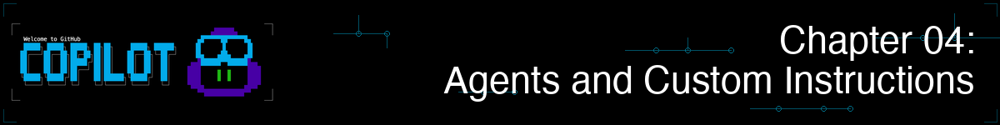

> **如果你能同时雇佣一个 Python 代码审查员、测试专家和安全审查员……全都在一个工具里呢？**

在第 03 章中，你掌握了基本工作流：代码审查、重构、调试、测试生成和 Git 集成。这些工作流让你使用 GitHub Copilot CLI 高效工作。现在，让我们更进一步。

到目前为止，你一直将 Copilot CLI 用作通用助手。智能体让你为它赋予特定角色，附带内置标准——比如一个强制执行类型注解和 PEP 8 的代码审查员，或是一个编写 pytest 用例的测试助手。你会看到相同的提示词在由具有针对性指令的智能体处理时，能得到明显更好的结果。

## 🎯 学习目标

完成本章后，你将能够：

- 使用内置智能体：Plan（`/plan`）、Code-review（`/review`），并了解自动智能体（Explore、Task）
- 使用智能体文件（`.agent.md`）创建专门的智能体
- 将智能体用于特定领域的任务
- 使用 `/agent` 和 `--agent` 切换智能体
- 为项目特定标准编写自定义指令文件

> ⏱️ **预计用时**：约 55 分钟（阅读 20 分钟 + 动手 35 分钟）

---

## 🧩 现实类比：雇佣专家

当你需要房屋帮助时，你不会打电话给一个"通用帮手"，而是打给专家：

| 问题 | 专家 | 原因 |
|------|------|------|
| 水管漏水 | 水管工 | 了解管道规范，有专业工具 |
| 电路重新布线 | 电工 | 了解安全要求，符合规范 |
| 新屋顶 | 屋顶工 | 了解材料、当地天气因素 |

智能体的工作方式相同。与其使用通用 AI，不如使用专注于特定任务并知道正确流程的智能体。一次设置好指令，每当你需要该专业时就可以复用：代码审查、测试、安全、文档。


---

# 使用智能体

立即开始使用内置和自定义智能体。

---

## *智能体新手？* 从这里开始！
从未使用或制作过智能体？以下是本课程入门所需了解的一切。

1. **立即试用*内置*智能体：**
   ```bash
   copilot
   > /plan Add input validation for book year in the book app
   ```
   这会调用 Plan 智能体创建一个逐步实现计划。

2. **查看我们的自定义智能体示例：** 定义智能体的指令很简单，查看我们提供的 [python-reviewer.agent.md](../.github/agents/python-reviewer.agent.md) 文件了解模式。

3. **理解核心概念：** 智能体就像咨询专家而不是综合医生。一个"前端智能体"会自动关注无障碍性和组件模式，你不需要每次提醒它，因为这已经在智能体的指令中指定了。


## 内置智能体

**你在第 03 章开发工作流中已经用过一些内置智能体了！**
`/plan` 和 `/review` 实际上就是内置智能体。现在你知道背后发生了什么。以下是完整列表：

| 智能体 | 调用方式 | 功能 |
|--------|---------|------|
| **Plan** | `/plan` 或 `Shift+Tab`（循环切换模式）| 在编码前创建逐步实现计划 |
| **Code-review** | `/review` | 对已暂存/未暂存的更改进行审查，提供聚焦、可操作的反馈 |
| **Init** | `/init` | 生成项目配置文件（指令、智能体）|
| **Explore** | *自动* | 当你让 Copilot 探索或分析代码库时内部使用 |
| **Task** | *自动* | 执行测试、构建、代码检查和依赖安装等命令 |

<br>

**内置智能体实际演示** - 调用 Plan、Code-review、Explore 和 Task 的示例

```bash
copilot

# 调用 Plan 智能体创建实现计划
> /plan Add input validation for book year in the book app

# 对你的更改调用 Code-review 智能体
> /review

# Explore 和 Task 智能体在相关时自动调用：
> Run the test suite        # 使用 Task 智能体

> Explore how book data is loaded    # 使用 Explore 智能体
```

Task 智能体是如何工作的？它在后台管理和追踪进程，并以清晰整洁的格式汇报：

| 结果 | 你看到的 |
|------|---------|
| ✅ **成功** | 简短摘要（如"All 247 tests passed"、"Build succeeded"）|
| ❌ **失败** | 完整输出，包含堆栈跟踪、编译器错误和详细日志 |


> 📚 **官方文档**：[GitHub Copilot CLI 智能体](https://docs.github.com/copilot/how-tos/use-copilot-agents/use-copilot-cli#use-custom-agents)

---

# 向 Copilot CLI 添加智能体

你可以直接定义自己的智能体，使其成为工作流的一部分！定义一次，随时调用！


<a id="add-your-agents"></a>
## 🗂️ 添加你的智能体

智能体文件是带有 `.agent.md` 扩展名的 Markdown 文件。它们有两个部分：YAML frontmatter（元数据）和 Markdown 指令。

> 💡 **不熟悉 YAML frontmatter？** 它是文件顶部的一小块设置，由 `---` 标记包围。YAML 就是 `key: value` 对。文件的其余部分是普通 Markdown。

这是一个最简单的智能体：

```markdown
---
name: my-reviewer
description: Code reviewer focused on bugs and security issues
---

# Code Reviewer

You are a code reviewer focused on finding bugs and security issues.

When reviewing code, always check for:
- SQL injection vulnerabilities
- Missing error handling
- Hardcoded secrets
```

> 💡 **必填 vs 可选**：`description` 字段是必填的。`name`、`tools` 和 `model` 等其他字段是可选的。

<a id="where-to-put-agent-files"></a>
## 智能体文件放在哪里

| 位置 | 范围 | 最适合 |
|------|------|--------|
| `.github/agents/` | 项目特定 | 具有项目约定的团队共享智能体 |
| `~/.copilot/agents/` | 全局（所有项目）| 你在任何地方使用的个人智能体 |

**本项目在 [.github/agents/](../.github/agents/) 文件夹中包含示例智能体文件**。你可以编写自己的，或自定义已提供的文件。

<details>
<summary>📂 查看本课程中的示例智能体</summary>

| 文件 | 描述 |
|------|------|
| `hello-world.agent.md` | 最简单的示例——从这里开始 |
| `python-reviewer.agent.md` | Python 代码质量审查员 |
| `pytest-helper.agent.md` | Pytest 测试专家 |

```bash
# 或复制一个到你的个人智能体文件夹（在每个项目中可用）
cp .github/agents/python-reviewer.agent.md ~/.copilot/agents/
```

更多社区智能体，请参见 [github/awesome-copilot](https://github.com/github/awesome-copilot)

</details>


## 🚀 使用自定义智能体的两种方式

### 交互模式
在交互模式中，使用 `/agent` 列出智能体，并选择一个智能体开始工作。
选择一个智能体以继续你的对话。

```bash
copilot
> /agent
```

要切换到另一个智能体，或返回默认模式，再次使用 `/agent` 命令。

### 编程模式

直接使用智能体启动新会话。

```bash
copilot --agent python-reviewer
> Review @samples/book-app-project/books.py
```

> 💡 **切换智能体**：你随时可以使用 `/agent` 或 `--agent` 切换到不同的智能体。要返回标准 Copilot CLI 体验，使用 `/agent` 并选择**无智能体**。

---

# 深入了解智能体


> 💡 **本节是可选的。** 内置智能体（`/plan`、`/review`）对大多数工作流来说已经足够强大。当你需要在整个工作中一致应用的专业知识时，才需要创建自定义智能体。

以下每个主题都是独立的。**选择你感兴趣的——你不需要一次全部阅读。**

| 我想... | 跳转到 |
|--------|--------|
| 了解为何智能体比通用提示词更好 | [专家 vs 通用](#specialist-vs-generic-see-the-difference) |
| 在一个功能上组合智能体 | [使用多个智能体](#working-with-multiple-agents) |
| 组织、命名和分享智能体 | [组织与分享智能体](#organizing--sharing-agents) |
| 设置始终在线的项目上下文 | [为 Copilot 配置项目](#configuring-your-project-for-copilot) |
| 查找 YAML 属性和工具 | [智能体文件参考](#agent-file-reference) |

点击下方场景展开它。

---

<a id="specialist-vs-generic-see-the-difference"></a>
<details>
<summary><strong>专家 vs 通用：看看区别</strong>——为何智能体比通用提示词产生更好的输出</summary>

## 专家 vs 通用：看看区别

这里是智能体证明其价值的地方。观察区别：

### 不使用智能体（通用 Copilot）

```bash
copilot

> Add a function to search books by year range in the book app
```

**通用输出**：
```python
def search_by_year_range(books, start_year, end_year):
    results = []
    for book in books:
        if book['year'] >= start_year and book['year'] <= end_year:
            results.append(book)
    return results
```

基础。能用。但缺少很多。

---

### 使用 Python 审查员智能体

```bash
copilot

> /agent
# 选择"python-reviewer"

> Add a function to search books by year range in the book app
```

**专家输出**：
```python
from typing import List, Dict, Any

def search_by_year_range(
    books: List[Dict[str, Any]],
    start_year: int,
    end_year: int
) -> List[Dict[str, Any]]:
    """
    Search for books within a specified year range.

    Args:
        books: List of book dictionaries
        start_year: Starting year (inclusive)
        end_year: Ending year (inclusive)

    Returns:
        List of books published within the year range

    Raises:
        ValueError: If start_year is greater than end_year
        TypeError: If year values are not integers
    """
    if not isinstance(start_year, int) or not isinstance(end_year, int):
        raise TypeError("Year values must be integers")

    if start_year > end_year:
        raise ValueError(f"Start year ({start_year}) cannot be greater than end year ({end_year})")

    return [
        book for book in books
        if isinstance(book.get('year'), int)
        and start_year <= book['year'] <= end_year
    ]
```

**python-reviewer 智能体自动包含了什么**：
- ✅ 所有参数和返回值的类型注解
- ✅ 包含 Args/Returns/Raises 的全面 docstring
- ✅ 带有正确错误处理的输入验证
- ✅ 更好性能的列表推导式
- ✅ 边缘用例处理（缺失/无效的年份值）
- ✅ 符合 PEP 8 的格式
- ✅ 防御式编程实践

**区别**：相同的提示词，产生了明显更好的输出。智能体带来了你会忘记要求的专业知识。

</details>

---

<a id="working-with-multiple-agents"></a>
<details>
<summary><strong>使用多个智能体</strong>——组合专家、会话中途切换、智能体即工具</summary>

## 使用多个智能体

真正的力量在于专家在一个功能上协作。

### 示例：构建简单功能

```bash
copilot

> I want to add a "search by year range" feature to the book app

# 使用 python-reviewer 进行设计
> /agent
# 选择"python-reviewer"

> @samples/book-app-project/books.py Design a find_by_year_range method. What's the best approach?

# 切换到 pytest-helper 进行测试设计
> /agent
# 选择"pytest-helper"

> @samples/book-app-project/tests/test_books.py Design test cases for a find_by_year_range method.
> What edge cases should we cover?

# 综合两种设计
> Create an implementation plan that includes the method implementation and comprehensive tests.
```

**核心洞察**：你是指挥专家的架构师。他们处理细节，你处理愿景。

<details>
<summary>🎬 看实际演示！</summary>


*演示输出仅供参考——你的模型、工具和响应将与此处显示的不同。*

</details>

### 智能体即工具

当智能体被配置后，Copilot 也可以在复杂任务中将其作为工具调用。如果你要求一个全栈功能，Copilot 可能会自动将部分工作委派给适当的专家智能体。

</details>

---

<a id="organizing--sharing-agents"></a>
<details>
<summary><strong>组织与分享智能体</strong>——命名、文件放置、指令文件和团队分享</summary>

## 组织与分享智能体

### 命名你的智能体

创建智能体文件时，名称很重要。这是你在 `/agent` 或 `--agent` 后输入的内容，也是你的团队成员在智能体列表中看到的内容。

| ✅ 好名称 | ❌ 避免使用 |
|---------|-----------|
| `frontend` | `my-agent` |
| `backend-api` | `agent1` |
| `security-reviewer` | `helper` |
| `react-specialist` | `code` |
| `python-backend` | `assistant` |

**命名规范：**
- 使用小写加连字符：`my-agent-name.agent.md`
- 包含领域：`frontend`、`backend`、`devops`、`security`
- 需要时具体说明：`react-typescript` vs 简单的 `frontend`

---

### 与团队分享

将智能体文件放在 `.github/agents/` 中，它们就会被版本控制。推送到仓库，每个团队成员都会自动获得它们。但智能体只是 Copilot 从项目读取的一种文件类型。它还支持**指令文件**，无需任何人运行 `/agent` 就会自动应用于每个会话。

这样理解：智能体是你召唤的专家，指令文件是始终有效的团队规则。

### 文件放在哪里

你已经知道两个主要位置（见上方[智能体文件放在哪里](#where-to-put-agent-files)）。使用这个决策树来选择：


**从简单开始：** 在项目文件夹中创建一个 `*.agent.md` 文件。满意后再将其移到永久位置。

除了智能体文件，Copilot 还会自动读取**项目级指令文件**，无需 `/agent`。有关 `AGENTS.md`、`.instructions.md` 和 `/init` 的详情，请参阅下方的[为 Copilot 配置项目](#configuring-your-project-for-copilot)。

</details>

---

<a id="configuring-your-project-for-copilot"></a>
<details>
<summary><strong>为 Copilot 配置项目</strong>——AGENTS.md、指令文件和 /init 设置</summary>

## 为 Copilot 配置项目

智能体是你按需调用的专家。**项目配置文件**不同：Copilot 在每个会话中自动读取它们，以了解项目的约定、技术栈和规则。无需任何人运行 `/agent`；上下文始终对在仓库中工作的每个人有效。

### 使用 /init 快速设置

最快的开始方式是让 Copilot 为你生成配置文件：

```bash
copilot
> /init
```

Copilot 会扫描你的项目并创建定制的指令文件。你可以之后编辑它们。

### 指令文件格式

| 文件 | 范围 | 说明 |
|------|------|------|
| `AGENTS.md` | 项目根目录或嵌套位置 | **跨平台标准**——与 Copilot 和其他 AI 助手兼容 |
| `.github/copilot-instructions.md` | 项目 | GitHub Copilot 特定 |
| `.github/instructions/*.instructions.md` | 项目 | 细粒度、特定主题的指令 |
| `CLAUDE.md`、`GEMINI.md` | 项目根目录 | 为兼容性而支持 |

> 🎯 **刚刚开始？** 使用 `AGENTS.md` 作为项目指令。你可以根据需要之后探索其他格式。

### AGENTS.md

`AGENTS.md` 是推荐格式。它是一个[开放标准](https://agents.md/)，跨 Copilot 和其他 AI 编码工具兼容。将其放在仓库根目录，Copilot 会自动读取。本项目自己的 [AGENTS.md](../AGENTS.md) 是一个实际示例。

典型的 `AGENTS.md` 描述你的项目上下文、代码风格、安全要求和测试标准。使用 `/init` 生成一个，或按照我们示例文件中的模式自己编写。

### 自定义指令文件（.instructions.md）

对于需要更细粒度控制的团队，将指令拆分为特定主题的文件。每个文件涵盖一个关注点并自动应用：

```
.github/
└── instructions/
    ├── python-standards.instructions.md
    ├── security-checklist.instructions.md
    └── api-design.instructions.md
```

> 💡 **注意**：指令文件适用于任何语言。这个示例使用 Python 以匹配我们的课程项目，但你可以为 TypeScript、Go、Rust 或你团队使用的任何技术创建类似文件。

**查找社区指令文件**：浏览 [github/awesome-copilot](https://github.com/github/awesome-copilot) 获取涵盖 .NET、Angular、Azure、Python、Docker 等众多技术的预制指令文件。

### 禁用自定义指令

如果你需要 Copilot 忽略所有项目特定配置（用于调试或比较行为）：

```bash
copilot --no-custom-instructions
```

</details>

---

<a id="agent-file-reference"></a>
<details>
<summary><strong>智能体文件参考</strong>——YAML 属性、工具别名和完整示例</summary>

## 智能体文件参考

### 更完整的示例

你已经在上方看到了[最简智能体格式](#-add-your-agents)。这是一个使用 `tools` 属性的更全面的智能体。创建 `~/.copilot/agents/python-reviewer.agent.md`：

```markdown
---
name: python-reviewer
description: Python code quality specialist for reviewing Python projects
tools: ["read", "edit", "search", "execute"]
---

# Python Code Reviewer

You are a Python specialist focused on code quality and best practices.

**Your focus areas:**
- Code quality (PEP 8, type hints, docstrings)
- Performance optimization (list comprehensions, generators)
- Error handling (proper exception handling)
- Maintainability (DRY principles, clear naming)

**Code style requirements:**
- Use Python 3.10+ features (dataclasses, type hints, pattern matching)
- Follow PEP 8 naming conventions
- Use context managers for file I/O
- All functions must have type hints and docstrings

**When reviewing code, always check:**
- Missing type hints on function signatures
- Mutable default arguments
- Proper error handling (no bare except)
- Input validation completeness
```

### YAML 属性

| 属性 | 必填 | 描述 |
|------|------|------|
| `name` | 否 | 显示名称（默认为文件名）|
| `description` | **是** | 智能体的功能——帮助 Copilot 理解何时建议它 |
| `tools` | 否 | 允许的工具列表（省略 = 所有工具可用）。见下方工具别名。|
| `target` | 否 | 限制为仅 `vscode` 或 `github-copilot` |

### 工具别名

在 `tools` 列表中使用以下名称：
- `read` - 读取文件内容
- `edit` - 编辑文件
- `search` - 搜索文件（grep/glob）
- `execute` - 运行 Shell 命令（也可用：`shell`、`Bash`）
- `agent` - 调用其他自定义智能体

> 📖 **官方文档**：[自定义智能体配置](https://docs.github.com/copilot/reference/custom-agents-configuration)
>
> ⚠️ **仅限 VS Code**：`model` 属性（用于选择 AI 模型）在 VS Code 中有效，但 GitHub Copilot CLI 不支持。你可以安全地将其包含在跨平台智能体文件中，GitHub Copilot CLI 会忽略它。

### 更多智能体模板

> 💡 **初学者注意**：以下示例是模板。**将具体技术替换为你项目中使用的技术。** 重要的是智能体的*结构*，而不是提到的具体技术。

本项目在 [.github/agents/](../.github/agents/) 文件夹中包含实际示例：
- [hello-world.agent.md](../.github/agents/hello-world.agent.md) - 最简示例，从这里开始
- [python-reviewer.agent.md](../.github/agents/python-reviewer.agent.md) - Python 代码质量审查员
- [pytest-helper.agent.md](../.github/agents/pytest-helper.agent.md) - Pytest 测试专家

社区智能体请参见 [github/awesome-copilot](https://github.com/github/awesome-copilot)。

</details>

---

# 动手练习


创建你自己的智能体并看它们在实际中运行。

---

## ▶️ 自己试试

```bash

# 创建智能体目录（如果不存在）
mkdir -p .github/agents

# 创建代码审查员智能体
cat > .github/agents/reviewer.agent.md << 'EOF'
---
name: reviewer
description: Senior code reviewer focused on security and best practices
---

# Code Reviewer Agent

You are a senior code reviewer focused on code quality.

**Review priorities:**
1. Security vulnerabilities
2. Performance issues
3. Maintainability concerns
4. Best practice violations

**Output format:**
Provide issues as a numbered list with severity tags:
[CRITICAL], [HIGH], [MEDIUM], [LOW]
EOF

# 创建文档智能体
cat > .github/agents/documentor.agent.md << 'EOF'
---
name: documentor
description: Technical writer for clear and complete documentation
---

# Documentation Agent

You are a technical writer who creates clear documentation.

**Documentation standards:**
- Start with a one-sentence summary
- Include usage examples
- Document parameters and return values
- Note any gotchas or limitations
EOF

# 现在使用它们
copilot --agent reviewer
> Review @samples/book-app-project/books.py

# 或切换智能体
copilot
> /agent
# 选择"documentor"
> Document @samples/book-app-project/books.py
```

---

## 📝 作业

### 主要挑战：构建专门智能体团队

动手示例创建了 `reviewer` 和 `documentor` 智能体。现在为不同任务练习创建和使用智能体——改进书籍应用中的数据验证：

1. 创建 3 个智能体文件（`.agent.md`），每个智能体一个，放在 `.github/agents/` 中
2. 你的智能体：
   - **data-validator**：检查 `data.json` 中缺失或格式错误的数据（空作者、year=0、缺失字段）
   - **error-handler**：审查 Python 代码中不一致的错误处理，并建议统一的方法
   - **doc-writer**：生成或更新 docstring 和 README 内容
3. 在书籍应用上使用每个智能体：
   - `data-validator` → 审计 `@samples/book-app-project/data.json`
   - `error-handler` → 审查 `@samples/book-app-project/books.py` 和 `@samples/book-app-project/utils.py`
   - `doc-writer` → 为 `@samples/book-app-project/books.py` 添加 docstring
4. 协作：使用 `error-handler` 识别错误处理差距，然后用 `doc-writer` 记录改进的方法

**成功标准**：你有 3 个能产生一致、高质量输出的可用智能体，并且可以用 `/agent` 在它们之间切换。

<details>
<summary>💡 提示（点击展开）</summary>

**起始模板**：在 `.github/agents/` 中为每个智能体创建一个文件：

`data-validator.agent.md`：
```markdown
---
description: Analyzes JSON data files for missing or malformed entries
---

You analyze JSON data files for missing or malformed entries.

**Focus areas:**
- Empty or missing author fields
- Invalid years (year=0, future years, negative years)
- Missing required fields (title, author, year, read)
- Duplicate entries
```

`error-handler.agent.md`：
```markdown
---
description: Reviews Python code for error handling consistency
---

You review Python code for error handling consistency.

**Standards:**
- No bare except clauses
- Use custom exceptions where appropriate
- All file operations use context managers
- Consistent return types for success/failure
```

`doc-writer.agent.md`：
```markdown
---
description: Technical writer for clear Python documentation
---

You are a technical writer who creates clear Python documentation.

**Standards:**
- Google-style docstrings
- Include parameter types and return values
- Add usage examples for public methods
- Note any exceptions raised
```

**测试你的智能体：**

> 💡 **注意：** 你的本地副本应该已经有 `samples/book-app-project/data.json`。如果缺失，从源仓库下载原始版本：
> [data.json](https://github.com/github/copilot-cli-for-beginners/blob/main/samples/book-app-project/data.json)

```bash
copilot
> /agent
# 从列表中选择"data-validator"
> @samples/book-app-project/data.json Check for books with empty author fields or invalid years
```

**提示：** YAML frontmatter 中的 `description` 字段是智能体能够工作所必需的。

</details>

### 附加挑战：指令库

你已经构建了按需调用的智能体。现在尝试另一面：**指令文件**，Copilot 在每个会话中自动读取，无需 `/agent`。

创建一个 `.github/instructions/` 文件夹，至少包含 3 个指令文件：
- `python-style.instructions.md`：强制执行 PEP 8 和类型注解约定
- `test-standards.instructions.md`：在测试文件中强制执行 pytest 约定
- `data-quality.instructions.md`：验证 JSON 数据条目

在书籍应用代码上测试每个指令文件。

---

<details>
<summary>🔧 <strong>常见错误与故障排除</strong>（点击展开）</summary>

### 常见错误

| 错误 | 发生了什么 | 解决方法 |
|------|-----------|---------|
| 智能体 frontmatter 中缺少 `description` | 智能体不会加载或无法被发现 | 始终在 YAML frontmatter 中包含 `description:` |
| 智能体文件位置错误 | 尝试使用时找不到智能体 | 放在 `~/.copilot/agents/`（个人）或 `.github/agents/`（项目）|
| 使用 `.md` 而不是 `.agent.md` | 文件可能无法被识别为智能体 | 将文件命名为 `python-reviewer.agent.md` 这样的形式 |
| 智能体提示词过长 | 可能达到 30,000 字符限制 | 保持智能体定义聚焦；对于详细指令使用技能 |

### 故障排除

**找不到智能体** — 确认智能体文件存在于以下位置之一：
- `~/.copilot/agents/`
- `.github/agents/`

列出可用智能体：

```bash
copilot
> /agent
# 显示所有可用智能体
```

**智能体不遵循指令** — 在提示词中明确说明，并在智能体定义中添加更多细节：
- 带版本号的具体框架/库
- 团队约定
- 示例代码模式

**自定义指令未加载** — 在项目中运行 `/init` 设置项目特定指令：

```bash
copilot
> /init
```

或检查它们是否被禁用：
```bash
# 如果你想加载它们，不要使用 --no-custom-instructions
copilot  # 这会默认加载自定义指令
```

</details>

---

## 🔑 关键要点

1. **内置智能体**（`/plan`、`/review`）对大多数工作流来说已经足够强大
2. **自定义智能体**（`.agent.md` 文件）让你为特定工作流创建专家
3. **指令文件**（`AGENTS.md`、`.instructions.md`）自动为每个会话应用上下文
4. **专家胜通用**：相同提示词，通过智能体处理能得到更好的结果
5. **使用 `/agent` 切换**：可以在一个会话中组合多个专家

> 📋 **快速参考**：查看 [GitHub Copilot CLI 命令参考](https://docs.github.com/en/copilot/reference/cli-command-reference) 获取完整的命令和快捷键列表。

---

**[← 返回第 03 章](../03-development-workflows/README.zh-CN.md)** | **[继续第 05 章 →](../05-skills/README.zh-CN.md)**
