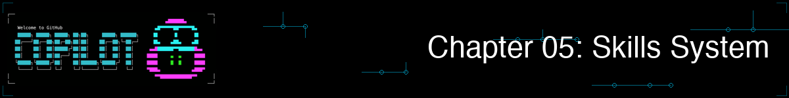
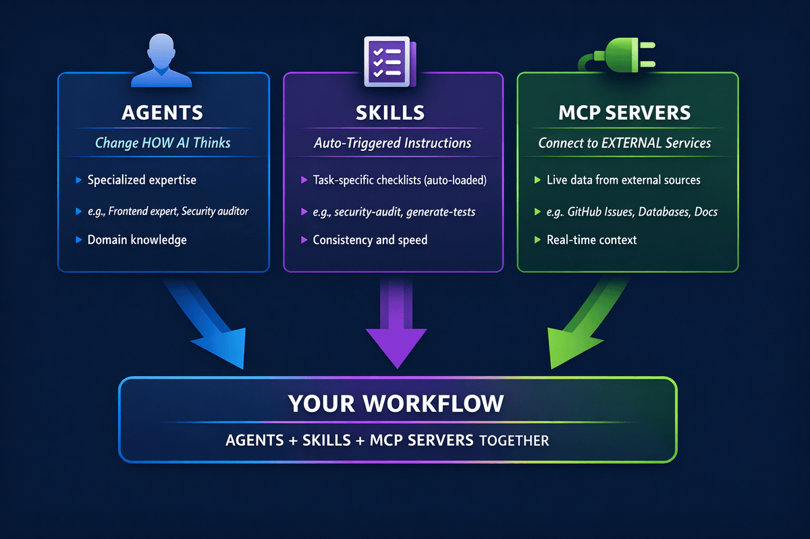
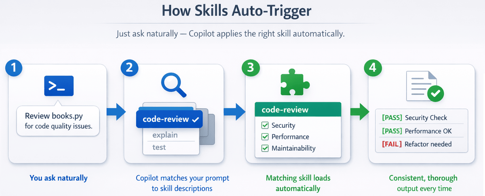

> **如果 Copilot 能自动应用团队的最佳实践，而不用你每次都重新解释一遍，会怎样？**

在本章中，你将学习 Agent Skills：它们是一组按文件夹组织的指令，Copilot 会在与你的任务相关时自动加载。智能体改变的是 Copilot *如何*思考，而技能教会 Copilot *如何按特定方式完成任务*。你将创建一个安全审计技能，让 Copilot 在你询问安全问题时自动应用；你还会构建团队统一的审查标准，以确保代码质量保持一致，并了解技能如何在 Copilot CLI、VS Code 和 Copilot 编码智能体之间协同工作。


## 🎯 学习目标

完成本章后，你将能够：

- 理解智能体技能的工作原理及使用时机
- 使用 SKILL.md 文件创建自定义技能
- 使用来自共享仓库的社区技能
- 知道何时使用技能 vs 智能体 vs MCP

> ⏱️ **预计用时**：约 55 分钟（阅读 20 分钟 + 动手 35 分钟）

---

## 🧩 现实类比：动力工具

通用电钻很有用，但专用配件才是它的威力所在。


技能的工作方式相同。就像为不同工作换钻头一样，你可以为不同任务向 Copilot 添加技能：

| 技能配件 | 用途 |
|---------|------|
| `commit` | 生成一致的提交信息 |
| `security-audit` | 检查 OWASP 漏洞 |
| `generate-tests` | 创建全面的 pytest 测试 |
| `code-checklist` | 应用团队代码质量标准 |


*技能是扩展 Copilot 能力的专用配件*

---

# 技能的工作原理


了解技能是什么，为何重要，以及它们与智能体和 MCP 的区别。

---

## *技能新手？* 从这里开始！

1. **查看哪些技能已经可用：**
   ```bash
   copilot
   > /skills list
   ```
   这会显示 Copilot 在项目和个人文件夹中找到的所有技能。

2. **查看真实的技能文件：** 查看我们提供的 [code-checklist SKILL.md](../.github/skills/code-checklist/SKILL.md) 以了解模式。它只是 YAML frontmatter 加上 Markdown 指令。

3. **理解核心概念：** 技能是特定任务的指令，当你的提示词与技能描述匹配时，Copilot *自动*加载它们。你不需要激活它们，只需自然地提问即可。


## 理解技能

智能体技能是包含指令、脚本和资源的文件夹，Copilot **在与任务相关时自动加载**。Copilot 读取你的提示词，检查是否有技能匹配，并自动应用相关指令。

```bash
copilot

> Check books.py against our quality checklist
# Copilot 检测到这与你的"code-checklist"技能匹配
# 并自动应用其 Python 质量清单

> Generate tests for the BookCollection class
# Copilot 加载你的"pytest-gen"技能
# 并应用你首选的测试结构

> What are the code quality issues in this file?
# Copilot 加载你的"code-checklist"技能
# 并根据团队标准进行检查
```

> 💡 **关键洞察**：技能根据你的提示词与技能描述的匹配**自动触发**。自然地提问，Copilot 在后台自动应用相关技能。当然，你也可以直接调用技能，稍后会介绍。

> 🧰 **即用模板**：查看 [.github/skills](../.github/skills/) 文件夹获取可直接复制使用的技能。

### 直接斜杠命令调用

虽然自动触发是技能工作的主要方式，你也可以使用技能名称作为斜杠命令**直接调用技能**：

```bash
> /generate-tests Create tests for the user authentication module

> /code-checklist Check books.py for code quality issues

> /security-audit Check the API endpoints for vulnerabilities
```

这让你在想要确保使用特定技能时拥有明确的控制权。

> 📝 **技能 vs 智能体的调用方式**：不要混淆技能调用与智能体调用：
> - **技能**：`/技能名称 <提示词>`，如 `/code-checklist Check this file`
> - **智能体**：`/agent`（从列表中选择）或 `copilot --agent <名称>`（命令行）
>
> 如果你同时有一个叫"code-reviewer"的技能和智能体，输入 `/code-reviewer` 会调用**技能**，而不是智能体。

### 如何知道技能被使用了？

你可以直接问 Copilot：

```bash
> What skills did you use for that response?

> What skills do you have available for security reviews?
```

### 技能 vs 智能体 vs MCP

技能只是 GitHub Copilot 可扩展性模型的一部分。以下是它们与智能体和 MCP 服务器的比较。

> *先别担心 MCP，我们将在[第 06 章](../06-mcp-servers/README.zh-CN.md)中介绍。这里包含它只是为了让你了解技能在整体图景中的位置。*



| 功能 | 作用 | 使用时机 |
|------|------|---------|
| **智能体** | 改变 AI 的思考方式 | 跨多个任务需要专业知识 |
| **技能** | 提供特定任务的指令 | 有详细步骤的特定、可重复任务 |
| **MCP** | 连接外部服务 | 需要来自 API 的实时数据 |

将智能体用于广泛的专业知识，将技能用于特定任务的指令，将 MCP 用于外部数据。智能体可以在对话中使用一个或多个技能。例如，当你让智能体检查代码时，它可能会自动应用 `security-audit` 技能和 `code-checklist` 技能。

> 📚 **了解更多**：查看官方[关于智能体技能](https://docs.github.com/copilot/concepts/agents/about-agent-skills)文档，获取技能格式和最佳实践的完整参考。

---

## 从手动提示词到自动专业知识

在深入了解如何创建技能之前，先看看*为什么*值得学习它们。一旦你看到一致性的提升，"如何"就会更有意义。

### 没有技能：不一致的审查

每次代码审查，你可能都会遗漏一些东西：

```bash
copilot

> Review this code for issues
# 通用审查——可能遗漏团队的具体关注点
```

或者每次都要写一个很长的提示词：

```bash
> Review this code checking for bare except clauses, missing type hints,
> mutable default arguments, missing context managers for file I/O,
> functions over 50 lines, print statements in production code...
```

耗时：**超过 30 秒**来输入。一致性：**因记忆力而异**。

### 有了技能：自动最佳实践

安装了 `code-checklist` 技能后，只需自然提问：

```bash
copilot

> Check the book collection code for quality issues
```

**后台发生了什么**：
1. Copilot 在提示词中看到"code quality"和"issues"
2. 检查技能描述，发现你的 `code-checklist` 技能匹配
3. 自动加载团队质量清单
4. 应用所有检查，无需你列出它们



*自然地提问，Copilot 将提示词与正确技能匹配并自动应用。*

**输出**：
```
## Code Checklist: books.py

### Code Quality
- [PASS] All functions have type hints
- [PASS] No bare except clauses
- [PASS] No mutable default arguments
- [PASS] Context managers used for file I/O
- [PASS] Functions are under 50 lines
- [PASS] Variable and function names follow PEP 8

### Input Validation
- [FAIL] User input is not validated - add_book() accepts any year value
- [FAIL] Edge cases not fully handled - empty strings accepted for title/author
- [PASS] Error messages are clear and helpful

### Testing
- [FAIL] No corresponding pytest tests found

### Summary
3 items need attention before merge
```

**区别**：你的团队标准每次都被自动应用，无需把它们都输出来。

---

<details>
<summary>🎬 看实际演示！</summary>


*演示输出因情况而异。你的模型、工具和响应将与此处显示的不同。*

</details>

---

## 规模化一致性：团队 PR 审查技能

想象你的团队有一个 10 点的 PR 清单。没有技能，每个开发者都必须记住所有 10 个点，而且总有人会忘记其中某一点。有了 `pr-review` 技能，整个团队都能获得一致的审查：

```bash
copilot

> Can you review this PR?
```

Copilot 自动加载团队的 `pr-review` 技能并检查所有 10 个点：

```
PR Review: feature/user-auth

## Security ✅
- No hardcoded secrets
- Input validation present
- No bare except clauses

## Code Quality ⚠️
- [WARN] print statement on line 45 - remove before merge
- [WARN] TODO on line 78 missing issue reference
- [WARN] Missing type hints on public functions

## Testing ✅
- New tests added
- Edge cases covered

## Documentation ❌
- [FAIL] Breaking change not documented in CHANGELOG
- [FAIL] API changes need OpenAPI spec update
```

**技能的力量**：每个团队成员都自动应用相同的标准。新员工不需要记住清单，因为技能会处理这一切。

---

# 创建自定义技能


从 SKILL.md 文件构建你自己的技能。

---

## 技能存放位置

技能存储在 `.github/skills/`（项目特定）或 `~/.copilot/skills/`（用户级别）中。

### Copilot 如何找到技能

Copilot 会自动扫描以下位置寻找技能：

| 位置 | 范围 |
|------|------|
| `.github/skills/` | 项目特定（通过 git 与团队共享）|
| `~/.copilot/skills/` | 用户特定（你的个人技能）|

### 技能结构

每个技能都存在于自己的文件夹中，包含一个 `SKILL.md` 文件。你也可以选择性地包含脚本、示例或其他资源：

```
.github/skills/
└── my-skill/
    ├── SKILL.md           # 必填：技能定义和指令
    ├── examples/          # 可选：Copilot 可以参考的示例文件
    │   └── sample.py
    └── scripts/           # 可选：技能可以使用的脚本
        └── validate.sh
```

> 💡 **提示**：目录名称应与 SKILL.md frontmatter 中的 `name` 匹配（小写加连字符）。

### SKILL.md 格式

技能使用带有 YAML frontmatter 的简单 Markdown 格式：

```markdown
---
name: code-checklist
description: Comprehensive code quality checklist with security, performance, and maintainability checks
license: MIT
---

# Code Checklist

When checking code, look for:

## Security
- SQL injection vulnerabilities
- XSS vulnerabilities
- Authentication/authorization issues
- Sensitive data exposure

## Performance
- N+1 query problems (running one query per item instead of one query for all items)
- Unnecessary loops or computations
- Memory leaks
- Blocking operations

## Maintainability
- Function length (flag functions > 50 lines)
- Code duplication
- Missing error handling
- Unclear naming

## Output Format
Provide issues as a numbered list with severity:
- [CRITICAL] - Must fix before merge
- [HIGH] - Should fix before merge
- [MEDIUM] - Should address soon
- [LOW] - Nice to have
```

**YAML 属性：**

| 属性 | 必填 | 描述 |
|------|------|------|
| `name` | **是** | 唯一标识符（小写，空格用连字符替代）|
| `description` | **是** | 技能的作用以及 Copilot 何时应使用它 |
| `license` | 否 | 适用于此技能的许可证 |

> 📖 **官方文档**：[关于智能体技能](https://docs.github.com/copilot/concepts/agents/about-agent-skills)

### 创建你的第一个技能

让我们构建一个检查 OWASP Top 10 漏洞的安全审计技能：

```bash
# 创建技能目录
mkdir -p .github/skills/security-audit

# 创建 SKILL.md 文件
cat > .github/skills/security-audit/SKILL.md << 'EOF'
---
name: security-audit
description: Security-focused code review checking OWASP (Open Web Application Security Project) Top 10 vulnerabilities
---

# Security Audit

Perform a security audit checking for:

## Injection Vulnerabilities
- SQL injection (string concatenation in queries)
- Command injection (unsanitized shell commands)
- LDAP injection
- XPath injection

## Authentication Issues
- Hardcoded credentials
- Weak password requirements
- Missing rate limiting
- Session management flaws

## Sensitive Data
- Plaintext passwords
- API keys in code
- Logging sensitive information
- Missing encryption

## Access Control
- Missing authorization checks
- Insecure direct object references
- Path traversal vulnerabilities

## Output
For each issue found, provide:
1. File and line number
2. Vulnerability type
3. Severity (CRITICAL/HIGH/MEDIUM/LOW)
4. Recommended fix
EOF

# 测试你的技能（技能根据提示词自动加载）
copilot

> @samples/book-app-project/ Check this code for security vulnerabilities
# Copilot 检测到"security vulnerabilities"与你的技能匹配
# 并自动应用其 OWASP 清单
```

**预期输出**（你的结果会有所不同）：

```
Security Audit: book-app-project

[HIGH] Hardcoded file path (book_app.py, line 12)
  File path is hardcoded rather than configurable
  Fix: Use environment variable or config file

[MEDIUM] No input validation (book_app.py, line 34)
  User input passed directly to function without sanitization
  Fix: Add input validation before processing

✅ No SQL injection found
✅ No hardcoded credentials found
```

---

## 编写好的技能描述

SKILL.md 中的 `description` 字段至关重要！这是 Copilot 决定是否加载你的技能的依据：

```markdown
---
name: security-audit
description: Use for security reviews, vulnerability scanning,
  checking for SQL injection, XSS, authentication issues,
  OWASP Top 10 vulnerabilities, and security best practices
---
```

> 💡 **提示**：包含与你自然提问方式匹配的关键词。如果你说"security review"，就在描述中包含"security review"。

### 将技能与智能体结合

技能和智能体可以协同工作。智能体提供专业知识，技能提供具体指令：

```bash
# 使用 code-reviewer 智能体开始
copilot --agent code-reviewer

> Check the book app for quality issues
# code-reviewer 智能体的专业知识与
# 你的 code-checklist 技能的清单相结合
```

---

# 管理与分享技能

发现已安装的技能，寻找社区技能，并分享你自己的技能。


---

## 使用 `/skills` 命令管理技能

使用 `/skills` 命令管理你安装的技能：

| 命令 | 作用 |
|------|------|
| `/skills list` | 显示所有已安装的技能 |
| `/skills info <名称>` | 获取特定技能的详细信息 |
| `/skills add <名称>` | 启用一个技能（来自仓库或市场）|
| `/skills remove <名称>` | 禁用或卸载一个技能 |
| `/skills reload` | 编辑 SKILL.md 文件后重新加载技能 |

> 💡 **记住**：你不需要为每个提示词"激活"技能。一旦安装，当提示词与描述匹配时技能会**自动触发**。这些命令是用来管理哪些技能可用，而不是用来使用它们的。

### 示例：查看你的技能

```bash
copilot

> /skills list

Available skills:
- security-audit: Security-focused code review checking OWASP Top 10
- generate-tests: Generate comprehensive unit tests with edge cases
- code-checklist: Team code quality checklist
...

> /skills info security-audit

Skill: security-audit
Source: Project
Location: .github/skills/security-audit/SKILL.md
Description: Security-focused code review checking OWASP Top 10 vulnerabilities
```

---

<details>
<summary>看实际演示！</summary>


*演示输出因情况而异。你的模型、工具和响应将与此处显示的不同。*

</details>

---

### 何时使用 `/skills reload`

创建或编辑技能的 SKILL.md 文件后，运行 `/skills reload` 无需重启 Copilot 即可获取更改：

```bash
# 编辑你的技能文件
# 然后在 Copilot 中：
> /skills reload
Skills reloaded successfully.
```

> 💡 **值得了解**：即使使用 `/compact` 压缩对话历史后，技能仍然有效。无需在压缩后重新加载。

---

## 查找和使用社区技能

### 使用插件安装技能

> 💡 **什么是插件？** 插件是可安装的包，可以将技能、智能体和 MCP 服务器配置捆绑在一起。把它们看作 Copilot CLI 的"应用商店"扩展。

`/plugin` 命令允许你浏览和安装这些包：

```bash
copilot

> /plugin list
# 显示已安装的插件

> /plugin marketplace
# 浏览可用插件

> /plugin install <插件名称>
# 从市场安装插件
```

插件可以将多个功能捆绑在一起——一个插件可能包含协同工作的相关技能、智能体和 MCP 服务器配置。

### 社区技能仓库

预制技能也可从社区仓库获取：

- **[Awesome Copilot](https://github.com/github/awesome-copilot)** - 官方 GitHub Copilot 资源，包括技能文档和示例

### 手动安装社区技能

如果你在 GitHub 仓库中找到了技能，将其文件夹复制到你的技能目录：

```bash
# 克隆 awesome-copilot 仓库
git clone https://github.com/github/awesome-copilot.git /tmp/awesome-copilot

# 将特定技能复制到你的项目
cp -r /tmp/awesome-copilot/skills/code-checklist .github/skills/

# 或用于个人跨项目使用
cp -r /tmp/awesome-copilot/skills/code-checklist ~/.copilot/skills/
```

> ⚠️ **安装前先审查**：在将技能的 `SKILL.md` 复制到项目之前，始终仔细阅读它。技能控制 Copilot 的行为，恶意技能可能指示它运行有害命令或以意外方式修改代码。

---

# 动手练习


通过构建和测试你自己的技能来应用所学知识。

---

## ▶️ 自己试试

### 构建更多技能

以下是两个展示不同模式的技能。按照上方"创建你的第一个技能"中的相同 `mkdir` + `cat` 工作流操作，或将技能粘贴到正确位置。更多示例在 [.github/skills](../.github/skills) 中。

### pytest 测试生成技能

确保代码库中一致的 pytest 结构的技能：

```bash
mkdir -p .github/skills/pytest-gen

cat > .github/skills/pytest-gen/SKILL.md << 'EOF'
---
name: pytest-gen
description: Generate comprehensive pytest tests with fixtures and edge cases
---

# pytest Test Generation

Generate pytest tests that include:

## Test Structure
- Use pytest conventions (test_ prefix)
- One assertion per test when possible
- Clear test names describing expected behavior
- Use fixtures for setup/teardown

## Coverage
- Happy path scenarios
- Edge cases: None, empty strings, empty lists
- Boundary values
- Error scenarios with pytest.raises()

## Fixtures
- Use @pytest.fixture for reusable test data
- Use tmpdir/tmp_path for file operations
- Mock external dependencies with pytest-mock

## Output
Provide complete, runnable test file with proper imports.
EOF
```

### 团队 PR 审查技能

在团队中强制执行一致 PR 审查标准的技能：

```bash
mkdir -p .github/skills/pr-review

cat > .github/skills/pr-review/SKILL.md << 'EOF'
---
name: pr-review
description: Team-standard PR review checklist
---

# PR Review

Review code changes against team standards:

## Security Checklist
- [ ] No hardcoded secrets or API keys
- [ ] Input validation on all user data
- [ ] No bare except clauses
- [ ] No sensitive data in logs

## Code Quality
- [ ] Functions under 50 lines
- [ ] No print statements in production code
- [ ] Type hints on public functions
- [ ] Context managers for file I/O
- [ ] No TODOs without issue references

## Testing
- [ ] New code has tests
- [ ] Edge cases covered
- [ ] No skipped tests without explanation

## Documentation
- [ ] API changes documented
- [ ] Breaking changes noted
- [ ] README updated if needed

## Output Format
Provide results as:
- ✅ PASS: Items that look good
- ⚠️ WARN: Items that could be improved
- ❌ FAIL: Items that must be fixed before merge
EOF
```

### 进一步探索

1. **技能创建挑战**：创建一个 `quick-review` 技能，执行 3 点清单：
   - Bare except 子句
   - 缺失的类型注解
   - 不清晰的变量名

   通过提问来测试：「Do a quick review of books.py」

2. **技能对比**：计时手动编写详细安全审查提示词需要多长时间。然后只需提问「Check for security issues in this file」，让你的 security-audit 技能自动加载。技能帮你节省了多少时间？

3. **团队技能挑战**：思考团队的代码审查清单。能将它编码为技能吗？写下技能应该始终检查的 3 件事。

**自我检验**：当你能解释 `description` 字段为何重要（这是 Copilot 决定是否加载你的技能的方式）时，你就理解了技能。

---

## 📝 作业

### 主要挑战：构建书籍摘要技能

上面的示例创建了 `pytest-gen` 和 `pr-review` 技能。现在练习创建一种完全不同类型的技能：用于从数据生成格式化输出的技能。

1. 列出当前技能：运行 Copilot 并传入 `/skills list`。你也可以使用 `ls .github/skills/` 查看项目技能，或 `ls ~/.copilot/skills/` 查看个人技能。
2. 在 `.github/skills/book-summary/SKILL.md` 创建一个 `book-summary` 技能，生成书籍集合的格式化 Markdown 摘要
3. 你的技能应该有：
   - 清晰的名称和描述（描述对匹配至关重要！）
   - 具体的格式规则（例如，带有标题、作者、年份、阅读状态的 Markdown 表格）
   - 输出约定（例如，已读状态使用 ✅/❌，按年份排序）
4. 测试技能：`@samples/book-app-project/data.json Summarize the books in this collection`
5. 通过检查 `/skills list` 验证技能自动触发
6. 尝试直接调用：`/book-summary Summarize the books in this collection`

**成功标准**：你有一个可用的 `book-summary` 技能，Copilot 在你询问书籍集合时会自动应用。

<details>
<summary>💡 提示（点击展开）</summary>

**起始模板**：创建 `.github/skills/book-summary/SKILL.md`：

```markdown
---
name: book-summary
description: Generate a formatted markdown summary of a book collection
---

# Book Summary Generator

Generate a summary of the book collection following these rules:

1. Output a markdown table with columns: Title, Author, Year, Status
2. Use ✅ for read books and ❌ for unread books
3. Sort by year (oldest first)
4. Include a total count at the bottom
5. Flag any data issues (missing authors, invalid years)

Example:
| Title | Author | Year | Status |
|-------|--------|------|--------|
| 1984 | George Orwell | 1949 | ✅ |
| Dune | Frank Herbert | 1965 | ❌ |

**Total: 2 books (1 read, 1 unread)**
```

**测试：**
```bash
copilot
> @samples/book-app-project/data.json Summarize the books in this collection
# 技能应基于描述匹配自动触发
```

**如果未触发：** 尝试 `/skills reload` 然后再次提问。

</details>

### 附加挑战：提交信息技能

1. 创建一个 `commit-message` 技能，生成格式一致的约定式提交信息
2. 通过暂存一个更改并提问来测试：「Generate a commit message for my staged changes」
3. 记录你的技能并在 GitHub 上以 `copilot-skill` 主题分享

---

<details>
<summary>🔧 <strong>常见错误与故障排除</strong>（点击展开）</summary>

### 常见错误

| 错误 | 发生了什么 | 解决方法 |
|------|-----------|---------|
| 文件名不是 `SKILL.md` | 技能不会被识别 | 文件必须完全命名为 `SKILL.md` |
| `description` 字段模糊 | 技能从不自动加载 | 描述是*主要*发现机制，使用具体的触发词 |
| frontmatter 中缺少 `name` 或 `description` | 技能加载失败 | 在 YAML frontmatter 中添加这两个字段 |
| 文件夹位置错误 | 找不到技能 | 使用 `.github/skills/技能名称/`（项目）或 `~/.copilot/skills/技能名称/`（个人）|

### 故障排除

**技能未被使用** - 如果 Copilot 在预期情况下未使用你的技能：

1. **检查描述**：它是否与你的提问方式匹配？
   ```markdown
   # 坏：太模糊
   description: Reviews code

   # 好：包含触发词
   description: Use for code reviews, checking code quality,
     finding bugs, security issues, and best practice violations
   ```

2. **验证文件位置**：
   ```bash
   # 项目技能
   ls .github/skills/

   # 用户技能
   ls ~/.copilot/skills/
   ```

3. **检查 SKILL.md 格式**：frontmatter 是必需的：
   ```markdown
   ---
   name: skill-name
   description: What the skill does and when to use it
   ---

   # Instructions here
   ```

**技能未出现** - 验证文件夹结构：
```
.github/skills/
└── my-skill/           # 文件夹名称
    └── SKILL.md        # 必须完全是 SKILL.md（区分大小写）
```

创建或编辑技能后运行 `/skills reload` 确保获取更改。

**测试技能是否加载** - 直接问 Copilot：
```bash
> What skills do you have available for checking code quality?
# Copilot 将描述它发现的相关技能
```

**如何知道技能是否真正在工作？**

1. **检查输出格式**：如果技能指定了输出格式（如 `[CRITICAL]` 标签），在响应中查找它
2. **直接询问**：获得响应后，问「Did you use any skills for that?」
3. **对比有无技能**：用 `--no-custom-instructions` 尝试相同提示词以查看区别：
   ```bash
   # 使用技能
   copilot --allow-all -p "Review @file.py for security issues"

   # 不使用技能（基线对比）
   copilot --allow-all -p "Review @file.py for security issues" --no-custom-instructions
   ```
4. **检查特定检查**：如果技能包含特定检查（如「functions over 50 lines」），看看这些是否出现在输出中

</details>

---

# 总结

## 🔑 关键要点

1. **技能是自动的**：当提示词与技能描述匹配时，Copilot 会加载它们
2. **直接调用**：你也可以使用 `/技能名称` 作为斜杠命令直接调用技能
3. **SKILL.md 格式**：YAML frontmatter（name、description、可选的 license）加上 Markdown 指令
4. **位置很重要**：`.github/skills/` 用于项目/团队共享，`~/.copilot/skills/` 用于个人使用
5. **描述是关键**：编写与你自然提问方式匹配的描述

> 📋 **快速参考**：查看 [GitHub Copilot CLI 命令参考](https://docs.github.com/en/copilot/reference/cli-command-reference) 获取完整的命令和快捷键列表。

---

## ➡️ 下一步

技能通过自动加载指令扩展 Copilot 的能力。但如果需要连接到外部服务呢？这就是 MCP 的用武之地。

在**[第 06 章：MCP 服务器](../06-mcp-servers/README.zh-CN.md)**中，你将学习：

- 什么是 MCP（模型上下文协议）
- 连接到 GitHub、文件系统和文档服务
- 配置 MCP 服务器
- 多服务器工作流

---

**[← 返回第 04 章](../04-agents-custom-instructions/README.zh-CN.md)** | **[继续第 06 章 →](../06-mcp-servers/README.zh-CN.md)**
