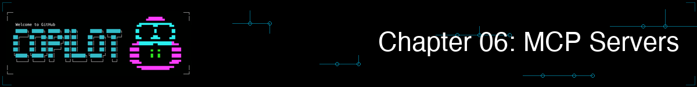

> **如果 Copilot 能直接从终端读取 GitHub Issues、检查数据库，还能创建 PR……那会怎样？**

到目前为止，Copilot 只能使用你直接提供的内容：用 `@` 引用的文件、对话历史以及它自身的训练数据。但如果它能主动检查你的 GitHub 仓库、浏览项目文件，或查找某个库的最新文档呢？

这正是 MCP（模型上下文协议）的作用。它将 Copilot 与外部服务连接起来，让它能访问实时的真实世界数据。Copilot 连接的每个服务都称为一个"MCP 服务器"。在本章中，你将设置几个这样的连接，并了解它们如何让 Copilot 变得更加强大。

> 💡 **已经熟悉 MCP 了？** [直接跳到快速入门](#-use-the-built-in-github-mcp)确认它正常工作，然后开始配置服务器。

## 🎯 学习目标

完成本章后，你将能够：

- 理解 MCP 是什么以及为何重要
- 使用 `/mcp` 命令管理 MCP 服务器
- 配置 GitHub、文件系统和文档的 MCP 服务器
- 通过书籍应用项目使用 MCP 驱动的工作流
- 了解何时以及如何构建自定义 MCP 服务器（可选）

> ⏱️ **预计用时**：约 50 分钟（阅读 15 分钟 + 动手 35 分钟）

---

## 🧩 现实类比：浏览器扩展


把 MCP 服务器想象成浏览器扩展。你的浏览器本身可以显示网页，但扩展将它连接到额外的服务：

| 浏览器扩展 | 连接到 | MCP 等价物 |
|-----------|--------|-----------|
| 密码管理器 | 你的密码库 | **GitHub MCP** → 你的仓库、Issues、PRs |
| Grammarly | 写作分析服务 | **Context7 MCP** → 库文档 |
| 文件管理器 | 云存储 | **Filesystem MCP** → 本地项目文件 |

没有扩展，你的浏览器仍然有用，但有了扩展，它就变成了一个强力工具。MCP 服务器对 Copilot 的作用是一样的。它们将 Copilot 连接到真实的实时数据源，让它能读取你的 GitHub Issues、浏览文件系统、获取最新文档等等。

***MCP 服务器将 Copilot 与外部世界连接：GitHub、仓库、文档等等***

> 💡 **关键洞察**：没有 MCP，Copilot 只能看到你通过 `@` 显式分享的文件。有了 MCP，它可以主动探索你的项目、检查 GitHub 仓库并查找文档，一切自动完成。

---


# 快速入门：30 秒体验 MCP

<a id="-use-the-built-in-github-mcp"></a>

## 使用内置 GitHub MCP 服务器
在配置任何东西之前，先立即体验 MCP。
GitHub MCP 服务器默认包含在内。试试这个：

```bash
copilot
> List the recent commits in this repository
```

如果 Copilot 返回了真实的提交数据，你刚刚就已经看到了 MCP 的实际效果。这是 GitHub MCP 服务器代表你向 GitHub 发出请求的结果。但 GitHub 只是*一个*服务器。本章将向你展示如何添加更多服务器（文件系统访问、最新文档等），让 Copilot 能做更多事情。

---

## `/mcp show` 命令

使用 `/mcp show` 查看哪些 MCP 服务器已配置以及是否已启用：

```bash
copilot

> /mcp show

MCP Servers:
✓ github (enabled) - GitHub integration
✓ filesystem (enabled) - File system access
```

> 💡 **只看到 GitHub 服务器？** 这是正常的！如果你还没有添加任何其他 MCP 服务器，GitHub 是唯一列出的服务器。你将在下一节中添加更多。

> 📚 **想查看所有 `/mcp` 命令？** 还有其他用于添加、编辑、启用和删除服务器的命令。请参阅本章末尾的[完整命令参考](#-additional-mcp-commands)。

<details>
<summary>🎬 看实际演示！</summary>


*演示输出因情况而异。你的模型、工具和响应将与此处显示的不同。*

</details>

---

## MCP 带来了什么变化？

以下是 MCP 在实际中的区别：

**没有 MCP：**
```bash
> What's in GitHub issue #42?

"I don't have access to GitHub. You'll need to copy and paste the issue content."
```

**有了 MCP：**
```bash
> What's in GitHub issue #42 of this repository?

Issue #42: Login fails with special characters
Status: Open
Labels: bug, priority-high
Description: Users report that passwords containing...
```

MCP 让 Copilot 了解你真实的开发环境。

> 📚 **官方文档**：[关于 MCP](https://docs.github.com/copilot/concepts/context/mcp) 深入了解 MCP 如何与 GitHub Copilot 配合工作。

---

# 配置 MCP 服务器


现在你已经看到了 MCP 的实际效果，让我们设置更多服务器。本节介绍配置文件格式以及如何添加新服务器。

---

## MCP 配置文件

MCP 服务器在 `~/.copilot/mcp-config.json`（用户级别，适用于所有项目）或 `.vscode/mcp.json`（项目级别，仅适用于当前工作区）中配置。

```json
{
  "mcpServers": {
    "server-name": {
      "type": "local",
      "command": "npx",
      "args": ["@package/server-name"],
      "tools": ["*"]
    }
  }
}
```

*大多数 MCP 服务器以 npm 包的形式发布，通过 `npx` 命令运行。*

<details>
<summary>💡 <strong>不熟悉 JSON？</strong> 点击这里了解每个字段的含义</summary>

| 字段 | 含义 |
|------|------|
| `"mcpServers"` | 所有 MCP 服务器配置的容器 |
| `"server-name"` | 你选择的名称（如"github"、"filesystem"）|
| `"type": "local"` | 服务器在你的机器上运行 |
| `"command": "npx"` | 要运行的程序（npx 运行 npm 包）|
| `"args": [...]` | 传递给命令的参数 |
| `"tools": ["*"]` | 允许此服务器的所有工具 |

**重要的 JSON 规则：**
- 字符串使用双引号 `"`（不是单引号）
- 最后一项后面没有尾随逗号
- 文件必须是有效的 JSON（如不确定，使用 [JSON 验证器](https://jsonlint.com/)）

</details>

---

## 添加 MCP 服务器

GitHub MCP 服务器是内置的，无需任何设置。以下是你可以添加的其他服务器。**选择你感兴趣的，或按顺序操作。**

| 我想... | 跳转到 |
|--------|--------|
| 让 Copilot 浏览我的项目文件 | [文件系统服务器](#filesystem-server) |
| 获取最新的库文档 | [Context7 服务器](#context7-server-documentation) |
| 探索可选功能（自定义服务器、web_fetch）| [进阶](#beyond-the-basics) |

<details>
<summary><strong>文件系统服务器</strong>——让 Copilot 浏览你的项目文件</summary>
<a id="filesystem-server"></a>

### 文件系统服务器

```json
{
  "mcpServers": {
    "filesystem": {
      "type": "local",
      "command": "npx",
      "args": ["-y", "@modelcontextprotocol/server-filesystem", "."],
      "tools": ["*"]
    }
  }
}
```

> 💡 **`.` 路径**：`.` 意思是"当前目录"。Copilot 可以访问你启动它的相对位置的文件。在 Codespace 中，这是工作区根目录。你也可以使用绝对路径，如 `/workspaces/copilot-cli-for-beginners`。

将此内容添加到 `~/.copilot/mcp-config.json` 并重启 Copilot。

</details>

<details>
<summary><strong>Context7 服务器</strong>——获取最新的库文档</summary>
<a id="context7-server-documentation"></a>

### Context7 服务器（文档）

Context7 让 Copilot 能访问流行框架和库的最新文档。Copilot 不再依赖可能过时的训练数据，而是获取真正的当前文档。

```json
{
  "mcpServers": {
    "context7": {
      "type": "local",
      "command": "npx",
      "args": ["-y", "@upstash/context7-mcp"],
      "tools": ["*"]
    }
  }
}
```

- ✅ **无需 API 密钥**
- ✅ **无需账户**
- ✅ **你的代码留在本地**

将此内容添加到 `~/.copilot/mcp-config.json` 并重启 Copilot。

</details>

<details>
<summary><strong>进阶</strong>——自定义服务器和网络访问（可选）</summary>
<a id="beyond-the-basics"></a>

这些是当你对上面的核心服务器感到熟悉后的可选功能。

<a id="microsoft-learn-mcp-server"></a>

### Microsoft Learn MCP 服务器

到目前为止你看到的所有 MCP 服务器（文件系统、Context7）都在你的机器上本地运行。但 MCP 服务器也可以远程运行，这意味着你只需将 Copilot CLI 指向一个 URL，它会处理其余的事情。无需 `npx` 或 `python`，无需本地进程，无需安装依赖。

[Microsoft Learn MCP 服务器](https://github.com/microsoftdocs/mcp) 就是一个很好的例子。它让 Copilot CLI 直接访问官方 Microsoft 文档（Azure、Microsoft Foundry 和其他 AI 主题、.NET、Microsoft 365 等），所以它可以搜索文档、获取完整页面，并找到官方代码示例，而不是依赖模型的训练数据。

- ✅ **无需 API 密钥**
- ✅ **无需账户**
- ✅ **无需本地安装**

**使用 `/plugin install` 快速安装：**

无需手动编辑 JSON 配置文件，你可以用一条命令安装它：

```bash
copilot

> /plugin install microsoftdocs/mcp
```

这会自动添加服务器及其关联的智能体技能。安装的技能包括：

- **microsoft-docs**：概念、教程和事实查询
- **microsoft-code-reference**：API 查询、代码示例和故障排除
- **microsoft-skill-creator**：用于生成 Microsoft 技术相关自定义技能的元技能

**使用方式：**
```bash
copilot

> What's the recommended way to deploy a Python app to Azure App Service? Search Microsoft Learn.
```

📚 了解更多：[Microsoft Learn MCP 服务器概述](https://learn.microsoft.com/training/support/mcp-get-started)

### 使用 `web_fetch` 进行网络访问

Copilot CLI 包含一个内置的 `web_fetch` 工具，可以从任何 URL 获取内容。这对于在不离开终端的情况下拉取 README、API 文档或发布说明非常有用。无需 MCP 服务器。

你可以通过 `~/.copilot/config.json`（通用 Copilot 设置）控制哪些 URL 可以访问，这与 `~/.copilot/mcp-config.json`（MCP 服务器定义）是分开的。

```json
{
  "permissions": {
    "allowedUrls": [
      "https://api.github.com/**",
      "https://docs.github.com/**",
      "https://*.npmjs.org/**"
    ],
    "blockedUrls": [
      "http://**"
    ]
  }
}
```

**使用方式：**
```bash
copilot

> Fetch and summarize the README from https://github.com/facebook/react
```

### 构建自定义 MCP 服务器

想将 Copilot 连接到你自己的 API、数据库或内部工具？你可以用 Python 构建一个自定义 MCP 服务器。这是完全可选的，因为预构建的服务器（GitHub、文件系统、Context7）已经覆盖了大多数用例。

📖 请参阅[自定义 MCP 服务器指南](mcp-custom-server.zh-CN.md)，以书籍应用为例进行完整演示。

📚 了解更多背景，请参阅 [MCP 初学者课程](https://github.com/microsoft/mcp-for-beginners)。

</details>

<a id="complete-configuration-file"></a>

### 完整配置文件

以下是包含文件系统和 Context7 服务器的完整 `mcp-config.json`：

> 💡 **注意：** GitHub MCP 是内置的，你不需要将它添加到配置文件中。

```json
{
  "mcpServers": {
    "filesystem": {
      "type": "local",
      "command": "npx",
      "args": ["-y", "@modelcontextprotocol/server-filesystem", "."],
      "tools": ["*"]
    },
    "context7": {
      "type": "local",
      "command": "npx",
      "args": ["-y", "@upstash/context7-mcp"],
      "tools": ["*"]
    }
  }
}
```

将这个内容保存为 `~/.copilot/mcp-config.json` 用于全局访问，或 `.vscode/mcp.json` 用于项目特定配置。

---

# 使用 MCP 服务器

现在你已经配置了 MCP 服务器，让我们看看它们能做什么。


---

## 服务器使用示例

**选择一个服务器来探索，或按顺序操作。**

| 我想尝试... | 跳转到 |
|------------|--------|
| GitHub 仓库、Issues 和 PRs | [GitHub 服务器](#github-server-built-in) |
| 浏览项目文件 | [文件系统服务器使用](#filesystem-server-usage) |
| 查找库文档 | [Context7 服务器使用](#context7-server-usage) |
| 自定义服务器、Microsoft Learn MCP 和 web_fetch 使用 | [进阶使用](#beyond-the-basics-usage) |

<details>
<summary><strong>GitHub 服务器（内置）</strong>——访问仓库、Issues、PRs 等</summary>
<a id="github-server-built-in"></a>

### GitHub 服务器（内置）

GitHub MCP 服务器是**内置的**。如果你已经登录 Copilot（你在初始设置时就已经登录了），它已经可以工作了。无需配置！

> 💡 **没有工作？** 运行 `/login` 重新通过 GitHub 身份验证。

<details>
<summary><strong>开发容器中的身份验证</strong></summary>

- **GitHub Codespaces**（推荐）：身份验证是自动的。`gh` CLI 继承了你的 Codespace 令牌。无需任何操作。
- **本地开发容器（Docker）**：容器启动后运行 `gh auth login`，然后重启 Copilot。

**身份验证故障排除：**
```bash
# Check if you're authenticated
gh auth status

# If not, log in
gh auth login

# Verify GitHub MCP is connected
copilot
> /mcp show
```

</details>

| 功能 | 示例 |
|------|------|
| **仓库信息** | 查看提交、分支、贡献者 |
| **Issues** | 列出、创建、搜索和评论 Issues |
| **拉取请求** | 查看 PR、差异、创建 PR、检查状态 |
| **代码搜索** | 跨仓库搜索代码 |
| **Actions** | 查询工作流运行和状态 |

```bash
copilot

# See recent activity in this repo
> List the last 5 commits in this repository

Recent commits:
1. abc1234 - Update chapter 05 skills examples (2 days ago)
2. def5678 - Add book app test fixtures (3 days ago)
3. ghi9012 - Fix typo in chapter 03 README (4 days ago)
...

# Explore the repo structure
> What branches exist in this repository?

Branches:
- main (default)
- chapter6 (current)

# Search for code patterns across the repo
> Search this repository for files that import pytest

Found 1 file:
- samples/book-app-project/tests/test_books.py
```

> 💡 **在你自己的 fork 上工作？** 如果你 fork 了这个课程仓库，你还可以尝试写操作，如创建 Issues 和拉取请求。我们将在下面的练习中实践这些。

> ⚠️ **没有看到结果？** GitHub MCP 操作的是仓库的远程（在 github.com 上），而不仅仅是本地文件。确保你的仓库有远程：运行 `git remote -v` 检查。

</details>

<details>
<summary><strong>文件系统服务器</strong>——浏览和分析项目文件</summary>
<a id="filesystem-server-usage"></a>

### 文件系统服务器

配置后，文件系统 MCP 提供 Copilot 可以自动使用的工具：

```bash
copilot

> How many Python files are in the book-app-project directory?

Found 3 Python files in samples/book-app-project/:
- book_app.py
- books.py
- utils.py

> What's the total size of the data.json file?

samples/book-app-project/data.json: 2.4 KB

> Find all functions that don't have type hints in the book app

Found 2 functions without type hints:
- samples/book-app-project/utils.py:10 - get_user_choice()
- samples/book-app-project/utils.py:14 - get_book_details()
```

</details>

<details>
<summary><strong>Context7 服务器</strong>——查找库文档</summary>
<a id="context7-server-usage"></a>

### Context7 服务器

```bash
copilot

> What are the best practices for using pytest fixtures?

From pytest Documentation:

Fixtures - Use fixtures to provide a fixed baseline for tests:

    import pytest

    @pytest.fixture
    def sample_books():
        return [
            {"title": "1984", "author": "George Orwell", "year": 1949},
            {"title": "Dune", "author": "Frank Herbert", "year": 1965},
        ]

    def test_find_by_author(sample_books):
        # fixture is automatically passed as argument
        results = [b for b in sample_books if "Orwell" in b["author"]]
        assert len(results) == 1

Best practices:
- Use fixtures instead of setup/teardown methods
- Use tmp_path fixture for temporary files
- Use monkeypatch for modifying environment
- Scope fixtures appropriately (function, class, module, session)

> How can I apply this to the book app's test file?

# Copilot now knows the official pytest patterns
# and can apply them to samples/book-app-project/tests/test_books.py
```

</details>

<details>
<summary><strong>进阶</strong>——自定义服务器和 web_fetch 使用</summary>
<a id="beyond-the-basics-usage"></a>

### 进阶

**自定义 MCP 服务器**：如果你从[自定义 MCP 服务器指南](mcp-custom-server.zh-CN.md)构建了书籍查找服务器，你可以直接查询你的书籍集合：

```bash
copilot

> Look up information about "1984" using the book lookup server. Search for books by George Orwell
```

**Microsoft Learn MCP**：如果你安装了 [Microsoft Learn MCP 服务器](#microsoft-learn-mcp-server)，你可以直接查找官方 Microsoft 文档：

```bash
copilot

> How do I configure managed identity for an Azure Function? Search Microsoft Learn.
```

**网络获取**：使用内置的 `web_fetch` 工具从任何 URL 拉取内容：

```bash
copilot

> Fetch and summarize the README from https://github.com/facebook/react
```

</details>

---

## 多服务器工作流

这些工作流展示了为什么开发者会说"我再也不想在没有这个的情况下工作了"。每个示例都在一个会话中将多个 MCP 服务器组合在一起。


*完整的 MCP 工作流：GitHub MCP 检索仓库数据，Filesystem MCP 查找代码，Context7 MCP 提供最佳实践，Copilot 负责分析*

下面的每个示例都是独立的。**选择一个你感兴趣的，或全部阅读。**

| 我想看... | 跳转到 |
|----------|--------|
| 多个服务器协同工作 | [多服务器探索](#multi-server-exploration) |
| 在一个会话中从 Issue 到 PR | [Issue 到 PR 工作流](#issue-to-pr-workflow) |
| 快速的项目健康检查 | [健康仪表板](#health-dashboard) |

<details>
<summary><strong>多服务器探索</strong>——在一个会话中结合文件系统、GitHub 和 Context7</summary>
<a id="multi-server-exploration"></a>

#### 使用多个 MCP 服务器探索书籍应用

```bash
copilot

# Step 1: Use filesystem MCP to explore the book app
> List all Python files in samples/book-app-project/ and summarize
> what each file does

Found 3 Python files:
- book_app.py: CLI entry point with command routing (list, add, remove, find)
- books.py: BookCollection class with data persistence via JSON
- utils.py: Helper functions for user input and display

# Step 2: Use GitHub MCP to check recent changes
> What were the last 3 commits that touched files in samples/book-app-project/?

Recent commits affecting book app:
1. abc1234 - Add test fixtures for BookCollection (2 days ago)
2. def5678 - Add find_by_author method (5 days ago)
3. ghi9012 - Initial book app setup (1 week ago)

# Step 3: Use Context7 MCP for best practices
> What are Python best practices for JSON data persistence?

From Python Documentation:
- Use context managers (with statements) for file I/O
- Handle JSONDecodeError for corrupted files
- Use dataclasses for structured data
- Consider atomic writes to prevent data corruption

# Step 4: Synthesize a recommendation
> Based on the book app code and these best practices,
> what improvements would you suggest?

Suggestions:
1. Add input validation in add_book() for empty strings and invalid years
2. Consider atomic writes in save_books() to prevent data corruption
3. Add type hints to utils.py functions (get_user_choice, get_book_details)
```

<details>
<summary>🎬 看 MCP 工作流实际演示！</summary>


*演示输出因情况而异。你的模型、工具和响应将与此处显示的不同。*

</details>

**结果**：代码探索 → 历史审查 → 最佳实践查询 → 改进计划。**全部在一个终端会话中，使用三个 MCP 服务器协同完成。**

</details>

<details>
<summary><strong>Issue 到 PR 工作流</strong>——不离开终端，从 GitHub Issue 一路到拉取请求</summary>
<a id="issue-to-pr-workflow"></a>

#### Issue 到 PR 工作流（在你自己的仓库上）

在你有写权限的 fork 或仓库上效果最佳：

> 💡 **如果现在无法尝试也不用担心。** 如果你在只读克隆上，你将在作业中练习这个。现在只需阅读以理解流程即可。

```bash
copilot

> Get the details of GitHub issue #1

Issue #1: Add input validation for book year
Status: Open
Description: The add_book function accepts any year value...

> @samples/book-app-project/books.py Fix the issue described in issue #1

[Copilot 在 add_book() 中实现年份验证]

> Run the tests to make sure the fix works

All 8 tests passed ✓

> Create a pull request titled "Add year validation to book app"

✓ Created PR #2: Add year validation to book app
```

**零复制粘贴。零上下文切换。一个终端会话。**

</details>

<details>
<summary><strong>健康仪表板</strong>——使用多个服务器快速获取项目健康检查</summary>
<a id="health-dashboard"></a>

#### 书籍应用健康仪表板

```bash
copilot

> Give me a health report for the book app project:
> 1. List all functions across the Python files in samples/book-app-project/
> 2. Check which functions have type hints and which don't
> 3. Show what tests exist in samples/book-app-project/tests/
> 4. Check the recent commit history for this directory

Book App Health Report
======================

📊 Functions Found:
- books.py: 8 methods in BookCollection (all have type hints ✓)
- book_app.py: 6 functions (4 have type hints, 2 missing)
- utils.py: 3 functions (1 has type hints, 2 missing)

🧪 Test Coverage:
- test_books.py: 8 test functions covering BookCollection
- Missing: no tests for book_app.py CLI functions
- Missing: no tests for utils.py helper functions

📝 Recent Activity:
- 3 commits in the last week
- Most recent: added test fixtures

Recommendations:
- Add type hints to utils.py functions
- Add tests for book_app.py CLI handlers
- All files well-sized (<100 lines) - good structure!
```

**结果**：多个数据源在几秒钟内聚合完毕。手动完成这些工作需要运行 grep、计算行数、检查 git log 并浏览测试文件。轻松需要 15 分钟以上。

</details>

---

# 动手练习


**🎉 你现在已经掌握了要点！** 你理解了 MCP，了解了如何配置服务器，并看到了真实的工作流。现在是时候亲自尝试了。

---

## ▶️ 自己试试

现在轮到你了！完成这些练习，用 MCP 服务器实践书籍应用项目。

### 练习 1：检查你的 MCP 状态

首先查看哪些 MCP 服务器可用：

```bash
copilot

> /mcp show
```

你应该会看到 GitHub 服务器被列为已启用。如果没有，运行 `/login` 进行身份验证。

---

### 练习 2：使用文件系统 MCP 探索书籍应用

如果你配置了文件系统服务器，用它来探索书籍应用：

```bash
copilot

> How many Python files are in samples/book-app-project/?
> What functions are defined in each file?
```

**预期结果**：Copilot 列出 `book_app.py`、`books.py` 和 `utils.py` 及其函数。

> 💡 **还没有配置文件系统 MCP？** 使用上方[完整配置](#complete-configuration-file)部分的 JSON 创建配置文件，然后重启 Copilot。

---

### 练习 3：使用 GitHub MCP 查询仓库历史

使用内置的 GitHub MCP 探索这个课程仓库：

```bash
copilot

> List the last 5 commits in this repository

> What branches exist in this repository?
```

**预期结果**：Copilot 显示来自 GitHub 远程的最近提交信息和分支名称。

> ⚠️ **在 Codespace 中？** 这会自动工作，身份验证已继承。如果你在本地克隆上，确保 `gh auth status` 显示你已登录。

---

### 练习 4：组合多个 MCP 服务器

现在在单个会话中组合文件系统和 GitHub MCP：

```bash
copilot

> Read samples/book-app-project/data.json and tell me what books are
> in the collection. Then check the recent commits to see when this
> file was last modified.
```

**预期结果**：Copilot 读取 JSON 文件（文件系统 MCP），列出包括「The Hobbit」、「1984」、「Dune」、「To Kill a Mockingbird」和「Mysterious Book」在内的 5 本书，然后通过 GitHub 查询提交历史。

**自我检验**：当你能解释为什么「Check my repo's commit history」比手动运行 `git log` 并将输出粘贴到提示词中更好时，你就理解了 MCP。

---

## 📝 作业

### 主要挑战：书籍应用 MCP 探索

练习在书籍应用项目上一起使用 MCP 服务器。在单个 Copilot 会话中完成以下步骤：

1. **验证 MCP 正常工作**：运行 `/mcp show` 确认至少 GitHub 服务器已启用
2. **设置文件系统 MCP**（如果还没有）：创建 `~/.copilot/mcp-config.json` 并填入文件系统服务器配置
3. **探索代码**：让 Copilot 使用文件系统服务器：
   - 列出 `samples/book-app-project/books.py` 中的所有函数
   - 检查 `samples/book-app-project/utils.py` 中哪些函数缺少类型注解
   - 读取 `samples/book-app-project/data.json` 并识别任何数据质量问题（提示：查看最后一条）
4. **检查仓库活动**：让 Copilot 使用 GitHub MCP：
   - 列出影响 `samples/book-app-project/` 文件的最近提交
   - 检查是否有任何开放的 Issues 或拉取请求
5. **组合服务器**：在单个提示词中，让 Copilot：
   - 读取 `samples/book-app-project/tests/test_books.py` 中的测试文件
   - 将测试的函数与 `books.py` 中的所有函数进行比较
   - 总结缺少哪些测试覆盖

**成功标准**：你能在单个 Copilot 会话中无缝组合文件系统和 GitHub MCP 数据，并能解释每个 MCP 服务器对响应的贡献。

<details>
<summary>💡 提示（点击展开）</summary>

**步骤 1：验证 MCP**
```bash
copilot
> /mcp show
# Should show "github" as enabled
# If not, run: /login
```

**步骤 2：创建配置文件**

使用上方[完整配置](#complete-configuration-file)部分的 JSON，将其保存为 `~/.copilot/mcp-config.json`。

**步骤 3：要寻找的数据质量问题**

`data.json` 中的最后一本书是：
```json
{
  "title": "Mysterious Book",
  "author": "",
  "year": 0,
  "read": false
}
```
空的 author 字段和 year 为 0 就是数据质量问题！

**步骤 5：测试覆盖率比较**

`test_books.py` 中的测试涵盖：`add_book`、`mark_as_read`、`remove_book`、`get_unread_books` 和 `find_book_by_title`。`load_books`、`save_books` 和 `list_books` 等函数没有直接测试。`book_app.py` 中的 CLI 函数和 `utils.py` 中的辅助函数完全没有测试。

**如果 MCP 不工作：** 编辑配置文件后重启 Copilot。

</details>

### 附加挑战：构建自定义 MCP 服务器

准备好深入探索了？按照[自定义 MCP 服务器指南](mcp-custom-server.zh-CN.md)用 Python 构建你自己的 MCP 服务器，连接到任何 API。

---

<details>
<summary>🔧 <strong>常见错误与故障排除</strong>（点击展开）</summary>

### 常见错误

| 错误 | 发生了什么 | 解决方法 |
|------|-----------|---------|
| 不知道 GitHub MCP 是内置的 | 尝试手动安装/配置它 | GitHub MCP 默认包含在内，直接试试：「List the recent commits in this repo」|
| 在错误位置查找配置 | 找不到或无法编辑 MCP 设置 | 用户级配置在 `~/.copilot/mcp-config.json`，项目级在 `.vscode/mcp.json` |
| 配置文件中 JSON 无效 | MCP 服务器无法加载 | 使用 `/mcp show` 检查配置；验证 JSON 语法 |
| 忘记验证 MCP 服务器 | 出现「Authentication failed」错误 | 某些 MCP 需要单独的身份验证，检查每个服务器的要求 |

### 故障排除

**"MCP server not found"** - 检查：
1. npm 包存在：`npm view @modelcontextprotocol/server-github`
2. 你的配置是有效的 JSON
3. 服务器名称与你的配置匹配

使用 `/mcp show` 查看当前配置。

**"GitHub authentication failed"** - 内置 GitHub MCP 使用你的 `/login` 凭据。尝试：

```bash
copilot
> /login
```

这会重新通过 GitHub 验证你的身份。如果问题持续，检查你的 GitHub 账户是否拥有访问该仓库所需的权限。

**"MCP server failed to start"** - 手动运行服务器命令查看错误：
```bash
npx -y @modelcontextprotocol/server-github
```

**MCP 工具不可用** - 确保服务器已启用：
```bash
copilot

> /mcp show
# Check if server is listed and enabled
```

如果服务器被禁用，请参阅下方的[附加 `/mcp` 命令](#-additional-mcp-commands)了解如何重新启用它。

</details>

---

<details>
<summary>📚 <strong>附加 <code>/mcp</code> 命令</strong>（点击展开）</summary>
<a id="-additional-mcp-commands"></a>

除了 `/mcp show`，还有其他几个管理 MCP 服务器的命令：

| 命令 | 作用 |
|------|------|
| `/mcp show` | 显示所有已配置的 MCP 服务器及其状态 |
| `/mcp add` | 交互式添加新服务器 |
| `/mcp edit <服务器名称>` | 编辑现有服务器配置 |
| `/mcp enable <服务器名称>` | 启用已禁用的服务器 |
| `/mcp disable <服务器名称>` | 临时禁用服务器 |
| `/mcp delete <服务器名称>` | 永久删除服务器 |

在本课程的大多数情况下，`/mcp show` 是你所需要的全部。其他命令在你随时间管理更多服务器时会变得有用。

</details>

---

# 总结

## 🔑 关键要点

1. **MCP** 将 Copilot 连接到外部服务（GitHub、文件系统、文档）
2. **GitHub MCP 是内置的**——无需配置，只需 `/login`
3. **文件系统和 Context7** 通过 `~/.copilot/mcp-config.json` 配置
4. **多服务器工作流**在单个会话中组合来自多个数据源的数据
5. **使用 `/mcp show` 检查服务器状态**（还有其他管理服务器的命令）
6. **自定义服务器**允许你连接任何 API（可选，在附录指南中介绍）

> 📋 **快速参考**：查看 [GitHub Copilot CLI 命令参考](https://docs.github.com/en/copilot/reference/cli-command-reference) 获取完整的命令和快捷键列表。

---

## ➡️ 下一步

你现在拥有了所有构建块：模式、上下文、工作流、智能体、技能和 MCP。是时候将它们整合在一起了。

在**[第 07 章：整合所有内容](../07-putting-it-together/README.zh-CN.md)**中，你将学习：

- 在统一工作流中组合智能体、技能和 MCP
- 从想法到合并 PR 的完整功能开发
- 使用 hooks 进行自动化
- 团队环境的最佳实践

---

**[← 返回第 05 章](../05-skills/README.zh-CN.md)** | **[继续第 07 章 →](../07-putting-it-together/README.zh-CN.md)**
