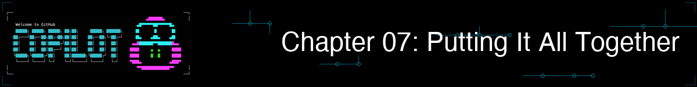

> **你学到的一切都会在这里汇合。只用一次会话，就能从想法走到合并 PR。**

在本章中，你会把之前学到的内容整合成完整工作流。你将使用多智能体协作来构建功能，设置能在提交前拦截安全问题的 pre-commit hook，把 Copilot 集成进 CI/CD 流水线，并在一次终端会话中完成从功能想法到合并 PR 的全过程。GitHub Copilot CLI 会在这里真正成为你的效率放大器。

> 💡 **注意**：本章展示的是如何把你学到的一切组合起来。**即使没有智能体、技能或 MCP，你依然可以高效工作（虽然它们会非常有帮助）。** 核心工作流，也就是描述、规划、实现、测试、审查、交付，只靠第 00-03 章中的内置功能就能完成。

## 🎯 学习目标

完成本章后，你将能够：

- 在统一工作流中组合智能体、技能和 MCP（模型上下文协议）
- 使用多工具方法构建完整功能
- 通过 hook 设置基础自动化
- 将专业开发的最佳实践应用到日常工作中

> ⏱️ **预计用时**：约 75 分钟（阅读 15 分钟 + 动手 60 分钟）

---

## 🧩 现实类比：交响乐团


一支交响乐团由许多声部组成：
- **弦乐**提供基础，就像你的核心工作流
- **铜管**增加力量，就像具备专门专长的智能体
- **木管**增加色彩，就像扩展能力的技能
- **打击乐**维持节奏，就像 MCP 连接外部系统

单独来看，每个声部的表现都有限。只有在良好指挥下协同演奏，它们才能创造出真正出色的成果。

**这正是本章要教你的内容！**<br>
*就像指挥家调度乐团一样，你将把智能体、技能和 MCP 编排成统一工作流*

先从一个场景开始：在一次会话里修改代码、生成测试、完成审查并创建 PR。

---

<a id="idea-to-merged-pr-in-one-session"></a>

## 一次会话从想法到合并 PR

你不必在编辑器、终端、测试运行器和 GitHub UI 之间来回切换并不断丢失上下文，而是可以把所有工具集中到一个终端会话中完成。我们会在下方的[集成模式](#the-integration-pattern-for-power-users)部分拆解这种模式。

```bash
# Start Copilot in interactive mode
copilot

> I need to add a "list unread" command to the book app that shows only
> books where read is False. What files need to change?

# Copilot creates high-level plan...

# SWITCH TO PYTHON-REVIEWER AGENT
> /agent
# Select "python-reviewer"

> @samples/book-app-project/books.py Design a get_unread_books method.
> What is the best approach?

# Python-reviewer agent produces:
# - Method signature and return type
# - Filter implementation using list comprehension
# - Edge case handling for empty collections

# SWITCH TO PYTEST-HELPER AGENT
> /agent
# Select "pytest-helper"

> @samples/book-app-project/tests/test_books.py Design test cases for
> filtering unread books.

# Pytest-helper agent produces:
# - Test cases for empty collections
# - Test cases with mixed read/unread books
# - Test cases with all books read

# IMPLEMENT
> Add a get_unread_books method to BookCollection in books.py
> Add a "list unread" command option in book_app.py
> Update the help text in the show_help function

# TEST
> Generate comprehensive tests for the new feature

# Multiple tests are generated similar to the following:
# - Happy path (3 tests) — filters correctly, excludes read, includes unread
# - Edge cases (4 tests) — empty collection, all read, none read, single book
# - Parametrized (5 cases) — varying read/unread ratios via @pytest.mark.parametrize
# - Integration (4 tests) — interplay with mark_as_read, remove_book, add_book, and data integrity

# Review the changes
> /review

# If review passes, generate a PR (uses GitHub MCP covered earlier in the course)
> Create a pull request titled "Feature: Add list unread books command"
```

**传统方式**：在编辑器、终端、测试运行器、文档和 GitHub UI 之间不断切换。每次切换都会带来上下文丢失和额外摩擦。

**关键洞察**：你像架构师一样调度这些专家。细节由他们处理，方向由你掌控。

> 💡 **继续深入**：对于这种大型多步骤计划，可以试试 `/fleet`，让 Copilot 并行运行相互独立的子任务。详情请参阅[官方文档](https://docs.github.com/copilot/concepts/agents/copilot-cli/fleet)。

---

# 更多工作流


对于完成了第 04-06 章的高级用户而言，下面这些工作流展示了智能体、技能和 MCP 如何成倍放大你的效率。

<a id="the-integration-pattern-for-power-users"></a>

## 集成模式

这是将所有能力组合起来时的心智模型：


---

## 工作流 1：排查并修复缺陷

这是一个集成全部工具的真实缺陷修复流程：

```bash
copilot

# PHASE 1: Understand the bug from GitHub (MCP provides this)
> Get the details of issue #1

# Learn: "find_by_author doesn't work with partial names"

# PHASE 2: Research best practice (deep research with web + GitHub sources)
> /research Best practices for Python case-insensitive string matching

# PHASE 3: Find related code
> @samples/book-app-project/books.py Show me the find_by_author method

# PHASE 4: Get expert analysis
> /agent
# Select "python-reviewer"

> Analyze this method for issues with partial name matching

# Agent identifies: Method uses exact equality instead of substring matching

# PHASE 5: Fix with agent guidance
> Implement the fix using lowercase comparison and 'in' operator

# PHASE 6: Generate tests
> /agent
# Select "pytest-helper"

> Generate pytest tests for find_by_author with partial matches
> Include test cases: partial name, case variations, no matches

# PHASE 7: Commit and PR
> Generate a commit message for this fix

> Create a pull request linking to issue #1
```

---

<a id="workflow-2-code-review-automation-optional"></a>

## 工作流 2：代码审查自动化（可选）

> 💡 **这一节是可选的。** pre-commit hook 对团队很有帮助，但并不是高效工作的前提。如果你刚开始使用，可以先跳过。
>
> ⚠️ **性能说明**：这个 hook 会对每个已暂存文件调用一次 `copilot -p`，每个文件通常都需要几秒。对于较大的提交，建议只限制到关键文件，或者改为使用 `/review` 手动审查。

**git hook** 是 Git 在特定时机自动运行的脚本，例如在提交前。你可以利用它对代码执行自动检查。下面是如何在提交时运行自动化 Copilot 审查：

```bash
# Create a pre-commit hook
cat > .git/hooks/pre-commit << 'EOF'
#!/bin/bash

# Get staged files (Python files only)
STAGED=$(git diff --cached --name-only --diff-filter=ACM | grep -E '\.py$')

if [ -n "$STAGED" ]; then
  echo "Running Copilot review on staged files..."

  for file in $STAGED; do
    echo "Reviewing $file..."

    # Use timeout to prevent hanging (60 seconds per file)
    # --allow-all auto-approves file reads/writes so the hook can run unattended.
    # Only use this in automated scripts. In interactive sessions, let Copilot ask for permission.
    REVIEW=$(timeout 60 copilot --allow-all -p "Quick security review of @$file - critical issues only" 2>/dev/null)

    # Check if timeout occurred
    if [ $? -eq 124 ]; then
      echo "Warning: Review timed out for $file (skipping)"
      continue
    fi

    if echo "$REVIEW" | grep -qi "CRITICAL"; then
      echo "Critical issues found in $file:"
      echo "$REVIEW"
      exit 1
    fi
  done

  echo "Review passed"
fi
EOF

chmod +x .git/hooks/pre-commit
```

> ⚠️ **macOS 用户**：macOS 默认不包含 `timeout` 命令。你可以用 `brew install coreutils` 安装，或者去掉超时保护，直接调用命令。

> 📚 **官方文档**：[Use hooks](https://docs.github.com/copilot/how-tos/copilot-cli/use-hooks) 和 [Hooks configuration reference](https://docs.github.com/copilot/reference/hooks-configuration) 提供了完整的 hooks API。
>
> 💡 **内置替代方案**：Copilot CLI 也有内置 hooks 系统（`copilot hooks`），可以在 pre-commit 等事件上自动运行。上面的手工 git hook 能给你完全控制权，而内置系统配置起来更简单。你可以结合文档决定哪种方式更适合你的工作流。

现在，每次提交都会先经过一次快速安全审查：

```bash
git add samples/book-app-project/books.py
git commit -m "Update book collection methods"

# Output:
# Running Copilot review on staged files...
# Reviewing samples/book-app-project/books.py...
# Critical issues found in samples/book-app-project/books.py:
# - Line 15: File path injection vulnerability in load_from_file
#
# Fix the issue and try again.
```

---

## 工作流 3：加入新代码库时快速上手

当你加入一个新项目时，可以把上下文、智能体和 MCP 组合起来，快速完成熟悉过程：

```bash
# Start Copilot in interactive mode
copilot

# PHASE 1: Get the big picture with context
> @samples/book-app-project/ Explain the high-level architecture of this codebase

# PHASE 2: Understand a specific flow
> @samples/book-app-project/book_app.py Walk me through what happens
> when a user runs "python book_app.py add"

# PHASE 3: Get expert analysis with an agent
> /agent
# Select "python-reviewer"

> @samples/book-app-project/books.py Are there any design issues,
> missing error handling, or improvements you would recommend?

# PHASE 4: Find something to work on (MCP provides GitHub access)
> List open issues labeled "good first issue"

# PHASE 5: Start contributing
> Pick the simplest open issue and outline a plan to fix it
```

这个工作流把 `@` 上下文、智能体和 MCP 合并到了同一个入门会话中，正对应本章前面介绍的集成模式。

---

# 最佳实践与自动化

这些模式和习惯能让你的工作流更高效。

---

## 最佳实践

### 1. 先建立上下文，再进行分析

提出分析请求之前，先把上下文收集完整：

```bash
# Good
> Get the details of issue #42
> /agent
# Select python-reviewer
> Analyze this issue

# Less effective
> /agent
# Select python-reviewer
> Fix login bug
# Agent doesn't have issue context
```

### 2. 区分清楚：智能体、技能与自定义指令

每种工具都有最适合自己的位置：

```bash
# Agents: Specialized personas you explicitly activate
> /agent
# Select python-reviewer
> Review this authentication code for security issues

# Skills: Modular capabilities that auto-activate when your prompt
# matches the skill's description (you must create them first — see Ch 05)
> Generate comprehensive tests for this code
# If you have a testing skill configured, it activates automatically

# Custom instructions (.github/copilot-instructions.md): Always-on
# guidance that applies to every session without switching or triggering
```

> 💡 **关键点**：智能体和技能都能做分析，也都能生成代码。真正的区别在于**它们如何被激活**：智能体是显式的（`/agent`），技能是自动的（根据提示匹配），自定义指令则是始终生效的。

### 3. 让每个会话聚焦单一目标

使用 `/rename` 为会话命名，便于在历史中查找；使用 `/exit` 干净地结束会话：

```bash
# Good: One feature per session
> /rename list-unread-feature
# Work on list unread
> /exit

copilot
> /rename export-csv-feature
# Work on CSV export
> /exit

# Less effective: Everything in one long session
```

### 4. 把工作流沉淀为可复用的 Copilot 资产

不要只把流程写在 wiki 里，而要直接编码进仓库，让 Copilot 真正能用上：

- **自定义指令**（`.github/copilot-instructions.md`）：始终生效的指导，用于编码规范、架构约束，以及构建、测试、部署步骤。每次会话都会自动遵循。
- **提示文件**（`.github/prompts/`）：团队可共享的可复用参数化提示模板，例如代码审查、组件生成或 PR 描述模板。
- **自定义智能体**（`.github/agents/`）：把专门角色编码下来，例如安全审查员或文档写作者，团队成员都可以通过 `/agent` 激活。
- **自定义技能**（`.github/skills/`）：把分步骤工作流封装起来，在相关场景下自动触发。

> 💡 **回报**：新成员可以直接继承你的工作流，它们已经内建在仓库里，而不是只存在于某个人脑中。

---

## 加餐：生产环境模式

这些模式是可选的，但在专业环境里很有价值。

### PR 描述生成器

```bash
# Generate comprehensive PR descriptions
BRANCH=$(git branch --show-current)
COMMITS=$(git log main..$BRANCH --oneline)

copilot -p "Generate a PR description for:
Branch: $BRANCH
Commits:
$COMMITS

Include: Summary, Changes Made, Testing Done, Screenshots Needed"
```

### CI/CD 集成

对于已经使用 CI/CD 流水线的团队，你可以借助 GitHub Actions 在每个拉取请求上自动运行 Copilot 审查。这包括自动发布审查评论，以及按关键问题级别进行过滤。

> 📖 **了解更多**：请参阅 [CI/CD 集成](../appendices/ci-cd-integration.zh-CN.md)，其中包含完整的 GitHub Actions 工作流、配置选项和故障排除说明。

---

# 练习


把完整工作流真正用起来。

---

## ▶️ 自己试试

完成演示后，试试这些变体：

1. **端到端挑战**：选择一个小功能，例如 “list unread books” 或 “export to CSV”，然后走完整个流程：
   - 使用 `/plan` 规划
   - 用智能体设计（python-reviewer、pytest-helper）
   - 实现
   - 生成测试
   - 创建 PR

2. **自动化挑战**：按照“代码审查自动化”工作流设置 pre-commit hook。然后故意提交一个带文件路径漏洞的改动，看看它是否会被拦截。

3. **你的生产工作流**：为自己经常做的一类任务设计一套工作流，把它写成检查清单。思考哪些部分可以用技能、智能体或 hook 自动化。

**自我检验**：当你能向同事解释智能体、技能和 MCP 如何协同工作，以及应该在什么场景下分别使用它们时，就说明你已经完成了本课程。

---

## 📝 作业

### 主要挑战：端到端功能开发

前面的实战示例演示了如何构建 “list unread books” 功能。现在请你用另一个功能来练习完整工作流：**按年份范围搜索书籍**。

1. 启动 Copilot 并收集上下文：`@samples/book-app-project/books.py`
2. 用 `/plan Add a "search by year" command that lets users find books published between two years` 进行规划
3. 在 `BookCollection` 中实现 `find_by_year_range(start_year, end_year)` 方法
4. 在 `book_app.py` 中添加 `handle_search_year()` 函数，用于提示用户输入起始和结束年份
5. 生成测试：`@samples/book-app-project/books.py @samples/book-app-project/tests/test_books.py Generate tests for find_by_year_range() including edge cases like invalid years, reversed range, and no results.`
6. 使用 `/review` 审查
7. 更新 README：`@samples/book-app-project/README.md Add documentation for the new "search by year" command.`
8. 生成提交信息

边做边记录你的工作流。

**成功标准**：你已经借助 Copilot CLI，从想法一路完成到提交，覆盖规划、实现、测试、文档和审查的完整流程。

> 💡 **加分项**：如果你已经按照第 04 章设置了智能体，可以尝试创建并使用自定义智能体。例如，用一个 error-handler 智能体做实现审查，用一个 doc-writer 智能体更新 README。

<details>
<summary>💡 提示（点击展开）</summary>

**沿用本章开头[“一次会话从想法到合并 PR”](#idea-to-merged-pr-in-one-session)的模式。** 关键步骤如下：

1. 用 `@samples/book-app-project/books.py` 收集上下文
2. 用 `/plan Add a "search by year" command` 做规划
3. 实现方法和命令处理函数
4. 生成覆盖边界情况的测试（无效输入、空结果、范围反转）
5. 使用 `/review` 审查
6. 用 `@samples/book-app-project/README.md` 更新 README
7. 使用 `-p` 生成提交信息

**需要考虑的边界情况：**
- 如果用户输入 “2000” 和 “1990” 这种反向范围怎么办？
- 如果没有任何书匹配该范围怎么办？
- 如果用户输入的是非数字怎么办？

**重点在于练习完整流程**：从想法 → 上下文 → 规划 → 实现 → 测试 → 文档 → 提交。

</details>

---

<details>
<summary>🔧 <strong>常见错误</strong>（点击展开）</summary>

| 错误 | 会发生什么 | 修复方式 |
|---------|--------------|-----|
| 直接跳到实现 | 会错过一些后续代价很高的设计问题 | 先用 `/plan` 想清楚方案 |
| 明明需要多个工具却只用一个 | 结果更慢，也不够全面 | 组合使用：智能体做分析 → 技能做执行 → MCP 做集成 |
| 提交前不做审查 | 安全问题或 bug 更容易漏进代码库 | 总是运行 `/review`，或者使用 [pre-commit hook](#workflow-2-code-review-automation-optional) |
| 忘记把工作流共享给团队 | 每个人都在重复造轮子 | 把模式沉淀到共享的智能体、技能和指令中 |

</details>

---

# 总结

## 🔑 关键要点

1. **集成胜于孤立**：把工具组合起来，才能获得最大收益
2. **上下文优先**：分析前先收集必要上下文
3. **智能体负责分析，技能负责执行**：针对任务选对工具
4. **自动化重复工作**：hooks 和脚本会成倍提高你的效率
5. **把工作流文档化**：可共享的模式能让整个团队受益

> 📋 **快速参考**：请参阅 [GitHub Copilot CLI command reference](https://docs.github.com/en/copilot/reference/cli-command-reference) 获取完整命令和快捷键列表。

---

## 🎓 课程完成！

恭喜，你已经学会了：

| 章节 | 你学到的内容 |
|---------|-------------------|
| 00 | Copilot CLI 安装与快速开始 |
| 01 | 三种交互模式 |
| 02 | 使用 @ 语法管理上下文 |
| 03 | 开发工作流 |
| 04 | 专用智能体 |
| 05 | 可扩展技能 |
| 06 | 通过 MCP 建立外部连接 |
| 07 | 统一的生产级工作流 |

现在，你已经具备把 GitHub Copilot CLI 当作真正效率放大器来使用的能力。

## ➡️ 接下来做什么

你的学习不会停在这里：

1. **每天练习**：在真实工作中使用 Copilot CLI
2. **构建自定义工具**：为你的具体需求创建智能体和技能
3. **分享知识**：帮助你的团队采用这些工作流
4. **持续关注更新**：跟进 GitHub Copilot 的新功能

### 资源

- [GitHub Copilot CLI Documentation](https://docs.github.com/copilot/concepts/agents/about-copilot-cli)
- [MCP Server Registry](https://github.com/modelcontextprotocol/servers)
- [Community Skills](https://github.com/topics/copilot-skill)

---

**做得很好。现在去真正做点东西吧。**

**[← 返回第 06 章](../06-mcp-servers/README.zh-CN.md)** | **[返回课程首页 →](../README.zh-CN.md)**