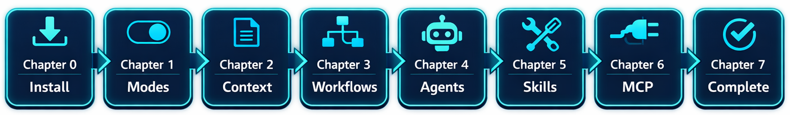

&ensp;
&ensp;
&ensp;

🎯 [你将学到什么](#what-youll-learn) &ensp; ✅ [先决条件](#prerequisites) &ensp; 🤖 [Copilot 家族](#understanding-the-github-copilot-family) &ensp; 📚 [课程结构](#course-structure) &ensp; 📋 [命令参考](#github-copilot-cli-command-reference)

· [English](./README.md) · [简体中文](./README.zh-CN.md) ·

# GitHub Copilot CLI 初学者教程

> **✨ 学习如何通过 AI 驱动的命令行助手，全面提升你的开发工作流。**

GitHub Copilot CLI 将 AI 助手直接带到你的终端。你无需在浏览器或代码编辑器之间来回切换，就可以在命令行中提问、生成功能完整的应用、评审代码、生成测试并排查问题。

把它想象成一位 24/7 在线、经验丰富的同事: 能阅读你的代码，解释令人困惑的模式，并帮助你更高效地完成工作。

本课程适合以下人群:

- 想在命令行中使用 AI 的**软件开发者**
- 偏好键盘驱动工作流、而不是 IDE 集成的**终端用户**
- 希望统一 AI 辅助代码评审和开发实践的**团队**

<a href="https://aka.ms/githubcopilotdevdays" target="_blank">
  <picture>
    
  </picture>
</a>

## 🎯 你将学到什么

这门实战课程会带你从零开始，快速上手 GitHub Copilot CLI 并实现高效产出。你将在所有章节中围绕同一个 Python 图书收藏应用持续实践，并通过 AI 辅助工作流逐步改进它。完成课程后，你将能够自信地在终端中使用 AI 进行代码评审、测试生成、问题调试与工作流自动化。

**无需 AI 经验。** 只要你会使用终端，就能学会本课程内容。

**非常适合:** 开发者、学生，以及任何有软件开发经验的人。

## ✅ 先决条件

开始前，请确保你具备:

- **GitHub 账号**: [免费创建](https://github.com/signup) 
- **GitHub Copilot 权限**: [免费方案](https://github.com/features/copilot/plans)、[月度订阅](https://github.com/features/copilot/plans) 或 [面向学生/教师的免费权益](https://education.github.com/pack) 
- **终端基础**: 熟悉 `cd`、`ls` 等命令以及基础命令执行

## 🤖 了解 GitHub Copilot 家族

GitHub Copilot 已发展为一整套 AI 产品。下面是各产品的运行位置与定位:

| 产品 | 运行位置 | 描述 |
|---------|---------------|----------|
| [**GitHub Copilot CLI**](https://docs.github.com/copilot/how-tos/copilot-cli/cli-getting-started) （本课程） | 你的终端 | 原生命令行 AI 编程助手 |
| [**GitHub Copilot**](https://docs.github.com/copilot) | VS Code、Visual Studio、JetBrains 等 | Agent 模式、聊天、行内建议 |
| [**GitHub.com 上的 Copilot**](https://github.com/copilot) | GitHub | 沉浸式仓库对话、创建代理等功能 |
| [**GitHub Copilot 编码代理**](https://docs.github.com/copilot/using-github-copilot/using-copilot-coding-agent-to-work-on-tasks) | GitHub | 将 Issue 分配给代理并接收 PR |

本课程聚焦 **GitHub Copilot CLI**，让 AI 能力直接进入你的终端工作流。

## 📚 课程结构

| 章节 | 标题 | 你将构建的内容 |
|:-------:|-------|-------------------|
| 00 | 🚀 [快速开始](./00-quick-start/README.zh-CN.md) | 安装与验证 |
| 01 | 👋 [第一步](./01-setup-and-first-steps/README.zh-CN.md) | 现场演示 + 三种交互模式 |
| 02 | 🔍 [上下文与会话](./02-context-conversations/README.zh-CN.md) | 多文件项目分析 |
| 03 | ⚡ [开发工作流](./03-development-workflows/README.zh-CN.md) | 代码评审、调试、测试生成 |
| 04 | 🤖 [创建专用 AI 助手](./04-agents-custom-instructions/README.zh-CN.md) | 适配你工作流的自定义代理 |
| 05 | 🛠️ [自动化重复任务](./05-skills/README.zh-CN.md) | 自动加载的 Skills |
| 06 | 🔌 [连接 GitHub、数据库与 API](./06-mcp-servers/README.zh-CN.md) | MCP 服务器集成 |
| 07 | 🎯 [综合实战](./07-putting-it-together/README.zh-CN.md) | 完整功能工作流 |

## 📖 课程如何进行

每章都遵循同一学习节奏:

1. **真实世界类比**: 通过熟悉的比较理解概念
2. **核心概念**: 掌握关键知识点
3. **动手示例**: 运行真实命令并查看结果
4. **练习任务**: 巩固你学到的内容
5. **下一步**: 预览后续章节

**示例代码可直接运行。** 本课程中的每个 copilot 文本块都可以复制到终端中执行。

## 📋 GitHub Copilot CLI 命令参考

查阅 **[GitHub Copilot CLI 命令参考](https://docs.github.com/en/copilot/reference/cli-command-reference)**，可快速找到命令与快捷键，帮助你更高效地使用 Copilot CLI。

## 🙋 获取帮助

- 🐛 **发现 Bug?** [提交 Issue](https://github.com/github/copilot-cli-for-beginners/issues)
- 🤝 **想参与贡献?** 欢迎提交 PR！
- 📚 **官方文档:** [GitHub Copilot CLI Documentation](https://docs.github.com/copilot/concepts/agents/about-copilot-cli)

## 许可证

本项目基于 MIT 开源许可证发布。完整条款请参阅 [LICENSE](./LICENSE) 文件。
