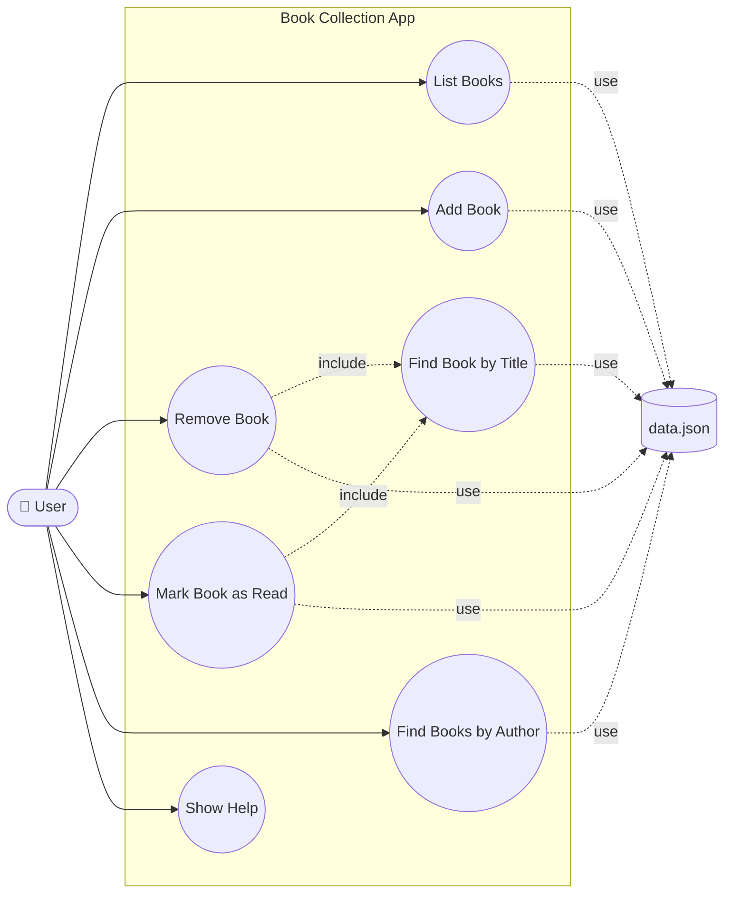

# Use Case Diagram — Book Collection App

This diagram shows how a **User** interacts with the Book Collection App
(`book_app.py`) and its underlying `BookCollection` logic (`books.py`).

## Diagram (Mermaid)

GitHub renders Mermaid diagrams natively in Markdown — no extra tools needed.



## Diagram (ASCII fallback)

```
                     Book Collection App
        ┌─────────────────────────────────────────────┐
        │                                               │
        │      (List Books)                            │
        │           ▲                                  │
        │           │                                  │
        │      (Add Book)                              │
        │           ▲                                  │
        │           │                                  │
   o    │           │                                  │
  /|\───┼────── (Remove Book) ─────┐                   │
  / \   │           ▲              │                   │
        │           │              │ <<include>>       │
 User   │      (Mark Book as Read) │                   │
        │           ▲              ▼                   │
        │           │        (Find Book by Title)      │
        │      (Find Books by Author)                  │
        │           ▲                                  │
        │           │                                  │
        │      (Show Help)                             │
        │                                               │
        └─────────────────────────────────────────────┘
                           │
                           │ <<use>>
                           ▼
                  ┌──────────────────┐
                  │  data.json (I/O) │
                  └──────────────────┘
```

## Relationships

- **Actor**: `User` — interacts via CLI commands (`list`, `add`, `remove`,
  `mark-read`, `find`, `help`) defined in `book_app.py`.
- `Remove Book` and `Mark Book as Read` `<<include>>` `Find Book by Title`
  (shared lookup logic in `BookCollection.find_book_by_title`).
- `List Books`, `Add Book`, `Remove Book`, `Mark Book as Read`,
  `Find Books by Author`, and `Find Book by Title` all `<<use>>` `data.json`
  for persistence via `load_books()` / `save_books()`.
