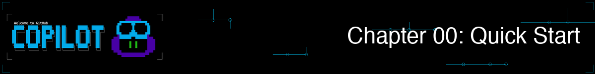
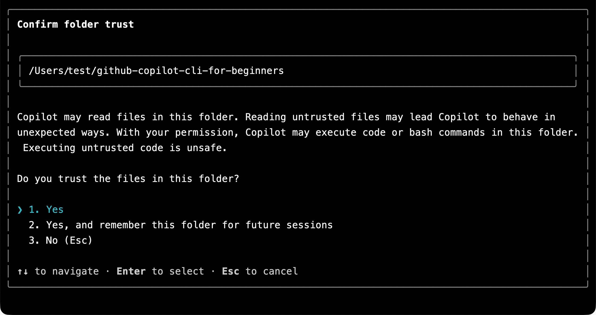
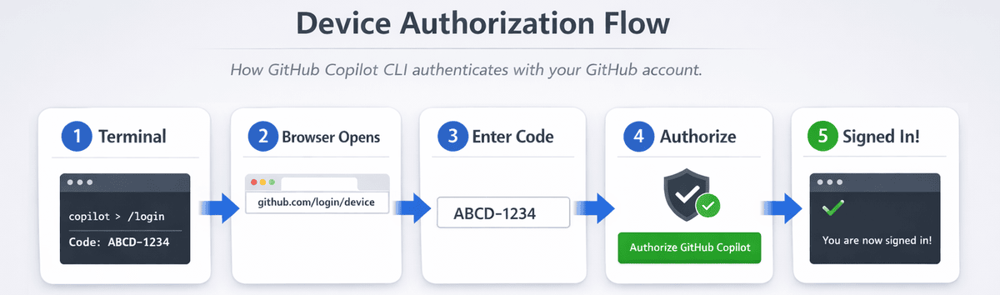

<!--
---
id: CopilotCLI-00
title: !translate Quick Start
description: !translate Install GitHub Copilot CLI, sign in with your GitHub account, and verify that everything works.
audience: Developers / Students / Terminal users
slug: quick-start
weight: 1
---
-->



¡Bienvenido! En este capítulo, instalarás GitHub Copilot CLI (Interfaz de Línea de Comandos), iniciarás sesión con tu cuenta de GitHub y verificarás que todo funciona. Este es un capítulo de configuración rápida. ¡Una vez que estés listo, las demostraciones reales comienzan en el Capítulo 01!

## 🎯 Objetivos de aprendizaje

Al finalizar este capítulo, habrás:

- Instalado GitHub Copilot CLI
- Has iniciado sesión con tu cuenta de GitHub
- Verificado que funciona con una prueba simple

> ⏱️ **Tiempo estimado**: ~10 minutos (5 min lectura + 5 min práctica)

---

## ✅ Requisitos previos

- **Cuenta de GitHub** con acceso a Copilot. [Ver opciones de suscripción](https://github.com/features/copilot/plans). Estudiantes/Profesores pueden acceder a Copilot Pro [gratuitamente a través de GitHub Education](https://education.github.com/pack).
- **Conceptos básicos de terminal**: Cómodo con comandos como `cd` y `ls`

### Qué significa "Acceso a Copilot"

GitHub Copilot CLI requiere una suscripción activa a Copilot. Puedes verificar tu estado en [github.com/settings/copilot](https://github.com/settings/copilot). Deberías ver uno de los siguientes:

- **Copilot Individual** - Suscripción personal
- **Copilot Business** - A través de tu organización
- **Copilot Enterprise** - A través de tu empresa
- **GitHub Education** - Gratis para estudiantes/profesores verificados

Si ves "You don't have access to GitHub Copilot", tendrás que usar la opción gratuita, suscribirte a un plan o unirte a una organización que proporcione acceso.

---

## Instalación

> ⏱️ **Estimación de tiempo**: La instalación toma 2-5 minutos. La autenticación añade otros 1-2 minutos.

### GitHub Codespaces (Configuración cero)

Si no quieres instalar ninguno de los requisitos previos puedes usar GitHub Codespaces, que tiene GitHub Copilot CLI listo para usar (necesitarás iniciar sesión), y preinstala Python y pytest.

1. [Haz un fork de este repositorio](https://github.com/github/copilot-cli-for-beginners/fork) en tu cuenta de GitHub
2. Selecciona **Code** > **Codespaces** > **Create codespace on main**
3. Espera unos minutos a que se construya el contenedor
4. ¡Ya estás listo! La terminal se abrirá automáticamente en el entorno del Codespace.

> 💡 **Verificar en Codespace**: Ejecuta `cd samples/book-app-project && python book_app.py help` para confirmar que Python y la aplicación de ejemplo funcionan.

### Instalación local

Sigue estos pasos si deseas ejecutar Copilot CLI en tu máquina local con las muestras del curso.

1. Clona el repositorio para obtener las muestras del curso en tu máquina:

    ```bash
    git clone https://github.com/github/copilot-cli-for-beginners
    cd copilot-cli-for-beginners
    ```

2. Instala Copilot CLI usando una de las siguientes opciones.

    > 💡 **¿No estás seguro cuál elegir?** Usa `npm` si tienes Node.js instalado. De lo contrario, elige la opción que coincida con tu sistema.

    ### Todas las plataformas (npm)

    ```bash
    # Si tienes Node.js instalado, esta es una forma rápida de obtener la interfaz de línea de comandos.
    npm install -g @github/copilot
    ```

    ### macOS/Linux (Homebrew)

    ```bash
    brew install copilot-cli
    ```

    ### Windows (WinGet)

    ```bash
    winget install GitHub.Copilot
    ```

    ### macOS/Linux (Script de instalación)

    ```bash
    curl -fsSL https://gh.io/copilot-install | bash
    ```

<details>
<summary>Opcional: Habilitar la finalización por tabulación en el shell</summary>

La finalización por tabulación del shell te permite presionar **Tab** para completar subcomandos de `copilot`, opciones de comando y algunos valores de opción. Esto es opcional, pero puede ser útil una vez que te sientas cómodo usando la CLI.

Copilot CLI actualmente soporta scripts de completado para Bash, Zsh y Fish:

```shell
# Bash, solo para la sesión actual
source <(copilot completion bash)

# Bash, persistente en Linux
copilot completion bash | sudo tee /etc/bash_completion.d/copilot

# Zsh
copilot completion zsh > "${fpath[1]}/_copilot"

# Fish
copilot completion fish > ~/.config/fish/completions/copilot.fish
```

Reinicia tu shell después de agregar la finalización persistente. PowerShell está soportado para ejecutar Copilot CLI en Windows, pero `copilot completion` actualmente solo soporta Bash, Zsh y Fish.

</details>

---

## Autenticación

Abre una ventana de terminal en la raíz del repositorio `copilot-cli-for-beginners`, inicia la CLI y permite el acceso a la carpeta.

```bash
copilot
```

Se te pedirá confiar en la carpeta que contiene el repositorio (si no lo has hecho ya). Puedes confiar una sola vez o para todas las sesiones futuras.



Después de confiar en la carpeta, puedes iniciar sesión con tu cuenta de GitHub.

```
> /login
```

**Qué ocurre a continuación (terminal local):**

1. Elige iniciar sesión en tu cuenta de GitHub.com o en una cuenta empresarial.
2. Selecciona `Sign in with your browser (recommended)`
3. Tu navegador se abre automáticamente en la página de autorización de GitHub. Inicia sesión en GitHub si no lo has hecho ya.
4. Selecciona "Authorize" para otorgar acceso a GitHub Copilot CLI.
5. Regresa a tu terminal — ¡ya has iniciado sesión!

> 💡 **Terminales remotas o sin interfaz gráfica**: Si estás en un servidor remoto o en un terminal sin navegador (por ejemplo SSH), Copilot CLI usa en su lugar el **flujo de código de dispositivo**. Verás un código de un solo uso como `ABCD-1234`. Visita [github.com/login/device](https://github.com/login/device) en un navegador de otra máquina e ingresa el código para completar el inicio de sesión. Para forzar un flujo específico, usa `copilot login --web-flow` para usar el popup del navegador o `copilot login --device-code` para usar el flujo basado en código. También puedes elegir interactivamente con `/login`.
> 
> 
>
 
*El flujo basado en navegador: tu navegador se abre automáticamente y autorizas con un clic. En terminales remotos/sin interfaz gráfica, en su lugar se muestra un código de dispositivo.*

**Consejo**: El inicio de sesión persiste entre sesiones. Solo necesitas hacerlo una vez a menos que tu token caduque o cierres sesión explícitamente.

---

## Verificar que funciona

### Paso 1: Probar Copilot CLI

Ahora que has iniciado sesión, verifiquemos que Copilot CLI funciona para ti. En la terminal, inicia la CLI si no lo has hecho ya:

```bash
> Say hello and tell me what you can help with
```

Después de recibir una respuesta, puedes salir de la CLI:

```bash
> /exit
```

---

<details>
<summary>🎬 ¡Míralo en acción!</summary>


*La salida de la demostración varía. Tu modelo, herramientas y respuestas serán diferentes de lo mostrado aquí.*

</details>

---

**Salida esperada**: Una respuesta amigable que enumere las capacidades de Copilot CLI.

### Paso 2: Ejecuta la app de ejemplo del libro

El curso proporciona una app de ejemplo que explorarás y mejorarás a lo largo del curso usando la CLI *(Puedes ver el código en /samples/book-app-project)*. Comprueba que la *app de terminal de colección de libros en Python* funciona antes de empezar. Ejecuta `python` o `python3` dependiendo de tu sistema.

> **Nota:** Los ejemplos principales mostrados a lo largo del curso usan Python (`samples/book-app-project`), por lo que necesitarás tener [Python 3.10+](https://www.python.org/downloads/) disponible en tu máquina local si elegiste esa opción (el Codespace ya lo tiene instalado). También hay versiones en JavaScript (`samples/book-app-project-js`) y C# (`samples/book-app-project-cs`) si prefieres trabajar con esos lenguajes. Cada ejemplo tiene un README con instrucciones para ejecutar la app en ese lenguaje.

```bash
cd samples/book-app-project
python book_app.py list
```

**Salida esperada**: Una lista de 5 libros que incluye "The Hobbit", "1984" y "Dune".

### Paso 3: Prueba Copilot CLI con la app del libro

Navega de nuevo a la raíz del repositorio primero (si ejecutaste el Paso 2):

```bash
cd ../..   # Volver a la raíz del repositorio si es necesario
copilot 
> What does @samples/book-app-project/book_app.py do?
```

**Salida esperada**: Un resumen de las funciones principales y comandos de la app del libro.

Si ves un error, consulta la [sección de solución de problemas](#you-dont-have-access-to-github-copilot) abajo.

Cuando termines puedes salir de Copilot CLI:

```bash
> /exit
```

---

## ✅ ¡Estás listo!

Eso es todo por la instalación. La verdadera diversión comienza en el Capítulo 01, donde:

- Verás a la IA revisar la app del libro y encontrar problemas de calidad de código al instante
- Aprenderás tres formas diferentes de usar Copilot CLI
- Generarás código funcional a partir de inglés natural

**[Continuar al Capítulo 01: Primeros pasos →](../01-setup-and-first-steps/README.md)**

---

## Solución de problemas

### "copilot: command not found"

La CLI no está instalada. Prueba un método de instalación diferente:

```bash
# Si brew falló, prueba con npm:
npm install -g @github/copilot

# O el script de instalación:
curl -fsSL https://gh.io/copilot-install | bash
```

### "You don't have access to GitHub Copilot"

1. Verifica que tienes una suscripción a Copilot en [github.com/settings/copilot](https://github.com/settings/copilot)
2. Comprueba que tu organización permita el acceso a la CLI si usas una cuenta de trabajo

### "Authentication failed"

Vuelve a autenticarte:

```bash
copilot
> /login
```

### El navegador no se abre automáticamente

En terminales remotos o sin interfaz gráfica, se utiliza el flujo de código de dispositivo en su lugar. Tu terminal mostrará un código de un solo uso. Visita [github.com/login/device](https://github.com/login/device) e ingresa el código, luego autoriza el acceso.

### Token expirado

Simplemente ejecuta `/login` de nuevo:

```bash
copilot
> /login
```

### ¿Sigues atascado?

- Revisa la [documentación de GitHub Copilot CLI](https://docs.github.com/copilot/concepts/agents/about-copilot-cli)
- Busca en [GitHub Issues](https://github.com/github/copilot-cli/issues)

---

## 🔑 Puntos clave

1. **Un GitHub Codespace es una forma rápida de empezar** - Python, pytest y GitHub Copilot CLI están preinstalados para que puedas comenzar inmediatamente con las demostraciones
2. **Múltiples métodos de instalación** - Elige lo que funcione para tu sistema (Homebrew, WinGet, npm o script de instalación)
3. **Autenticación única** - El inicio de sesión persiste hasta que el token caduque
4. **La app del libro funciona** - Usarás `samples/book-app-project` a lo largo de todo el curso

> 📚 **Documentación oficial**: [Instalar Copilot CLI](https://docs.github.com/copilot/how-tos/copilot-cli/cli-getting-started) para opciones de instalación y requisitos.

> 📋 **Referencia rápida**: Consulta la [referencia de comandos de GitHub Copilot CLI](https://docs.github.com/en/copilot/reference/cli-command-reference) para una lista completa de comandos y atajos.

---

**[Continuar al Capítulo 01: Primeros pasos →](../01-setup-and-first-steps/README.md)**

---

<!-- CO-OP TRANSLATOR DISCLAIMER START -->
**Descargo de responsabilidad**:
Este documento ha sido traducido utilizando el servicio de traducción automática [Co-op Translator](https://github.com/Azure/co-op-translator). Aunque nos esforzamos por la precisión, tenga en cuenta que las traducciones automatizadas pueden contener errores o inexactitudes. El documento original en su idioma nativo debe considerarse la fuente autorizada. Para información crítica, se recomienda una traducción profesional humana. No somos responsables de cualquier malentendido o interpretación errónea que surja del uso de esta traducción.
<!-- CO-OP TRANSLATOR DISCLAIMER END -->