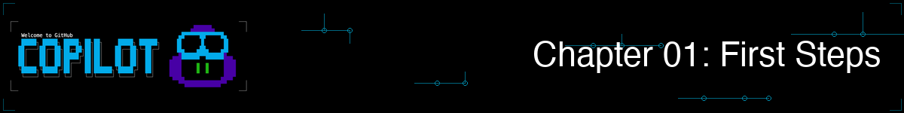
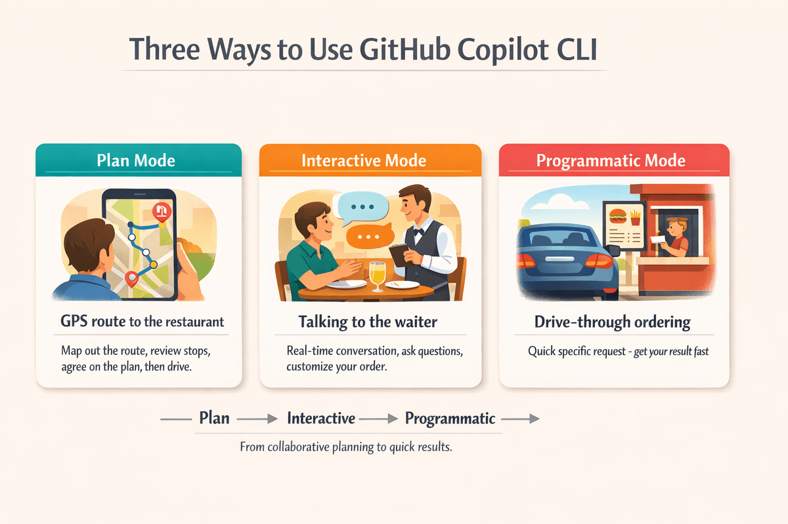

<!--
---
id: CopilotCLI-01
title: !translate First Steps
description: !translate Experience GitHub Copilot CLI through hands-on demos, then learn when to use interactive, plan, and programmatic modes.
audience: Developers / Students / Terminal users
slug: first-steps
weight: 2
---
-->



> **Observa cómo la IA encuentra errores al instante, explica código confuso y genera scripts funcionales. Luego aprende tres formas diferentes de usar GitHub Copilot CLI.**

¡En este capítulo comienza la magia! Experimentarás de primera mano por qué los desarrolladores describen GitHub Copilot CLI como tener a un ingeniero senior en marcación rápida. Verás a la IA encontrar errores de seguridad en segundos, obtener explicaciones de código complejo en lenguaje sencillo y generar scripts funcionales al instante. Luego dominarás los tres modos de interacción (Interactivo, Plan y Programático) para saber exactamente cuál usar en cada tarea.

> ⚠️ **Prerequisitos**: Asegúrate de haber completado primero **[Capítulo 00: Inicio rápido](../00-quick-start/README.md)**. Necesitarás tener GitHub Copilot CLI instalado y autenticado antes de ejecutar las demostraciones a continuación.

## 🎯 Learning Objectives

Al final de este capítulo, podrás:

- Experimentar el aumento de productividad que proporciona GitHub Copilot CLI mediante demostraciones prácticas
- Elegir el modo correcto (Interactivo, Plan o Programático) para cualquier tarea
- Usar comandos con barra para controlar tus sesiones

> ⏱️ **Tiempo estimado**: ~45 minutos (15 min lectura + 30 min práctica)

---

# Tu primera experiencia con Copilot CLI


Sumérgete y ve lo que Copilot CLI puede hacer.

---

## Familiarizarte: Tus primeros prompts

Antes de sumergirte en las demostraciones impresionantes, comencemos con algunos prompts sencillos que puedes probar ahora mismo. **¡No se necesita un repositorio de código!** Simplemente abre un terminal y ejecuta Copilot CLI:

```bash
copilot
```

Prueba estas indicaciones para principiantes:

```
> Explain what a dataclass is in Python in simple terms

> Write a function that sorts a list of dictionaries by a specific key

> What's the difference between a list and a tuple in Python?

> Give me 5 best practices for writing clean Python code
```

¿No usas Python? ¡No hay problema! Simplemente haz preguntas sobre el lenguaje que prefieras.

Observa lo natural que se siente. Haz preguntas como lo harías con un compañero. Cuando termines de explorar, escribe `/exit` para salir de la sesión.

**La idea clave**: GitHub Copilot CLI es conversacional. No necesitas sintaxis especial para empezar. Solo haz preguntas en inglés sencillo.

## Verlo en acción

Ahora veamos por qué los desarrolladores dicen que esto es "tener a un ingeniero senior en marcación rápida".

> 📖 **Lectura de los ejemplos**: Las líneas que comienzan con `>` son prompts que escribes dentro de una sesión interactiva de Copilot CLI. Las líneas sin el prefijo `>` son comandos de shell que ejecutas en tu terminal.

> 💡 **Sobre las salidas de ejemplo**: Las salidas de ejemplo que se muestran a lo largo de este curso son ilustrativas. Como las respuestas de Copilot CLI varían cada vez, tus resultados diferirán en redacción, formato y detalle. Concéntrate en el *tipo* de información devuelta, no en el texto exacto.

### Demo 1: Revisión de código en segundos

El curso incluye archivos de ejemplo con problemas intencionales de calidad de código. Si estás trabajando en tu máquina local y aún no has clonado el repositorio, por favor ejecuta el comando `git clone` de abajo, navega a la carpeta `copilot-cli-for-beginners` y luego ejecuta el comando `copilot`.

```bash
# Clona el repositorio del curso si estás trabajando localmente y aún no lo has hecho
git clone https://github.com/github/copilot-cli-for-beginners
cd copilot-cli-for-beginners

# Inicia Copilot
copilot
```

Una vez dentro de la sesión interactiva de Copilot CLI, ejecuta lo siguiente:

```
> Review @samples/book-app-project/book_app.py for code quality issues and suggest improvements
```

> 💡 **¿Para qué se usa el símbolo `@`?** El símbolo `@` le indica a Copilot CLI que lea un archivo. Aprenderás todo sobre esto en el Capítulo 02. Por ahora, solo copia el comando exactamente como se muestra.

---

<details>
<summary>🎬 ¡Míralo en acción!</summary>


*La salida de la demostración varía. Tu modelo, herramientas y respuestas diferirán de lo que se muestra aquí.*

</details>

---

**La conclusión**: Una revisión profesional de código en segundos. La revisión manual tomaría... bueno... mucho más tiempo que eso.

---

### Demo 2: Explicar código confuso

¿Alguna vez te has quedado mirando código preguntándote qué hace? Prueba esto en tu sesión de Copilot CLI:

```
> Explain what @samples/book-app-project/books.py does in simple terms
```

---

<details>
<summary>🎬 ¡Míralo en acción!</summary>


*La salida de la demostración varía. Tu modelo, herramientas y respuestas diferirán de lo que se muestra aquí.*

</details>

---

**Qué sucede**: (tu salida puede variar) Copilot CLI lee el archivo, entiende el código y lo explica en un lenguaje sencillo.

```
This is a book collection management module using Python dataclasses.

Think of it like a digital bookshelf:
- Book is a dataclass - a simple way to store book information (title, author, year, read status)
- BookCollection manages the entire collection and handles saving/loading

Key components:

1. @dataclass decorator (line 8)
   - Automatically creates __init__, __repr__, etc.
   - Clean way to define data structures in Python

2. BookCollection class (line 16)
   - Maintains a list of Book objects
   - Handles persistence with JSON file I/O
   - load_books() reads from data.json
   - save_books() writes to data.json using asdict()

3. Book operations:
   - add_book() - creates and saves new books
   - find_book_by_title() - searches collection
   - mark_as_read() - updates read status
   - find_by_author() - filters by author name

Common pattern: Read from JSON → Work with Python objects → Write back to JSON
```

**La conclusión**: Código complejo explicado como lo haría un mentor paciente.

---

### Demo 3: Generar código funcional

¿Necesitas una función que de otro modo pasarías 15 minutos buscando en Google? Aún en tu sesión:

```
> Write a Python function that takes a list of books and returns statistics: 
  total count, number read, number unread, oldest and newest book
```

---

<details>
<summary>🎬 ¡Míralo en acción!</summary>


*La salida de la demostración varía. Tu modelo, herramientas y respuestas diferirán de lo que se muestra aquí.*

</details>

---

**Qué sucede**: Una función completa y funcional en segundos que puedes copiar-pegar-ejecutar.

Cuando termines de explorar, sal de la sesión:

```
> /exit
```

**La conclusión**: Satisfacción instantánea, y permaneciste en una sola sesión continua todo el tiempo.

---

# Modos y comandos


Acabas de ver lo que Copilot CLI puede hacer. Ahora entendamos *cómo* usar estas capacidades de forma efectiva. La clave es saber cuál de los tres modos de interacción usar en diferentes situaciones.

> 💡 **Nota**: Copilot CLI también tiene un modo **Autopilot** donde trabaja en las tareas sin esperar tu entrada. Es potente pero requiere otorgar permisos completos y realiza solicitudes premium de forma autónoma. Este curso se centra en los tres modos siguientes. Te indicaremos a Autopilot cuando te sientas cómodo con los conceptos básicos.

---

## 🧩 Analogía del mundo real: Comer fuera

Piensa en usar GitHub Copilot CLI como salir a comer. Desde planificar el viaje hasta hacer tu pedido, diferentes situaciones requieren diferentes enfoques:

| Modo | Analogía al comer fuera | Cuándo usar |
|------|-------------------------|-------------|
| **Plan** | Ruta GPS al restaurante | Tareas complejas: planifica la ruta, revisa paradas, acepta el plan y luego conduce |
| **Interactivo** | Hablar con el camarero | Exploración e iteración: haz preguntas, personaliza, obtiene retroalimentación en tiempo real |
| **Programático** | Pedir en el autoservicio | Tareas rápidas y específicas: permanece en tu entorno, obtén un resultado rápido |

Al igual que al salir a comer, aprenderás de forma natural cuándo cada enfoque es el adecuado.



*Elige tu modo según la tarea: Plan para mapear primero, Interactivo para colaboración iterativa, Programático para resultados rápidos y puntuales*

### ¿Con qué modo debo empezar?

**Empieza con el modo Interactivo.**
- Puedes experimentar y hacer preguntas de seguimiento
- El contexto se construye de forma natural a través de la conversación
- Los errores son fáciles de corregir con `/clear`

Una vez que te sientas cómodo, prueba:
- **Modo Programático** (`copilot -p "<your prompt>"`) para consultas rápidas y puntuales
- **Modo Plan** (`/plan`) cuando necesites planificar con más detalle antes de codificar

---

## Los tres modos

### Modo 1: Modo interactivo (comienza aquí)


**Ideal para**: Exploración, iteración, conversaciones multi-turno. Como hablar con un camarero que puede responder preguntas, recibir retroalimentación y ajustar el pedido al instante.

Inicia una sesión interactiva:

```bash
copilot
```

Como has visto hasta este punto, verás un prompt donde puedes escribir de forma natural. Para obtener ayuda sobre los comandos disponibles, simplemente escribe:

```
> /help
```

**Idea clave**: El modo interactivo mantiene el contexto. Cada mensaje se basa en los anteriores, como en una conversación real.

#### Ejemplo de modo interactivo

```bash
copilot

> Review @samples/book-app-project/utils.py and suggest improvements

> Add type hints to all functions

> Make the error handling more robust

> /exit
```

Observa cómo cada prompt se basa en la respuesta anterior. Estás teniendo una conversación, no empezando de cero cada vez.

---

### Modo 2: Modo Plan


**Ideal para**: Tareas complejas donde quieres revisar el enfoque antes de ejecutar. Similar a planificar una ruta antes de un viaje usando GPS.

El modo Plan te ayuda a crear un plan paso a paso antes de escribir cualquier código. Usa el comando `/plan`, presiona **Shift+Tab** para cambiar al Modo Plan:

```bash
copilot

> /plan Add a "mark as read" command to the book app
```

> 💡 **Consejo**: **Shift+Tab** cambia entre los modos: Interactivo → Plan → Autopilot. Púlsalo en cualquier momento durante una sesión interactiva para cambiar de modo sin escribir un comando.

También puedes iniciar Copilot CLI directamente en modo plan usando el flag `--plan`:

```bash
copilot --plan
```

**Salida del modo Plan:** (tu salida puede variar)

```
📋 Implementation Plan

Step 1: Update the command handler in book_app.py
  - Add new elif branch for "mark" command
  - Create handle_mark_as_read() function

Step 2: Implement the handler function
  - Prompt user for book title
  - Call collection.mark_as_read(title)
  - Display success/failure message

Step 3: Update help text
  - Add "mark" to available commands list
  - Document the command usage

Step 4: Test the flow
  - Add a book
  - Mark it as read
  - Verify status changes in list output

Proceed with implementation? [Y/n]
```

**Idea clave**: El modo Plan te permite revisar y modificar el enfoque antes de que se escriba código. Una vez que un plan esté completo, incluso puedes decirle a Copilot CLI que lo guarde en un archivo para referencia posterior. Por ejemplo, "Save this plan to `mark_as_read_plan.md`" crearía un archivo markdown con los detalles del plan.

> 💡 **¿Quieres algo más complejo?** Prueba: `/plan Add search and filter capabilities to the book app`. El modo Plan escala desde funciones simples hasta aplicaciones completas.

> 📚 **Modo Autopilot**: Puede que hayas notado que Shift+Tab cambia entre un tercer modo llamado **Autopilot**. En modo autopilot, Copilot ejecuta un plan completo sin esperar tu entrada después de cada paso — como entregar una tarea a un colega y decir "avísame cuando hayas terminado". El flujo típico es plan → aceptar → autopilot, lo que significa que debes ser bueno escribiendo planes primero. También puedes iniciar directamente en autopilot con `copilot --autopilot`. Familiarízate primero con los modos Interactivo y Plan, y luego consulta la [documentación oficial](https://docs.github.com/copilot/concepts/agents/copilot-cli/autopilot) cuando estés listo.

---

### Modo 3: Modo Programático


**Ideal para**: Automatización, scripts, CI/CD, comandos de una sola ejecución. Como usar un autoservicio para un pedido rápido sin necesidad de hablar con un camarero.

Usa el flag `-p` para comandos puntuales que no requieren interacción:

```bash
# Generar código
copilot -p "Write a function that checks if a number is even or odd"

# Obtener ayuda rápida
copilot -p "How do I read a JSON file in Python?"
```

**Idea clave**: El modo programático te da una respuesta rápida y sale. No hay conversación, solo entrada → salida.

<details>
<summary>📚 <strong>Ir más allá: Usar el modo programático en scripts</strong> (haz clic para expandir)</summary>

Una vez que te sientas cómodo, puedes usar `-p` en scripts de shell:

```bash
#!/bin/bash

# Generar mensajes de commit automáticamente
COMMIT_MSG=$(copilot -p "Generate a commit message for: $(git diff --staged)")
git commit -m "$COMMIT_MSG"

# Revisar un archivo
copilot --allow-all -p "Review @myfile.py for issues"
```
> ⚠️ **Sobre `--allow-all`**: Este flag omite todas las solicitudes de permiso, permitiendo que Copilot CLI lea archivos, ejecute comandos y acceda a URLs sin pedir aprobación primero. Esto es necesario para el modo programático (`-p`) ya que no hay una sesión interactiva para aprobar acciones. Usa `--allow-all` solo con prompts que tú hayas escrito y en directorios en los que confíes. Nunca lo uses con entradas no confiables o en directorios sensibles.

</details>

---

## Comandos esenciales con barra

Estos comandos son buenos para aprender al principio mientras te familiarizas con Copilot CLI:

| Comando | Qué hace | Cuándo usar |
|---------|----------|-------------|
| `/ask` | Haz una pregunta rápida sin que afecte tu historial de conversación | Cuando quieras una respuesta rápida sin desviarte de la tarea actual |
| `/clear` | Borra la conversación y empieza de nuevo | Al cambiar de tema |
| `/help` | Muestra todos los comandos disponibles | Cuando no recuerdes un comando |
| `/model` | Muestra o cambia el modelo de IA | Cuando quieras cambiar el modelo de IA |
| `/plan` | Planifica tu trabajo antes de codificar | Para características más complejas |
| `/research` | Investigación profunda usando GitHub y fuentes web | Cuando necesites investigar un tema antes de codificar |
| `/exit` | Termina la sesión | Cuando hayas terminado |

> 💡 **`/ask` vs chat normal**: Normalmente cada mensaje que envías pasa a formar parte de la conversación en curso y afecta a las respuestas futuras. `/ask` es un atajo "off the record" — perfecto para preguntas puntuales como `/ask What does YAML mean?` sin ensuciar el contexto de tu sesión.
> 💡 **Autocompletar con Tab**: Al escribir un comando con barra, presiona **Tab** para completar automáticamente el nombre del comando o recorrer los subcomandos y argumentos disponibles. Esto es especialmente útil cuando no puedes recordar el nombre exacto de un comando.

¡Eso es todo para comenzar! A medida que te familiarices, puedes explorar comandos adicionales.

> 📚 **Documentación oficial**: [Referencia de comandos de la CLI](https://docs.github.com/copilot/reference/cli-command-reference) para la lista completa de comandos y banderas.

<details>
<summary>📚 <strong>Comandos adicionales</strong> (haga clic para expandir)</summary>

> 💡 Los comandos esenciales anteriores cubren gran parte de lo que harás diariamente. Esta referencia está aquí para cuando estés listo para explorar más.

### Agent Environment

| Command | What It Does |
|---------|--------------|
| `/agent` | Examinar y seleccionar entre agentes disponibles |
| `/env` | Mostrar detalles del entorno cargado — qué instrucciones, servidores MCP, habilidades, agentes y complementos están activos |
| `/init` | Inicializar instrucciones de Copilot para tu repositorio |
| `/mcp` | Administrar la configuración del servidor MCP |
| `/settings` | Abrir un diálogo interactivo para explorar y editar todas las configuraciones de usuario en un solo lugar |
| `/skills` | Administrar habilidades para capacidades mejoradas |

> 💡 Los agentes se tratan en [Capítulo 04](../04-agents-custom-instructions/README.md), las habilidades se tratan en [Capítulo 05](../05-skills/README.md), y los servidores MCP se tratan en [Capítulo 06](../06-mcp-servers/README.md).

### Models and Subagents

| Command | What It Does |
|---------|--------------|
| `/delegate` | Delegar la tarea a un agente en la nube de GitHub Copilot |
| `/fleet` | Dividir una tarea compleja en subtareas paralelas para completar más rápido |
| `/model` | Mostrar o cambiar el modelo de IA |
| `/tasks` | Ver subagentes en segundo plano y sesiones de shell desprendidas |

### Code

| Command | What It Does |
|---------|--------------|
| `/diff` | Revisar los cambios realizados en el directorio actual |
| `/pr` | Operar sobre pull requests para la rama actual |
| `/research` | Ejecutar una investigación profunda usando GitHub y fuentes web |
| `/review` | Ejecutar el agente de revisión de código para analizar cambios |
| `/terminal-setup` | Habilitar soporte de entrada multilínea (shift+enter y ctrl+enter) |

### Permissions

| Command | What It Does |
|---------|--------------|
| `/add-dir <directory>` | Agregar un directorio a la lista permitida |
| `/allow-all [on\|off\|show]` | Aprobar automáticamente todos los avisos de permisos; usa `on` para activar, `off` para desactivar, `show` para verificar el estado actual |
| `/yolo` | Alias rápido para `/allow-all on` — aprueba automáticamente todos los avisos de permisos. |
| `/cwd`, `/cd [directory]` | Ver o cambiar el directorio de trabajo |
| `/list-dirs` | Mostrar todos los directorios permitidos |

> ⚠️ **Usar con precaución**: `/allow-all` y `/yolo` omiten los avisos de confirmación. Genial para proyectos de confianza, pero ten cuidado con código no confiable.

### Session

| Command | What It Does |
|---------|--------------|
| `/clear` | Abandona la sesión actual (sin historial guardado) y comienza una conversación nueva |
| `/compact` | Resumir la conversación para reducir el uso de contexto (opcionalmente agrega instrucciones de enfoque, p. ej. `/compact focus on the bug list`) |
| `/context` | Mostrar el uso de tokens de la ventana de contexto y visualización |
| `/keep-alive` | Evitar que tu sistema entre en suspensión mientras Copilot CLI está activo — útil para tareas de larga duración en un portátil |
| `/memory [on\|off\|show]` | Habilitar, deshabilitar o ver la memoria persistente — hechos y preferencias recordadas entre sesiones |
| `/new` | Finaliza la sesión actual (guardándola en el historial para búsqueda/continuación) y comienza una conversación nueva. |
| `/resume` | Cambiar a una sesión diferente (opcionalmente especifica ID o nombre de la sesión) |
| `/rename` | Renombrar la sesión actual (omite el nombre para autogenerarlo) |
| `/rewind` | Abrir un selector de línea de tiempo para retroceder a cualquier punto anterior en la conversación |
| `/usage` | Mostrar métricas y estadísticas de uso de la sesión, incluidas barras de progreso de cuota |
| `/session` | Mostrar información de la sesión y resumen del espacio de trabajo; usa `/session delete`, `/session delete <id>`, o `/session delete-all` para eliminar sesiones |
| `/share` | Exportar la sesión como un archivo markdown, un gist de GitHub o un archivo HTML autocontenido |
| `/every <interval> <prompt>` | Programar una instrucción para ejecutarse en intervalos recurrentes (p. ej., `/every 1h summarize new commits`). Usa lenguaje natural para el intervalo. `/loop` es un alias de `/every`. |
| `/after <time> <prompt>` | Programar una instrucción para ejecutarse una vez después de un retraso (p. ej., `/after 30m run tests`). Usa lenguaje natural para el tiempo. |

### Display

| Command | What It Does |
|---------|--------------|
| `/statusline` (or `/footer`) | Personalizar qué elementos aparecen en la barra de estado en la parte inferior de la sesión (directorio, rama, esfuerzo, ventana de contexto, cuota) |
| `/theme` | Ver o establecer el tema del terminal |
| `/voice` | Dictar tu instrucción usando reconocimiento de voz local — habla de forma natural en lugar de escribir |

### Help and Feedback

| Command | What It Does |
|---------|--------------|
| `/app` | Abrir la app de GitHub (o navegador como alternativa) directamente desde la CLI |
| `/changelog` | Mostrar el changelog de las versiones de la CLI |
| `/feedback` | Enviar comentarios a GitHub |
| `/help` | Mostrar todos los comandos disponibles |

### Quick Shell Commands

Run shell commands directly without AI by prefixing with `!`:

```bash
copilot

> !git status
# Ejecuta git status directamente, omitiendo la IA

> !python -m pytest tests/
# Ejecuta pytest directamente
```

### Switching Models

Copilot CLI admite varios modelos de IA de OpenAI, Anthropic, Google y otros. Los modelos disponibles para ti dependen de tu nivel de suscripción y región. Usa `/model` para ver tus opciones y cambiar entre ellos:

```bash
copilot
> /model

# Muestra los modelos disponibles y te permite elegir uno. Selecciona Sonnet 4.5.
```

> 💡 **Consejo**: Algunos modelos cuestan más "solicitudes premium" que otros. Los modelos marcados **1x** (como Claude Sonnet 4.5) son una excelente opción por defecto. Son capaces y eficientes. Los modelos con multiplicadores más altos usan tu cuota de solicitudes premium más rápido, así que guárdalos para cuando realmente los necesites.

> 💡 **¿No sabes qué modelo elegir?** Selecciona **`Auto`** en el selector de modelos para permitir que Copilot elija automáticamente el mejor modelo disponible para cada sesión. Es un gran valor predeterminado si recién comienzas y no quieres pensar en la selección de modelos.

> 💡 **Atajos de familia de modelos**: También puedes escribir un alias corto de la familia — como `opus`, `sonnet`, `haiku`, `gpt`, o `gemini` — directamente en el selector `/model` en lugar de desplazarte por la lista completa. Copilot elegirá el mejor modelo disponible de esa familia por ti.

</details>

---

# Practice


Es hora de poner en práctica lo que has aprendido.

---

## ▶️ Pruébalo tú mismo

### Exploración interactiva

Inicia Copilot y usa prompts de seguimiento para mejorar iterativamente la app de libros:

```bash
copilot

> Review @samples/book-app-project/book_app.py - what could be improved?

> Refactor the if/elif chain into a more maintainable structure

> Add type hints to all the handler functions

> /exit
```

### Planificar una función

Usa `/plan` para que Copilot CLI trace una implementación antes de escribir código:

```bash
copilot

> /plan Add a search feature to the book app that can find books by title or author

# Revisar el plan
# Aprobar o modificar
# Observar cómo se implementa paso a paso
```

### Automatizar con el modo programático

La bandera `-p` te permite ejecutar Copilot CLI directamente desde tu terminal sin entrar en modo interactivo. Copia y pega el siguiente script en tu terminal (no dentro de Copilot) desde la raíz del repositorio para revisar todos los archivos Python en la app de libros.

```bash
# Revisa todos los archivos Python en la aplicación del libro
for file in samples/book-app-project/*.py; do
  echo "Reviewing $file..."
  copilot --allow-all -p "Quick code quality review of @$file - critical issues only"
done
```

**PowerShell (Windows):**

```powershell
# Revisa todos los archivos Python en la aplicación del libro
Get-ChildItem samples/book-app-project/*.py | ForEach-Object {
  $relativePath = "samples/book-app-project/$($_.Name)";
  Write-Host "Reviewing $relativePath...";
  copilot --allow-all -p "Quick code quality review of @$relativePath - critical issues only" 
}
```

---

Después de completar las demostraciones, prueba estas variaciones:

1. **Desafío interactivo**: Inicia `copilot` y explora la app de libros. Pregunta por `@samples/book-app-project/books.py` y solicita mejoras 3 veces seguidas.

2. **Desafío en modo Plan**: Ejecuta `/plan Add rating and review features to the book app`. Lee el plan detenidamente. ¿Tiene sentido?

3. **Desafío programático**: Ejecuta `copilot --allow-all -p "List all functions in @samples/book-app-project/book_app.py and describe what each does"`. ¿Funcionó en el primer intento?

---

## 💡 Consejo: Controla tu sesión de CLI desde la web o el móvil

GitHub Copilot CLI admite **sesiones remotas**, permitiéndote monitorear e interactuar con una sesión CLI en ejecución desde un navegador web (en escritorio o móvil) o desde la app GitHub Mobile sin estar físicamente en tu terminal.

Inicia una sesión remota con la bandera `--remote`:

```bash
copilot --remote
```

Copilot CLI mostrará un enlace y proporcionará acceso a un código QR. Abre el enlace en tu teléfono o en una pestaña del navegador de escritorio para ver la sesión en tiempo real, enviar prompts de seguimiento, revisar planes y dirigir al agente de forma remota. Las sesiones son específicas del usuario, por lo que solo puedes acceder a tus propias sesiones de Copilot CLI.

También puedes habilitar el acceso remoto desde dentro de una sesión activa en cualquier momento:

```
> /remote
```

Se pueden encontrar más detalles sobre sesiones remotas en la [documentación de Copilot CLI](https://docs.github.com/copilot/how-tos/copilot-cli/steer-remotely).

---

## 📝 Asignación

### Desafío principal: Mejora las utilidades de la app de libros

Los ejemplos prácticos se centraron en revisar y refactorizar `book_app.py`. Ahora practica las mismas habilidades en un archivo diferente, `utils.py`:

1. Inicia una sesión interactiva: `copilot`
2. Pide a Copilot CLI que resuma el archivo: "Summarize @samples/book-app-project/utils.py and explain what each function in this file does"
3. Pide que agregue validación de entrada: "Add validation to `get_user_choice()` so it handles empty input and non-numeric entries"
4. Pide que mejore el manejo de errores: "What happens if `get_book_details()` receives an empty string for the title? Add guards for that."
5. Pide un docstring: "Add a comprehensive docstring to `get_book_details()` with parameter descriptions and return values"
6. Observa cómo el contexto se mantiene entre prompts. Cada mejora se construye sobre la anterior
7. Sal con `/exit`

**Criterios de éxito**: Debes tener un `utils.py` mejorado con validación de entrada, manejo de errores y un docstring, todo construido a través de una conversación multi-turno.

<details>
<summary>💡 Sugerencias (haga clic para expandir)</summary>

**Prompts de ejemplo para probar:**
```bash
> @samples/book-app-project/utils.py What does each function in this file do?
> Add validation to get_user_choice() so it handles empty input and non-numeric entries
> What happens if get_book_details() receives an empty string for the title? Add guards for that.
> Add a comprehensive docstring to get_book_details() with parameter descriptions and return values
```

**Problemas comunes:**
- Si Copilot CLI hace preguntas aclaratorias, simplemente respóndelas de forma natural
- El contexto se mantiene, así que cada prompt se construye sobre el anterior
- Usa `/clear` si quieres empezar de nuevo

</details>

### Desafío adicional: Compara los modos

Los ejemplos usaron `/plan` para una función de búsqueda y `-p` para revisiones por lotes. Ahora prueba los tres modos en una sola tarea nueva: agregar un método `list_by_year()` a la clase `BookCollection`:

1. **Interactivo**: `copilot` → pídele que diseñe y construya el método paso a paso
2. **Plan**: `/plan Add a list_by_year(start, end) method to BookCollection that filters books by publication year range`
3. **Programático**: `copilot --allow-all -p "@samples/book-app-project/books.py Add a list_by_year(start, end) method that returns books published between start and end year inclusive"`

**Reflexión**: ¿Qué modo te resultó más natural? ¿Cuándo usarías cada uno?

---

<details>
<summary>🔧 <strong>Errores comunes y solución de problemas</strong> (haga clic para expandir)</summary>

### Errores comunes

| Mistake | What Happens | Fix |
|---------|--------------|-----|
| Typing `exit` instead of `/exit` | Copilot CLI treats "exit" as a prompt, not a command | Los comandos con barra siempre comienzan con `/` |
| Using `-p` for multi-turn conversations | Each `-p` call is isolated with no memory of previous calls | Usa el modo interactivo (`copilot`) para conversaciones que se basan en contexto |
| Forgetting quotes around prompts with `$` or `!` | Shell interprets special characters before Copilot CLI sees them | Encierra los prompts entre comillas: `copilot -p "What does $HOME mean?"` |
| Pressing Esc once to cancel a running task | A single Esc no longer cancels in-flight work (to prevent accidents) | Presiona **Esc dos veces** para cancelar mientras Copilot CLI está procesando |

### Solución de problemas

**"Model not available"** - Tu suscripción puede no incluir todos los modelos. Usa `/model` para ver qué está disponible.

**"Context too long"** - Tu conversación ha usado toda la ventana de contexto. Usa `/clear` para reiniciar, o inicia una nueva sesión.

**"Rate limit exceeded"** - Espera unos minutos e inténtalo de nuevo. Considera usar el modo programático para operaciones por lotes con retrasos.

</details>

---

# Resumen

## 🔑 Puntos clave
1. **Modo interactivo** es para la exploración y la iteración - el contexto se mantiene. Es como mantener una conversación con alguien que recuerda lo que has dicho hasta ese momento.
2. **Modo de planificación** se usa normalmente para tareas más complejas. Revisa antes de implementar.
3. **Modo programático** es para la automatización. No se necesita interacción.
4. **Comandos esenciales** (`/ask`, `/help`, `/clear`, `/plan`, `/research`, `/model`, `/exit`) cubren la mayoría del uso diario.

> 📋 **Referencia rápida**: Consulta la [referencia de comandos de GitHub Copilot CLI](https://docs.github.com/en/copilot/reference/cli-command-reference) para obtener una lista completa de comandos y atajos.

---

## ➡️ ¿Qué sigue?

Ahora que entiendes los tres modos, aprendamos cómo darle contexto a Copilot CLI sobre tu código.

En **[Capítulo 02: Contexto y conversaciones](../02-context-conversations/README.md)**, aprenderás:

- La sintaxis `@` para referenciar archivos y directorios
- La gestión de sesiones con `--resume` y `--continue`
- Cómo la gestión de contexto hace que Copilot CLI sea realmente potente

---

**[← Volver a la página principal del curso](../README.md)** | **[Continuar al Capítulo 02 →](../02-context-conversations/README.md)**

---

<!-- CO-OP TRANSLATOR DISCLAIMER START -->
**Descargo de responsabilidad**:
Este documento ha sido traducido utilizando el servicio de traducción automática [Co-op Translator](https://github.com/Azure/co-op-translator). Aunque nos esforzamos por la precisión, tenga en cuenta que las traducciones automatizadas pueden contener errores o inexactitudes. El documento original en su idioma nativo debe considerarse la fuente autorizada. Para información crítica, se recomienda una traducción profesional humana. No somos responsables de cualquier malentendido o interpretación errónea que surja del uso de esta traducción.
<!-- CO-OP TRANSLATOR DISCLAIMER END -->