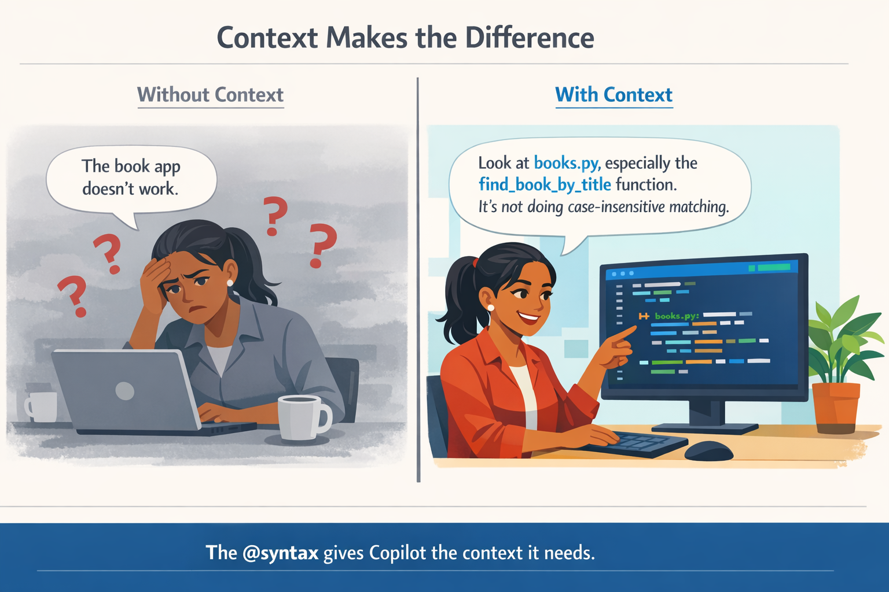
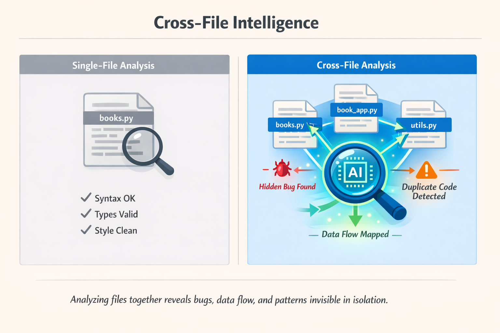
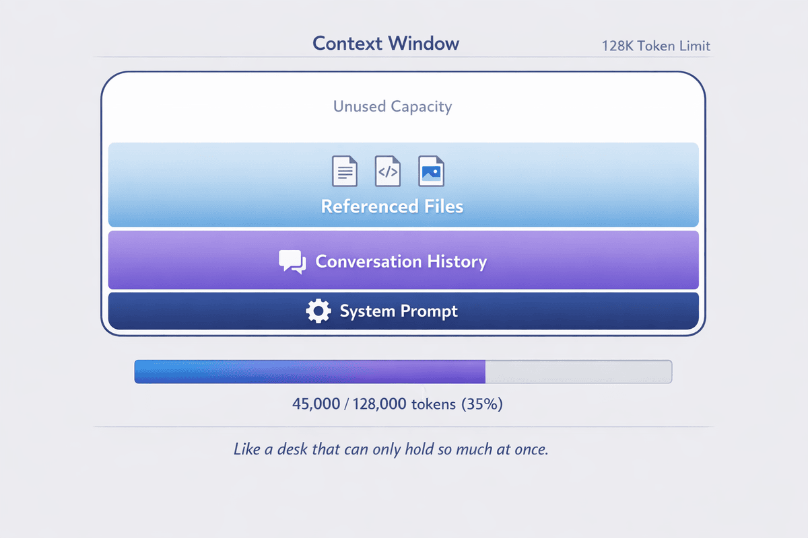

<!--
---
id: CopilotCLI-02
title: !translate Contexto y conversaciones
description: !translate Usa el contexto de archivos y directorios, reanuda sesiones previas y escribe conversaciones multi-turno efectivas con GitHub Copilot CLI.
audience: Developers / Students / Terminal users
slug: context-and-conversations
weight: 3
---
-->


> **¿Y si la IA pudiera ver todo tu código, no solo un archivo a la vez?**

En este capítulo, desbloquearás el verdadero poder de GitHub Copilot CLI: el contexto. Aprenderás a usar la sintaxis `@` para referenciar archivos y directorios, dándole a Copilot CLI una comprensión profunda de tu código. Descubrirás cómo mantener conversaciones a través de sesiones, reanudar el trabajo días después exactamente donde lo dejaste, y verás cómo el análisis entre archivos detecta errores que las revisiones de un solo archivo no alcanzan a ver.

## 🎯 Objetivos de aprendizaje

Al final de este capítulo, podrás:

- Usar la sintaxis `@` para referenciar archivos, directorios e imágenes
- Reanudar sesiones previas con `--resume` y `--continue`
- Entender cómo funcionan las [ventanas de contexto](../GLOSSARY.md#ventana-de-contexto)
- Escribir conversaciones multi-turno efectivas
- Gestionar permisos de directorio para flujos de trabajo multi-proyecto

> ⏱️ **Tiempo estimado**: ~50 minutos (20 min lectura + 30 min práctico)

---

## 🧩 Analogía en el mundo real: Trabajar con un colega



*Al igual que tus colegas, Copilot CLI no es un lector de mentes. Proporcionar más información ayuda tanto a los humanos como a Copilot a ofrecer soporte más específico.*

Imagina explicar un error a un colega:

> **Sin contexto**: "La aplicación de libros no funciona."

> **Con contexto**: "Mira `books.py`, especialmente la función `find_book_by_title`. No está haciendo una comparación que ignore mayúsculas/minúsculas."

Para proporcionar contexto a Copilot CLI usa *la sintaxis `@`* para señalar archivos específicos.

---

# Esencial: Contexto básico


Esta sección cubre todo lo que necesitas para trabajar eficazmente con el contexto. Domina estos conceptos básicos primero.

---

## La sintaxis @

El símbolo `@` referencia archivos y directorios en tus prompts. Es la forma de decirle a Copilot CLI "mira este archivo".

> 💡 **Nota**: Todos los ejemplos en este curso usan la carpeta `samples/` incluida en este repositorio, así que puedes probar cada comando directamente.

### Pruébalo ahora (sin configuración)

Puedes probar esto con cualquier archivo en tu computadora:

```bash
copilot

# Señala cualquier archivo que tengas
> Explain what @package.json does
> Summarize @README.md
> What's in @.gitignore and why?
```

> 💡 **¿No tienes un proyecto a la mano?** Crea un archivo de prueba rápido:
> ```bash
> echo "def greet(name): return 'Hello ' + name" > test.py
> copilot
> > What does @test.py do?
> ```

### Patrones básicos de @

| Pattern | What It Does | Example Use |
|---------|--------------|-------------|
| `@file.py` | Reference a single file | `Review @samples/book-app-project/books.py` |
| `@folder/` | Reference all files in a directory | `Review @samples/book-app-project/` |
| `@file1.py @file2.py` | Reference multiple files | `Compare @samples/book-app-project/book_app.py @samples/book-app-project/books.py` |

### Referenciar un único archivo

```bash
copilot

> Explain what @samples/book-app-project/utils.py does
```

---

<details>
<summary>🎬 Mira la demostración</summary>


*La salida de la demo varía. Tu modelo, herramientas y respuestas diferirán de lo que se muestra aquí.*

</details>

---

### Referenciar varios archivos

```bash
copilot

> Compare @samples/book-app-project/book_app.py and @samples/book-app-project/books.py for consistency
```

### Referenciar un directorio completo

```bash
copilot

> Review all files in @samples/book-app-project/ for error handling
```

---

## Inteligencia entre archivos

Aquí es donde el contexto se vuelve una superpotencia. El análisis de un solo archivo es útil. El análisis entre archivos es transformador.



### Demostración: Encuentra errores que abarcan varios archivos

```bash
copilot

> @samples/book-app-project/book_app.py @samples/book-app-project/books.py
>
> How do these files work together? What's the data flow?
```

> 💡 **Opción avanzada**: Para análisis entre archivos enfocado en seguridad, prueba los ejemplos de seguridad en Python:
> ```bash
> > @samples/buggy-code/python/user_service.py @samples/buggy-code/python/payment_processor.py
> > Find security vulnerabilities that span BOTH files
> ```

---

<details>
<summary>🎬 Mira la demostración</summary>


*La salida de la demo varía. Tu modelo, herramientas y respuestas diferirán de lo que se muestra aquí.*

</details>

---

**Lo que descubre Copilot CLI**:

```
Cross-Module Analysis
=====================

1. DATA FLOW PATTERN
   book_app.py creates BookCollection instance and calls methods
   books.py defines BookCollection class and manages data persistence

   Flow: book_app.py (UI) → books.py (business logic) → data.json (storage)

2. DUPLICATE DISPLAY FUNCTIONS
   book_app.py:9-21    show_books() function
   utils.py:28-36      print_books() function

   Impact: Two nearly identical functions doing the same thing. If you update
   one (like changing the format), you must remember to update the other.

3. INCONSISTENT ERROR HANDLING
   book_app.py handles ValueError from year conversion
   books.py silently returns None/False on errors

   Pattern: No unified approach to error handling across modules
```

**Por qué esto importa**: Una revisión de un solo archivo se perdería la imagen completa. Solo el análisis entre archivos revela:
- **Código duplicado** que debería consolidarse
- **Patrones de flujo de datos** que muestran cómo interactúan los componentes
- **Problemas arquitectónicos** que afectan la mantenibilidad

---

### Demostración: Entender una base de código en 60 segundos


¿Nuevo en un proyecto? Conócelo rápidamente usando Copilot CLI.

```bash
copilot

> @samples/book-app-project/
>
> In one paragraph, what does this app do and what are its biggest quality issues?
```

**Lo que obtienes**:
```
This is a CLI book collection manager that lets users add, list, remove, and
search books stored in a JSON file. The biggest quality issues are:

1. Duplicate display logic - show_books() and print_books() do the same thing
2. Inconsistent error handling - some errors raise exceptions, others return False
3. No input validation - year can be 0, empty strings accepted for title/author
4. Missing tests - no test coverage for critical functions like find_book_by_title

Priority fix: Consolidate duplicate display functions and add input validation.
```

**Resultado**: Lo que toma una hora de lectura de código se comprime en 10 segundos. Sabes exactamente dónde concentrarte.

---

## Ejemplos prácticos

### Ejemplo 1: Revisión de código con contexto

```bash
copilot

> @samples/book-app-project/books.py Review this file for potential bugs

# Copilot CLI ahora tiene el contenido completo del archivo y puede dar comentarios específicos:
# "Línea 49: La comparación con distinción entre mayúsculas y minúsculas puede omitir libros..."
# "Línea 29: Se capturan errores de decodificación JSON pero no se registra la corrupción de datos..."

> What about @samples/book-app-project/book_app.py?

# Ahora revisando book_app.py, pero sigo teniendo en cuenta el contexto de books.py
```

### Ejemplo 2: Entender una base de código

```bash
copilot

> @samples/book-app-project/books.py What does this module do?

# Copilot CLI lee books.py y entiende la clase BookCollection

> @samples/book-app-project/ Give me an overview of the code structure

# Copilot CLI escanea el directorio y resume

> How does the app save and load books?

# Copilot CLI puede seguir el código que ya ha visto
```

<details>
<summary>🎬 Mira una conversación de varios turnos en acción</summary>


*La salida de la demo varía. Tu modelo, herramientas y respuestas diferirán de lo que se muestra aquí.*

</details>

### Ejemplo 3: Refactorización en varios archivos

```bash
copilot

> @samples/book-app-project/book_app.py @samples/book-app-project/utils.py
> I see duplicate display functions: show_books() and print_books(). Help me consolidate these.

# Copilot CLI ve ambos archivos y puede sugerir cómo fusionar el código duplicado
```

---

## Gestión de sesiones

Las sesiones se guardan automáticamente mientras trabajas. Puedes reanudar sesiones previas para continuar donde lo dejaste.

### Guardado automático de sesiones

Cada conversación se guarda automáticamente. Simplemente sal normalmente:

```bash
copilot

> @samples/book-app-project/ Let's improve error handling across all modules

[... do some work ...]

> /exit
```

### Reanudar la sesión más reciente

```bash
# Continúa donde lo dejaste
copilot --continue
```

### Reanudar una sesión específica

```bash
# Selecciona una sesión de una lista de forma interactiva
copilot --resume

# -r es un atajo para --resume (¡ahorra algo de tecleo!)
copilot -r

# O reanuda una sesión específica por ID
copilot --resume=abc123

# O reanuda por el nombre que le diste a la sesión
copilot --resume="my book app review"
```

> 💡 **¿Cómo encuentro un ID de sesión?** No necesitas memorizarlos. Ejecutar `copilot --resume` sin un ID muestra una lista interactiva de tus sesiones previas, sus nombres, IDs y cuándo estuvieron activas por última vez. Simplemente elige la que quieres.
>
> **¿Y si tengo múltiples terminales?** Cada ventana de terminal es su propia sesión con su propio contexto. Si tienes Copilot CLI abierto en tres terminales, son tres sesiones separadas. Ejecutar `--resume` desde cualquier terminal te permite explorar todas ellas. El flag `--continue` toma la sesión del directorio de trabajo actual primero; si no existe allí, selecciona la sesión más recientemente activa.
>
> **¿Puedo cambiar de sesión sin reiniciar?** Sí. Usa el comando con barra `/resume` desde dentro de una sesión activa:
> ```
> > /resume
> # Shows a list of sessions to switch to
> ```

### Organiza tus sesiones

Pon nombres significativos a las sesiones para poder encontrarlas después. Puedes nombrar una sesión cuando la inicias, o renombrarla en cualquier momento mientras estás dentro de la sesión:

```bash
# Nombra una sesión justo cuando la inicias
copilot --name book-app-review

# O renombra la sesión actual desde dentro
copilot

> /rename book-app-review
# Sesión renombrada para facilitar su identificación
```

Una vez que una sesión está nombrada, puedes reanudarla directamente por nombre sin navegar por una lista:

```bash
copilot --resume=book-app-review
```

Para limpiar sesiones que ya no necesitas, usa `/session delete` desde dentro de una sesión:

```bash
copilot

> /session delete            # Elimina la sesión actual
> /session delete abc123     # Elimina una sesión específica por su ID
> /session delete-all        # Elimina todas las sesiones (¡usar con precaución!)
```

### Memoria persistente entre sesiones

Las sesiones guardan el historial de la conversación, pero la **memoria** va un paso más allá y permite que Copilot CLI recuerde preferencias y hechos *a través de todas las sesiones*, no solo dentro de una sola.

```bash
copilot

> /memory show
# Muestra lo que Copilot CLI recuerda actualmente sobre ti y tu proyecto

> /memory on
# Activa la memoria (activada por defecto si tu cuenta lo permite)

> /memory off
# Desactiva la memoria (útil si prefieres empezar desde cero cada vez)
```

Por ejemplo, si le dices a Copilot CLI "Siempre prefiero pytest para pruebas en Python", puede recordar esa preferencia y aplicarla automáticamente en sesiones futuras. Todo sin que tengas que repetirlo.

> 💡 **Memoria vs. sesiones**: Las sesiones guardan el historial de conversación para que puedas reanudar una tarea específica. La memoria guarda hechos reutilizables del repositorio y preferencias del usuario que Copilot puede aplicar en trabajos futuros. Piensa en las sesiones como cuadernos de tareas, y en la memoria como contexto reutilizable que Copilot puede llevar adelante.

### Comprobar y gestionar el contexto

A medida que añades archivos y conversación, la [ventana de contexto](../GLOSSARY.md#ventana-de-contexto) de Copilot CLI se va llenando. Hay varios comandos disponibles para ayudarte a mantener el control:

```bash
copilot

> /context
Context usage: 62k/200k tokens (31%)

> /clear
# Abandona la sesión actual (no se guarda el historial) y comienza una conversación nueva

> /new
# Finaliza la sesión actual (guardándola en el historial para búsqueda/reanudación) y comienza una conversación nueva

> /rewind
# Abre un selector de línea de tiempo que te permite retroceder a un punto anterior de tu conversación
```

> 💡 **Cuándo usar `/clear` o `/new`**: Si has estado revisando books.py y quieres cambiar a discutir utils.py, ejecuta /new primero (o /clear si no necesitas el historial de la sesión). De lo contrario el contexto obsoleto del tema anterior puede confundir las respuestas.

> 💡 **¿Cometiste un error o quieres probar un enfoque distinto?** Usa `/rewind` (o presiona Esc dos veces) para abrir un **selector de línea de tiempo** que te permite retroceder a cualquier punto anterior de tu conversación, no solo al más reciente. Cuando retrocedes, Copilot CLI pregunta si quieres restaurar solo la conversación o también deshacer los cambios en archivos que Copilot hizo — no se requiere un repositorio git. Esto es útil cuando tomaste un camino equivocado y quieres retroceder sin empezar completamente de nuevo.

---

### Retoma donde lo dejaste


*Las sesiones se guardan automáticamente al salir. Reanuda días después con todo el contexto: archivos, issues y progreso recordados.*

Imagina este flujo de trabajo a lo largo de varios días:

```bash
# Lunes: Comenzar la revisión de la aplicación de libros indicando un nombre desde el principio
copilot --name book-app-review

> @samples/book-app-project/books.py
> Review and number all code quality issues

Quality Issues Found:
1. Duplicate display functions (book_app.py & utils.py) - MEDIUM
2. No input validation for empty strings - MEDIUM
3. Year can be 0 or negative - LOW
4. No type hints on all functions - LOW
5. Missing error logging - LOW

> Fix issue #1 (funciones duplicadas)
# Trabajar en la corrección...

> /exit
```

```bash
# Miércoles: Reanuda exactamente donde lo dejaste, por nombre
copilot --resume=book-app-review

> What issues remain unfixed from our book app review?

Remaining issues from our book-app-review session:
2. No input validation for empty strings - MEDIUM
3. Year can be 0 or negative - LOW
4. No type hints on all functions - LOW
5. Missing error logging - LOW

Issue #1 (funciones duplicadas) se solucionó el lunes.

> Let's tackle issue #2 next
```

**Por qué esto es poderoso**: Días después, Copilot CLI recuerda:
- El archivo exacto en el que estabas trabajando
- La lista numerada de issues
- Cuáles ya has abordado
- El contexto de tu conversación

Sin volver a explicar ni a releer archivos. Simplemente continúa trabajando.

---

**🎉 ¡Ahora conoces lo esencial!** La sintaxis `@`, la gestión de sesiones (`--name`/`--continue`/`--resume`/`/rename`) y los comandos de contexto (`/context`/`/clear`) son suficientes para ser muy productivo. Todo lo que sigue es opcional. Vuelve a ello cuando estés listo.

---

# Opcional: Profundizar


Estos temas se basan en los conceptos esenciales anteriores. **Elige lo que te interese o salta a [Practice](#el-espectro-de-especificidad).**

| I want to learn about... | Jump to |
|---|---|
| Wildcard patterns and advanced session commands | [Additional @ Patterns & Session Commands](#comprobar-y-gestionar-el-contexto) |
| Building on context across multiple prompts | [Context-Aware Conversations](#patrones-adicionales) |
| Token limits and `/compact` | [Understanding Context Windows](#comparte-tu-sesión) |
| How to pick the right files to reference | [Choosing What to Reference](#el-comando-compact) |
| Analyzing screenshots and mockups | [Working with Images](#qué-incluir-y-qué-excluir) |

<details>
<summary><strong>Patrones @ adicionales y comandos de sesión</strong></summary>
<a id="additional-patterns"></a>

### Patrones @ adicionales

Para usuarios avanzados, Copilot CLI admite patrones comodín y referencias a imágenes:

| Pattern | What It Does |
|---------|--------------|
| `@folder/*.py` | All .py files in folder |
| `@**/test_*.py` | Recursive wildcard: find all test files anywhere |
| `@image.png` | Image file for UI review |

```bash
copilot

> Find all TODO comments in @samples/book-app-project/**/*.py
```

### Ver información de la sesión

```bash
copilot

> /session
# Muestra los detalles de la sesión actual y un resumen del espacio de trabajo

> /usage
# Muestra métricas y estadísticas de la sesión
```

### Comparte tu sesión

```bash
copilot

> /share file ./my-session.md
# Exporta la sesión como un archivo Markdown

> /share gist
# Crea un gist de GitHub con la sesión

> /share html
# Exporta la sesión como un archivo HTML interactivo autocontenido
# Útil para compartir informes de sesión pulidos con compañeros de equipo o guardarlos como referencia
```

</details>

<details>
<summary><strong>Conversaciones con contexto</strong></summary>
<a id="context-aware-conversations"></a>

### Conversaciones con contexto

La magia ocurre cuando tienes conversaciones de varios turnos que se construyen unas sobre otras.

#### Ejemplo: Mejora progresiva

```bash
copilot

> @samples/book-app-project/books.py Review the BookCollection class

Copilot CLI: "The class looks functional, but I notice:
1. Missing type hints on some methods
2. No validation for empty title/author
3. Could benefit from better error handling"

> Add type hints to all methods

Copilot CLI: "Here's the class with complete type hints..."
[Shows typed version]

> Now improve error handling

Copilot CLI: "Building on the typed version, here's improved error handling..."
[Adds validation and proper exceptions]

> Generate tests for this final version

Copilot CLI: "Based on the class with types and error handling..."
[Generates comprehensive tests]
```

Observa cómo cada prompt se basa en el trabajo previo. Este es el poder del contexto.

</details>

<details>
<summary><strong>Comprender las ventanas de contexto</strong></summary>
<a id="understanding-context-windows"></a>

### Comprender las ventanas de contexto

Ya conoces `/context` y `/clear` de lo esencial. Aquí tienes una visión más profunda de cómo funcionan las ventanas de contexto.

Cada IA tiene una "ventana de contexto", que es la cantidad de texto que puede considerar a la vez.



*La ventana de contexto es como un escritorio: solo puede sostener cierta cantidad a la vez. Archivos, historial de conversación y prompts del sistema ocupan espacio.*

#### Qué sucede en el límite

```bash
copilot

> /context

Context usage: 45,000 / 128,000 tokens (35%)

# A medida que añades más archivos y conversaciones, esto crece

> @large-codebase/

Context usage: 120,000 / 128,000 tokens (94%)

# Advertencia: Se acerca el límite de contexto

> @another-large-file.py

Context limit reached. Older context will be summarized.
```

#### El comando `/compact`

Cuando tu contexto se está llenando pero no quieres perder la conversación, `/compact` resume tu historial para liberar tokens:

```bash
copilot

> /compact
# Resume el historial de la conversación, liberando espacio de contexto
# Sus hallazgos y decisiones clave se preservan
```

También puedes darle a `/compact` instrucciones de enfoque opcionales para moldear qué se prioriza en el resumen:

```bash
copilot

> /compact focus on the list of bugs we found and decisions made
# Resume la historia, manteniendo la lista de errores y las decisiones en primer plano
```

> 💡 **Cuándo usar instrucciones de enfoque**: Si tu conversación abarcó muchos temas, las instrucciones de enfoque ayudan a `/compact` a conservar las partes más relevantes para tus siguientes pasos para que no pierdas el hilo.

#### Consejos para la eficiencia del contexto

| Situación | Acción | Por qué |
|-----------|--------|-----|
| Empezar un tema nuevo | `/clear` | Elimina el contexto irrelevante |
| Seguiste por un camino equivocado | `/rewind` | Revertir la conversación (y opcionalmente restaurar archivos) a cualquier punto anterior |
| Conversación larga | `/compact` | Resume el historial, libera tokens |
| Necesitas un archivo específico | `@file.py` no `@folder/` | Carga solo lo que necesitas |
| Alcanzar límites | `/new` o `/clear` | Contexto nuevo |
| Múltiples temas | Usa `/rename` por tema | Fácil reanudar la sesión correcta |

#### Mejores prácticas para grandes bases de código

1. **Sé específico**: `@samples/book-app-project/books.py` en lugar de `@samples/book-app-project/`
2. **Limpia el contexto entre temas**: Usa `/new` o `/clear` al cambiar de enfoque
3. **Usa `/compact`**: Resume la conversación para liberar contexto
4. **Usa múltiples sesiones**: Una sesión por funcionalidad o tema

</details>

<details>
<summary><strong>Elegir qué referenciar</strong></summary>
<a id="choosing-what-to-reference"></a>

### Elegir qué referenciar

No todos los archivos son iguales cuando se trata de contexto. Aquí tienes cómo elegir sabiamente:

#### Consideraciones sobre el tamaño de archivo

| Tamaño de archivo | Aproximados [Tokens](../GLOSSARY.md#token) | Estrategia |
|-----------|-------------------|----------|
| Pequeño (<100 líneas) | ~500-1,500 tokens | Referenciar libremente |
| Mediano (100-500 líneas) | ~1,500-7,500 tokens | Referenciar archivos específicos |
| Grande (500+ líneas) | 7,500+ tokens | Sé selectivo, usa archivos específicos |
| Muy grande (1000+ líneas) | 15,000+ tokens | Considera dividir o enfocar secciones |

**Ejemplos concretos:**
- Los 4 archivos Python de la app de libros combinados ≈ 2,000-3,000 tokens
- Un módulo Python típico (200 líneas) ≈ 3,000 tokens
- Un archivo de API Flask (400 líneas) ≈ 6,000 tokens
- Tu package.json ≈ 200-500 tokens
- Un prompt corto + respuesta ≈ 500-1,500 tokens

> 💡 **Estimación rápida para código:** Multiplica las líneas de código por ~15 para obtener tokens aproximados. Ten en cuenta que esto es solo una estimación.

#### Qué incluir y qué excluir

**De alto valor** (incluir estos):
- Puntos de entrada (`book_app.py`, `main.py`, `app.py`)
- Los archivos específicos sobre los que preguntas
- Archivos importados directamente por tu archivo objetivo
- Archivos de configuración (`requirements.txt`, `pyproject.toml`)
- Modelos de datos o dataclasses

**De menor valor** (considera excluir):
- Archivos generados (salida compilada, assets empaquetados)
- Node modules o directorios vendor
- Archivos grandes de datos o fixtures
- Archivos no relacionados con tu pregunta

#### El espectro de especificidad

```
Less specific ────────────────────────► More specific
@samples/book-app-project/                      @samples/book-app-project/books.py:47-52
     │                                       │
     └─ Scans everything                     └─ Just what you need
        (uses more context)                      (preserves context)
```

**Cuándo ir a lo general** (`@samples/book-app-project/`):
- Exploración inicial del código base
- Encontrar patrones en muchos archivos
- Revisiones de arquitectura

**Cuándo ser específico** (`@samples/book-app-project/books.py`):
- Depurar un problema en particular
- Revisión de código de un archivo específico
- Preguntar sobre una sola función

#### Ejemplo práctico: carga de contexto por etapas

```bash
copilot

# Paso 1: Empieza con la estructura
> @package.json What frameworks does this project use?

# Paso 2: Restringe según la respuesta
> @samples/book-app-project/ Show me the project structure

# Paso 3: Concéntrate en lo que importa
> @samples/book-app-project/books.py Review the BookCollection class

# Paso 4: Añade archivos relacionados solo cuando sea necesario
> @samples/book-app-project/book_app.py @samples/book-app-project/books.py How does the CLI use the BookCollection?
```

Este enfoque por etapas mantiene el contexto enfocado y eficiente.

</details>

<details>
<summary><strong>Trabajar con imágenes</strong></summary>
<a id="working-with-images"></a>

### Trabajar con imágenes

Puedes incluir imágenes en tus conversaciones usando la sintaxis `@`, o simplemente **pegar desde tu portapapeles** (Cmd+V / Ctrl+V). Copilot CLI puede analizar capturas de pantalla, mockups y diagramas para ayudar con depuración de UI, implementación de diseño y análisis de errores.

```bash
copilot

> @assets/screenshot.png What is happening in this image?

> @assets/mockup.png Write the HTML and CSS to match this design. Place it in a new file called index.html and put the CSS in styles.css.
```

> 📖 **Más información**: Consulta [Additional Context Features](../appendices/additional-context.md#trabajar-con-imágenes) para formatos compatibles, casos de uso prácticos y consejos para combinar imágenes con código.

</details>

---

# Práctica


Es hora de aplicar tus habilidades de gestión de contexto y sesiones.

---

## ▶️ Pruébalo tú mismo

### Revisión completa del proyecto

El curso incluye archivos de ejemplo que puedes revisar directamente. Inicia copilot y ejecuta el prompt que se muestra a continuación:

```bash
copilot

> @samples/book-app-project/ Give me a code quality review of this project

# Copilot CLI identificará problemas como:
# - Funciones de visualización duplicadas
# - Falta validación de entrada
# - Manejo de errores inconsistente
```

> 💡 **¿Quieres probar con tus propios archivos?** Crea un pequeño proyecto Python (`mkdir -p my-project/src`), añade algunos archivos .py, luego usa `@my-project/src/` para revisarlos. ¡Puedes pedirle a copilot que cree código de ejemplo si quieres!

### Flujo de sesión

```bash
copilot

> /rename book-app-review
> @samples/book-app-project/books.py Let's add input validation for empty titles

[Copilot CLI suggests validation approach]

> Implement that fix
> Now consolidate the duplicate display functions in @samples/book-app-project/
> /exit

# Más tarde - reanudar donde lo dejaste
copilot --continue

> Generate tests for the changes we made
```

---

Después de completar las demos, prueba estas variaciones:

1. **Desafío entre archivos**: Analiza cómo funcionan book_app.py y books.py conjuntamente:
   ```bash
   copilot
   > @samples/book-app-project/book_app.py @samples/book-app-project/books.py
   > What's the relationship between these files? Are there any code smells?
   ```

2. **Desafío de sesión**: Inicia una sesión, nómbrala con `/rename my-first-session`, trabaja en algo, sal con `/exit`, luego ejecuta `copilot --continue`. ¿Recuerda lo que estabas haciendo?

3. **Desafío de contexto**: Ejecuta `/context` a mitad de sesión. ¿Cuántos tokens estás usando? Prueba `/compact` y comprueba de nuevo. (Ve [Comprender las ventanas de contexto](#comparte-tu-sesión) en Going Deeper para más sobre `/compact`.)

**Autoevaluación**: Entiendes el contexto cuando puedas explicar por qué `@folder/` es más potente que abrir cada archivo individualmente.

---

## 📝 Tarea

### Desafío principal: Rastrear el flujo de datos

Los ejemplos prácticos se centraron en revisiones de calidad de código y validación de entradas. Ahora practica las mismas habilidades de contexto en una tarea diferente: rastrear cómo se mueve la información a través de la app:

1. Inicia una sesión interactiva: `copilot`
2. Referencia `books.py` y `book_app.py` juntos:
   `@samples/book-app-project/books.py @samples/book-app-project/book_app.py Rastrear cómo un libro pasa desde la entrada del usuario hasta guardarse en data.json. ¿Qué funciones intervienen en cada paso?`
3. Incluye el archivo de datos para contexto adicional:
   `@samples/book-app-project/data.json ¿Qué sucede si este archivo JSON falta o está corrupto? ¿Qué funciones fallarían?`
4. Pide una mejora entre archivos:
   `@samples/book-app-project/books.py @samples/book-app-project/utils.py Sugiere una estrategia coherente de manejo de errores que funcione en ambos archivos.`
5. Renombra la sesión: `/rename data-flow-analysis`
6. Sal con `/exit`, luego reanuda con `copilot --continue` y haz una pregunta de seguimiento sobre el flujo de datos

**Criterios de éxito**: Puedes rastrear datos a través de múltiples archivos, reanudar una sesión nombrada y obtener sugerencias entre archivos.

<details>
<summary>💡 Sugerencias (haz clic para expandir)</summary>

**Para empezar:**
```bash
cd /path/to/copilot-cli-for-beginners
copilot
> @samples/book-app-project/books.py @samples/book-app-project/book_app.py Trace how a book goes from user input to being saved in data.json.
> @samples/book-app-project/data.json What happens if this file is missing or corrupted?
> /rename data-flow-analysis
> /exit
```

Luego reanuda con: `copilot --continue`

**Comandos útiles:**
- `@file.py` - Referencia un solo archivo
- `@folder/` - Referencia todos los archivos en una carpeta (nota la `/` final)
- `/context` - Comprueba cuánto contexto estás usando
- `/rename <name>` - Nombra tu sesión para reanudarla fácilmente

</details>

### Reto extra: límites del contexto

1. Referencia todos los archivos de la app de libros a la vez con `@samples/book-app-project/`
2. Haz varias preguntas detalladas sobre distintos archivos (`books.py`, `utils.py`, `book_app.py`, `data.json`)
3. Ejecuta `/context` para ver el uso. ¿Qué tan rápido se llena?
4. Practica usando `/compact` para recuperar espacio, luego continúa la conversación
5. Intenta ser más específico con las referencias de archivos (p. ej., `@samples/book-app-project/books.py` en lugar de la carpeta completa) y observa cómo afecta el uso del contexto

---

<details>
<summary>🔧 <strong>Errores comunes y solución de problemas</strong> (haz clic para expandir)</summary>

### Errores comunes

| Error | Qué sucede | Solución |
|---------|--------------|-----|
| Olvidar `@` antes de los nombres de archivo | Copilot CLI trata "books.py" como texto sin formato | Usa `@samples/book-app-project/books.py` para referenciar archivos |
| Esperar que las sesiones persistan automáticamente | Iniciar `copilot` desde cero pierde todo el contexto previo | Usa `--continue` (última sesión) o `--resume` (elige una sesión) |
| Referenciar archivos fuera del directorio actual | Errores "Permission denied" o "File not found" | Usa `/add-dir /path/to/directory` para otorgar acceso |
| No usar `/clear` al cambiar de tema | El contexto antiguo confunde las respuestas sobre el nuevo tema | Ejecuta `/clear` antes de empezar una tarea diferente |

### Solución de problemas

**"File not found" errors** - Asegúrate de que estás en el directorio correcto:

```bash
pwd  # Comprobar el directorio actual
ls   # Listar archivos

# Luego inicia copilot y usa rutas relativas
copilot

> Review @samples/book-app-project/books.py
```

**"Permission denied"** - Añade el directorio a tu lista de permitidos:

```bash
copilot --add-dir /path/to/directory

# O en una sesión:
> /add-dir /path/to/directory
```

**El contexto se llena demasiado rápido**:
- Sé más específico con las referencias de archivos
- Usa `/clear` entre diferentes temas
- Divide el trabajo en múltiples sesiones

</details>

---

# Resumen

## 🔑 Puntos clave

1. **Sintaxis `@`** proporciona a Copilot CLI contexto sobre archivos, directorios e imágenes
2. **Las conversaciones multi-turno** se basan unas en otras a medida que el contexto se acumula
3. **Las sesiones se guardan automáticamente**: nómbralas al inicio con `--name`, recupéralas por nombre con `--resume=<name>`, o usa `--continue` para retomar la sesión más reciente
4. **Las ventanas de contexto** tienen límites: gestiona con `/clear`, `/compact`, `/context`, `/new` y `/rewind`. Usa `/compact focus on <topic>` para definir qué se conserva en el resumen
5. **Memoria persistente** (`/memory`) permite a Copilot CLI recordar preferencias y hechos a través de *todas* las sesiones — no solo la actual
6. **Flags de permisos** (`--add-dir`, `--allow-all`) controlan el acceso a múltiples directorios. ¡Úsalas con prudencia!
7. **Referencias de imágenes** (`@screenshot.png`) ayudan a depurar problemas de UI visualmente

> 📚 **Documentación oficial**: [Usar Copilot CLI](https://docs.github.com/copilot/how-tos/copilot-cli/use-copilot-cli) para la referencia completa sobre contexto, sesiones y trabajar con archivos.

> 📋 **Referencia rápida**: Consulta la [referencia de comandos de GitHub Copilot CLI](https://docs.github.com/en/copilot/reference/cli-command-reference) para una lista completa de comandos y atajos.

---

## ➡️ ¿Qué sigue?

Ahora que puedes darle contexto a Copilot CLI, pongámoslo a trabajar en tareas de desarrollo reales. Las técnicas de contexto que acabas de aprender (referencias de archivos, análisis entre archivos y gestión de sesiones) son la base para los potentes flujos de trabajo del próximo capítulo.

En **[Capítulo 03: Flujos de trabajo de desarrollo](../03-development-workflows/README.md)**, aprenderás:

- Flujos de trabajo de revisión de código
- Patrones de refactorización
- Asistencia para depuración
- Generación de pruebas
- Integración con Git

---

**[← Volver al Capítulo 01](../01-setup-and-first-steps/README.md)** | **[Continuar al Capítulo 03 →](../03-development-workflows/README.md)**

---

<!-- CO-OP TRANSLATOR DISCLAIMER START -->
**Descargo de responsabilidad**:
Este documento ha sido traducido utilizando el servicio de traducción automática [Co-op Translator](https://github.com/Azure/co-op-translator). Aunque nos esforzamos por la precisión, tenga en cuenta que las traducciones automatizadas pueden contener errores o inexactitudes. El documento original en su idioma nativo debe considerarse la fuente autorizada. Para información crítica, se recomienda una traducción profesional humana. No somos responsables de cualquier malentendido o interpretación errónea que surja del uso de esta traducción.
<!-- CO-OP TRANSLATOR DISCLAIMER END -->