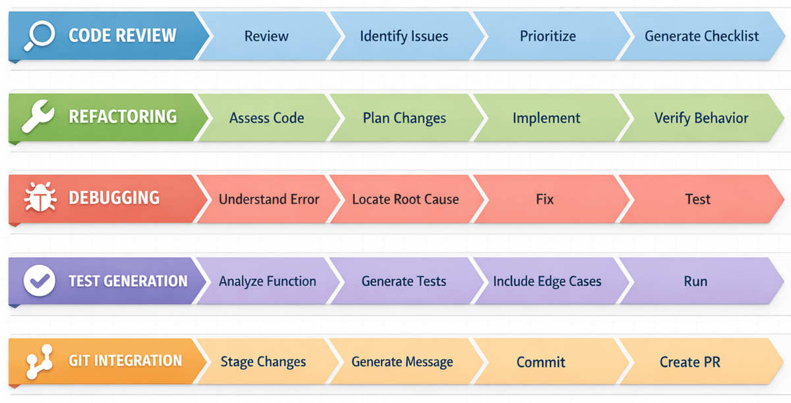
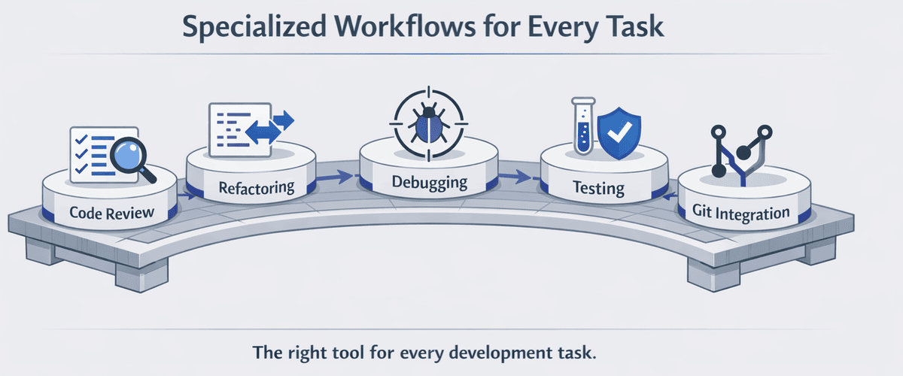

<!--
---
id: CopilotCLI-03
title: !translate Development Workflows
description: !translate Apply GitHub Copilot CLI to everyday development workflows including code review, refactoring, debugging, test generation, and Git.
audience: Developers / Students / Terminal users
slug: development-workflows
weight: 4
---
-->


> **¿Y si la IA pudiera encontrar errores sobre los que ni siquiera sabías preguntar?**

En este capítulo, GitHub Copilot CLI se convierte en tu herramienta diaria. Lo usarás dentro de los flujos de trabajo que ya utilizas todos los días: pruebas, refactorización, depuración y Git.

## 🎯 Objetivos de aprendizaje

Al final de este capítulo, podrás:

- Realizar revisiones de código exhaustivas con Copilot CLI
- Refactorizar código heredado de forma segura
- Depurar problemas con asistencia de IA
- Generar pruebas automáticamente
- Integrar Copilot CLI con tu flujo de trabajo de git

> ⏱️ **Tiempo estimado**: ~60 minutos (15 min lectura + 45 min práctico)

---

## 🧩 Analogía del mundo real: El flujo de trabajo de un carpintero

Un carpintero no solo sabe usar herramientas, tiene *flujos de trabajo* para diferentes tareas:


De manera similar, los desarrolladores tienen flujos de trabajo para distintas tareas. GitHub Copilot CLI mejora cada uno de estos flujos, haciéndote más eficiente y eficaz en tus tareas de programación diarias.

---

# Los cinco flujos de trabajo


Cada flujo de trabajo abajo es autónomo. Elige los que se ajusten a tus necesidades actuales o recórrelos todos.

---

## Elige tu propia aventura

Este capítulo cubre cinco flujos de trabajo que los desarrolladores usan típicamente. **¡Sin embargo, no necesitas leerlos todos de una vez!** Cada flujo está contenido en una sección plegable a continuación. Elige los que correspondan a lo que necesitas y que mejor se adapten a tu proyecto actual. Siempre puedes volver y explorar los demás más tarde.



| Quiero... | Ir a |
|---|---|
| Revisar código antes de fusionar | [Flujo 1: Revisión de código](#workflow-1-code-review) |
| Limpiar código desordenado o heredado | [Flujo 2: Refactorización](#workflow-2-refactoring) |
| Localizar y arreglar un error | [Flujo 3: Depuración](#workflow-3-debugging) |
| Generar pruebas para mi código | [Flujo 4: Generación de pruebas](#workflow-4-test-generation) |
| Escribir mejores commits y PRs | [Flujo 5: Integración con Git](#workflow-5-git-integration) |
| Investigar antes de programar | [Consejo rápido: Investiga antes de planear o codificar](#usar-delegate-para-tareas-en-segundo-plano) |
| Ver un flujo de corrección de errores completo de principio a fin | [Uniendo todo: flujo de corrección de errores](#usar-diff-para-revisar-los-cambios-de-la-sesión) |

**Selecciona un flujo de trabajo abajo para expandirlo** y ver cómo GitHub Copilot CLI puede mejorar tu proceso de desarrollo en esa área. 

---

<a id="workflow-1-code-review"></a>
<details>
<summary><strong>Flujo 1: Revisión de código</strong> - Revisar archivos, usar el agente /review, crear listas de verificación por severidad</summary>


### Revisión básica

Este ejemplo usa el símbolo `@` para referenciar un archivo, dando a Copilot CLI acceso directo a su contenido para revisarlo.

```bash
copilot

> Review @samples/book-app-project/book_app.py for code quality
```

---

<details>
<summary>🎬 ¡Míralo en acción!</summary>


*La salida de la demostración varía. Tu modelo, herramientas y respuestas diferirán de lo mostrado aquí.*

</details>

---

### Revisión de validación de entradas

Pídele a Copilot CLI que enfoque su revisión en una preocupación específica (aquí, la validación de entradas) listando en el prompt las categorías que te importan.

```text
copilot

> Review @samples/book-app-project/utils.py for input validation issues. Check for: missing validation, error handling gaps, and edge cases
```


### Revisión de proyecto entre archivos

Referencia un directorio entero con `@` para permitir que Copilot CLI escanee todos los archivos del proyecto a la vez.

```bash
copilot

> @samples/book-app-project/ Review this entire project. Create a markdown checklist of issues found, categorized by severity
```

### Revisión de código interactiva

Usa una conversación multi-turno para profundizar. Comienza con una revisión amplia y luego haz preguntas de seguimiento sin reiniciar.

```bash
copilot

> @samples/book-app-project/book_app.py Review this file for:
> - Input validation
> - Error handling
> - Code style and best practices

# Copilot CLI proporciona una revisión detallada

> The user input handling - are there any edge cases I'm missing?

# Copilot CLI muestra posibles problemas con cadenas vacías, caracteres especiales

> Create a checklist of all issues found, prioritized by severity

# Copilot CLI genera elementos de acción priorizados
```

### Plantilla de lista de verificación para revisión

Pídele a Copilot CLI que estructure su salida en un formato específico (aquí, una lista de verificación en markdown categorizada por severidad que puedes pegar en un issue).

```bash
copilot

> Review @samples/book-app-project/ and create a markdown checklist of issues found, categorized by:
> - Critical (data loss risks, crashes)
> - High (bugs, incorrect behavior)
> - Medium (performance, maintainability)
> - Low (style, minor improvements)
```

### Entender los cambios en Git (Importante para /review)

Antes de usar el comando `/review`, necesitas comprender dos tipos de cambios en git:

| Tipo de cambio | Qué significa | Cómo verlo |
|-------------|---------------|------------|
| **Cambios staged** | Archivos que has marcado para el siguiente commit con `git add` | `git diff --staged` |
| **Cambios no staged** | Archivos que has modificado pero que aún no has añadido | `git diff` |

```bash
# Referencia rápida
git status           # Muestra tanto los cambios preparados como los no preparados
git add file.py      # Preparar un archivo para el commit
git diff             # Muestra los cambios no preparados
git diff --staged    # Muestra los cambios preparados
```

### Usar el comando /review

El comando `/review` invoca al **agente de revisión de código** integrado, que está optimizado para analizar cambios staged y no staged con una salida de alta relación señal/ruido. Usa un comando con slash para activar un agente integrado especializado en lugar de escribir un prompt en forma libre.

```bash
copilot

> /review
# Invoca al agente de revisión de código en cambios preparados/no preparados
# Proporciona retroalimentación enfocada y accionable

> /review Check for security issues in authentication
# Ejecuta la revisión con un área de enfoque específica
```

> 💡 **Consejo**: El agente de revisión de código funciona mejor cuando tienes cambios pendientes. Prepara tus archivos con `git add` para revisiones más enfocadas.

</details>

---

<a id="workflow-2-refactoring"></a>
<details>
<summary><strong>Flujo 2: Refactorización</strong> - Reestructurar el código, separar responsabilidades, mejorar el manejo de errores</summary>


### Refactorización simple

> **Prueba esto primero:** `@samples/book-app-project/book_app.py The command handling uses if/elif chains. Refactor it to use a dictionary dispatch pattern.`

Comienza con mejoras sencillas. Prueba estas en la aplicación de libros. Cada prompt usa una referencia de archivo `@` junto con una instrucción de refactorización específica para que Copilot CLI sepa exactamente qué cambiar.

```bash
copilot

> @samples/book-app-project/book_app.py The command handling uses if/elif chains. Refactor it to use a dictionary dispatch pattern.

> @samples/book-app-project/utils.py Add type hints to all functions

> @samples/book-app-project/book_app.py Extract the book display logic into utils.py for better separation of concerns
```

> 💡 **¿Nuevo en la refactorización?** Empieza con solicitudes simples como añadir anotaciones de tipos o mejorar nombres de variables antes de abordar transformaciones complejas.

---

<details>
<summary>🎬 ¡Míralo en acción!</summary>


*La salida de la demostración varía. Tu modelo, herramientas y respuestas diferirán de lo mostrado aquí.*

</details>

---

### Separar responsabilidades

Referencia múltiples archivos con `@` en un solo prompt para que Copilot CLI pueda mover código entre ellos como parte del refactor.

```bash
copilot

> @samples/book-app-project/utils.py @samples/book-app-project/book_app.py
> The utils.py file has print statements mixed with logic. Refactor to separate display functions from data processing.
```

### Mejorar el manejo de errores

Proporciona dos archivos relacionados y describe la preocupación transversal para que Copilot CLI pueda sugerir una corrección consistente en ambos.

```bash
copilot

> @samples/book-app-project/utils.py @samples/book-app-project/books.py
> These files have inconsistent error handling. Suggest a unified approach using custom exceptions.
```

### Añadir documentación

Usa una lista detallada de viñetas para especificar exactamente qué debe contener cada docstring.

```bash
copilot

> @samples/book-app-project/books.py Add comprehensive docstrings to all methods:
> - Include parameter types and descriptions
> - Document return values
> - Note any exceptions raised
> - Add usage examples
```

### Refactorización segura con tests

Encadena dos solicitudes relacionadas en una conversación multi-turno. Primero genera pruebas, luego refactoriza con esas pruebas como red de seguridad.

```bash
copilot

> @samples/book-app-project/books.py Before refactoring, generate tests for current behavior

# Obtén las pruebas primero

> Now refactor the BookCollection class to use a context manager for file operations

# Refactoriza con confianza - las pruebas verifican que el comportamiento se mantiene
```

</details>

---

<a id="workflow-3-debugging"></a>
<details>
<summary><strong>Flujo 3: Depuración</strong> - Localizar errores, auditorías de seguridad, rastrear problemas a través de archivos</summary>


### Depuración sencilla

> **Prueba esto primero:** `@samples/book-app-buggy/books_buggy.py Users report that searching for "The Hobbit" returns no results even though it's in the data. Debug why.`

Empieza describiendo lo que está mal. Aquí hay patrones comunes de depuración que puedes probar con la aplicación de libros con errores. Cada prompt empareja una referencia de archivo `@` con una descripción clara del síntoma para que Copilot CLI pueda localizar y diagnosticar el error.

```bash
copilot

# Patrón: "Se esperaba X pero se obtuvo Y"
> @samples/book-app-buggy/books_buggy.py Users report that searching for "The Hobbit" returns no results even though it's in the data. Debug why.

# Patrón: "Comportamiento inesperado"
> @samples/book-app-buggy/book_app_buggy.py When I remove a book that doesn't exist, the app says it was removed. Help me find why.

# Patrón: "Resultados incorrectos"
> @samples/book-app-buggy/books_buggy.py When I mark one book as read, ALL books get marked. What's the bug?
```

> 💡 **Consejo de depuración**: Describe el *síntoma* (lo que ves) y la *expectativa* (lo que debería ocurrir). Copilot CLI se encarga del resto.

---

<details>
<summary>🎬 ¡Míralo en acción!</summary>


*La salida de la demostración varía. Tu modelo, herramientas y respuestas diferirán de lo mostrado aquí.*

</details>

---

### El "detective de bugs" - La IA encuentra errores RELACIONADOS

Aquí es donde la depuración consciente del contexto destaca. Prueba este escenario con la aplicación de libros con errores. Proporciona el archivo completo vía `@` y describe solo el síntoma informado por el usuario. Copilot CLI rastreará la causa raíz y puede detectar errores adicionales cercanos.

```bash
copilot

> @samples/book-app-buggy/books_buggy.py
>
> Users report: "Finding books by author name doesn't work for partial names"
> Debug why this happens
```

**Lo que hace Copilot CLI**:
```
Root Cause: Line 80 uses exact match (==) instead of partial match (in).

Line 80: return [b for b in self.books if b.author == author]

The find_by_author function requires an exact match. Searching for "Tolkien"
won't find books by "J.R.R. Tolkien".

Fix: Change to case-insensitive partial match:
return [b for b in self.books if author.lower() in b.author.lower()]
```

**Por qué esto importa**: Copilot CLI lee todo el archivo, entiende el contexto de tu informe de error y te da una corrección específica con una explicación clara.

> 💡 **Bono**: Debido a que Copilot CLI analiza todo el archivo, frecuentemente descubre *otros* problemas sobre los que no preguntaste. Por ejemplo, al arreglar la búsqueda por autor, Copilot CLI podría también notar el error de sensibilidad a mayúsculas en `find_book_by_title`!

### Sidebar de seguridad en el mundo real

Aunque depurar tu propio código es importante, entender las vulnerabilidades de seguridad en aplicaciones en producción es crítico. Prueba este ejemplo: Apunta Copilot CLI a un archivo desconocido y pídele auditar en busca de problemas de seguridad.

```bash
copilot

> @samples/buggy-code/python/user_service.py Find all security vulnerabilities in this Python user service
```

Este archivo demuestra patrones de seguridad reales que encontrarás en aplicaciones de producción.

> 💡 **Términos de seguridad comunes que encontrarás:**
> - **Inyección SQL**: Cuando la entrada del usuario se inserta directamente en una consulta a la base de datos, permitiendo a atacantes ejecutar comandos maliciosos
> - **Consultas parametrizadas**: La alternativa segura - los marcadores (`?`) separan los datos del usuario de los comandos SQL
> - **Condición de carrera**: Cuando dos operaciones ocurren al mismo tiempo e interfieren entre sí
> - **XSS (Cross-Site Scripting)**: Cuando atacantes inyectan scripts maliciosos en páginas web

---

### Entender un error

Pega un stack trace directamente en tu prompt junto con una referencia de archivo `@` para que Copilot CLI pueda mapear el error al código fuente.

```bash
copilot

> I'm getting this error:
> AttributeError: 'NoneType' object has no attribute 'title'
>     at show_books (book_app.py:19)
>
> @samples/book-app-project/book_app.py Explain why and how to fix it
```

### Depuración con caso de prueba

Describe la entrada exacta y la salida observada para darle a Copilot CLI un caso de prueba concreto y reproducible sobre el que razonar.

```bash
copilot

> @samples/book-app-buggy/books_buggy.py The remove_book function has a bug. When I try to remove "Dune",
> it also removes "Dune Messiah". Debug this: explain the root cause and provide a fix.
```

### Rastrear un problema a través del código

Referencia múltiples archivos y pide a Copilot CLI que siga el flujo de datos a través de ellos para localizar dónde se origina el problema.

```bash
copilot

> Users report that the book list numbering starts at 0 instead of 1.
> @samples/book-app-buggy/book_app_buggy.py @samples/book-app-buggy/books_buggy.py
> Trace through the list display flow and identify where the issue occurs
```

### Entender problemas de datos

Incluye un archivo de datos junto con el código que lo lee para que Copilot CLI entienda la imagen completa al sugerir mejoras en el manejo de errores.

```bash
copilot

> @samples/book-app-project/data.json @samples/book-app-project/books.py
> Sometimes the JSON file gets corrupted and the app crashes. How should we handle this gracefully?
```

</details>

---

<a id="workflow-4-test-generation"></a>
<details>
<summary><strong>Flujo 4: Generación de pruebas</strong> - Generar pruebas exhaustivas y casos límite automáticamente</summary>


> **Prueba esto primero:** `@samples/book-app-project/books.py Generate pytest tests for all functions including edge cases`

### La "explosión de pruebas" - 2 pruebas vs 15+ pruebas

Al escribir pruebas manualmente, los desarrolladores típicamente crean 2-3 pruebas básicas:
- Probar entrada válida
- Probar entrada inválida
- Probar un caso límite

Mira lo que pasa cuando pides a Copilot CLI que genere pruebas exhaustivas. Este prompt usa una lista estructurada de viñetas con una referencia de archivo `@` para guiar a Copilot CLI hacia una cobertura de pruebas completa:

```bash
copilot

> @samples/book-app-project/books.py Generate comprehensive pytest tests. Include tests for:
> - Adding books
> - Removing books
> - Finding by title
> - Finding by author
> - Marking as read
> - Edge cases with empty data
```

---

<details>
<summary>🎬 ¡Míralo en acción!</summary>


*La salida de la demostración varía. Tu modelo, herramientas y respuestas diferirán de lo mostrado aquí.*

</details>

---

**Lo que obtienes**: 15+ pruebas exhaustivas que incluyen:

```python
class TestBookCollection:
    # Camino feliz
    def test_add_book_creates_new_book(self):
        ...
    def test_list_books_returns_all_books(self):
        ...

    # Operaciones de búsqueda
    def test_find_book_by_title_case_insensitive(self):
        ...
    def test_find_book_by_title_returns_none_when_not_found(self):
        ...
    def test_find_by_author_partial_match(self):
        ...
    def test_find_by_author_case_insensitive(self):
        ...

    # Casos límite
    def test_add_book_with_empty_title(self):
        ...
    def test_remove_nonexistent_book(self):
        ...
    def test_mark_as_read_nonexistent_book(self):
        ...

    # Persistencia de datos
    def test_save_books_persists_to_json(self):
        ...
    def test_load_books_handles_missing_file(self):
        ...
    def test_load_books_handles_corrupted_json(self):
        ...

    # Caracteres especiales
    def test_add_book_with_unicode_characters(self):
        ...
    def test_find_by_author_with_special_characters(self):
        ...
```

**Resultado**: En 30 segundos obtienes pruebas de casos límite que tomaría una hora idear y escribir.

---

### Pruebas unitarias

Apunta a una única función y enumera las categorías de entrada que quieres probar para que Copilot CLI genere pruebas unitarias enfocadas y completas.

```bash
copilot

> @samples/book-app-project/utils.py Generate comprehensive pytest tests for get_book_details covering:
> - Valid input
> - Empty strings
> - Invalid year formats
> - Very long titles
> - Special characters in author names
```

### Ejecutar pruebas

Pídele a Copilot CLI una pregunta en lenguaje sencillo sobre tu cadena de herramientas. Puede generar para ti el comando de shell adecuado.

```bash
copilot

> How do I run the tests? Show me the pytest command.

# Copilot CLI responde:
# cd samples/book-app-project && python -m pytest tests/
# O para salida detallada: python -m pytest tests/ -v
# Para ver las sentencias print: python -m pytest tests/ -s
```

### Probar escenarios específicos

Enumera escenarios avanzados o complicados que quieras cubrir para que Copilot CLI vaya más allá del camino feliz.

```bash
copilot

> @samples/book-app-project/books.py Generate tests for these scenarios:
> - Adding duplicate books (same title and author)
> - Removing a book by partial title match
> - Finding books when collection is empty
> - File permission errors during save
> - Concurrent access to the book collection
```

### Agregar pruebas a un archivo existente

Solicita pruebas *adicionales* para una sola función para que Copilot CLI genere nuevos casos que complementen lo que ya tienes.

```bash
copilot

> @samples/book-app-project/books.py
> Generate additional tests for the find_by_author function with edge cases:
> - Author name with hyphens (e.g., "Jean-Paul Sartre")
> - Author with multiple first names
> - Empty string as author
> - Author name with accented characters
```

</details>

---

<a id="workflow-5-git-integration"></a>
<details>
<summary><strong>Flujo de trabajo 5: Integración con Git</strong> - Mensajes de commit, descripciones de PR, /pr, /delegate, /diff y /branch</summary>


> 💡 **Este flujo de trabajo asume familiaridad básica con git** (preparar cambios, confirmar, ramas). Si git es nuevo para ti, prueba primero los otros cuatro flujos de trabajo.

### Generar mensajes de commit

> **Prueba esto primero:** `copilot -p "Generate a conventional commit message for: $(git diff --staged)"` — prepara algunos cambios, luego ejecuta esto para ver a Copilot CLI escribir tu mensaje de commit.

Este ejemplo usa la opción de indicador en línea `-p` con sustitución de comandos del shell para pasar la salida de `git diff` directamente a Copilot CLI y obtener un mensaje de commit de una sola vez. La sintaxis `$(...)` ejecuta el comando dentro de los paréntesis e inserta su salida en el comando exterior.

```bash

# Ver qué cambió
git diff --staged

# Generar mensaje de commit usando el formato [Conventional Commit](../GLOSSARY.md#conventional-commit)
# (mensajes estructurados como "feat(books): add search" o "fix(data): handle empty input")
copilot -p "Generate a conventional commit message for: $(git diff --staged)"

# Salida: "feat(books): añadir búsqueda parcial por nombre de autor
#
# - Actualizar find_by_author para soportar coincidencias parciales
# - Añadir comparación insensible a mayúsculas y minúsculas
# - Mejorar la experiencia de usuario al buscar autores"
```

---

<details>
<summary>🎬 ¡Míralo en acción!</summary>


*La salida de la demo varía. Tu modelo, herramientas y respuestas diferirán de lo mostrado aquí.*

</details>

---

### Explicar cambios

Pasa la salida de `git show` a un prompt con `-p` para obtener un resumen en lenguaje sencillo del último commit.

```bash
# ¿Qué cambió en este commit?
copilot -p "Explain what this commit does: $(git show HEAD --stat)"
```

### Descripción de PR

Combina la salida de `git log` con una plantilla de prompt estructurada para generar automáticamente una descripción completa del pull request.

```bash
# Generar la descripción del PR a partir de los cambios de la rama
copilot -p "Generate a pull request description for these changes:
$(git log main..HEAD --oneline)

Include:
- Summary of changes
- Why these changes were made
- Testing done
- Breaking changes? (yes/no)"
```

### Usar /pr en modo interactivo para la rama actual

Si estás trabajando con una rama en el modo interactivo de Copilot CLI, puedes usar el comando `/pr` para trabajar con pull requests. Usa `/pr` para ver un PR, crear uno nuevo, corregir un PR existente o dejar que Copilot CLI decida automáticamente según el estado de la rama.

```bash
copilot

> /pr [view|create|fix|auto]
```

### Revisar antes de hacer push

Usa `git diff main..HEAD` dentro de un prompt `-p` para una verificación rápida antes del push de todos los cambios de la rama.

```bash
# Última comprobación antes de subir
copilot -p "Review these changes for issues before I push:
$(git diff main..HEAD)"
```

### Usar /delegate para tareas en segundo plano

El comando `/delegate` delega trabajo al agente en la nube de GitHub Copilot. Usa el comando con barra `/delegate` (o el atajo `&`) para descargar una tarea bien definida a un agente en segundo plano.

```bash
copilot

> /delegate Add input validation to the login form

# O usa el atajo de prefijo &:
> & Fix the typo in the README header

# Copilot CLI:
# 1. Confirma tus cambios en una nueva rama
# 2. Abre una solicitud de extracción en borrador
# 3. Trabaja en segundo plano en GitHub
# 4. Solicita tu revisión cuando termine
```

Esto es ideal para tareas bien definidas que quieres que se completen mientras te concentras en otro trabajo.

### Usar /diff para revisar los cambios de la sesión

El comando `/diff` muestra todos los cambios realizados durante tu sesión actual. Usa este comando con barra para ver un diff visual de todo lo que Copilot CLI ha modificado antes de que confirmes los cambios. También funciona en carpetas que no son repositorios git.

```bash
copilot

# Después de hacer algunos cambios...
> /diff

# Muestra un diff visual de todos los archivos modificados en esta sesión
# Muy útil para revisar antes de confirmar
```

### Ramificar tu sesión con /branch o /fork

A veces quieres explorar dos enfoques distintos para un problema sin perder tu conversación original. El comando `/branch` (también disponible como `/fork`) crea una copia de tu sesión actual para que puedas probar una dirección diferente y luego comparar resultados.

```bash
copilot

> Fix the find_by_author function to support partial matches

# Quieres probar un enfoque diferente — primero crea una rama!
> /branch

# Ahora estás en una copia de la sesión. Prueba tu enfoque alternativo:
> Fix find_by_author using a different regex-based strategy

# Si no te gusta el resultado, vuelve a tu sesión original usando /session
```

> 💡 **`/branch` y `/fork` son lo mismo**: Ambos comandos hacen cosas idénticas. `/branch` se añadió como un nombre más intuitivo. Usa el que tenga más sentido para ti.

> 💡 **Cuándo ramificar**: Ramificar es útil cuando no estás seguro de qué enfoque es mejor y quieres mantener ambas opciones abiertas.

</details>

---

## Consejo rápido: Investiga antes de planificar o codificar

Cuando necesites investigar una biblioteca, entender las mejores prácticas o explorar un tema desconocido, usa `/research` para realizar una investigación profunda antes de escribir código:

```bash
copilot

> /research What are the best Python libraries for validating user input in CLI apps?
```

Copilot busca en repositorios de GitHub y fuentes web, luego devuelve un resumen con referencias. Esto es útil cuando estás a punto de comenzar una nueva característica y quieres tomar decisiones informadas primero. Puedes compartir los resultados usando `/share`.

> 💡 **Consejo**: `/research` funciona bien *antes* de `/plan`. Investiga el enfoque y luego planifica la implementación.

---

## Poniéndolo todo junto: Flujo de trabajo para corregir errores

Aquí tienes un flujo de trabajo completo para corregir un bug reportado:

```bash

# 1. Entender el informe de errores
copilot

> Users report: 'Finding books by author name doesn't work for partial names'
> @samples/book-app-project/books.py Analyze and identify the likely cause

# 2. Depurar el problema y arreglarlo (continuando en la misma sesión)
> Based on the analysis, show me the find_by_author function and explain the issue

> Fix the find_by_author function to handle partial name matches

# 3. Generar pruebas para la corrección
> @samples/book-app-project/books.py Generate pytest tests specifically for:
> - Full author name match
> - Partial author name match
> - Case-insensitive matching
> - Author name not found

# Salir de la sesión interactiva

> /exit

# 4. Ejecutar git add

# Poner los cambios en el área de preparación para que git diff --staged tenga algo con lo que trabajar
git add .

# 5. Generar el mensaje de commit
copilot -p "Generate commit message for: $(git diff --staged)"

# Ejemplo de salida: "fix(books): soportar búsqueda parcial del nombre del autor"

# 6. Hacer commit de los cambios (opcional)

git commit -m "<paste generated message>"
```

### Resumen del flujo de trabajo para corregir bugs

| Paso | Acción | Comando de Copilot |
|------|--------|-----------------|
| 1 | Entender el bug | `> [describe bug] @relevant-file.py Analyze the likely cause` |
| 2 | Análisis y corrección | `> Show me the function and fix the issue` |
| 3 | Generar pruebas | `> Generate tests for [specific scenarios]` |
| 4 | Preparar los cambios | `git add .` |
| 5 | Generar mensaje de commit | `copilot -p "Generate commit message for: $(git diff --staged)"` |
| 6 | Confirmar cambios| `git commit -m "<paste generated message>"` |

---

# Práctica


Ahora es tu turno para aplicar estos flujos de trabajo.

---

## ▶️ Pruébalo tú mismo

Después de completar las demostraciones, prueba estas variaciones:

1. **Desafío detective de bugs**: Pídele a Copilot CLI que depure la función `mark_as_read` en `samples/book-app-buggy/books_buggy.py`. ¿Explicó por qué la función marca TODOS los libros como leídos en lugar de solo uno?

2. **Desafío de pruebas**: Genera pruebas para la función `add_book` en la aplicación de libros. Cuenta cuántos casos límite incluye Copilot CLI que no habrías pensado.

3. **Desafío de mensaje de commit**: Haz cualquier cambio pequeño en un archivo de la aplicación de libros, prepáralo (`git add .`), luego ejecuta:
   ```bash
   copilot -p "Generate a conventional commit message for: $(git diff --staged)"
   ```
   ¿Es el mensaje mejor que lo que habrías escrito rápidamente?

**Autoevaluación**: Comprendes los flujos de trabajo de desarrollo cuando puedes explicar por qué "debug this bug" es más potente que "find bugs" (¡el contexto importa!).

---

## 📝 Asignación

### Desafío principal: Refactorizar, probar y entregar

Los ejemplos prácticos se centraron en `find_book_by_title` y las revisiones de código. Ahora practica las mismas habilidades de flujo de trabajo en diferentes funciones en `book-app-project`:

1. **Revisión**: Pídele a Copilot CLI que revise `remove_book()` en `books.py` en busca de casos límite y problemas potenciales:
   `@samples/book-app-project/books.py Review the remove_book() function. What happens if the title partially matches another book (e.g., "Dune" vs "Dune Messiah")? Are there any edge cases not handled?`
2. **Refactorizar**: Pídele a Copilot CLI que mejore `remove_book()` para manejar casos límite como coincidencia sin distinguir mayúsculas/minúsculas y devolver retroalimentación útil cuando no se encuentra un libro
3. **Pruebas**: Genera tests de pytest específicamente para la función `remove_book()` mejorada, cubriendo:
   - Eliminar un libro que existe
   - Coincidencia de título sin distinguir mayúsculas/minúsculas
   - Un libro que no existe devuelve retroalimentación apropiada
   - Eliminar de una colección vacía
4. **Revisión**: Prepara tus cambios y ejecuta `/review` para comprobar si quedan problemas
5. **Commit**: Genera un mensaje de commit convencional:
   `copilot -p "Generate a conventional commit message for: $(git diff --staged)"`

<details>
<summary>💡 Pistas (haz clic para expandir)</summary>

**Prompts de ejemplo para cada paso:**

```bash
copilot

# Paso 1: Revisar
> @samples/book-app-project/books.py Review the remove_book() function. What edge cases are not handled?

# Paso 2: Refactorizar
> Improve remove_book() to use case-insensitive matching and return a clear message when the book isn't found. Show me the before and after code.

# Paso 3: Probar
> Generate pytest tests for the improved remove_book() function, including:
> - Removing a book that exists
> - Case-insensitive matching ("dune" should remove "Dune")
> - Book not found returns appropriate response
> - Removing from an empty collection

# Paso 4: Revisar
> /review

# Paso 5: Confirmar
> Generate a conventional commit message for this refactor
```

**Consejo:** Después de mejorar `remove_book()`, prueba a preguntarle a Copilot CLI: "Are there any other functions in this file that could benefit from the same improvements?". Puede sugerir cambios similares a `find_book_by_title()` o `find_by_author()`.

</details>

### Desafío adicional: Crea una aplicación con Copilot CLI

> 💡 **Nota**: Este ejercicio de GitHub Skills usa **Node.js** en lugar de Python. Las técnicas de GitHub Copilot CLI que practicarás - crear issues, generar código y colaborar desde la terminal - se aplican a cualquier lenguaje.

El ejercicio muestra a los desarrolladores cómo usar GitHub Copilot CLI para crear issues, generar código y colaborar desde la terminal mientras construyen una app de calculadora en Node.js. Instalarás el CLI, usarás plantillas y agentes, y practicarás un desarrollo iterativo impulsado desde la línea de comandos.

#####  [Comienza el ejercicio de Skills "Crear aplicaciones con Copilot CLI"](https://github.com/skills/create-applications-with-the-copilot-cli)

---

<details>
<summary>🔧 <strong>Errores comunes y solución de problemas</strong> (haz clic para expandir)</summary>

### Errores comunes

| Error | Qué sucede | Solución |
|---------|--------------|-----|
| Usar prompts vagos como "Review this code" | Retroalimentación genérica que omite problemas específicos | Sé específico: "Review for SQL injection, XSS, and auth issues" |
| No usar `/review` para revisiones de código | Falta el agente optimizado de revisión de código | Usa `/review` que está ajustado para una salida con alta relación señal/ruido |
| Pedir "find bugs" sin contexto | Copilot CLI no sabe qué error estás experimentando | Describe el síntoma: "Users report X happens when Y" |
| Generar pruebas sin especificar el framework | Las pruebas pueden usar la sintaxis o biblioteca de aserciones incorrecta | Especifica: "Generate tests using Jest" o "using pytest" |

### Solución de problemas

**La revisión parece incompleta** - Sé más específico sobre qué buscar:

```bash
copilot

# En lugar de:
> Review @samples/book-app-project/book_app.py

# Intenta:
> Review @samples/book-app-project/book_app.py for input validation, error handling, and edge cases
```

**Las pruebas no coinciden con mi framework** - Especifica el framework:

```bash
copilot

> @samples/book-app-project/books.py Generate tests using pytest (not unittest)
```

**La refactorización cambia el comportamiento** - Pide a Copilot CLI que preserve el comportamiento:

```bash
copilot

> @samples/book-app-project/book_app.py Refactor command handling to use dictionary dispatch. IMPORTANT: Maintain identical external behavior - no breaking changes
```

</details>

---

# Resumen

## 🔑 Puntos clave



1. **Revisión de código** se vuelve más exhaustiva con prompts específicos
2. **Refactorización** es más segura cuando generas pruebas primero
3. **Depuración** se beneficia de mostrar a Copilot CLI el error Y el código
4. **Generación de pruebas** debe incluir casos límite y escenarios de error
5. **Integración con Git** automatiza mensajes de commit y descripciones de PR

> 📋 **Referencia rápida**: Consulta la [referencia de comandos de GitHub Copilot CLI](https://docs.github.com/en/copilot/reference/cli-command-reference) para obtener una lista completa de comandos y atajos.

---

## ✅ Punto de control: Has dominado lo esencial

**¡Felicidades!** Ahora tienes todas las habilidades básicas para ser productivo con GitHub Copilot CLI:

| Habilidad | Capítulo | Ahora puedes... |
|-------|---------|----------------|
| Comandos básicos | Ch 01 | Usa el modo interactivo, el modo plan, el modo programático (-p) y los comandos con barra |
| Contexto | Ch 02 | Referencia archivos con `@`, gestiona sesiones, comprende ventanas de contexto |
| Flujos de trabajo | Ch 03 | Revisar código, refactorizar, depurar, generar pruebas, integrar con git |

Los capítulos 04-06 cubren funciones adicionales que añaden aún más potencia y vale la pena aprenderlas.

---

## 🛠️ Construyendo tu flujo de trabajo personal

No hay una forma "correcta" única de usar GitHub Copilot CLI. Aquí tienes algunos consejos mientras desarrollas tus propios patrones:

> 📚 **Documentación oficial**: [Mejores prácticas de Copilot CLI](https://docs.github.com/copilot/how-tos/copilot-cli/cli-best-practices) para flujos de trabajo recomendados y consejos de GitHub.

- **Comienza con `/plan`** para cualquier cosa no trivial. Refina el plan antes de ejecutarlo - un buen plan conduce a mejores resultados.
- **Guarda los prompts que funcionen bien.** Cuando Copilot CLI cometa un error, anota qué salió mal. Con el tiempo, esto se convierte en tu libro de jugadas personal.
- **Experimenta libremente.** Algunos desarrolladores prefieren prompts largos y detallados. Otros prefieren prompts cortos con seguimientos. Prueba diferentes enfoques y observa lo que se siente natural.

> 💡 **Próximo**: En los capítulos 04 y 05, aprenderás cómo codificar tus mejores prácticas en instrucciones personalizadas y skills que Copilot CLI carga automáticamente.

---

## ➡️ Qué sigue

Los capítulos restantes cubren características adicionales que amplían las capacidades de Copilot CLI:

| Capítulo | Qué cubre | Cuándo lo querrás |
|---------|----------------|---------------------|
| Ch 04: Agents | Crear personas de IA especializadas | Cuando quieras expertos de dominio (frontend, seguridad) |
| Ch 05: Skills | Cargar automáticamente instrucciones para tareas | Cuando repitas los mismos prompts con frecuencia |
| Capítulo 06: MCP | Conectar servicios externos | Cuando necesites datos en vivo de GitHub, bases de datos |

**Recomendación**: Prueba los flujos de trabajo principales durante una semana, luego vuelve a los Capítulos 04-06 cuando tengas necesidades específicas.

---

## Continuar con temas adicionales

En **[Capítulo 04: Agentes e instrucciones personalizadas](../04-agents-custom-instructions/README.md)**, aprenderás:

- Uso de agentes integrados (`/plan`, `/review`)
- Creación de agentes especializados (experto en frontend, auditor de seguridad) con archivos `.agent.md`
- Patrones de colaboración multiagente
- Archivos de instrucciones personalizadas para estándares del proyecto

---

**[← Volver al Capítulo 02](../02-context-conversations/README.md)** | **[Continuar al Capítulo 04 →](../04-agents-custom-instructions/README.md)**

---

<!-- CO-OP TRANSLATOR DISCLAIMER START -->
**Descargo de responsabilidad**:
Este documento ha sido traducido utilizando el servicio de traducción automática [Co-op Translator](https://github.com/Azure/co-op-translator). Aunque nos esforzamos por la precisión, tenga en cuenta que las traducciones automatizadas pueden contener errores o inexactitudes. El documento original en su idioma nativo debe considerarse la fuente autorizada. Para información crítica, se recomienda una traducción profesional humana. No somos responsables de cualquier malentendido o interpretación errónea que surja del uso de esta traducción.
<!-- CO-OP TRANSLATOR DISCLAIMER END -->