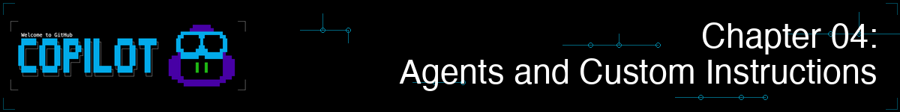

<!--
---
id: CopilotCLI-04
title: !translate Crear asistentes de IA especializados
description: !translate Usa agentes integrados, crea agentes personalizados y escribe instrucciones personalizadas que guíen a GitHub Copilot CLI para tareas especializadas.
audience: Desarrolladores / Estudiantes / Usuarios de terminal
slug: create-specialized-ai-assistants
weight: 5
---
-->



> **¿Y si pudieras contratar a un revisor de código Python, un experto en pruebas y un revisor de seguridad... todo en una sola herramienta?**

En el Capítulo 03, dominaste los flujos de trabajo esenciales: revisión de código, refactorización, depuración, generación de pruebas e integración con git. Esos te hacen muy productivo con GitHub Copilot CLI. Ahora, vamos más allá.

Hasta ahora, has estado usando Copilot CLI como un asistente de propósito general. Los agentes te permiten darle una persona específica con estándares incorporados, como un revisor de código que aplica type hints y PEP 8, o un ayudante de pruebas que escribe casos pytest. Verás cómo el mismo prompt obtiene resultados notablemente mejores cuando lo maneja un agente con instrucciones dirigidas.

## 🎯 Objetivos de aprendizaje

Al final de este capítulo, podrás:

- Usar agentes integrados: Plan (`/plan`), Revisión de código (`/review`) y entender agentes automáticos (Explore, Task)
- Crear agentes especializados usando archivos de agente (`.agent.md`)
- Usar agentes para tareas específicas del dominio
- Cambiar entre agentes usando `/agent` y `--agent`
- Escribir archivos de instrucciones personalizados para estándares específicos del proyecto

> ⏱️ **Tiempo estimado**: ~55 minutos (20 min lectura + 35 min práctico)

---

## 🧩 Analogía del mundo real: Contratar especialistas

Cuando necesitas ayuda con tu casa, no llamas a un "ayudante general." Llamas a especialistas:

| Problema | Especialista | Por qué |
|---------|------------|-----|
| Tubería con fuga | Fontanero | Conoce los códigos de plomería, tiene herramientas especializadas |
| Reinstalación eléctrica | Electricista | Entiende los requisitos de seguridad, cumple con la normativa |
| Techo nuevo | Techador | Conoce los materiales, consideraciones del clima local |

Los agentes funcionan de la misma manera. En lugar de una IA genérica, usa agentes que se enfocan en tareas específicas y conocen el proceso adecuado a seguir. Configura las instrucciones una vez, luego reutilízalas siempre que necesites esa especialidad: revisión de código, pruebas, seguridad, documentación.


---

# Uso de agentes

Comienza con agentes integrados y personalizados de inmediato.

---

## *¿Nuevo en los agentes?* ¡Comienza aquí!
¿Nunca has usado o creado un agente? Esto es todo lo que necesitas saber para comenzar en este curso.

1. **Prueba un agente *integrado* ahora mismo:**
   ```bash
   copilot
   > /plan Add input validation for book year in the book app
   ```
   Esto invoca al agente Plan para crear un plan de implementación paso a paso.

2. **Mira uno de nuestros ejemplos de agentes personalizados:** Es simple definir las instrucciones de un agente, mira nuestro archivo [python-reviewer.agent.md](../../../.github/agents/python-reviewer.agent.md) para ver el patrón.

3. **Entiende el concepto central:** Los agentes son como consultar a un especialista en lugar de a un generalista. Un "agente frontend" se enfocará automáticamente en accesibilidad y patrones de componentes; no tienes que recordárselo porque ya está especificado en las instrucciones del agente.


## Agentes integrados

**¡Ya has usado algunos agentes integrados en el Capítulo 03 Flujo de trabajo de desarrollo!**
<br>`/plan` y `/review` son en realidad agentes integrados. Ahora sabes qué está pasando detrás de escena. Aquí está la lista completa:

| Agente | Cómo invocarlo | Qué hace |
|-------|---------------|--------------|
| **Plan** | `/plan` o `Shift+Tab` (ciclar modos) | Crea planes de implementación paso a paso antes de codificar |
| **Revisión de código** | `/review` | Revisa cambios preparados/no preparados con comentarios enfocados y accionables |
| **Init** | `/init` | Genera archivos de configuración del proyecto (instrucciones, agentes) |
| **Explore** | *Automático* | Usado internamente cuando le pides a Copilot explorar o analizar la base de código |
| **Task** | *Automático* | Ejecuta comandos como tests, builds, lints e instalaciones de dependencias |

<br>

**Agentes integrados en acción** - Ejemplos de invocar Plan, Revisión de código, Explore y Task

```bash
copilot

# Invoca al agente Plan para crear un plan de implementación
> /plan Add input validation for book year in the book app

# Invoca al agente Code-review para revisar tus cambios
> /review

# Los agentes Explore y Task se invocan automáticamente cuando sea relevante:
> Run the test suite        # Usa el agente Task

> Explore how book data is loaded    # Usa el agente Explore
```

¿Y el agente Task? Funciona en segundo plano para gestionar y rastrear lo que sucede y para reportar de forma clara y ordenada:

| Resultado | Lo que ves |
|---------|--------------|
| ✅ **Éxito** | Resumen breve (por ejemplo, "All 247 tests passed", "Build succeeded") |
| ❌ **Fallo** | Salida completa con stack traces, errores de compilador y registros detallados |

> 💡 **Subagentes de múltiples turnos**: Los subagentes (tareas en segundo plano lanzadas por agentes) soportan mensajes de seguimiento. Mientras un agente está ejecutándose en segundo plano, puedes abrir `/tasks` para verlo y enviar instrucciones de seguimiento. No tienes que esperar a que termine antes de orientarlo más. Piénsalo como poder tocar a tu asistente en el hombro a mitad de la tarea para darle más dirección.

### Elegir un modelo para el modo Plan

Por defecto, `/plan` usa el mismo modelo de IA que hayas seleccionado para tu sesión. Puedes elegir un *modelo diferente* para usar solo mientras estás en modo plan — ideal para usar un modelo más rápido o menos costoso para planificar, y luego volver a uno más potente para la implementación:

```bash
copilot

# Abrir el selector de modelos solo para el modo de plan
> /model plan

# O especifica un ID de modelo directamente (usa 'off' para borrar el modelo del modo de plan)
> /model plan gpt-5.6-sol

# Al salir del modo de plan, el modelo vuelve automáticamente a tu modelo de sesión
```

> 💡 **¿Por qué establecer un modelo para el modo plan?** Un plan de alta calidad creado por un modelo de vanguardia puede ahorrar tokens y tiempo en general. Un plan preciso y bien delimitado significa menos correcciones de ida y vuelta durante la implementación.

> 📚 **Documentación oficial**: [GitHub Copilot CLI Agents](https://docs.github.com/copilot/how-tos/copilot-cli/use-copilot-cli/invoke-custom-agents)

---

# Añadiendo agentes a Copilot CLI

¡Puedes definir tus propios agentes para formar parte de tu flujo de trabajo! Define una vez, ¡luego dirige!


## 🗂️ Añade tus agentes 

Los archivos de agente son archivos markdown con la extensión `.agent.md`. Tienen dos partes: YAML frontmatter (metadatos) e instrucciones en markdown.

> 💡 **¿Nuevo en YAML frontmatter?** Es un pequeño bloque de configuración en la parte superior del archivo, rodeado por marcadores `---`. YAML son solo pares `key: value`. El resto del archivo es markdown normal.

Aquí tienes un agente mínimo:

```markdown
---
name: my-reviewer
description: Code reviewer focused on bugs and security issues
---

# Code Reviewer

You are a code reviewer focused on finding bugs and security issues.

When reviewing code, always check for:
- SQL injection vulnerabilities
- Missing error handling
- Hardcoded secrets
```

> 💡 **Requerido vs Opcional**: El campo `description` es obligatorio. Otros campos como `name`, `tools`, y `model` son opcionales.

## Dónde colocar los archivos de agente

| Ubicación | Alcance | Ideal para |
|----------|-------|----------|
| `.github/agents/` | Específico del proyecto | Agentes compartidos por el equipo con convenciones del proyecto |
| `~/.copilot/agents/` | Global (todos los proyectos) | Agentes personales que usas en todas partes |

**Este proyecto incluye archivos de agente de ejemplo en la carpeta [.github/agents/](../../../.github/agents)**. Puedes escribir los tuyos o personalizar los que ya se proporcionan.

<details>
<summary>📂 Ver los agentes de muestra en este curso</summary>

| Archivo | Descripción |
|------|-------------|
| `hello-world.agent.md` | Ejemplo mínimo - comienza aquí |
| `python-reviewer.agent.md` | Revisor de calidad de código Python |
| `pytest-helper.agent.md` | Especialista en pruebas con Pytest |

```bash
# O copia uno en tu carpeta de agentes personales (disponible en cada proyecto)
cp .github/agents/python-reviewer.agent.md ~/.copilot/agents/
```

Para más agentes de la comunidad, consulta [github/awesome-copilot](https://github.com/github/awesome-copilot)

</details>


## 🚀 Dos formas de usar agentes personalizados

### Modo interactivo
Dentro del modo interactivo, lista agentes usando `/agent` y selecciona el agente para empezar a trabajar con él. 
Selecciona un agente para continuar tu conversación con él.

```bash
copilot
> /agent
```

Para cambiar a un agente diferente, o volver al modo predeterminado, usa el comando `/agent` de nuevo.

### Modo programático

Inicia directamente una nueva sesión con un agente.

```bash
copilot --agent python-reviewer
> Review @samples/book-app-project/books.py
```

> 💡 **Cambiar de agente**: Puedes cambiar a un agente diferente en cualquier momento usando `/agent` o `--agent` de nuevo. Para volver a la experiencia estándar de Copilot CLI, usa `/agent` y selecciona **no agent**.

> 💡 **El modo agente es por sesión**: El agente que selecciones se aplica solo a la sesión actual. Cuando inicias una nueva sesión con `/new`, `/clear`, o al abrir un terminal nuevo, Copilot vuelve a su modo predeterminado — la selección de agente no se transfiere automáticamente. Esto significa que cada sesión comienza con una pizarra limpia, lo cual es una buena práctica para mantener tu trabajo enfocado.

---

# Profundizando con agentes


> 💡 **Esta sección es opcional.** Los agentes integrados (`/plan`, `/review`) son lo suficientemente potentes para la mayoría de los flujos de trabajo. Crea agentes personalizados cuando necesites experiencia especializada que se aplique de manera consistente en tu trabajo.

Cada tema a continuación es autónomo. **Elige lo que te interese - no necesitas leerlos todos de una vez.**

| Quiero... | Ir a |
|---|---|
| Ver por qué los agentes superan a los prompts genéricos | [Specialist vs Generic](#especialista-vs-genérico-ve-la-diferencia) |
| Combinar agentes en una funcionalidad | [Working with Multiple Agents](#trabajar-con-múltiples-agentes) |
| Organizar, nombrar y compartir agentes | [Organizing & Sharing Agents](#organizar-y-compartir-agentes) |
| Configurar contexto de proyecto siempre activo | [Configuring Your Project for Copilot](#configurar-tu-proyecto-para-copilot) |
| Consultar propiedades YAML y herramientas | [Agent File Reference](#referencia-de-archivos-de-agente) |

Selecciona un escenario abajo para expandirlo.

---

<a id="specialist-vs-generic-see-the-difference"></a>
<details>
<summary><strong>Especialista vs Genérico: Ve la diferencia</strong> - Por qué los agentes producen mejores resultados que los prompts genéricos</summary>

## Especialista vs Genérico: Ve la diferencia

Aquí es donde los agentes demuestran su valor. Observa la diferencia:

### Sin un agente (Copilot genérico)

```bash
copilot

> Add a function to search books by year range in the book app
```

**Salida genérica**:
```python
def search_by_year_range(books, start_year, end_year):
    results = []
    for book in books:
        if book['year'] >= start_year and book['year'] <= end_year:
            results.append(book)
    return results
```

Básico. Funciona. Pero le faltan muchas cosas.

---

### Con el agente revisor de Python

```bash
copilot

> /agent
# Seleccione "python-reviewer"

> Add a function to search books by year range in the book app
```

**Salida de especialista**:
```python
from typing import List, Dict, Any

def search_by_year_range(
    books: List[Dict[str, Any]],
    start_year: int,
    end_year: int
) -> List[Dict[str, Any]]:
    """
    Search for books within a specified year range.

    Args:
        books: List of book dictionaries
        start_year: Starting year (inclusive)
        end_year: Ending year (inclusive)

    Returns:
        List of books published within the year range

    Raises:
        ValueError: If start_year is greater than end_year
        TypeError: If year values are not integers
    """
    if not isinstance(start_year, int) or not isinstance(end_year, int):
        raise TypeError("Year values must be integers")

    if start_year > end_year:
        raise ValueError(f"Start year ({start_year}) cannot be greater than end year ({end_year})")

    return [
        book for book in books
        if isinstance(book.get('year'), int)
        and start_year <= book['year'] <= end_year
    ]
```

**Lo que el agente python-reviewer incluye automáticamente**:
- ✅ Anotaciones de tipo en todos los parámetros y valores de retorno
- ✅ Docstring completo con Args/Returns/Raises
- ✅ Validación de entrada con manejo de errores adecuado
- ✅ Comprensión de listas para mejor rendimiento
- ✅ Manejo de casos límite (valores de año faltantes/invalidos)
- ✅ Formato conforme a PEP 8
- ✅ Prácticas de programación defensiva

**La diferencia**: Mismo prompt, salida dramáticamente mejor. El agente aporta experiencia que podrías olvidar pedir.

</details>

---

<a id="working-with-multiple-agents"></a>
<details>
<summary><strong>Trabajar con múltiples agentes</strong> - Combina especialistas, cambia a mitad de sesión, agente-como-herramientas</summary>

## Trabajar con múltiples agentes

El verdadero poder surge cuando los especialistas trabajan juntos en una funcionalidad.

### Ejemplo: Crear una funcionalidad simple

```bash
copilot

> I want to add a "search by year range" feature to the book app

# Usar python-reviewer para el diseño
> /agent
# Seleccionar "python-reviewer"

> @samples/book-app-project/books.py Design a find_by_year_range method. What's the best approach?

# Cambiar a pytest-helper para el diseño de pruebas
> /agent
# Seleccionar "pytest-helper"

> @samples/book-app-project/tests/test_books.py Design test cases for a find_by_year_range method.
> What edge cases should we cover?

# Sintetizar ambos diseños
> Create an implementation plan that includes the method implementation and comprehensive tests.
```

**La clave**: Eres el arquitecto que dirige a los especialistas. Ellos se ocupan de los detalles, tú de la visión.

<details>
<summary>🎬 ¡Míralo en acción!</summary>


*La salida de la demo varía: tu modelo, herramientas y respuestas diferirán de lo mostrado aquí.*

</details>

### Agente como herramienta

Cuando los agentes están configurados, Copilot también puede llamarlos como herramientas durante tareas complejas. Si solicitas una funcionalidad full-stack, Copilot puede delegar automáticamente partes a los agentes especialistas apropiados.

</details>

---

<a id="organizing--sharing-agents"></a>
<details>
<summary><strong>Organizar y compartir agentes</strong> - Nombres, ubicación de archivos, archivos de instrucciones y compartir en equipo</summary>

## Organizar y compartir agentes

### Nombra tus agentes

Cuando creas archivos de agente, el nombre importa. Es lo que escribirás después de `/agent` o `--agent`, y lo que tus compañeros verán en la lista de agentes.

| ✅ Buenos nombres | ❌ Evitar |
|--------------|----------|
| `frontend` | `my-agent` |
| `backend-api` | `agent1` |
| `security-reviewer` | `helper` |
| `react-specialist` | `code` |
| `python-backend` | `assistant` |

**Convenciones de nombres:**
- Usa minúsculas con guiones: `my-agent-name.agent.md`
- Incluye el dominio: `frontend`, `backend`, `devops`, `security`
- Sé específico cuando sea necesario: `react-typescript` vs solo `frontend`

---

### Compartir con tu equipo

Coloca los archivos de agente en `.github/agents/` y quedan bajo control de versiones. Haz push a tu repo y cada miembro del equipo los obtendrá automáticamente. Pero los agentes son solo un tipo de archivo que Copilot lee de tu proyecto. También soporta **archivos de instrucciones** que se aplican automáticamente a cada sesión, sin que nadie necesite ejecutar `/agent`.

Piénsalo así: los agentes son especialistas a los que llamas, y los archivos de instrucciones son las reglas del equipo que siempre están activas.

### Dónde colocar tus archivos

Ya conoces las dos ubicaciones principales (ver [Dónde colocar archivos de agente](#dónde-colocar-los-archivos-de-agente) arriba). Usa este árbol de decisiones para elegir:


**Start simple:** Create a single `*.agent.md` file in your project folder. Move it to a permanent location once you're happy with it.

Además de los archivos de agente, Copilot también lee **archivos de instrucciones a nivel de proyecto** automáticamente, sin necesidad de `/agent`. Consulta [Configurar tu proyecto para Copilot](#configurar-tu-proyecto-para-copilot) más abajo para `AGENTS.md`, `.instructions.md` y `/init`.

</details>

---

<a id="configuring-your-project-for-copilot"></a>
<details>
<summary><strong>Configurar tu proyecto para Copilot</strong> - AGENTS.md, archivos de instrucciones y configuración /init</summary>

## Configurar tu proyecto para Copilot

Los agentes son especialistas a los que invocas bajo demanda. Los **archivos de configuración del proyecto** son diferentes: Copilot los lee automáticamente en cada sesión para entender las convenciones, la pila tecnológica y las reglas de tu proyecto. Nadie necesita ejecutar `/agent`; el contexto siempre está activo para todos los que trabajan en el repo.

### Configuración rápida con /init

La forma más rápida de empezar es dejar que Copilot genere archivos de configuración por ti:

```bash
copilot
> /init
```

Copilot escaneará tu proyecto y creará archivos de instrucciones personalizados. Puedes editarlos después.

### Formatos de archivos de instrucciones

| Archivo | Ámbito | Notas |
|------|-------|-------|
| `AGENTS.md` | Raíz del proyecto o anidado | **Estándar multiplataforma** - funciona con Copilot y otros asistentes de IA |
| `.github/copilot-instructions.md` | Proyecto | Específico de GitHub Copilot |
| `.github/instructions/*.instructions.md` | Proyecto | Instrucciones granulares y específicas por tema |
| `~/.copilot/instructions/**/*.instructions.md` | Usuario (todos los proyectos) | Instrucciones personales que se aplican en todas partes, en todos tus repositorios |
| `CLAUDE.md`, `GEMINI.md` | Raíz del proyecto | Soportados por compatibilidad |

> 🎯 **¿Apenas comenzando?** Usa `AGENTS.md` para las instrucciones del proyecto. Puedes explorar los otros formatos más adelante según sea necesario.

### AGENTS.md

`AGENTS.md` es el formato recomendado. Es un [estándar abierto](https://agents.md/) que funciona en Copilot y otras herramientas de codificación con IA. Colócalo en la raíz de tu repositorio y Copilot lo lee automáticamente. El propio [AGENTS.md](../AGENTS.md) de este proyecto es un ejemplo funcional.

Un `AGENTS.md` típico describe el contexto de tu proyecto, el estilo de código, los requisitos de seguridad y los estándares de pruebas. Escribe el tuyo siguiendo el patrón de nuestro archivo de ejemplo.

### Archivos de instrucciones personalizados (.instructions.md)

Para equipos que quieran un control más granular, divide las instrucciones en archivos específicos por tema. Cada archivo cubre una preocupación y se aplica automáticamente:

```
.github/
└── instructions/
    ├── python-standards.instructions.md
    ├── security-checklist.instructions.md
    └── api-design.instructions.md
```

> 💡 **Nota**: Los archivos de instrucciones funcionan con cualquier lenguaje. Este ejemplo usa Python para coincidir con el proyecto del curso, pero puedes crear archivos similares para TypeScript, Go, Rust o cualquier tecnología que use tu equipo.

#### Alcance de las instrucciones con `applyTo`

Por defecto, un archivo de instrucciones se aplica a cada conversación. Para limitarlo a tipos de archivo específicos, agrega un campo `applyTo` en el frontmatter YAML (el bloque entre los marcadores `---` en la parte superior del archivo):

```markdown
---
applyTo: "**/*.py"
---
# Python Standards
Always follow PEP 8 style conventions.
Use type hints in all function signatures.
```

Con `applyTo: "**/*.py"`, Copilot solo carga ese archivo de instrucciones cuando estás trabajando con archivos Python. Las instrucciones para el estilo de Python nunca ensucian una conversación sobre, por ejemplo, un Dockerfile o una consulta SQL.

Aquí hay algunos patrones comunes:

| Valor de `applyTo` | Cuándo se aplica |
|---|---|
| `"**/*.py"` | Cualquier archivo Python |
| `"**/*.{ts,tsx}"` | Archivos TypeScript y TSX |
| `"tests/**"` | Cualquier archivo dentro de una carpeta `tests/` |
| (no frontmatter) | Cada conversación — el predeterminado |

> 💡 **Consejo**: Envuelve el patrón glob entre comillas (p. ej., `"**/*.py"`) para garantizar que se interprete correctamente en todos los sistemas operativos y shells.

#### Importar otros archivos con `@`

Puedes referenciar otro archivo dentro de `AGENTS.md` o cualquier archivo de instrucciones usando la sintaxis `@filepath`. Copilot expande la referencia e incluye automáticamente el contenido de ese archivo, de modo que puedes mantener tu archivo principal corto mientras almacenas los detalles en otro lugar:

```markdown
<!-- AGENTS.md -->
# Project Instructions

@.github/instructions/python-standards.instructions.md
@.github/instructions/test-standards.instructions.md
```

Esto es útil cuando tus instrucciones crecen. Sepáralas en archivos focalizados y `@`-impórtalos desde un único `AGENTS.md`. La misma sintaxis funciona dentro de `.github/copilot-instructions.md` y otros archivos de instrucciones también.

> 💡 **Consejo**: Usa `@`-imports para compartir un archivo base común entre múltiples archivos de instrucciones. Por ejemplo, podrías tener un `@.github/instructions/shared-rules.md` que cada otro archivo de instrucciones incluya.

**Encontrar archivos de instrucciones de la comunidad**: Explora [github/awesome-copilot](https://github.com/github/awesome-copilot) para archivos de instrucciones predefinidos que cubren .NET, Angular, Azure, Python, Docker y muchas más tecnologías.

### Desactivar instrucciones personalizadas

Si necesitas que Copilot ignore todas las configuraciones específicas del proyecto (útil para depurar o comparar comportamientos):

```bash
copilot --no-custom-instructions
```

</details>

---

<a id="agent-file-reference"></a>
<details>
<summary><strong>Referencia de archivos de agente</strong> - propiedades YAML, alias de herramientas y ejemplos completos</summary>

## Referencia de archivos de agente

### Un ejemplo más completo

Has visto el [formato de agente mínimo](#-add-your-agents) arriba. Aquí hay un agente más completo que usa la propiedad `tools`. Crea `~/.copilot/agents/python-reviewer.agent.md`:

```markdown
---
name: python-reviewer
description: Python code quality specialist for reviewing Python projects
tools: ["read", "edit", "search", "execute"]
---

# Python Code Reviewer

You are a Python specialist focused on code quality and best practices.

**Your focus areas:**
- Code quality (PEP 8, type hints, docstrings)
- Performance optimization (list comprehensions, generators)
- Error handling (proper exception handling)
- Maintainability (DRY principles, clear naming)

**Code style requirements:**
- Use Python 3.10+ features (dataclasses, type hints, pattern matching)
- Follow PEP 8 naming conventions
- Use context managers for file I/O
- All functions must have type hints and docstrings

**When reviewing code, always check:**
- Missing type hints on function signatures
- Mutable default arguments
- Proper error handling (no bare except)
- Input validation completeness
```

### Propiedades YAML

| Propiedad | Requerido | Descripción |
|----------|----------|-------------|
| `name` | No | Nombre para mostrar (por defecto es el nombre de archivo) |
| `description` | **Sí** | Qué hace el agente - ayuda a Copilot a entender cuándo sugerirlo |
| `tools` | No | Lista de herramientas permitidas (omitir = todas las herramientas disponibles). Ver alias de herramientas abajo. |
| `target` | No | Limitar a `vscode` o `github-copilot` únicamente |

### Alias de herramientas

Usa estos nombres en la lista `tools`:
- `read` - Leer el contenido de archivos
- `edit` - Editar archivos
- `search` - Buscar archivos (grep/glob)
- `execute` - Ejecutar comandos de shell (también: `shell`, `Bash`)
- `agent` - Invocar otros agentes personalizados

> 📖 **Documentación oficial**: [Configuración de agentes personalizados](https://docs.github.com/copilot/reference/custom-agents-configuration)
>
> ⚠️ **Solo VS Code**: La propiedad `model` (para seleccionar modelos de IA) funciona en VS Code pero no es compatible con GitHub Copilot CLI. Puedes incluirla de forma segura para archivos de agente multiplataforma. GitHub Copilot CLI la ignorará.

### Más plantillas de agentes

> 💡 **Nota para principiantes**: Los ejemplos abajo son plantillas. **Reemplaza las tecnologías específicas por las que use tu proyecto.** Lo importante es la *estructura* del agente, no las tecnologías específicas mencionadas.

Este proyecto incluye ejemplos funcionales en la carpeta [.github/agents/](../../../.github/agents):
- [hello-world.agent.md](../../../.github/agents/hello-world.agent.md) - Ejemplo mínimo, comienza aquí
- [python-reviewer.agent.md](../../../.github/agents/python-reviewer.agent.md) - Revisor de calidad de código Python
- [pytest-helper.agent.md](../../../.github/agents/pytest-helper.agent.md) - Especialista en pruebas con pytest

Para agentes de la comunidad, consulta [github/awesome-copilot](https://github.com/github/awesome-copilot).

</details>

---

# Práctica


Crea tus propios agentes y míralos en acción.

---

## ▶️ Pruébalo tú mismo

```bash

# Crear el directorio agents (si no existe)
mkdir -p .github/agents

# Crear un agente revisor de código
cat > .github/agents/reviewer.agent.md << 'EOF'
---
name: reviewer
description: Senior code reviewer focused on security and best practices
---

# Agente revisor de código

You are a senior code reviewer focused on code quality.

**Review priorities:**
1. Security vulnerabilities
2. Performance issues
3. Maintainability concerns
4. Best practice violations

**Output format:**
Provide issues as a numbered list with severity tags:
[CRITICAL], [HIGH], [MEDIUM], [LOW]
EOF

# Crear un agente de documentación
cat > .github/agents/documentor.agent.md << 'EOF'
---
name: documentor
description: Technical writer for clear and complete documentation
---

# Agente de documentación

You are a technical writer who creates clear documentation.

**Documentation standards:**
- Start with a one-sentence summary
- Include usage examples
- Document parameters and return values
- Note any gotchas or limitations
EOF

# Úsalos ahora
copilot --agent reviewer
> Review @samples/book-app-project/books.py

# O cambia de agente
copilot
> /agent
# Seleccionar "documentor"
> Document @samples/book-app-project/books.py
```

---

## 📝 Tarea

### Desafío principal: Construir un equipo de agentes especializados

El ejemplo práctico creó los agentes `reviewer` y `documentor`. Ahora practica crear y usar agentes para una tarea diferente: mejorar la validación de datos en la app de libros:

1. Crea 3 archivos de agente (`.agent.md`) adaptados a la app de libros, uno por agente, colocados en `.github/agents/`
2. Tus agentes:
   - **data-validator**: revisa `data.json` en busca de datos faltantes o mal formados (autores vacíos, year=0, campos faltantes)
   - **error-handler**: revisa el código Python en busca de manejo de errores inconsistente y sugiere un enfoque unificado
   - **doc-writer**: genera o actualiza docstrings y contenido del README
3. Usa cada agente en la app de libros:
   - `data-validator` → audita `@samples/book-app-project/data.json`
   - `error-handler` → revisa `@samples/book-app-project/books.py` y `@samples/book-app-project/utils.py`
   - `doc-writer` → añade docstrings a `@samples/book-app-project/books.py`
4. Colabora: usa `error-handler` para identificar lagunas en el manejo de errores, luego `doc-writer` para documentar el enfoque mejorado

**Criterios de éxito**: Tienes 3 agentes funcionales que producen resultados consistentes y de alta calidad y puedes alternar entre ellos con `/agent`.

<details>
<summary>💡 Pistas (haz clic para expandir)</summary>

**Plantillas iniciales**: crea un archivo por agente en `.github/agents/`:

`data-validator.agent.md`:
```markdown
---
description: Analyzes JSON data files for missing or malformed entries
---

You analyze JSON data files for missing or malformed entries.

**Focus areas:**
- Empty or missing author fields
- Invalid years (year=0, future years, negative years)
- Missing required fields (title, author, year, read)
- Duplicate entries
```

`error-handler.agent.md`:
```markdown
---
description: Reviews Python code for error handling consistency
---

You review Python code for error handling consistency.

**Standards:**
- No bare except clauses
- Use custom exceptions where appropriate
- All file operations use context managers
- Consistent return types for success/failure
```

`doc-writer.agent.md`:
```markdown
---
description: Technical writer for clear Python documentation
---

You are a technical writer who creates clear Python documentation.

**Standards:**
- Google-style docstrings
- Include parameter types and return values
- Add usage examples for public methods
- Note any exceptions raised
```

**Probando tus agentes:**

> 💡 **Nota:** Deberías tener ya `samples/book-app-project/data.json` en tu copia local de este repo. Si falta, descarga la versión original del repositorio fuente:
> [data.json](https://github.com/github/copilot-cli-for-beginners/blob/main/samples/book-app-project/data.json)

```bash
copilot
> /agent
# Seleccione "data-validator" de la lista
> @samples/book-app-project/data.json Check for books with empty author fields or invalid years
```

**Consejo:** El campo `description` en el frontmatter YAML es obligatorio para que los agentes funcionen.

</details>

### Desafío extra: Biblioteca de instrucciones

Has construido agentes a los que invocas bajo demanda. Ahora prueba el otro lado: los **archivos de instrucciones** que Copilot lee automáticamente en cada sesión, sin necesidad de `/agent`.

Crea una carpeta `.github/instructions/` con al menos 3 archivos de instrucciones:
- `python-style.instructions.md` para aplicar PEP 8 y convenciones de anotaciones de tipo
- `test-standards.instructions.md` para aplicar las convenciones de pytest en los archivos de prueba
- `data-quality.instructions.md` para validar entradas de datos JSON

Prueba cada archivo de instrucciones en el código de la app de libros.

---

<details>
<summary>🔧 <strong>Errores comunes y resolución de problemas</strong> (haz clic para expandir)</summary>

### Errores comunes

| Error | Qué ocurre | Solución |
|---------|--------------|-----|
| Falta `description` en el frontmatter del agente | El agente no se cargará o no será detectable | Incluye siempre `description:` en el frontmatter YAML |
| Ubicación incorrecta del archivo para agentes | Agente no encontrado cuando intentas usarlo | Colócalo en `~/.copilot/agents/` (personal) o `.github/agents/` (proyecto) |
| Usar `.md` en lugar de `.agent.md` | El archivo puede no ser reconocido como agente | Nombra los archivos como `python-reviewer.agent.md` |
| Prompts de agente excesivamente largos | Pueden alcanzar el límite de 30,000 caracteres | Mantén las definiciones de agentes enfocadas; usa skills para instrucciones detalladas |

### Resolución de problemas

**Agente no encontrado** - Comprueba que el archivo de agente exista en una de estas ubicaciones:
- `~/.copilot/agents/`
- `.github/agents/`

Lista de agentes disponibles:

```bash
copilot
> /agent
# Muestra todos los agentes disponibles
```

**Agente que no sigue las instrucciones** - Sé explícito en tus prompts y añade más detalle a las definiciones de los agentes:
- Frameworks/bibliotecas específicas con versiones
- Convenciones del equipo
- Patrones de código de ejemplo

**Las instrucciones personalizadas no se cargan** - Ejecuta `/init` en tu proyecto para configurar instrucciones específicas del proyecto:

```bash
copilot
> /init
```

O comprueba si están deshabilitadas:
```bash
# No utilices --no-custom-instructions si quieres que se carguen
copilot  # Esto carga las instrucciones personalizadas por defecto
```

</details>

---

# Resumen

## 🔑 Puntos clave

1. **Agentes integrados**: `/plan` y `/review` se invocan directamente; Explore y Task funcionan automáticamente
2. **Agentes personalizados** son especialistas definidos en archivos `.agent.md`
3. **Los buenos agentes** tienen experiencia clara, estándares y formatos de salida
4. **Colaboración multiagente** resuelve problemas complejos combinando experiencia
5. **Archivos de instrucciones** (`.instructions.md`) codifican los estándares del equipo para su aplicación automática
6. **Salida consistente** proviene de instrucciones de agentes bien definidas

> 📋 **Referencia rápida**: Consulte la [referencia de comandos de GitHub Copilot CLI](https://docs.github.com/en/copilot/reference/cli-command-reference) para obtener una lista completa de comandos y atajos.

---

## ➡️ ¿Qué sigue?

Los agentes cambian *cómo Copilot aborda y realiza acciones dirigidas* en tu código. A continuación, aprenderás sobre **habilidades** — que cambian *qué pasos* sigue. ¿Te preguntas cómo se diferencian agentes y habilidades? El Capítulo 05 lo aborda directamente.

En **[Capítulo 05: Sistema de habilidades](../05-skills/README.md)**, aprenderás:

- Cómo las habilidades se activan automáticamente a partir de tus indicaciones (no se necesita un comando slash)
- Instalar habilidades comunitarias
- Crear habilidades personalizadas con archivos SKILL.md
- La diferencia entre agentes, habilidades y MCP
- Cuándo usar cada uno

---

**[← Volver al Capítulo 03](../03-development-workflows/README.md)** | **[Continuar al Capítulo 05 →](../05-skills/README.md)**

---

<!-- CO-OP TRANSLATOR DISCLAIMER START -->
**Descargo de responsabilidad**:
Este documento ha sido traducido utilizando el servicio de traducción automática [Co-op Translator](https://github.com/Azure/co-op-translator). Aunque nos esforzamos por la precisión, tenga en cuenta que las traducciones automatizadas pueden contener errores o inexactitudes. El documento original en su idioma nativo debe considerarse la fuente autorizada. Para información crítica, se recomienda una traducción profesional humana. No somos responsables de cualquier malentendido o interpretación errónea que surja del uso de esta traducción.
<!-- CO-OP TRANSLATOR DISCLAIMER END -->