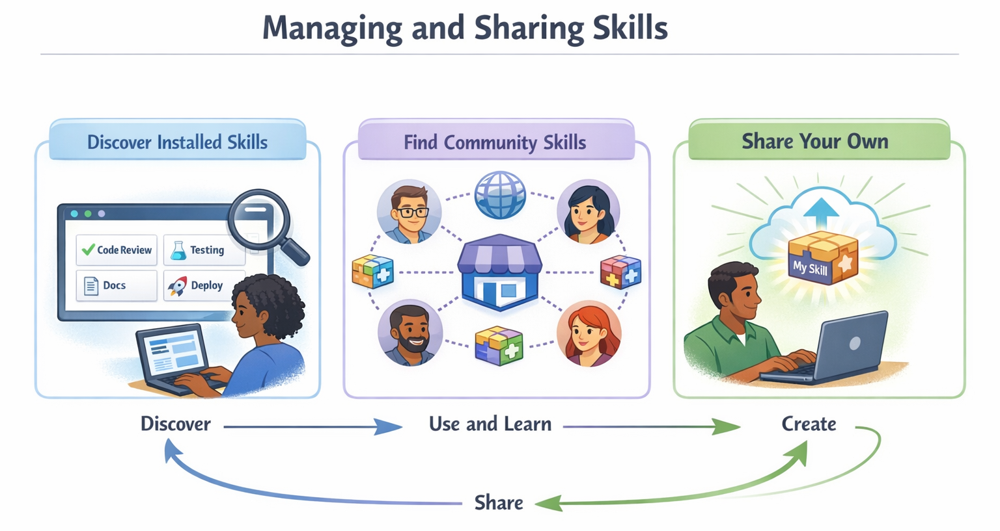

<!--
---
id: CopilotCLI-05
title: !translate Automatizar tareas repetitivas
description: !translate Crear y usar Habilidades de Agente para que GitHub Copilot CLI pueda aplicar automáticamente instrucciones específicas de la tarea y las mejores prácticas del equipo.
audience: Desarrolladores / Estudiantes / Usuarios de terminal
slug: automate-repetitive-tasks
weight: 6
---
-->


> **¿Y si Copilot pudiera aplicar automáticamente las mejores prácticas de tu equipo sin que tengas que explicarlas cada vez?**

En este capítulo aprenderás sobre las Habilidades de Agente: carpetas de instrucciones que Copilot carga automáticamente cuando son relevantes para tu tarea. Mientras que los agentes cambian *cómo* piensa Copilot, las habilidades le enseñan a Copilot *formas específicas de completar tareas*. Crearás una habilidad de auditoría de seguridad que Copilot aplicará cada vez que preguntes sobre seguridad, construirás criterios de revisión estándar del equipo que garanticen una calidad de código coherente, y aprenderás cómo funcionan las habilidades en Copilot CLI, VS Code y el agente en la nube de GitHub Copilot.


## 🎯 Objetivos de aprendizaje

Al final de este capítulo, podrás:

- Entender cómo funcionan las Habilidades de Agente y cuándo usarlas
- Crear habilidades personalizadas con archivos SKILL.md
- Usar habilidades comunitarias desde repositorios compartidos
- Saber cuándo usar habilidades frente a agentes o MCP

> ⏱️ **Tiempo estimado**: ~55 minutos (20 min de lectura + 35 min prácticos)

---

## 🧩 Analogía del mundo real: Herramientas eléctricas

Un taladro de uso general es útil, pero los accesorios especializados lo hacen más potente. 


Las habilidades funcionan de la misma manera. Al igual que cambiar brocas para distintos trabajos, puedes añadir habilidades a Copilot para diferentes tareas:

| Accesorio de habilidad | Propósito |
|------------|---------|
| `commit` | Generar mensajes de commit coherentes |
| `security-audit` | Comprobar vulnerabilidades OWASP |
| `generate-tests` | Crear tests completos con pytest |
| `code-checklist` | Aplicar estándares de calidad de código del equipo |


*Las habilidades son accesorios especializados que amplían lo que Copilot puede hacer*

---

# Cómo funcionan las habilidades


Aprende qué son las habilidades, por qué importan y cómo se diferencian de los agentes y MCP.

---

## *¿Nuevo en las habilidades?* ¡Empieza aquí!

1. **Consulta qué habilidades ya están disponibles:**
   ```bash
   copilot
   > /skills list
   ```
   Esto muestra todas las habilidades que Copilot puede encontrar, incluidas las **habilidades integradas** que vienen con la propia CLI, además de habilidades de tu proyecto y carpetas personales.

   > 💡 **Habilidades integradas**: La Copilot CLI viene con habilidades preinstaladas. Por ejemplo, la habilidad `customizing-copilot-cloud-agents-environment` proporciona una guía para personalizar el entorno del agente en la nube de Copilot. No necesitas crear ni instalar nada para usarlas. Ejecuta `/skills list` para ver lo que está disponible.

2. **Mira un archivo de habilidad real:** Consulta nuestro [code-checklist SKILL.md](../../../.github/skills/code-checklist/SKILL.md) proporcionado para ver el patrón. Es solo frontmatter YAML más instrucciones en markdown.

3. **Entiende el concepto central:** Las habilidades son instrucciones específicas de la tarea que Copilot carga *automáticamente* cuando tu petición coincide con la descripción de la habilidad. No necesitas activarlas, simplemente pregunta de forma natural.


## Comprender las habilidades

Las Habilidades de Agente son carpetas que contienen instrucciones, scripts y recursos que Copilot **carga automáticamente cuando son relevantes** para tu tarea. Copilot lee tu solicitud, comprueba si alguna habilidad coincide y aplica las instrucciones relevantes automáticamente.

```bash
copilot

> Check books.py against our quality checklist
# Copilot detecta que esto coincide con tu habilidad "code-checklist"
# y aplica automáticamente su lista de verificación de calidad para Python

> Generate tests for the BookCollection class
# Copilot carga tu habilidad "pytest-gen"
# y aplica tu estructura de pruebas preferida

> What are the code quality issues in this file?
# Copilot carga tu habilidad "code-checklist"
# y verifica que cumpla con los estándares de tu equipo
```

> 💡 **Idea clave**: Las habilidades se **activan automáticamente** cuando tu petición coincide con la descripción de la habilidad. Simplemente pregunta de forma natural y Copilot aplica las habilidades relevantes en segundo plano. También puedes invocar habilidades directamente, lo cual aprenderás a continuación.

> 🧰 **Plantillas listas para usar**: Revisa la carpeta [.github/skills](../../../.github/skills) para ver habilidades sencillas que puedes copiar y pegar y probar.

### Invocación directa con comando slash

Aunque el auto-desencadenamiento es la forma principal en que funcionan las habilidades, también puedes **invocarlas directamente** usando su nombre como comando slash:

```bash
> /generate-tests Create tests for the user authentication module

> /code-checklist Check books.py for code quality issues

> /security-audit Check the API endpoints for vulnerabilities
```

Esto te da control explícito cuando quieres asegurarte de que se use una habilidad específica.

#### Combinar múltiples habilidades en un solo mensaje

Puedes invocar **más de una habilidad en un solo mensaje**, y el comando slash de la habilidad puede aparecer en cualquier parte de tu petición, no solo al principio. Esto es útil cuando quieres realizar dos comprobaciones distintas de una sola vez:

```bash
> Check @samples/book-app-project/book_app.py with /code-checklist and also run /generate-tests for it

> Review the auth module /security-audit then /code-checklist the result
```

Copilot aplicará cada habilidad nombrada en la misma respuesta, evitando que tengas que enviar múltiples mensajes separados.

> 💡 **Consejo**: Coloca los comandos slash de las habilidades donde se sientan más naturales en tu frase. Puedes ponerlos al inicio, en medio o al final de tu mensaje.

> 📝 **Invocación: habilidades vs agentes**: No confundas la invocación de una habilidad con la de un agente:
> - **Habilidades**: `/skill-name <prompt>`, p. ej., `/code-checklist Revisa este archivo`
> - **Agentes**: `/agent` (seleccionar de la lista) o `copilot --agent <name>` (línea de comandos)
>
> Si tienes tanto una habilidad como un agente con el mismo nombre (p. ej., "code-reviewer"), escribir `/code-reviewer` invoca la **habilidad**, no el agente.

### ¿Cómo sé que se usó una habilidad?

Puedes preguntar a Copilot directamente:

```bash
> What skills did you use for that response?

> What skills do you have available for security reviews?
```

### Habilidades vs Agentes vs MCP

Las habilidades son solo una pieza del modelo de extensibilidad de GitHub Copilot. Aquí se muestran cómo se comparan con los agentes y los servidores MCP.

> *No te preocupes por MCP todavía. Lo cubriremos en [Capítulo 06](../../../06-mcp-servers). Se incluye aquí para que puedas ver cómo encajan las habilidades en el panorama general.*


| Característica | Qué hace | Cuándo usarla |
|---------|--------------|-------------|
| **Agentes** | Cambian cómo piensa la IA | Requieren experiencia especializada en múltiples tareas |
| **Habilidades** | Proporcionan instrucciones específicas por tarea | Tareas concretas y repetibles con pasos detallados |
| **MCP** | Conecta servicios externos | Cuando necesitas datos en vivo de APIs |

Usa agentes para experiencia amplia, habilidades para instrucciones específicas de tareas y MCP para datos externos. Un agente puede usar una o más habilidades durante una conversación. Por ejemplo, cuando le pides a un agente que revise tu código, podría aplicar automáticamente tanto la habilidad `security-audit` como la habilidad `code-checklist`.

> 📚 **Más información**: Consulta la documentación oficial [Acerca de las Habilidades de Agente](https://docs.github.com/copilot/concepts/agents/about-agent-skills) para la referencia completa sobre formatos de habilidades y buenas prácticas.

---

## De las indicaciones manuales a la experiencia automática

Antes de profundizar en cómo crear habilidades, veamos *por qué* vale la pena aprenderlas. Una vez que veas las mejoras en consistencia, el "cómo" tendrá más sentido.

### Antes de las habilidades: revisiones inconsistentes

En cada revisión de código, podrías olvidar algo:

```bash
copilot

> Review this code for issues
# Revisión genérica: podría pasar por alto las preocupaciones específicas de su equipo
```

O escribes una indicación larga cada vez:

```bash
> Review this code checking for bare except clauses, missing type hints,
> mutable default arguments, missing context managers for file I/O,
> functions over 50 lines, print statements in production code...
```

Tiempo: **30+ segundos** para escribir. Consistencia: **varía según la memoria**.

### Después de las habilidades: mejores prácticas automáticas

Con una habilidad `code-checklist` instalada, simplemente pregunta de forma natural:

```bash
copilot

> Check the book collection code for quality issues
```

**Qué ocurre entre bastidores**:
1. Copilot detecta "calidad de código" y "problemas" en tu petición
2. Comprueba las descripciones de las habilidades y encuentra que tu habilidad `code-checklist` coincide
3. Carga automáticamente la lista de verificación de calidad de tu equipo
4. Aplica todas las comprobaciones sin que las tengas que enumerar


*Solo pregunta de forma natural. Copilot empareja tu petición con la habilidad adecuada y la aplica automáticamente.*

**Salida**:
```
## Code Checklist: books.py

### Code Quality
- [PASS] All functions have type hints
- [PASS] No bare except clauses
- [PASS] No mutable default arguments
- [PASS] Context managers used for file I/O
- [PASS] Functions are under 50 lines
- [PASS] Variable and function names follow PEP 8

### Input Validation
- [FAIL] User input is not validated - add_book() accepts any year value
- [FAIL] Edge cases not fully handled - empty strings accepted for title/author
- [PASS] Error messages are clear and helpful

### Testing
- [FAIL] No corresponding pytest tests found

### Summary
3 items need attention before merge
```

**La diferencia**: Los estándares de tu equipo se aplican automáticamente, cada vez, sin que tengas que escribirlos.

---

<details>
<summary>🎬 ¡Míralo en acción!</summary>


*La salida de la demostración puede variar. Tu modelo, herramientas y respuestas diferirán de lo que se muestra aquí.*

</details>

---

## Consistencia a escala: habilidad de revisión de PR del equipo

Imagina que tu equipo tiene una lista de verificación de PR de 10 puntos. Sin una habilidad, cada desarrollador debe recordar los 10 puntos, y alguien siempre olvida uno. Con una habilidad `pr-review`, todo el equipo obtiene revisiones consistentes:

```bash
copilot

> Can you review this PR?
```

Copilot carga automáticamente la habilidad `pr-review` de tu equipo y verifica los 10 puntos:

```
PR Review: feature/user-auth

## Security ✅
- No hardcoded secrets
- Input validation present
- No bare except clauses

## Code Quality ⚠️
- [WARN] print statement on line 45 - remove before merge
- [WARN] TODO on line 78 missing issue reference
- [WARN] Missing type hints on public functions

## Testing ✅
- New tests added
- Edge cases covered

## Documentation ❌
- [FAIL] Breaking change not documented in CHANGELOG
- [FAIL] API changes need OpenAPI spec update
```

**El poder**: Cada miembro del equipo aplica los mismos estándares automáticamente. Los nuevos empleados no necesitan memorizar la lista de verificación porque la habilidad lo gestiona.

---

# Crear habilidades personalizadas


Crea tus propias habilidades desde archivos SKILL.md.

---

## Ubicaciones de las habilidades

Las habilidades se almacenan en `.github/skills/` (específicas del proyecto) o en `~/.copilot/skills/` (a nivel de usuario).

### Cómo Copilot encuentra las habilidades

Copilot escanea automáticamente estas ubicaciones en busca de habilidades:

| Ubicación | Alcance |
|----------|-------|
| `.github/skills/` | Específico del proyecto (compartido con el equipo vía git) |
| `~/.copilot/skills/` | Específico del usuario (tus habilidades personales) |

### Estructura de la habilidad

Cada habilidad vive en su propia carpeta con un archivo `SKILL.md`. Opcionalmente puedes incluir scripts, ejemplos u otros recursos:

```
.github/skills/
└── my-skill/
    ├── SKILL.md           # Required: Skill definition and instructions
    ├── examples/          # Optional: Example files Copilot can reference
    │   └── sample.py
    └── scripts/           # Optional: Scripts the skill can use
        └── validate.sh
```

> 💡 **Consejo**: El nombre del directorio debe coincidir con el `name` en el frontmatter de tu SKILL.md (minúsculas con guiones).

### Formato de SKILL.md

Las habilidades usan un formato simple en markdown con frontmatter YAML:

```markdown
---
name: code-checklist
description: Comprehensive code quality checklist with security, performance, and maintainability checks
license: MIT
---

# Code Checklist

When checking code, look for:

## Security
- SQL injection vulnerabilities
- XSS vulnerabilities
- Authentication/authorization issues
- Sensitive data exposure

## Performance
- N+1 query problems (running one query per item instead of one query for all items)
- Unnecessary loops or computations
- Memory leaks
- Blocking operations

## Maintainability
- Function length (flag functions > 50 lines)
- Code duplication
- Missing error handling
- Unclear naming

## Output Format
Provide issues as a numbered list with severity:
- [CRITICAL] - Must fix before merge
- [HIGH] - Should fix before merge
- [MEDIUM] - Should address soon
- [LOW] - Nice to have
```

**Propiedades YAML:**

| Propiedad | Requerida | Descripción |
|----------|----------|-------------|
| `name` | **Sí** | Identificador único (minúsculas, guiones en lugar de espacios) |
| `description` | **Sí** | Qué hace la habilidad y cuándo Copilot debe usarla |
| `license` | No | Licencia que se aplica a esta habilidad |
| `argument-hint` | No | Breve pista que se muestra a los usuarios describiendo qué argumento espera la habilidad (p. ej., `"ruta de archivo o fragmento de código"`) |

> 💡 **¿Qué es `argument-hint`?** Cuando los usuarios invocan una habilidad directamente (p. ej., `/security-audit`), el texto `argument-hint` aparece como un marcador de posición que muestra qué escribir a continuación — como una mini ayuda. Por ejemplo, configurar `argument-hint: "ruta de archivo a revisar"` indica al usuario que proporcione una ruta de archivo después del nombre de la habilidad.

> 📖 **Documentación oficial**: [Acerca de las Habilidades de Agente](https://docs.github.com/copilot/concepts/agents/about-agent-skills)

### Creando tu primera habilidad

Construyamos una habilidad de auditoría de seguridad que compruebe las vulnerabilidades del OWASP Top 10:

```bash
# Crear directorio de la habilidad
mkdir -p .github/skills/security-audit

# Crear el archivo SKILL.md
cat > .github/skills/security-audit/SKILL.md << 'EOF'
---
name: security-audit
description: Security-focused code review checking OWASP (Open Web Application Security Project) Top 10 vulnerabilities
---

# Auditoría de seguridad

Perform a security audit checking for:

## Vulnerabilidades de inyección
- SQL injection (string concatenation in queries)
- Command injection (unsanitized shell commands)
- LDAP injection
- XPath injection

## Problemas de autenticación
- Hardcoded credentials
- Weak password requirements
- Missing rate limiting
- Session management flaws

## Datos sensibles
- Plaintext passwords
- API keys in code
- Logging sensitive information
- Missing encryption

## Control de acceso
- Missing authorization checks
- Insecure direct object references
- Path traversal vulnerabilities

## Salida
For each issue found, provide:
1. File and line number
2. Vulnerability type
3. Severity (CRITICAL/HIGH/MEDIUM/LOW)
4. Recommended fix
EOF

# Prueba tu habilidad (las habilidades se cargan automáticamente según tu prompt)
copilot

> @samples/book-app-project/ Check this code for security vulnerabilities
# Copilot detecta coincidencias de 'vulnerabilidades de seguridad' con tu habilidad
# y aplica automáticamente su lista de verificación OWASP
```

**Salida esperada** (tus resultados pueden variar):

```
Security Audit: book-app-project

[HIGH] Hardcoded file path (book_app.py, line 12)
  File path is hardcoded rather than configurable
  Fix: Use environment variable or config file

[MEDIUM] No input validation (book_app.py, line 34)
  User input passed directly to function without sanitization
  Fix: Add input validation before processing

✅ No SQL injection found
✅ No hardcoded credentials found
```

---

## Escribir buenas descripciones de habilidades

¡El campo `description` en tu SKILL.md es crucial! Es como Copilot decide si cargar tu habilidad:

```markdown
---
name: security-audit
description: Use for security reviews, vulnerability scanning,
  checking for SQL injection, XSS, authentication issues,
  OWASP Top 10 vulnerabilities, and security best practices
---
```

> 💡 **Consejo**: Incluye palabras clave que coincidan con la forma en que preguntas de manera natural. Si dices "revisión de seguridad", incluye "revisión de seguridad" en la descripción.

### Combinar habilidades con agentes

Las habilidades y los agentes funcionan juntos. El agente aporta experiencia, la habilidad aporta instrucciones específicas:

```bash
# Empieza con un agente revisor de código
copilot --agent code-reviewer

> Check the book app for quality issues
# la experiencia del agente revisor de código se combina
# con la lista de comprobación de tu habilidad code-checklist
```

---

# Gestionar y compartir habilidades

Descubre habilidades instaladas, encuentra habilidades comunitarias y comparte las tuyas.



---

## Managing Skills with the `copilot skill` Command and `/skills`

La Copilot CLI te ofrece dos maneras de gestionar habilidades. Puedes hacerlo directamente desde el terminal antes de iniciar Copilot o desde dentro de una sesión de Copilot.

### Opción 1: `copilot skill` (comando de terminal)

El subcomando `copilot skill` te permite gestionar habilidades directamente desde tu terminal, sin abrir una sesión interactiva de Copilot. Esto es útil para scripting, comprobaciones rápidas o para añadir habilidades antes de empezar a trabajar.

```bash
# Ver todas las habilidades instaladas
copilot skill list

# Agregar una habilidad desde un archivo local, URL o directorio
copilot skill add .github/skills/my-skill/SKILL.md
copilot skill add https://example.com/skills/security-audit/SKILL.md

# Eliminar una habilidad por su nombre
copilot skill remove security-audit
```

### Opción 2: `/skills` (dentro de la sesión de Copilot)

Una vez que estés en una sesión interactiva de Copilot, usa `/skills` (o su atajo `/skill`) para gestionar habilidades sin salir:

| Comando | Qué hace |

|---------|--------------|
| `/skills list` | Mostrar todas las habilidades instaladas |
| `/skills info <name>` | Obtener detalles sobre una habilidad específica |
| `/skills add <name>` | Habilitar una habilidad (desde un repositorio o marketplace) |
| `/skills remove <name>` | Deshabilitar o desinstalar una habilidad |
| `/skills reload` | Recargar las habilidades después de editar archivos SKILL.md |

> 💡 **`/skill` shortcut**: Puedes escribir `/skill` en lugar de `/skills` — son intercambiables. Por ejemplo, `/skill list` funciona igual que `/skills list`.

> 💡 **Recuerda**: No necesitas "activar" las skills para cada prompt. Una vez instaladas, las skills se **activan automáticamente** cuando tu prompt coincide con su descripción. Estos comandos sirven para gestionar qué skills están disponibles, no para usarlas.

### Example: View Your Skills

```bash
# Desde la terminal (no se necesita sesión interactiva):
copilot skill list

Available skills:
- security-audit: Security-focused code review checking OWASP Top 10
- generate-tests: Generate comprehensive unit tests with edge cases
- code-checklist: Team code quality checklist
...

# O desde dentro de una sesión de Copilot:
copilot

> /skills list

Available skills:
- security-audit: Security-focused code review checking OWASP Top 10
- generate-tests: Generate comprehensive unit tests with edge cases
- code-checklist: Team code quality checklist
...

> /skills info security-audit

Skill: security-audit
Source: Project
Location: .github/skills/security-audit/SKILL.md
Description: Security-focused code review checking OWASP Top 10 vulnerabilities
```

---

<details>
<summary>¡Míralo en acción!</summary>


*La salida de la demostración varía. Tu modelo, herramientas y respuestas diferirán de lo que se muestra aquí.*

</details>

---

### When to Use `/skills reload`

Después de crear o editar el archivo SKILL.md de una skill, ejecuta `/skills reload` para aplicar los cambios sin reiniciar Copilot:

```bash
# Edita tu archivo de habilidad
# Luego en Copilot:
> /skills reload
Skills reloaded successfully.
```

> 💡 **Buen dato**: Las skills siguen siendo efectivas incluso después de usar `/compact` para resumir el historial de conversación. No es necesario recargar después de compactar.

---

## Finding and Using Community Skills

### Using Plugins to Install Skills

> 💡 **¿Qué son los plugins?** Los plugins son paquetes instalables que pueden agrupar skills, agents y configuraciones de servidores MCP. Piénsalos como extensiones de "app store" para Copilot CLI.

El comando `/plugin` te permite explorar e instalar estos paquetes:

```bash
copilot

> /plugin list
# Muestra los complementos instalados

> /plugin marketplace
# Examinar complementos disponibles

> /plugin install <plugin-name>
# Instalar un complemento desde el mercado de complementos
```

Para mantener tu catálogo local de plugins actualizado, actualízalo con:

```bash
copilot plugin marketplace update
```

Los plugins pueden agrupar múltiples capacidades. Un solo plugin podría incluir skills, agents y configuraciones de servidores MCP relacionados que funcionen en conjunto.

### Community Skill Repositories

También hay skills preconstruidas disponibles en repositorios de la comunidad:

- **[Awesome Copilot](https://github.com/github/awesome-copilot)** - Recursos oficiales de GitHub Copilot que incluyen documentación y ejemplos de skills

### Installing a Community Skill with GitHub CLI

La forma más sencilla de instalar una skill desde un repositorio de GitHub es usando el comando `gh skill install` (requiere [GitHub CLI v2.90.0+](https://github.blog/changelog/2026-04-16-manage-agent-skills-with-github-cli/)):

```bash
# Explorar y seleccionar interactivamente una habilidad de awesome-copilot
gh skill install github/awesome-copilot

# O instalar una habilidad específica directamente
gh skill install github/awesome-copilot ai-ready

# Instalar para uso personal en todos los proyectos (ámbito de usuario)
gh skill install github/awesome-copilot ai-ready --scope user
```

> ⚠️ **Revisa antes de instalar**: Siempre lee el `SKILL.md` de una skill antes de instalarla. Las skills controlan lo que hace Copilot, y una skill maliciosa podría indicarle ejecutar comandos dañinos o modificar código de maneras inesperadas.

---

# Practice


Aplica lo que has aprendido construyendo y probando tus propias skills.

---

## ▶️ Try It Yourself

### Build More Skills

Aquí hay dos skills más que muestran diferentes patrones. Sigue el mismo flujo de trabajo `mkdir` + `cat` de "Creando tu primera skill" arriba o copia y pega las skills en la ubicación adecuada. Más ejemplos están disponibles en [.github/skills](../../../.github/skills).

### pytest Test Generation Skill

Una skill que asegura una estructura consistente de pytest en tu base de código:

```bash
mkdir -p .github/skills/pytest-gen

cat > .github/skills/pytest-gen/SKILL.md << 'EOF'
---
name: pytest-gen
description: Generate comprehensive pytest tests with fixtures and edge cases
---

# Generación de pruebas de pytest

Generate pytest tests that include:

## Estructura de pruebas
- Use pytest conventions (test_ prefix)
- One assertion per test when possible
- Clear test names describing expected behavior
- Use fixtures for setup/teardown

## Cobertura
- Happy path scenarios
- Edge cases: None, empty strings, empty lists
- Boundary values
- Error scenarios with pytest.raises()

## Fixtures
- Use @pytest.fixture for reusable test data
- Use tmpdir/tmp_path for file operations
- Mock external dependencies with pytest-mock

## Salida
Provide complete, runnable test file with proper imports.
EOF
```

### Team PR Review Skill

Una skill que hace cumplir estándares consistentes de revisión de PR en tu equipo:

```bash
mkdir -p .github/skills/pr-review

cat > .github/skills/pr-review/SKILL.md << 'EOF'
---
name: pr-review
description: Team-standard PR review checklist
---

# Revisión de PR

Review code changes against team standards:

## Lista de verificación de seguridad
- [ ] No hardcoded secrets or API keys
- [ ] Input validation on all user data
- [ ] No bare except clauses
- [ ] No sensitive data in logs

## Calidad del código
- [ ] Functions under 50 lines
- [ ] No print statements in production code
- [ ] Type hints on public functions
- [ ] Context managers for file I/O
- [ ] No TODOs without issue references

## Pruebas
- [ ] New code has tests
- [ ] Edge cases covered
- [ ] No skipped tests without explanation

## Documentación
- [ ] API changes documented
- [ ] Breaking changes noted
- [ ] README updated if needed

## Formato de salida
Provide results as:
- ✅ PASS: Items that look good
- ⚠️ WARN: Items that could be improved
- ❌ FAIL: Items that must be fixed before merge
EOF
```

### Go Further

1. **Desafío de creación de skills**: Crea una skill `quick-review` que haga una lista de verificación de 3 puntos:
   - Cláusulas except sin especificar
   - Faltan anotaciones de tipo
   - Nombres de variables poco claros

   Pruébala pidiendo: "Haz una revisión rápida de books.py"

2. **Comparación de skills**: Cronométrate escribiendo manualmente un prompt detallado de revisión de seguridad. Luego simplemente pide "Check for security issues in this file" y deja que tu skill de auditoría de seguridad se cargue automáticamente. ¿Cuánto tiempo ahorró la skill?

3. **Desafío de skills para el equipo**: Piensa en la lista de verificación de revisión de código de tu equipo. ¿Podrías codificarla como una skill? Anota 3 cosas que la skill debería comprobar siempre.

**Autoevaluación**: Entiendes las skills cuando puedes explicar por qué el campo `description` importa (es como Copilot decide si cargar tu skill).

---

## 📝 Assignment

### Main Challenge: Build a Book Summary Skill

Los ejemplos anteriores crearon las skills `pytest-gen` y `pr-review`. Ahora practica creando un tipo de skill completamente distinto: uno para generar salida formateada a partir de datos.

1. Haz una lista de tus skills actuales: Ejecuta Copilot y pásale `/skills list`. También puedes usar `ls .github/skills/` para ver las skills del proyecto o `ls ~/.copilot/skills/` para las personales.
2. Crea una skill `book-summary` en `.github/skills/book-summary/SKILL.md` que genere un resumen en Markdown formateado de la colección de libros
3. Tu skill debe tener:
   - Nombre y descripción claros (¡la descripción es crucial para el emparejamiento!)
   - Reglas de formato específicas (p. ej., tabla en markdown con título, autor, año, estado de lectura)
   - Convenciones de salida (p. ej., usar ✅/❌ para estado de lectura, ordenar por año)
4. Prueba la skill: `@samples/book-app-project/data.json Summarize the books in this collection`
5. Verifica que la skill se active automáticamente comprobando `/skills list`
6. Intenta invocarla directamente con `/book-summary Summarize the books in this collection`

**Criterios de éxito**: Tienes una skill `book-summary` funcionando que Copilot aplica automáticamente cuando preguntas sobre la colección de libros.

<details>
<summary>💡 Sugerencias (haz clic para expandir)</summary>

**Plantilla inicial**: Crea `.github/skills/book-summary/SKILL.md`:

```markdown
---
name: book-summary
description: Generate a formatted markdown summary of a book collection
---

# Book Summary Generator

Generate a summary of the book collection following these rules:

1. Output a markdown table with columns: Title, Author, Year, Status
2. Use ✅ for read books and ❌ for unread books
3. Sort by year (oldest first)
4. Include a total count at the bottom
5. Flag any data issues (missing authors, invalid years)

Example:
| Title | Author | Year | Status |
|-------|--------|------|--------|
| 1984 | George Orwell | 1949 | ✅ |
| Dune | Frank Herbert | 1965 | ❌ |

**Total: 2 books (1 read, 1 unread)**
```

**Pruébala:**
```bash
copilot
> @samples/book-app-project/data.json Summarize the books in this collection
# La habilidad debería activarse automáticamente en función de la coincidencia de la descripción.
```

**Si no se activa:** Prueba `/skills reload` y luego pregunta de nuevo.

</details>

### Bonus Challenge: Commit Message Skill

1. Crea una skill `commit-message` que genere mensajes de commit convencionales con un formato consistente
2. Pruébala poniendo en stage un cambio y pidiendo: "Generate a commit message for my staged changes"
3. Documenta tu skill y compártela en GitHub con el tema `copilot-skill`

---

<details>
<summary>🔧 <strong>Errores comunes y solución de problemas</strong> (haz clic para expandir)</summary>

### Errores comunes

| Error | Qué ocurre | Solución |
|---------|--------------|-----|
| Nombrar el archivo con otro nombre que no sea `SKILL.md` | La skill no será reconocida | El archivo debe llamarse exactamente `SKILL.md` |
| Campo `description` vago | La skill nunca se carga automáticamente | La descripción es el mecanismo PRINCIPAL de descubrimiento. Usa palabras clave específicas |
| Falta `name` o `description` en el frontmatter | La skill falla al cargarse | Añade ambos campos en el frontmatter YAML |
| Ubicación de carpeta incorrecta | Skill no encontrada | Usa `.github/skills/skill-name/` (proyecto) o `~/.copilot/skills/skill-name/` (personal) |

### Solución de problemas

**Skill no utilizada** - Si Copilot no está usando tu skill cuando se espera:

1. **Revisa la descripción**: ¿Coincide con la forma en que preguntas?
   ```markdown
   # Bad: Too vague
   description: Reviews code

   # Good: Includes trigger words
   description: Use for code reviews, checking code quality,
     finding bugs, security issues, and best practice violations
   ```

2. **Verifica la ubicación del archivo**:
   ```bash
   # Habilidades del proyecto
   ls .github/skills/

   # Habilidades del usuario
   ls ~/.copilot/skills/
   ```

3. **Revisa el formato de SKILL.md**: El frontmatter es obligatorio:
   ```markdown
   ---
   name: skill-name
   description: What the skill does and when to use it
   ---

   # Instructions here
   ```

**Skill no aparece** - Verifica la estructura de carpetas:
```
.github/skills/
└── my-skill/           # Folder name
    └── SKILL.md        # Must be exactly SKILL.md (case-sensitive)
```

Ejecuta `/skills reload` después de crear o editar skills para asegurarte de que se apliquen los cambios.

**Probar si una skill se carga** - Pregunta a Copilot directamente:
```bash
> What skills do you have available for checking code quality?
# Copilot describirá las habilidades relevantes que encontró
```

**¿Cómo sé si mi skill realmente está funcionando?**

1. **Revisa el formato de salida**: Si tu skill especifica un formato de salida (como etiquetas `[CRITICAL]`), búscalo en la respuesta
2. **Pregunta directamente**: Después de obtener una respuesta, pregunta "Did you use any skills for that?"
3. **Compara con/sin**: Prueba el mismo prompt con `--no-custom-instructions` para ver la diferencia:
   ```bash
   # Con habilidades
   copilot --allow-all -p "Review @file.py for security issues"

   # Sin habilidades (comparación de referencia)
   copilot --allow-all -p "Review @file.py for security issues" --no-custom-instructions
   ```
4. **Comprueba verificaciones específicas**: Si tu skill incluye verificaciones específicas (como "functions over 50 lines"), mira si aparecen en la salida

</details>

---

# Summary

## 🔑 Key Takeaways

1. **Las skills son automáticas**: Copilot las carga cuando tu prompt coincide con la descripción de la skill
2. **Invocación directa**: También puedes invocar skills directamente con `/skill-name` como un comando slash
3. **SKILL.md formato**: Frontmatter YAML (name, description, optional license, argument-hint) más instrucciones en markdown
4. **La ubicación importa**: `.github/skills/` para compartir en proyecto/equipo, `~/.copilot/skills/` para uso personal
5. **La descripción es clave**: Escribe descripciones que coincidan con la forma en que consultas de manera natural
6. **Dos formas de gestionar skills**: Usa `copilot skill` desde la terminal o `/skills` (atajo: `/skill`) dentro de una sesión

> 📋 **Referencia rápida**: Consulta la [referencia de comandos del CLI de GitHub Copilot](https://docs.github.com/en/copilot/reference/cli-command-reference) para obtener una lista completa de comandos y atajos.

---

## ➡️ What's Next

Las skills amplían lo que Copilot puede hacer con instrucciones cargadas automáticamente. ¿Pero qué hay de conectarse a servicios externos? Ahí es donde entra MCP.

En **[Capítulo 06: MCP Servers](../06-mcp-servers/README.md)**, aprenderás:

- Qué es MCP (Model Context Protocol)
- Conexión a GitHub, sistema de archivos y servicios de documentación
- Configuración de servidores MCP
- Flujos de trabajo multi-servidor

---

**[← Volver al Capítulo 04](../04-agents-custom-instructions/README.md)** | **[Continuar al Capítulo 06 →](../06-mcp-servers/README.md)**

---

<!-- CO-OP TRANSLATOR DISCLAIMER START -->
**Descargo de responsabilidad**:
Este documento ha sido traducido utilizando el servicio de traducción automática [Co-op Translator](https://github.com/Azure/co-op-translator). Aunque nos esforzamos por la precisión, tenga en cuenta que las traducciones automatizadas pueden contener errores o inexactitudes. El documento original en su idioma nativo debe considerarse la fuente autorizada. Para información crítica, se recomienda una traducción profesional humana. No somos responsables de cualquier malentendido o interpretación errónea que surja del uso de esta traducción.
<!-- CO-OP TRANSLATOR DISCLAIMER END -->