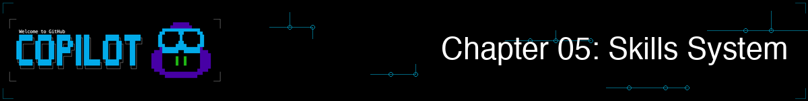
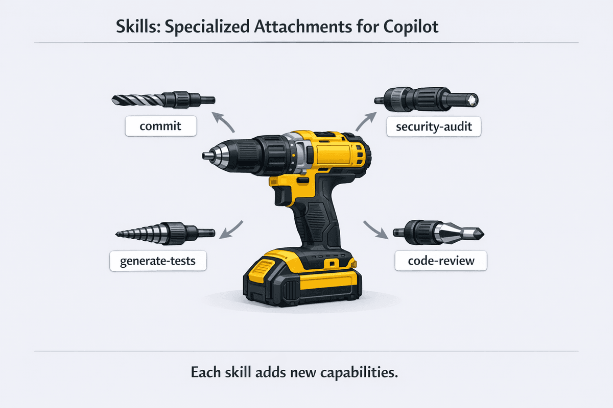
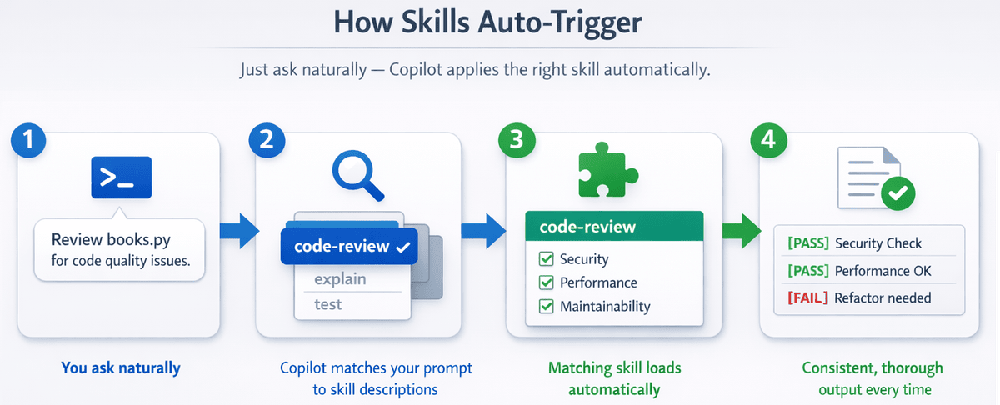

<!--
---
id: CopilotCLI-05
title: !translate Automatizar tareas repetitivas
description: !translate Crea y usa Agent Skills para que GitHub Copilot CLI pueda aplicar automáticamente instrucciones específicas de tareas y las mejores prácticas del equipo.
audience: Desarrolladores / Estudiantes / Usuarios de terminal
slug: automate-repetitive-tasks
weight: 6
---
-->



> **¿Y si Copilot pudiera aplicar automáticamente las mejores prácticas de tu equipo sin que tengas que explicarlas cada vez?**

En este capítulo, aprenderás sobre Agent Skills: carpetas de instrucciones que Copilot carga automáticamente cuando son relevantes para tu tarea. Mientras que los agentes cambian *cómo* piensa Copilot, las habilidades le enseñan *maneras específicas de completar tareas*. Crearás una skill de auditoría de seguridad que Copilot aplicará siempre que preguntes sobre seguridad, establecerás criterios de revisión estándar del equipo que aseguren una calidad de código consistente y aprenderás cómo funcionan las skills en Copilot CLI, VS Code y el agente en la nube de GitHub Copilot.


## 🎯 Objetivos de aprendizaje

Al final de este capítulo, podrás:

- Entender cómo funcionan las Agent Skills y cuándo usarlas
- Crear skills personalizadas con archivos SKILL.md
- Usar skills de la comunidad desde repositorios compartidos
- Saber cuándo usar skills vs agentes vs MCP

> ⏱️ **Tiempo estimado**: ~55 minutos (20 min de lectura + 35 min práctico)

---

## 🧩 Analogía del mundo real: herramientas eléctricas

Un taladro de uso general es útil, pero los accesorios especializados lo hacen poderoso.



Las skills funcionan de la misma manera. Al igual que cambiar brocas para diferentes trabajos, puedes añadir skills a Copilot para distintas tareas:

| Accesorio de habilidad | Propósito |
|------------|---------|
| `commit` | Generar mensajes de commit consistentes |
| `security-audit` | Comprobar vulnerabilidades OWASP |
| `generate-tests` | Crear pruebas completas con pytest |
| `code-checklist` | Aplicar estándares de calidad de código del equipo |


*Las habilidades son accesorios especializados que amplían lo que Copilot puede hacer*

---

# Cómo funcionan las Skills


Aprende qué son las skills, por qué importan y en qué se diferencian de los agentes y de MCP.

---

## *¿Nuevo en las habilidades?* ¡Comienza aquí!

1. **Ver qué habilidades ya están disponibles:**
   ```bash
   copilot
   > /skills list
   ```
   Esto muestra todas las skills que Copilot puede encontrar, incluidas las **habilidades integradas** que vienen con la propia CLI, además de las skills de tu proyecto y carpetas personales.

   > 💡 **Habilidades integradas**: La Copilot CLI incluye skills preinstaladas por defecto. Por ejemplo, la skill `customizing-copilot-cloud-agents-environment` proporciona una guía para personalizar el entorno del agente en la nube de Copilot. No necesitas crear ni instalar nada para usarlas. Ejecuta `/skills list` para ver lo que hay disponible.

2. **Mira un archivo skill real:** Echa un vistazo a nuestro [code-checklist SKILL.md](../../../.github/skills/code-checklist/SKILL.md) para ver el patrón. Es solo frontmatter YAML más instrucciones en markdown.

3. **Entiende el concepto central:** Las skills son instrucciones específicas de tareas que Copilot carga *automáticamente* cuando tu solicitud coincide con la descripción de la skill. No necesitas activarlas; simplemente pide de forma natural.


## Entendiendo las Skills

Agent Skills son carpetas que contienen instrucciones, scripts y recursos que Copilot **carga automáticamente cuando son relevantes** para tu tarea. Copilot lee tu prompt, verifica si alguna skill coincide y aplica las instrucciones relevantes automáticamente.

```bash
copilot

> Check books.py against our quality checklist
# Copilot detecta que esto coincide con tu habilidad "code-checklist"
# y aplica automáticamente su lista de verificación de calidad para Python

> Generate tests for the BookCollection class
# Copilot carga tu habilidad "pytest-gen"
# y aplica tu estructura de pruebas preferida

> What are the code quality issues in this file?
# Copilot carga tu habilidad "code-checklist"
# y verifica según los estándares de tu equipo
```

> 💡 **Idea clave**: Las skills se **activan automáticamente** en función de que tu prompt coincida con la descripción de la skill. Simplemente pide de forma natural y Copilot aplica las skills relevantes entre bastidores. También puedes invocar las skills directamente, lo que aprenderás a continuación.

> 🧰 **Plantillas listas para usar**: Revisa la carpeta [.github/skills](../../../.github/skills) para encontrar skills simples que puedes copiar y probar.

### Invocación directa con comando slash

Si bien el auto-disparo es la forma principal en que funcionan las skills, también puedes **invocar skills directamente** usando su nombre como comando slash:

```bash
> /generate-tests Create tests for the user authentication module

> /code-checklist Check books.py for code quality issues

> /security-audit Check the API endpoints for vulnerabilities
```

Esto te da control explícito cuando quieres asegurarte de que se use una skill específica.

#### Combinar múltiples skills en un solo mensaje

Puedes invocar **más de una skill en un solo mensaje**, y el comando slash de la skill puede aparecer en cualquier parte de tu prompt — no solo al principio. Esto es útil cuando quieres que se realicen dos comprobaciones diferentes en una sola vez:

```bash
> Check @samples/book-app-project/book_app.py with /code-checklist and also run /generate-tests for it

> Review the auth module /security-audit then /code-checklist the result
```

Copilot aplicará cada skill nombrada en la misma respuesta, ahorrándote el tener que enviar varios mensajes separados.

> 💡 **Consejo**: Coloca los comandos slash de las skills donde suenen más naturales en tu frase. Puedes ponerlos al inicio, en el medio o al final de tu mensaje.

> 📝 **Invocación: Skills vs Agentes**: No confundas la invocación de una skill con la de un agente:
> - **Skills**: `/skill-name <prompt>`, p. ej., `/code-checklist Check this file`
> - **Agentes**: `/agent` (selecciona de la lista) o `copilot --agent <name>` (línea de comandos)
>
> Si tienes tanto una skill como un agente con el mismo nombre (p. ej., "code-reviewer"), escribir `/code-reviewer` invoca la **skill**, no el agente.

### ¿Cómo sé que se usó una skill?

Puedes preguntarle a Copilot directamente:

```bash
> What skills did you use for that response?

> What skills do you have available for security reviews?
```

### Habilidades vs Agentes vs MCP

Las habilidades son solo una pieza del modelo de extensibilidad de GitHub Copilot. Aquí se muestra cómo se comparan con los agentes y los servidores MCP.

> *No te preocupes por MCP todavía. Lo cubriremos en [Capítulo 06](../../../06-mcp-servers). Se incluye aquí para que puedas ver cómo encajan las skills en el conjunto general.*


| Característica | Qué hace | Cuándo usar |
|---------|--------------|-------------|
| **Agentes** | Cambia cómo piensa la IA | Necesitas experiencia especializada en muchas tareas |
| **Habilidades** | Proporciona instrucciones específicas para tareas | Tareas específicas y repetibles con pasos detallados |
| **MCP** | Conecta servicios externos | Necesitas datos en tiempo real desde APIs |

Usa agentes para experiencia amplia, habilidades para instrucciones de tareas específicas y MCP para datos externos. Un agente puede usar una o más habilidades durante una conversación. Por ejemplo, cuando le pides a un agente que revise tu código, podría aplicar automáticamente tanto la habilidad `security-audit` como la habilidad `code-checklist`.

> 📚 **Más información**: Consulta la documentación oficial [Acerca de las habilidades de agentes](https://docs.github.com/copilot/concepts/agents/about-agent-skills) para la referencia completa sobre formatos de habilidades y mejores prácticas.

---

## De indicaciones manuales a experiencia automática

Antes de profundizar en cómo crear habilidades, veamos *por qué* vale la pena aprenderlas. Una vez que veas las mejoras en consistencia, el "cómo" tendrá más sentido.

### Antes de las habilidades: Revisiones inconsistentes

En cada revisión de código, podrías olvidar algo:

```bash
copilot

> Review this code for issues
# Revisión genérica: podría pasar por alto las preocupaciones específicas de su equipo
```

Or you write a long prompt every time:

```bash
> Review this code checking for bare except clauses, missing type hints,
> mutable default arguments, missing context managers for file I/O,
> functions over 50 lines, print statements in production code...
```

Tiempo: **30+ segundos** para escribir. Consistencia: **varía según la memoria**.

### Después de las habilidades: Buenas prácticas automáticas

Con la habilidad `code-checklist` instalada, solo pregunta de forma natural:

```bash
copilot

> Check the book collection code for quality issues
```

**Qué sucede entre bastidores**:
1. Copilot detecta "calidad del código" y "problemas" en tu prompt
2. Revisa las descripciones de las habilidades y encuentra que tu habilidad `code-checklist` coincide
3. Carga automáticamente la lista de verificación de calidad de tu equipo
4. Aplica todas las comprobaciones sin que las enumeres



*Simplemente pregunta de forma natural. Copilot empareja tu prompt con la habilidad adecuada y la aplica automáticamente.*

**Salida**:
```
## Code Checklist: books.py

### Code Quality
- [PASS] All functions have type hints
- [PASS] No bare except clauses
- [PASS] No mutable default arguments
- [PASS] Context managers used for file I/O
- [PASS] Functions are under 50 lines
- [PASS] Variable and function names follow PEP 8

### Input Validation
- [FAIL] User input is not validated - add_book() accepts any year value
- [FAIL] Edge cases not fully handled - empty strings accepted for title/author
- [PASS] Error messages are clear and helpful

### Testing
- [FAIL] No corresponding pytest tests found

### Summary
3 items need attention before merge
```

**La diferencia**: Los estándares de tu equipo se aplican automáticamente, cada vez, sin tener que escribirlos.

---

<details>
<summary>🎬 ¡Míralo en acción!</summary>


*La salida de la demostración varía. Tu modelo, herramientas y respuestas serán diferentes de lo que se muestra aquí.*

</details>

---

## Consistencia a escala: Habilidad de revisión de PR del equipo

Imagina que tu equipo tiene una lista de verificación de PR de 10 puntos. Sin una habilidad, cada desarrollador debe recordar los 10 puntos, y siempre alguien olvida uno. Con la habilidad `pr-review`, todo el equipo obtiene revisiones consistentes:

```bash
copilot

> Can you review this PR?
```

Copilot carga automáticamente la habilidad `pr-review` de tu equipo y verifica los 10 puntos:

```
PR Review: feature/user-auth

## Security ✅
- No hardcoded secrets
- Input validation present
- No bare except clauses

## Code Quality ⚠️
- [WARN] print statement on line 45 - remove before merge
- [WARN] TODO on line 78 missing issue reference
- [WARN] Missing type hints on public functions

## Testing ✅
- New tests added
- Edge cases covered

## Documentation ❌
- [FAIL] Breaking change not documented in CHANGELOG
- [FAIL] API changes need OpenAPI spec update
```

**El poder**: Cada miembro del equipo aplica los mismos estándares automáticamente. Los nuevos contratados no necesitan memorizar la lista de verificación porque la habilidad se encarga.

---

# Creación de habilidades personalizadas


Crea tus propias habilidades a partir de archivos SKILL.md.

---

## Ubicaciones de habilidades

Las habilidades se almacenan en `.github/skills/` (específicas del proyecto) o en `~/.copilot/skills/` (nivel de usuario).

### Cómo Copilot encuentra las habilidades

Copilot escanea automáticamente estas ubicaciones en busca de habilidades:

| Ubicación | Ámbito |
|----------|-------|
| `.github/skills/` | Específico del proyecto (compartido con el equipo vía git) |
| `~/.copilot/skills/` | Específico del usuario (tus habilidades personales) |

### Estructura de la habilidad

Cada habilidad vive en su propia carpeta con un archivo `SKILL.md`. Opcionalmente puedes incluir scripts, ejemplos u otros recursos:

```
.github/skills/
└── my-skill/
    ├── SKILL.md           # Required: Skill definition and instructions
    ├── examples/          # Optional: Example files Copilot can reference
    │   └── sample.py
    └── scripts/           # Optional: Scripts the skill can use
        └── validate.sh
```

> 💡 **Consejo**: El nombre del directorio debe coincidir con el `name` en el frontmatter de tu SKILL.md (minúsculas con guiones).

### Formato de SKILL.md

Las habilidades usan un formato sencillo en markdown con frontmatter YAML:

```markdown
---
name: code-checklist
description: Comprehensive code quality checklist with security, performance, and maintainability checks
license: MIT
---

# Code Checklist

When checking code, look for:

## Security
- SQL injection vulnerabilities
- XSS vulnerabilities
- Authentication/authorization issues
- Sensitive data exposure

## Performance
- N+1 query problems (running one query per item instead of one query for all items)
- Unnecessary loops or computations
- Memory leaks
- Blocking operations

## Maintainability
- Function length (flag functions > 50 lines)
- Code duplication
- Missing error handling
- Unclear naming

## Output Format
Provide issues as a numbered list with severity:
- [CRITICAL] - Must fix before merge
- [HIGH] - Should fix before merge
- [MEDIUM] - Should address soon
- [LOW] - Nice to have
```

**Propiedades YAML:**

| Propiedad | Requerido | Descripción |
|----------|----------|-------------|
| `name` | **Sí** | Identificador único (minúsculas, guiones en lugar de espacios) |
| `description` | **Sí** | Qué hace la habilidad y cuándo Copilot debería usarla |
| `license` | No | Licencia que aplica a esta habilidad |
| `argument-hint` | No | Sugerencia corta mostrada a los usuarios describiendo qué argumento espera la habilidad (p. ej., `"ruta de archivo o fragmento de código"`) |

> 💡 **¿Qué es `argument-hint`?** Cuando los usuarios invocan una habilidad directamente (p. ej., `/security-audit`), el texto `argument-hint` aparece como un placeholder que muestra qué escribir a continuación — como un mini prompt de ayuda. Por ejemplo, configurar `argument-hint: "ruta de archivo a revisar"` indica al usuario que proporcione una ruta de archivo después del nombre de la habilidad.

> 📖 **Documentación oficial**: [Acerca de las habilidades de agentes](https://docs.github.com/copilot/concepts/agents/about-agent-skills)

### Creando tu primera habilidad

Construyamos una habilidad de auditoría de seguridad que verifique las 10 principales vulnerabilidades OWASP:

```bash
# Crear el directorio de la habilidad
mkdir -p .github/skills/security-audit

# Crear el archivo SKILL.md
cat > .github/skills/security-audit/SKILL.md << 'EOF'
---
name: security-audit
description: Security-focused code review checking OWASP (Open Web Application Security Project) Top 10 vulnerabilities
---

# Auditoría de seguridad

Perform a security audit checking for:

## Vulnerabilidades de inyección
- SQL injection (string concatenation in queries)
- Command injection (unsanitized shell commands)
- LDAP injection
- XPath injection

## Problemas de autenticación
- Hardcoded credentials
- Weak password requirements
- Missing rate limiting
- Session management flaws

## Datos sensibles
- Plaintext passwords
- API keys in code
- Logging sensitive information
- Missing encryption

## Control de acceso
- Missing authorization checks
- Insecure direct object references
- Path traversal vulnerabilities

## Salida
For each issue found, provide:
1. File and line number
2. Vulnerability type
3. Severity (CRITICAL/HIGH/MEDIUM/LOW)
4. Recommended fix
EOF

# Prueba tu habilidad (las habilidades se cargan automáticamente según tu instrucción)
copilot

> @samples/book-app-project/ Check this code for security vulnerabilities
# Copilot detecta "vulnerabilidades de seguridad" que coinciden con tu habilidad
# y aplica automáticamente su lista de verificación OWASP
```

**Salida esperada** (tus resultados pueden variar):

```
Security Audit: book-app-project

[HIGH] Hardcoded file path (book_app.py, line 12)
  File path is hardcoded rather than configurable
  Fix: Use environment variable or config file

[MEDIUM] No input validation (book_app.py, line 34)
  User input passed directly to function without sanitization
  Fix: Add input validation before processing

✅ No SQL injection found
✅ No hardcoded credentials found
```

---

## Escribir buenas descripciones de habilidades

El campo `description` en tu SKILL.md es crucial! ¡Es la forma en que Copilot decide si cargar tu habilidad:

```markdown
---
name: security-audit
description: Use for security reviews, vulnerability scanning,
  checking for SQL injection, XSS, authentication issues,
  OWASP Top 10 vulnerabilities, and security best practices
---
```

> 💡 **Consejo**: Incluye palabras clave que coincidan con cómo preguntas de forma natural. Si dices "security review", incluye "security review" en la descripción.

### Combinando habilidades con agentes

Las habilidades y los agentes trabajan juntos. El agente aporta experiencia, la habilidad ofrece instrucciones específicas:

```bash
# Comienza con un agente revisor de código
copilot --agent code-reviewer

> Check the book app for quality issues
# La experiencia del agente revisor de código se combina
# con la lista de verificación de tu habilidad code-checklist
```

---

# Gestionar y compartir habilidades

Descubre las habilidades instaladas, encuentra habilidades de la comunidad y comparte las tuyas.


---

## Gestión de habilidades con el comando `copilot skill` y `/skills`

La CLI de Copilot te ofrece dos formas de gestionar habilidades. Puedes hacerlo directamente desde la terminal antes de iniciar Copilot o desde dentro de una sesión de Copilot.

### Opción 1: `copilot skill` (comando de terminal)

El subcomando `copilot skill` te permite gestionar habilidades directamente desde tu terminal, sin abrir una sesión interactiva de Copilot. Esto es útil para scripts, comprobaciones rápidas o para añadir habilidades antes de empezar a trabajar.

```bash
# Ver todas las habilidades instaladas
copilot skill list

# Agregar una habilidad desde un archivo local, URL o directorio
copilot skill add .github/skills/my-skill/SKILL.md
copilot skill add https://example.com/skills/security-audit/SKILL.md

# Eliminar una habilidad por nombre
copilot skill remove security-audit
```

### Opción 2: `/skills` (dentro de una sesión de Copilot)

Una vez que estés en una sesión interactiva de Copilot, usa `/skills` (o su atajo `/skill`) para gestionar habilidades sin salir:

| Comando | Qué hace |
|---------|--------------|
| `/skills list` | Mostrar todas las habilidades instaladas |
| `/skills info <name>` | Obtener detalles sobre una habilidad específica |
| `/skills add <name>` | Habilitar una habilidad (desde un repositorio o marketplace) |
| `/skills remove <name>` | Deshabilitar o desinstalar una habilidad |
| `/skills reload` | Recargar habilidades después de editar archivos SKILL.md |

> 💡 **`/skill` shortcut**: You can type `/skill` instead of `/skills` — they're interchangeable. For example, `/skill list` works the same as `/skills list`.

> 💡 **Recuerda**: No necesitas "activar" las habilidades para cada prompt. Una vez instaladas, las habilidades se **activan automáticamente** cuando tu prompt coincide con su descripción. Estos comandos son para administrar qué habilidades están disponibles, no para usarlas.

### Ejemplo: Ver tus habilidades

```bash
# Desde la terminal (no se necesita sesión interactiva):
copilot skill list

Project skills:
- security-audit: Security-focused code review checking OWASP Top 10
- generate-tests: Generate comprehensive unit tests with edge cases
- code-checklist: Team code quality checklist (disabled)
...

# O desde dentro de una sesión de Copilot:
copilot

> /skills list

Project skills:
- security-audit: Security-focused code review checking OWASP Top 10
- generate-tests: Generate comprehensive unit tests with edge cases
- code-checklist: Team code quality checklist (disabled)
...

> /skills info security-audit

Skill: security-audit
Source: Project
Location: .github/skills/security-audit/SKILL.md
Description: Security-focused code review checking OWASP Top 10 vulnerabilities
```

> 💡 **Habilidades deshabilitadas**: Las habilidades marcadas como `(disabled)` están instaladas pero no están activas actualmente. No se activarán por prompts hasta que se vuelvan a habilitar. Esto puede ocurrir si el archivo `SKILL.md` de una habilidad tiene un problema de configuración, o si la habilidad fue deshabilitada explícitamente. Puedes habilitar/deshabilitar habilidades ejecutando `/skills`.

---

<details>
<summary>¡Míralo en acción!</summary>


*La salida de la demostración puede variar. Tu modelo, herramientas y respuestas diferirán de lo mostrado aquí.*

</details>

---

### Cuándo usar `/skills reload`

Después de crear o editar el archivo SKILL.md de una habilidad, ejecuta `/skills reload` para aplicar los cambios sin reiniciar Copilot:

```bash
# Edita el archivo de tu skill
# Luego, en Copilot:
> /skills reload
Skills reloaded successfully.
```

> 💡 **Buen dato**: Las habilidades siguen siendo efectivas incluso después de usar `/compact` para resumir el historial de conversación. No es necesario recargar después de compactar.

---

## Encontrar y usar habilidades de la comunidad

### Usar plugins para instalar habilidades

> 💡 **¿Qué son los plugins?** Los plugins son paquetes instalables que pueden agrupar habilidades, agentes y configuraciones de servidores MCP. Piensa en ellos como extensiones tipo "app store" para Copilot CLI.

El comando `/plugin` te permite explorar e instalar estos paquetes:

```bash
copilot

> /plugin list
# Muestra los plugins instalados

> /plugin marketplace
# Explorar los plugins disponibles

> /plugin install <plugin-name>
# Instalar un plugin desde el marketplace
```

Para mantener tu catálogo local de plugins actualizado, renuévalo con:

```bash
copilot plugin marketplace update
```

Los plugins pueden agrupar múltiples capacidades. Un solo plugin puede incluir habilidades relacionadas, agentes y configuraciones de servidores MCP que funcionen en conjunto.

### Repositorios de habilidades de la comunidad

Habilidades preconstruidas también están disponibles en repositorios de la comunidad:

- **[Awesome Copilot](https://github.com/github/awesome-copilot)** - Recursos oficiales de GitHub Copilot que incluyen documentación y ejemplos de habilidades

### Instalar una habilidad de la comunidad con GitHub CLI

La forma más sencilla de instalar una habilidad desde un repositorio de GitHub es usando el comando `gh skill install` (requiere [GitHub CLI v2.90.0+](https://github.blog/changelog/2026-04-16-manage-agent-skills-with-github-cli/)):

```bash
# Explorar y seleccionar de forma interactiva una habilidad de awesome-copilot
gh skill install github/awesome-copilot

# O instalar directamente una habilidad específica
gh skill install github/awesome-copilot ai-ready

# Instalar para uso personal en todos los proyectos (ámbito de usuario)
gh skill install github/awesome-copilot ai-ready --scope user
```

> ⚠️ **Revisa antes de instalar**: Lee siempre el `SKILL.md` de una habilidad antes de instalarla. Las habilidades controlan lo que hace Copilot, y una habilidad maliciosa podría indicarle ejecutar comandos dañinos o modificar el código de maneras inesperadas.

---

# Práctica


Aplica lo que has aprendido construyendo y probando tus propias habilidades.

---

## ▶️ Pruébalo tú mismo

### Construye más habilidades

Aquí hay dos habilidades más que muestran diferentes patrones. Sigue el mismo flujo de trabajo `mkdir` + `cat` de "Crear tu primera habilidad" arriba o copia y pega las habilidades en la ubicación correspondiente. Más ejemplos están disponibles en [.github/skills](../../../.github/skills).

### Habilidad de generación de pruebas pytest

Una habilidad que asegura una estructura consistente de pytest en tu base de código:

```bash
mkdir -p .github/skills/pytest-gen

cat > .github/skills/pytest-gen/SKILL.md << 'EOF'
---
name: pytest-gen
description: Generate comprehensive pytest tests with fixtures and edge cases
---

# Generación de pruebas pytest

Generate pytest tests that include:

## Estructura de las pruebas
- Use pytest conventions (test_ prefix)
- One assertion per test when possible
- Clear test names describing expected behavior
- Use fixtures for setup/teardown

## Cobertura
- Happy path scenarios
- Edge cases: None, empty strings, empty lists
- Boundary values
- Error scenarios with pytest.raises()

## Fixtures
- Use @pytest.fixture for reusable test data
- Use tmpdir/tmp_path for file operations
- Mock external dependencies with pytest-mock

## Salida
Provide complete, runnable test file with proper imports.
EOF
```

### Habilidad de revisión de PR en equipo

Una habilidad que aplica estándares consistentes de revisión de PR en tu equipo:

```bash
mkdir -p .github/skills/pr-review

cat > .github/skills/pr-review/SKILL.md << 'EOF'
---
name: pr-review
description: Team-standard PR review checklist
---

# Revisión de PR

Review code changes against team standards:

## Lista de verificación de seguridad
- [ ] No hardcoded secrets or API keys
- [ ] Input validation on all user data
- [ ] No bare except clauses
- [ ] No sensitive data in logs

## Calidad del código
- [ ] Functions under 50 lines
- [ ] No print statements in production code
- [ ] Type hints on public functions
- [ ] Context managers for file I/O
- [ ] No TODOs without issue references

## Pruebas
- [ ] New code has tests
- [ ] Edge cases covered
- [ ] No skipped tests without explanation

## Documentación
- [ ] API changes documented
- [ ] Breaking changes noted
- [ ] README updated if needed

## Formato de salida
Provide results as:
- ✅ PASS: Items that look good
- ⚠️ WARN: Items that could be improved
- ❌ FAIL: Items that must be fixed before merge
EOF
```

### Ir más allá

1. **Desafío de creación de habilidades**: Crea una habilidad `quick-review` que haga una lista de verificación de 3 puntos:
   - Cláusulas except vacías
   - Faltan anotaciones de tipo
   - Nombres de variables poco claros

   Pruébala preguntando: "Haz una revisión rápida de books.py"

2. **Comparación de habilidades**: Cronométrate escribiendo manualmente un prompt detallado de revisión de seguridad. Luego simplemente pide "Revisa este archivo en busca de problemas de seguridad" y deja que tu habilidad de auditoría de seguridad se cargue automáticamente. ¿Cuánto tiempo ahorró la habilidad?

3. **Desafío de habilidad en equipo**: Piensa en la lista de verificación de revisión de código de tu equipo. ¿Podrías codificarla como una habilidad? Anota 3 cosas que la habilidad debería comprobar siempre.

**Autoevaluación**: Entiendes las habilidades cuando puedes explicar por qué importa el campo `description` (es como Copilot decide si cargar tu habilidad).

---

## 📝 Tarea

### Desafío principal: Construir una habilidad de resumen de libros

Los ejemplos anteriores crearon las habilidades `pytest-gen` y `pr-review`. Ahora practica creando un tipo de habilidad completamente diferente: una para generar salida formateada a partir de datos.

1. Lista tus habilidades actuales: Ejecuta Copilot y pásale `/skills list`. También puedes usar `ls .github/skills/` para ver las habilidades del proyecto o `ls ~/.copilot/skills/` para habilidades personales.
2. Crea una habilidad `book-summary` en `.github/skills/book-summary/SKILL.md` que genere un resumen en markdown formateado de la colección de libros
3. Tu habilidad debe tener:
   - Nombre y descripción claros (¡la descripción es crucial para la coincidencia!)
   - Reglas de formato específicas (p. ej., tabla markdown con título, autor, año, estado de lectura)
   - Convenciones de salida (p. ej., usar ✅/❌ para el estado de lectura, ordenar por año)
4. Prueba la habilidad: `@samples/book-app-project/data.json Resumir los libros en esta colección`
5. Verifica que la habilidad se active automáticamente comprobando `/skills list`
6. Intenta invocarla directamente con `/book-summary Resumir los libros en esta colección`

**Criterios de éxito**: Tienes una habilidad `book-summary` funcional que Copilot aplica automáticamente cuando preguntas sobre la colección de libros.

<details>
<summary>💡 Pistas (haz clic para expandir)</summary>

**Plantilla inicial**: Crea `.github/skills/book-summary/SKILL.md`:

```markdown
---
name: book-summary
description: Generate a formatted markdown summary of a book collection
---

# Book Summary Generator

Generate a summary of the book collection following these rules:

1. Output a markdown table with columns: Title, Author, Year, Status
2. Use ✅ for read books and ❌ for unread books
3. Sort by year (oldest first)
4. Include a total count at the bottom
5. Flag any data issues (missing authors, invalid years)

Example:
| Title | Author | Year | Status |
|-------|--------|------|--------|
| 1984 | George Orwell | 1949 | ✅ |
| Dune | Frank Herbert | 1965 | ❌ |

**Total: 2 books (1 read, 1 unread)**
```

**Pruébala:**
```bash
copilot
> @samples/book-app-project/data.json Summarize the books in this collection
# La habilidad debería activarse automáticamente en función de la coincidencia con la descripción
```

**Si no se activa:** Intenta `/skills reload` y luego pregunta de nuevo.

</details>

### Desafío adicional: Habilidad de mensaje de commit

1. Crea una habilidad `commit-message` que genere mensajes de commit convencionales con un formato consistente
2. Pruébala preparando un cambio y pidiendo: "Genera un mensaje de commit para mis cambios preparados"
3. Documenta tu habilidad y compártela en GitHub con el topic `copilot-skill`

---

<details>
<summary>🔧 <strong>Errores comunes y solución de problemas</strong> (haz clic para expandir)</summary>

### Errores comunes

| Error | Qué ocurre | Solución |
|---------|--------------|-----|
| Nombrar el archivo con otro nombre distinto a `SKILL.md` | La habilidad no será reconocida | El archivo debe llamarse exactamente `SKILL.md` |
| Campo `description` vago | La habilidad nunca se carga automáticamente | La descripción es el mecanismo PRINCIPAL de descubrimiento. Usa palabras desencadenantes específicas |
| Falta `name` o `description` en el frontmatter | La habilidad no se carga | Añade ambos campos en el frontmatter YAML |
| Ubicación de carpeta incorrecta | Habilidad no encontrada | Usa `.github/skills/skill-name/` (proyecto) o `~/.copilot/skills/skill-name/` (personal) |

### Solución de problemas

**Habilidad no utilizada** - Si Copilot no está usando tu habilidad cuando se espera:

1. **Revisa la descripción**: ¿Coincide con cómo lo estás pidiendo?
   ```markdown
   # Bad: Too vague
   description: Reviews code

   # Good: Includes trigger words
   description: Use for code reviews, checking code quality,
     finding bugs, security issues, and best practice violations
   ```

2. **Verifica la ubicación del archivo**:
   ```bash
   # Habilidades del proyecto
   ls .github/skills/

   # Habilidades del usuario
   ls ~/.copilot/skills/
   ```

3. **Revisa el formato de SKILL.md**: El frontmatter es obligatorio:
   ```markdown
   ---
   name: skill-name
   description: What the skill does and when to use it
   ---

   # Instructions here
   ```

**Habilidad que no aparece** - Verifica la estructura de carpetas:
```
.github/skills/
└── my-skill/           # Folder name
    └── SKILL.md        # Must be exactly SKILL.md (case-sensitive)
```

Ejecuta `/skills reload` después de crear o editar habilidades para asegurar que los cambios sean aplicados.

**Probar si una habilidad se carga** - Pregunta a Copilot directamente:
```bash
> What skills do you have available for checking code quality?
# Copilot describirá las habilidades relevantes que encontró
```

**¿Cómo sé si mi habilidad realmente está funcionando?**

1. **Revisa el formato de salida**: Si tu habilidad especifica un formato de salida (como etiquetas `[CRITICAL]`), búscalo en la respuesta
2. **Pregunta directamente**: Después de obtener una respuesta, pregunta "¿Usaste alguna habilidad para eso?"
3. **Compara con/sin**: Prueba el mismo prompt con `--no-custom-instructions` para ver la diferencia:
   ```bash
   # Con habilidades
   copilot --allow-all -p "Review @file.py for security issues"

   # Sin habilidades (comparación de referencia)
   copilot --allow-all -p "Review @file.py for security issues" --no-custom-instructions
   ```
4. **Comprueba verificaciones específicas**: Si tu habilidad incluye verificaciones específicas (como "funciones de más de 50 líneas"), verifica si aparecen en la salida

</details>

---

# Resumen

## 🔑 Conclusiones clave

1. **Las habilidades son automáticas**: Copilot las carga cuando tu prompt coincide con la descripción de la habilidad
2. **Invocación directa**: También puedes invocar habilidades directamente con `/skill-name` como un comando slash
3. **Formato SKILL.md**: Frontmatter YAML (name, description, optional license, argument-hint) más instrucciones en markdown
4. **La ubicación importa**: `.github/skills/` para compartir en proyecto/equipo, `~/.copilot/skills/` para uso personal
5. **La descripción es clave**: Escribe descripciones que coincidan con cómo preguntas de forma natural
6. **Dos formas de administrar habilidades**: Usa `copilot skill` desde la terminal o `/skills` (acceso directo: `/skill`) dentro de una sesión

> 📋 **Referencia rápida**: Consulta la [referencia de comandos de GitHub Copilot CLI](https://docs.github.com/en/copilot/reference/cli-command-reference) para una lista completa de comandos y atajos.

---

## ➡️ Qué sigue

Las habilidades amplían lo que Copilot puede hacer con instrucciones que se cargan automáticamente. ¿Pero qué pasa con conectarse a servicios externos? Ahí es donde entra MCP.

En **[Capítulo 06: Servidores MCP](../06-mcp-servers/README.md)**, aprenderás:

- Qué es MCP (Model Context Protocol)
- Conectar con GitHub, sistema de archivos y servicios de documentación
- Configurar servidores MCP
- Flujos de trabajo multi-servidor

---

**[← Volver al Capítulo 04](../04-agents-custom-instructions/README.md)** | **[Continuar al Capítulo 06 →](../06-mcp-servers/README.md)**

---

<!-- CO-OP TRANSLATOR DISCLAIMER START -->
**Descargo de responsabilidad**:
Este documento ha sido traducido utilizando el servicio de traducción automática [Co-op Translator](https://github.com/Azure/co-op-translator). Aunque nos esforzamos por la precisión, tenga en cuenta que las traducciones automatizadas pueden contener errores o inexactitudes. El documento original en su idioma nativo debe considerarse la fuente autorizada. Para información crítica, se recomienda una traducción profesional humana. No somos responsables de cualquier malentendido o interpretación errónea que surja del uso de esta traducción.
<!-- CO-OP TRANSLATOR DISCLAIMER END -->