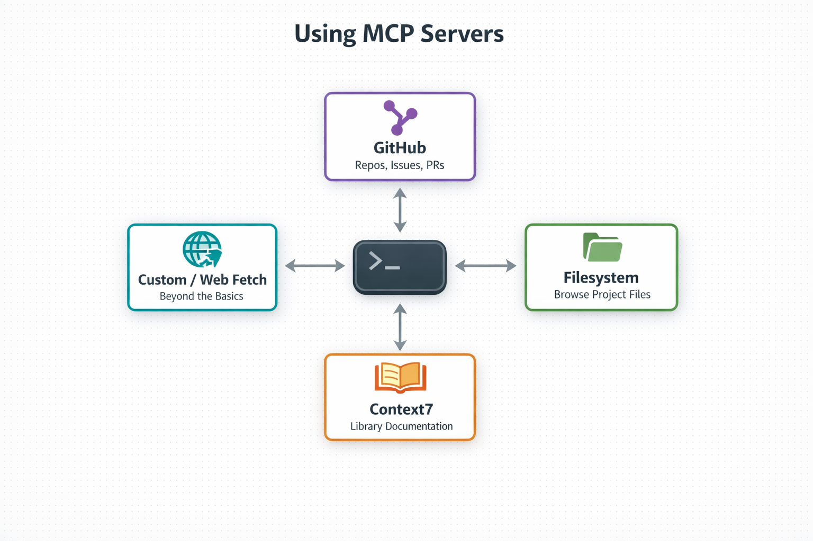

<!--
---
id: CopilotCLI-06
title: !translate Connect to GitHub, Databases, and APIs
description: !translate Configure MCP servers so GitHub Copilot CLI can connect to GitHub, local files, documentation, databases, and other live data sources.
audience: Developers / Students / Terminal users
slug: connect-to-github-databases-and-apis
weight: 7
---
-->


> **¿Y si Copilot pudiera leer tus issues de GitHub, consultar tu base de datos y crear PRs... todo desde la terminal?**

Hasta ahora, Copilot solo puede trabajar con lo que le das directamente: archivos que referencias con `@`, el historial de la conversación y sus propios datos de entrenamiento. Pero, ¿y si pudiera conectarse por su cuenta para revisar tu repositorio de GitHub, navegar por los archivos de tu proyecto o consultar la documentación más reciente de una librería?

Eso es lo que hace MCP (Model Context Protocol). Es una forma de conectar Copilot a servicios externos para que tenga acceso a datos en vivo y del mundo real. Cada servicio al que Copilot se conecta se llama "servidor MCP". En este capítulo, configurarás algunas de estas conexiones y verás cómo hacen que Copilot sea mucho más útil.

> 💡 **¿Ya conoces MCP?** [Ir al inicio rápido](#-use-the-built-in-github-mcp) para confirmar que funciona y comenzar a configurar servidores.

## 🎯 Objetivos de aprendizaje

Al final de este capítulo, podrás:

- Entender qué es MCP y por qué importa
- Gestionar servidores MCP usando comandos `/mcp`
- Configurar servidores MCP para GitHub, sistema de archivos y documentación
- Usar flujos de trabajo potenciados por MCP con el proyecto de la aplicación del libro
- Saber cuándo y cómo crear un servidor MCP personalizado (opcional)

> ⏱️ **Tiempo estimado**: ~50 minutos (15 min lectura + 35 min práctica)

---

## 🧩 Analogía del mundo real: Extensiones del navegador


Piensa en los servidores MCP como extensiones del navegador. Tu navegador por sí solo puede mostrar páginas web, pero las extensiones lo conectan a servicios adicionales:

| Extensión del Navegador | A qué se conecta | Equivalente en MCP |
|-------------------|---------------------|----------------|
| Administrador de contraseñas | Tu bóveda de contraseñas | **GitHub MCP** → tus repositorios, issues y PRs |
| Grammarly | Servicio de análisis de escritura | **Context7 MCP** → documentación de librerías |
| Gestor de archivos | Almacenamiento en la nube | **Filesystem MCP** → archivos locales del proyecto |

Sin extensiones, tu navegador sigue siendo útil, pero con ellas se convierte en una potencia. Los servidores MCP hacen lo mismo por Copilot. Lo conectan a fuentes de datos reales y en vivo para que pueda leer tus issues de GitHub, explorar tu sistema de archivos, obtener documentación actualizada y más.

***Los servidores MCP conectan a Copilot con el mundo exterior: GitHub, repositorios, documentación y más***

> 💡 **Idea clave**: Sin MCP, Copilot solo puede ver archivos que compartes explícitamente con `@`. Con MCP, puede explorar proactivamente tu proyecto, revisar tu repo de GitHub y consultar documentación, todo automáticamente.

---


# Inicio rápido: MCP en 30 segundos

## Comienza con el servidor MCP de GitHub incorporado
Veamos MCP en acción ahora mismo, antes de configurar nada.
El servidor MCP de GitHub está incluido por defecto. Prueba esto:

```bash
copilot
> List the recent commits in this repository
```

Si Copilot devuelve datos reales de commits, acabas de ver MCP en acción. Ese es el servidor MCP de GitHub conectándose a GitHub en tu nombre. Pero GitHub es solo *un* servidor. Este capítulo te muestra cómo añadir más (acceso al sistema de archivos, documentación actualizada y otros) para que Copilot pueda hacer aún más.

---

## El comando `/mcp show`

Usa `/mcp show` para ver qué servidores MCP están configurados y si están habilitados:

```bash
copilot

> /mcp show

MCP Servers:
✓ github (enabled) - GitHub integration
✓ filesystem (enabled) - File system access
```

> 💡 **¿Solo ves el servidor de GitHub?** ¡Es esperado! Si no has añadido servidores MCP adicionales todavía, GitHub es el único que aparece. Añadirás más en la siguiente sección.

> 📚 **¿Quieres ver todos los comandos de gestión de MCP?** Puedes gestionar servidores con los comandos slash `/mcp` dentro del chat, o con `copilot mcp` directamente desde tu terminal. Consulta la [referencia completa de comandos](#-additional-mcp-commands) al final de este capítulo.

<details>
<summary>🎬 ¡Míralo en acción!</summary>


*La salida de la demo varía. Tu modelo, herramientas y respuestas serán diferentes de lo que se muestra aquí.*

</details>

---

## ¿Qué cambia con MCP?

Aquí está la diferencia que hace MCP en la práctica:

**Sin MCP:**
```bash
> What's in GitHub issue #42?

"I don't have access to GitHub. You'll need to copy and paste the issue content."
```

**Con MCP:**
```bash
> What's in GitHub issue #42 of this repository?

Issue #42: El inicio de sesión falla con caracteres especiales
Status: Open
Labels: bug, priority-high
Description: Users report that passwords containing...
```

MCP hace que Copilot sea consciente de tu entorno de desarrollo real.

> 📚 **Documentación oficial**: [About MCP](https://docs.github.com/copilot/concepts/context/mcp) para una mirada más profunda sobre cómo MCP funciona con GitHub Copilot.

---

# Configuración de servidores MCP


Ahora que has visto MCP en acción, vamos a configurar servidores adicionales. Puedes añadir servidores de dos maneras: **desde el registro incorporado** (lo más fácil — configuración guiada directamente en la CLI) o editando el archivo de configuración manualmente (más flexible). Comienza con la opción del registro si no estás seguro de cuál elegir.

---

## Instalación de servidores MCP desde el registro

La CLI tiene un registro integrado de servidores MCP que te permite descubrir e instalar servidores populares con una configuración guiada — no se requiere editar JSON.

```bash
copilot

> /mcp search
```

Copilot abre un selector interactivo mostrando los servidores disponibles. Selecciona uno y la CLI te guía por la configuración requerida (claves API, rutas, etc.) y lo añade a tu configuración automáticamente.

> 💡 **¿Por qué usar el registro?** Es la forma más fácil de empezar — no necesitas conocer el nombre del paquete npm, los argumentos del comando ni la estructura JSON. La CLI se encarga de todo eso por ti.

---

## Archivo de configuración de MCP

Los servidores MCP pueden configurarse a nivel de usuario en `~/.copilot/mcp-config.json`, lo que aplica en todos los proyectos, a nivel de proyecto en `.mcp.json`, o en el archivo de configuración del espacio de trabajo `.github/mcp.json`. `.github/mcp.json` se carga automáticamente junto con `.mcp.json`. Si usaste `/mcp search`, la CLI creó o actualizó tu `~/.copilot/mcp-config.json` a nivel de usuario, pero entender el formato JSON es útil cuando quieres personalizar o compartir la configuración MCP a nivel de proyecto.

> ⚠️ **Nota**: `.vscode/mcp.json` ya no es compatible como fuente de configuración MCP. Si tienes un `.vscode/mcp.json` existente, migra su contenido a `.mcp.json` en la raíz de tu proyecto. La CLI mostrará una sugerencia de migración si detecta un archivo de configuración antiguo.

```json
{
  "mcpServers": {
    "server-name": {
      "type": "local",
      "command": "npx",
      "args": ["@package/server-name"],
      "tools": ["*"]
    }
  }
}
```

*La mayoría de los servidores MCP se distribuyen como paquetes npm y se ejecutan vía el comando `npx`.*

<details>
<summary>💡 <strong>¿Nuevo en JSON?</strong> Haz clic aquí para aprender qué significa cada campo</summary>

| Campo | Qué significa |
|-------|---------------|
| `"mcpServers"` | Contenedor para todas tus configuraciones de servidores MCP |
| `"server-name"` | Un nombre que eliges (por ejemplo, "github", "filesystem") |
| `"type": "local"` | El servidor se ejecuta en tu máquina |
| `"command": "npx"` | El programa a ejecutar (npx ejecuta paquetes npm) |
| `"args": [...]` | Argumentos pasados al comando |
| `"tools": ["*"]` | Permitir todas las herramientas de este servidor |

**Reglas importantes de JSON:**
- Usa comillas dobles `"` para cadenas (no comillas simples)
- No uses comas finales después del último elemento
- El archivo debe ser JSON válido (usa un [validador JSON](https://jsonlint.com/) si no estás seguro)

</details>

---

## Añadir servidores MCP

El servidor MCP de GitHub está integrado y no requiere configuración. A continuación hay servidores adicionales que puedes añadir. **Elige lo que te interese o trabájalo en orden.**

| Quiero... | Ir a |
|---|---|
| Permitir que Copilot explore los archivos de mi proyecto | [Filesystem Server](#servidor-del-sistema-de-archivos) |
| Obtener documentación de librerías actualizada | [Context7 Server](#servidor-context7-documentación) |
| Explorar extras opcionales (servidores personalizados, web_fetch) | [Más allá de lo básico](#más-allá-de-lo-básico) |

<details>
<summary><strong>Servidor del sistema de archivos</strong> - Permitir que Copilot explore los archivos de tu proyecto</summary>
<a id="filesystem-server"></a>

### Servidor del sistema de archivos

```json
{
  "mcpServers": {
    "filesystem": {
      "type": "local",
      "command": "npx",
      "args": ["-y", "@modelcontextprotocol/server-filesystem", "."],
      "tools": ["*"]
    }
  }
}
```

> 💡 **La ruta `.`**: `.` significa "directorio actual". Copilot puede acceder a archivos relativos a dónde lo iniciaste. En un Codespace, esto es la raíz de tu espacio de trabajo. También puedes usar una ruta absoluta como `/workspaces/copilot-cli-for-beginners` si lo prefieres.

Añade esto a tu `~/.copilot/mcp-config.json` y reinicia Copilot.

</details>

<details>
<summary><strong>Servidor Context7</strong> - Obtener documentación de librerías actualizada</summary>
<a id="context7-server-documentation"></a>

### Servidor Context7 (Documentación)

Context7 da a Copilot acceso a documentación actualizada para frameworks y librerías populares. En lugar de confiar en datos de entrenamiento que pueden estar desactualizados, Copilot obtiene la documentación actual real.

```json
{
  "mcpServers": {
    "context7": {
      "type": "local",
      "command": "npx",
      "args": ["-y", "@upstash/context7-mcp"],
      "tools": ["*"]
    }
  }
}
```

- ✅ **No se requiere clave API** 
- ✅ **No se necesita cuenta** 
- ✅ **Tu código permanece local**

Añade esto a tu `~/.copilot/mcp-config.json` y reinicia Copilot.

</details>

<details>
<summary><strong>Más allá de lo básico</strong> - Servidores personalizados y acceso web (opcional)</summary>
<a id="beyond-the-basics"></a>

Estos son extras opcionales para cuando ya te sientas cómodo con los servidores principales anteriores.

### Servidor MCP Microsoft Learn

Todos los servidores MCP que has visto hasta ahora (filesystem, Context7) se ejecutan localmente en tu máquina. Pero los servidores MCP también pueden ejecutarse de forma remota, lo que significa que solo apuntas la Copilot CLI a una URL y ella se encarga del resto. No hace falta `npx` ni `python`, no hay procesos locales ni dependencias que instalar.

El [Microsoft Learn MCP Server](https://github.com/microsoftdocs/mcp) es un buen ejemplo. Le da a la Copilot CLI acceso directo a la documentación oficial de Microsoft (Azure, Microsoft Foundry y otros temas de IA, .NET, Microsoft 365 y mucho más) para que pueda buscar en la documentación, recuperar páginas completas y encontrar ejemplos de código oficiales en lugar de depender de los datos de entrenamiento de un modelo.

- ✅ **No se requiere clave API** 
- ✅ **No se necesita cuenta** 
- ✅ **No se requiere instalación local**

**Instalación rápida con `/plugin install`:**

En lugar de editar tu archivo JSON de configuración manualmente, puedes instalarlo con un solo comando:

```bash
copilot

> /plugin install microsoftdocs/mcp
```

Esto añade el servidor y sus habilidades de agente asociadas automáticamente. Las habilidades instaladas incluyen:

- **microsoft-docs**: Conceptos, tutoriales y búsquedas factuales
- **microsoft-code-reference**: Búsquedas de API, ejemplos de código y resolución de problemas
- **microsoft-skill-creator**: Una meta-habilidad para generar habilidades personalizadas sobre tecnologías Microsoft

**Uso:**
```bash
copilot

> What's the recommended way to deploy a Python app to Azure App Service? Search Microsoft Learn.
```

📚 Aprende más: [Microsoft Learn MCP Server overview](https://learn.microsoft.com/training/support/mcp-get-started)

### Acceso web con `web_fetch`

La Copilot CLI incluye una herramienta incorporada `web_fetch` que puede recuperar contenido de cualquier URL. Esto es útil para obtener README, documentación de APIs o notas de lanzamiento sin salir de la terminal. No se necesita un servidor MCP.

Puedes controlar qué URLs son accesibles mediante `~/.copilot/config.json` (ajustes generales de Copilot), que es independiente de `~/.copilot/mcp-config.json` (definiciones de servidores MCP).

```json
{
  "permissions": {
    "allowedUrls": [
      "https://api.github.com/**",
      "https://docs.github.com/**",
      "https://*.npmjs.org/**"
    ],
    "blockedUrls": [
      "http://**"
    ]
  }
}
```

**Uso:**
```bash
copilot

> Fetch and summarize the README from https://github.com/facebook/react
```

### Crear un servidor MCP personalizado

¿Quieres conectar Copilot a tus propias APIs, bases de datos o herramientas internas? Puedes crear un servidor MCP personalizado en Python. Esto es completamente opcional ya que los servidores preconstruidos (GitHub, filesystem, Context7) cubren la mayoría de los casos de uso.

📖 Consulta la [Guía de servidor MCP personalizado](mcp-custom-server.md) para un recorrido completo usando la aplicación del libro como ejemplo.

📚 Para más contexto, consulta el [curso MCP para principiantes](https://github.com/microsoft/mcp-for-beginners).

</details>

<a id="complete-configuration-file"></a>

### Archivo de configuración completo

Aquí tienes un `mcp-config.json` completo con los servidores filesystem y Context7:

> 💡 **Nota:** GitHub MCP está integrado. No necesitas añadirlo a tu archivo de configuración.
```json
{
  "mcpServers": {
    "filesystem": {
      "type": "local",
      "command": "npx",
      "args": ["-y", "@modelcontextprotocol/server-filesystem", "."],
      "tools": ["*"]
    },
    "context7": {
      "type": "local",
      "command": "npx",
      "args": ["-y", "@upstash/context7-mcp"],
      "tools": ["*"]
    }
  }
}
```

Guárdalo como `~/.copilot/mcp-config.json` para acceso global o `.mcp.json` en la raíz del proyecto para configuración específica del proyecto.

---

# Usando servidores MCP

Ahora que tienes servidores MCP configurados, veamos qué pueden hacer.



---

## Ejemplos de uso de servidores

**Elige un servidor para explorar, o recórrelos en orden.**

| Quiero probar... | Ir a |
|---|---|
| Repositorios, issues y PRs de GitHub | [GitHub Server](#servidor-github-integrado) |
| Explorar archivos del proyecto | [Filesystem Server Usage](#filesystem-server-usage) |
| Búsqueda de documentación de la biblioteca | [Context7 Server Usage](#context7-server-usage) |
| Servidor personalizado, Microsoft Learn MCP y uso de web_fetch | [Beyond the Basics Usage](#beyond-the-basics-usage) |

<details>
<summary><strong>Servidor GitHub (Integrado)</strong> - Accede a repositorios, issues, PRs y más</summary>
<a id="github-server-built-in"></a>

### Servidor GitHub (Integrado)

El servidor MCP de GitHub está **integrado**. Si iniciaste sesión en Copilot (como lo hiciste durante la configuración inicial), ya funciona. ¡No se necesita configuración!

> 💡 **¿No funciona?** Ejecuta `/login` para volver a autenticarte con GitHub.

<details>
<summary><strong>Autenticación en Dev Containers</strong></summary>

- **GitHub Codespaces** (recomendado): La autenticación es automática. La CLI `gh` hereda tu token del Codespace. No se necesita ninguna acción.
- **Contenedor de desarrollo local (Docker)**: Ejecuta `gh auth login` después de que el contenedor inicie, luego reinicia Copilot.

**Solución de problemas de autenticación:**
```bash
# Comprueba si estás autenticado
gh auth status

# Si no, inicia sesión
gh auth login

# Verifica que GitHub MCP esté conectado
copilot
> /mcp show
```

</details>

| Función | Ejemplo |
|---------|----------|
| **Información del repositorio** | Ver commits, ramas, colaboradores |
| **Issues** | Listar, crear, buscar y comentar issues |
| **Pull requests** | Ver PRs, diffs, crear PRs, comprobar estado |
| **Búsqueda de código** | Buscar código en repositorios |
| **Actions** | Consultar ejecuciones de workflows y estado |

```bash
copilot

# Ver la actividad reciente de este repositorio
> List the last 5 commits in this repository

Recent commits:
1. abc1234 - Update chapter 05 skills examples (2 days ago)
2. def5678 - Add book app test fixtures (3 days ago)
3. ghi9012 - Fix typo in chapter 03 README (4 days ago)
...

# Explorar la estructura del repositorio
> What branches exist in this repository?

Branches:
- main (default)
- chapter6 (current)

# Buscar patrones de código en todo el repositorio
> Search this repository for files that import pytest

Found 1 file:
- samples/book-app-project/tests/test_books.py
```

> 💡 **¿Trabajas en tu propio fork?** Si bifurcaste (forkeaste) este repositorio del curso, también puedes probar operaciones de escritura como crear issues y pull requests. Practicaremos eso en los ejercicios más abajo.

> ⚠️ **¿No ves resultados?** El MCP de GitHub opera sobre el remoto del repositorio (en github.com), no solo los archivos locales. Asegúrate de que tu repo tenga un remoto: ejecuta `git remote -v` para comprobar.

</details>

<details>
<summary><strong>Servidor de sistema de archivos</strong> - Explorar y analizar archivos del proyecto</summary>
<a id="filesystem-server-usage"></a>

### Servidor de sistema de archivos

Una vez configurado, el MCP del sistema de archivos proporciona herramientas que Copilot puede usar automáticamente:

```bash
copilot

> How many Python files are in the book-app-project directory?

Found 3 Python files in samples/book-app-project/:
- book_app.py
- books.py
- utils.py

> What's the total size of the data.json file?

samples/book-app-project/data.json: 2.4 KB

> Find all functions that don't have type hints in the book app

Found 2 functions without type hints:
- samples/book-app-project/utils.py:10 - get_user_choice()
- samples/book-app-project/utils.py:14 - get_book_details()
```

</details>

<details>
<summary><strong>Servidor Context7</strong> - Buscar documentación de bibliotecas</summary>
<a id="context7-server-usage"></a>

### Servidor Context7

```bash
copilot

> What are the best practices for using pytest fixtures?

From pytest Documentation:

Fixtures - Use fixtures to provide a fixed baseline for tests:

    import pytest

    @pytest.fixture
    def sample_books():
        return [
            {"title": "1984", "author": "George Orwell", "year": 1949},
            {"title": "Dune", "author": "Frank Herbert", "year": 1965},
        ]

    def test_find_by_author(sample_books):
        # la fixture se pasa automáticamente como argumento
        results = [b for b in sample_books if "Orwell" in b["author"]]
        assert len(results) == 1

Best practices:
- Use fixtures instead of setup/teardown methods
- Use tmp_path fixture for temporary files
- Use monkeypatch for modifying environment
- Scope fixtures appropriately (function, class, module, session)

> How can I apply this to the book app's test file?

# Copilot ahora conoce los patrones oficiales de pytest
# y puede aplicarlos a samples/book-app-project/tests/test_books.py
```

</details>

<details>
<summary><strong>Más allá de lo básico</strong> - Servidor personalizado y uso de web_fetch</summary>
<a id="beyond-the-basics-usage"></a>

### Más allá de lo básico

**Servidor MCP personalizado**: Si construiste el servidor de búsqueda de libros de la [Guía de servidor MCP personalizado](mcp-custom-server.md), puedes consultar tu colección de libros directamente:

```bash
copilot

> Look up information about "1984" using the book lookup server. Search for books by George Orwell
```

**Microsoft Learn MCP**: Si instalaste el [servidor Microsoft Learn MCP](#servidor-mcp-microsoft-learn), puedes consultar la documentación oficial de Microsoft directamente:

```bash
copilot

> How do I configure managed identity for an Azure Function? Search Microsoft Learn.
```

**Web Fetch**: Usa la herramienta integrada `web_fetch` para obtener contenido de cualquier URL:

```bash
copilot

> Fetch and summarize the README from https://github.com/facebook/react
```

</details>

---

## Flujos de trabajo multi-servidor

Estos flujos de trabajo muestran por qué los desarrolladores dicen «Nunca quiero volver a trabajar sin esto». Cada ejemplo combina múltiples servidores MCP en una sola sesión.


*Flujo completo de MCP: GitHub MCP recupera datos del repositorio, Filesystem MCP encuentra el código, Context7 MCP proporciona mejores prácticas, y Copilot se encarga del análisis*

Cada ejemplo a continuación es independiente. **Elige uno que te interese, o léelos todos.**

| Quiero ver... | Ir a |
|---|---|
| Múltiples servidores trabajando juntos | [Multi-Server Exploration](#multi-server-exploration) |
| Ir de issue a PR en una sesión | [Issue-to-PR Workflow](#issue-to-pr-workflow) |
| Un chequeo rápido de la salud del proyecto | [Health Dashboard](#health-dashboard) |

<details>
<summary><strong>Exploración multi-servidor</strong> - Combinar filesystem, GitHub y Context7 en una sesión</summary>
<a id="multi-server-exploration"></a>

#### Explorando la aplicación de libros con múltiples servidores MCP

```bash
copilot

# Paso 1: Usa el MCP del sistema de archivos para explorar la aplicación de libros
> List all Python files in samples/book-app-project/ and summarize
> what each file does

Found 3 Python files:
- book_app.py: CLI entry point with command routing (list, add, remove, find)
- books.py: BookCollection class with data persistence via JSON
- utils.py: Helper functions for user input and display

# Paso 2: Usa GitHub MCP para comprobar los cambios recientes
> What were the last 3 commits that touched files in samples/book-app-project/?

Recent commits affecting book app:
1. abc1234 - Add test fixtures for BookCollection (2 days ago)
2. def5678 - Add find_by_author method (5 days ago)
3. ghi9012 - Initial book app setup (1 week ago)

# Paso 3: Usa Context7 MCP para las mejores prácticas
> What are Python best practices for JSON data persistence?

From Python Documentation:
- Use context managers (with statements) for file I/O
- Handle JSONDecodeError for corrupted files
- Use dataclasses for structured data
- Consider atomic writes to prevent data corruption

# Paso 4: Sintetiza una recomendación
> Based on the book app code and these best practices,
> what improvements would you suggest?

Suggestions:
1. Add input validation in add_book() for empty strings and invalid years
2. Consider atomic writes in save_books() to prevent data corruption
3. Add type hints to utils.py functions (get_user_choice, get_book_details)
```

<details>
<summary>🎬 ¡Mira el flujo de trabajo MCP en acción!</summary>


*La salida de la demo varía. Tu modelo, herramientas y respuestas diferirán de lo mostrado aquí.*

</details>

**El resultado**: Exploración de código → revisión del historial → búsqueda de mejores prácticas → plan de mejora. **Todo desde una sola sesión de terminal, usando tres servidores MCP juntos.**

</details>

<details>
<summary><strong>Flujo de issue a PR</strong> - Ir de un issue de GitHub a un pull request sin salir del terminal</summary>
<a id="issue-to-pr-workflow"></a>

#### Flujo de issue a PR (en tu propio repo)

Esto funciona mejor en tu propio fork o repositorio donde tengas acceso de escritura:

> 💡 **No te preocupes si no puedes probar esto ahora mismo.** Si estás en un clon de solo lectura, practicarás esto en la tarea. Por ahora, solo léelo para entender el flujo.

```bash
copilot

> Get the details of GitHub issue #1

Issue #1: Agregar validación de entrada para el año del libro
Status: Open
Description: The add_book function accepts any year value...

> @samples/book-app-project/books.py Fix the issue described in issue #1

[Copilot implements year validation in add_book()]

> Run the tests to make sure the fix works

All 8 tests passed ✓

> Create a pull request titled "Add year validation to book app"

✓ Created PR #2: Agregar validación del año a la aplicación de libros
```

**Cero copiar-pegar. Cero cambios de contexto. Una sesión de terminal.**

</details>

<details>
<summary><strong>Panel de estado</strong> - Obtén un chequeo rápido de la salud del proyecto usando múltiples servidores</summary>
<a id="health-dashboard"></a>

#### Panel de salud de la aplicación de libros

```bash
copilot

> Give me a health report for the book app project:
> 1. List all functions across the Python files in samples/book-app-project/
> 2. Check which functions have type hints and which don't
> 3. Show what tests exist in samples/book-app-project/tests/
> 4. Check the recent commit history for this directory

Book App Health Report
======================

📊 Functions Found:
- books.py: 8 methods in BookCollection (all have type hints ✓)
- book_app.py: 6 functions (4 have type hints, 2 missing)
- utils.py: 3 functions (1 has type hints, 2 missing)

🧪 Test Coverage:
- test_books.py: 8 test functions covering BookCollection
- Missing: no tests for book_app.py CLI functions
- Missing: no tests for utils.py helper functions

📝 Recent Activity:
- 3 commits in the last week
- Most recent: added test fixtures

Recommendations:
- Add type hints to utils.py functions
- Add tests for book_app.py CLI handlers
- All files well-sized (<100 lines) - good structure!
```

**El resultado**: Múltiples fuentes de datos agregadas en segundos. Manualmente, esto implicaría ejecutar grep, contar líneas, revisar git log y explorar archivos de pruebas. Fácilmente más de 15 minutos de trabajo.

</details>

---

# Práctica


**🎉 ¡Ahora conoces lo esencial!** Entiendes MCP, has visto cómo configurar servidores y has visto flujos de trabajo reales en acción. Ahora es momento de probarlo tú mismo.

---

## ▶️ Pruébalo tú mismo

¡Ahora es tu turno! Completa estos ejercicios para practicar el uso de servidores MCP con el proyecto de la aplicación de libros.

### Ejercicio 1: Comprueba el estado de tu MCP

Comienza viendo qué servidores MCP están disponibles:

```bash
copilot

> /mcp show
```

Deberías ver el servidor GitHub listado como habilitado. Si no, ejecuta `/login` para autenticarte.

---

### Ejercicio 2: Explora la aplicación de libros con Filesystem MCP

Si has configurado el servidor de sistema de archivos, úsalo para explorar la aplicación de libros:

```bash
copilot

> How many Python files are in samples/book-app-project/?
> What functions are defined in each file?
```

**Resultado esperado**: Copilot lista `book_app.py`, `books.py` y `utils.py` con sus funciones.

> 💡 **¿No tienes configurado el MCP del sistema de archivos todavía?** Crea el archivo de configuración desde la sección de la [Configuración completa](#archivo-de-configuración-completo) arriba. Luego reinicia Copilot.

---

### Ejercicio 3: Consultar el historial del repositorio con GitHub MCP

Usa el MCP integrado de GitHub para explorar este repositorio del curso:

```bash
copilot

> List the last 5 commits in this repository

> What branches exist in this repository?
```

**Resultado esperado**: Copilot muestra mensajes de commits recientes y nombres de ramas del remoto de GitHub.

> ⚠️ **¿En un Codespace?** Esto funciona automáticamente. La autenticación se hereda. Si estás en un clon local, asegúrate de que `gh auth status` muestre que has iniciado sesión.

---

### Ejercicio 4: Combinar múltiples servidores MCP

Ahora combina filesystem y GitHub MCP en una sola sesión:

```bash
copilot

> Read samples/book-app-project/data.json and tell me what books are
> in the collection. Then check the recent commits to see when this
> file was last modified.
```

**Resultado esperado**: Copilot lee el archivo JSON (filesystem MCP), lista los 5 libros incluyendo "The Hobbit", "1984", "Dune", "To Kill a Mockingbird" y "Mysterious Book", luego consulta GitHub por el historial de commits.

**Autochequeo**: Entiendes MCP cuando puedas explicar por qué "Check my repo's commit history" es mejor que ejecutar manualmente `git log` y pegar la salida en tu prompt.

---

## 📝 Tarea

### Desafío principal: Exploración MCP de la aplicación de libros

Practica usando servidores MCP juntos en el proyecto de la aplicación de libros. Completa estos pasos en una sola sesión de Copilot:

1. **Verificar que MCP funciona**: Ejecuta `/mcp show` y confirma que al menos el servidor GitHub esté habilitado
2. **Configurar el MCP de sistema de archivos** (si no está hecho): Crea `~/.copilot/mcp-config.json` con la configuración del servidor del sistema de archivos
3. **Explorar el código**: Pídele a Copilot que use el servidor de sistema de archivos para:
   - Listar todas las funciones en `samples/book-app-project/books.py`
   - Comprobar qué funciones en `samples/book-app-project/utils.py` carecen de anotaciones de tipo
   - Leer `samples/book-app-project/data.json` e identificar cualquier problema de calidad de datos (pista: mira la última entrada)
4. **Comprobar la actividad del repositorio**: Pídele a Copilot que use GitHub MCP para:
   - Listar commits recientes que modificaron archivos en `samples/book-app-project/`
   - Comprobar si hay issues o pull requests abiertos
5. **Combinar servidores**: En un solo prompt, pídele a Copilot que:
   - Leer el archivo de pruebas en `samples/book-app-project/tests/test_books.py`
   - Comparar las funciones probadas contra todas las funciones en `books.py`
   - Resumir qué cobertura de pruebas falta

**Criterios de éxito**: Puedes combinar sin problemas los datos de filesystem y GitHub MCP en una sola sesión de Copilot, y puedes explicar qué contribuyó cada servidor MCP a la respuesta.

<details>
<summary>💡 Pistas (haz clic para expandir)</summary>

**Paso 1: Verificar MCP**
```bash
copilot
> /mcp show
# Debería mostrar "github" como habilitado
# Si no, ejecute: /login
```

**Paso 2: Crear el archivo de configuración**

Usa el JSON de la sección de la [Configuración completa](#archivo-de-configuración-completo) arriba y guárdalo como `~/.copilot/mcp-config.json`.

**Paso 3: Problema de calidad de datos a buscar**

El último libro en `data.json` es:
```json
{
  "title": "Mysterious Book",
  "author": "",
  "year": 0,
  "read": false
}
```
Un autor vacío y año 0. ¡Ese es el problema de calidad de datos!

**Paso 5: Comparación de cobertura de pruebas**

Las pruebas en `test_books.py` cubren: `add_book`, `mark_as_read`, `remove_book`, `get_unread_books`, y `find_book_by_title`. Funciones como `load_books`, `save_books` y `list_books` no tienen pruebas directas. Las funciones de la CLI en `book_app.py` y los helpers en `utils.py` no tienen pruebas en absoluto.

**Si MCP no funciona:** Reinicia Copilot después de editar el archivo de configuración.

</details>

### Desafío extra: Construye un servidor MCP personalizado

¿Listo para profundizar? Sigue la [Guía de servidor MCP personalizado](mcp-custom-server.md) para construir tu propio servidor MCP en Python que se conecte a cualquier API.

---

<details>
<summary>🔧 <strong>Errores comunes y solución de problemas</strong> (haz clic para expandir)</summary>

### Errores comunes

| Error | Qué pasa | Solución |
|---------|--------------|-----|
| No saber que GitHub MCP está integrado | Intentar instalar/configurarlo manualmente | GitHub MCP está incluido por defecto. Simplemente intenta: "Lista los commits recientes en este repo" |
| Buscar la config en la ubicación equivocada | No puedes encontrar o editar la configuración MCP | La configuración a nivel de usuario está en `~/.copilot/mcp-config.json`, la de proyecto está en `.mcp.json` en la raíz del proyecto |
| JSON inválido en el archivo de configuración | Los servidores MCP no se cargan | Usa `/mcp show` para comprobar la configuración; valida la sintaxis JSON |
| Olvidar autenticar los servidores MCP | Errores de "Authentication failed" | Algunos MCP requieren autenticación por separado. Revisa los requisitos de cada servidor |

### Solución de problemas

**"MCP server not found"** - Comprueba que:
1. El paquete npm existe: `npm view @modelcontextprotocol/server-github`
2. Tu configuración es JSON válido
3. El nombre del servidor coincide con tu config

Usa `/mcp show` para ver la configuración actual.

</details>
**"Error de autenticación de GitHub"** - El MCP de GitHub incorporado usa tus credenciales de `/login`. Prueba:

```bash
copilot
> /login
```

Esto volverá a autenticarte con GitHub. Si los problemas persisten, verifica que tu cuenta de GitHub tenga los permisos necesarios para el repositorio al que intentas acceder.

**"No se pudo iniciar el servidor MCP"** - Revisa los registros del servidor:
```bash
# Ejecuta el comando del servidor manualmente para ver errores
npx -y @modelcontextprotocol/server-github
```

**Herramientas MCP no disponibles** - Asegúrate de que el servidor esté habilitado:
```bash
copilot

> /mcp show
# Comprobar si el servidor está listado y habilitado
```

Si un servidor está deshabilitado, consulta los [comandos adicionales `/mcp`](#-additional-mcp-commands) más abajo para saber cómo volver a habilitarlo.

</details>

---

<details>
<summary>📚 <strong>Comandos MCP adicionales</strong> (haz clic para expandir)</summary>
<a id="-additional-mcp-commands"></a>

Puedes gestionar servidores MCP de dos maneras: usando **comandos slash dentro de una sesión de chat**, o usando el **comando `copilot mcp` directamente en tu terminal** (no se necesita una sesión de chat).

### Opción 1: Comandos slash (dentro de una sesión de chat)

Estos funcionan cuando ya estás dentro de `copilot`:

| Comando | Qué hace |
|---------|--------------|
| `/mcp show` | Mostrar todos los servidores MCP configurados y su estado |
| `/mcp add` | Configuración interactiva para añadir un nuevo servidor |
| `/mcp edit <server-name>` | Editar la configuración de un servidor existente |
| `/mcp enable <server-name>` | Habilitar un servidor deshabilitado (persiste entre sesiones) |
| `/mcp disable <server-name>` | Deshabilitar un servidor (persiste entre sesiones) |
| `/mcp delete <server-name>` | Eliminar un servidor de forma permanente |
| `/mcp auth <server-name>` | Volver a autenticarse con un servidor MCP que usa OAuth (p. ej., después de cambiar de cuenta) |

### Opción 2: comando `copilot mcp` (desde tu terminal)

También puedes gestionar servidores MCP directamente desde tu terminal sin iniciar primero una sesión de chat:

```bash
# Listar todos los servidores MCP configurados
copilot mcp list

# Habilitar un servidor
copilot mcp enable filesystem

# Deshabilitar un servidor
copilot mcp disable context7
```

> 💡 **¿Cuándo usar cada uno?** Usa los comandos slash `/mcp` cuando ya estés en una sesión de chat. Usa `copilot mcp` desde el terminal cuando quieras comprobar o cambiar rápidamente la configuración de tus servidores antes de iniciar una sesión.

Para la mayor parte de este curso, `/mcp show` es todo lo que necesitas. Los otros comandos resultan útiles a medida que administras más servidores con el tiempo.

</details>

---

# Resumen

## 🔑 Puntos clave

1. **MCP** conecta Copilot con servicios externos (GitHub, sistema de archivos, documentación)
2. **El MCP de GitHub está integrado** - no se necesita configuración, solo `/login`
3. **El sistema de archivos y Context7** se configuran mediante `~/.copilot/mcp-config.json`
4. **Los flujos de trabajo multi-servidor** combinan datos de múltiples fuentes en una sola sesión
5. **Gestiona servidores de dos maneras**: usa comandos slash `/mcp` dentro del chat, o `copilot mcp` desde el terminal
6. **Los servidores personalizados** te permiten conectar cualquier API (opcional, cubierto en la guía del apéndice)

> 📋 **Referencia rápida**: Consulta la [referencia de comandos CLI de GitHub Copilot](https://docs.github.com/en/copilot/reference/cli-command-reference) para una lista completa de comandos y atajos.

---

## ➡️ Qué sigue

Ahora tienes todos los bloques: modos, contexto, flujos de trabajo, agentes, habilidades y MCP. Es hora de unirlos todos.

En **[Capítulo 07: Poniéndolo todo junto](../07-putting-it-together/README.md)**, aprenderás:

- Combinar agentes, habilidades y MCP en flujos de trabajo unificados
- Desarrollo completo de una funcionalidad desde la idea hasta el PR fusionado
- Automatización con hooks
- Mejores prácticas para entornos de equipo

---

**[← Volver al Capítulo 05](../05-skills/README.md)** | **[Continuar al Capítulo 07 →](../07-putting-it-together/README.md)**

---

<!-- CO-OP TRANSLATOR DISCLAIMER START -->
**Descargo de responsabilidad**:
Este documento ha sido traducido utilizando el servicio de traducción automática [Co-op Translator](https://github.com/Azure/co-op-translator). Aunque nos esforzamos por la precisión, tenga en cuenta que las traducciones automatizadas pueden contener errores o inexactitudes. El documento original en su idioma nativo debe considerarse la fuente autorizada. Para información crítica, se recomienda una traducción profesional humana. No somos responsables de cualquier malentendido o interpretación errónea que surja del uso de esta traducción.
<!-- CO-OP TRANSLATOR DISCLAIMER END -->