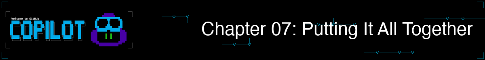
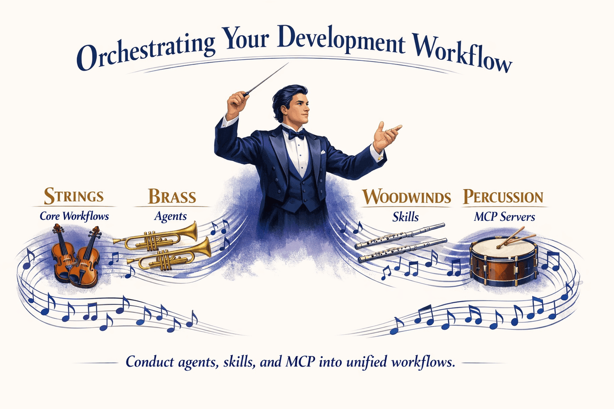

<!--
---
id: CopilotCLI-07
title: !translate Putting It All Together
description: !translate Combine context, workflows, agents, skills, and MCP into complete feature development workflows from idea to pull request.
audience: Developers / Students / Terminal users
slug: putting-it-all-together
weight: 8
---
-->



> **Todo lo que aprendiste se combina aquí. Ve de la idea a un PR fusionado en una sola sesión.**

En este capítulo, reunirás todo lo que has aprendido en flujos de trabajo completos. Construirás funcionalidades usando colaboración multi-agente, configurarás hooks de pre-commit que detecten problemas de seguridad antes de que se cometan, integrarás Copilot en pipelines de CI/CD y pasarás de la idea de una funcionalidad a un PR fusionado en una sola sesión de terminal. Aquí es donde GitHub Copilot CLI se convierte en un verdadero multiplicador de fuerza.

> 💡 **Nota**: Este capítulo muestra cómo combinar todo lo que has aprendido. **No necesitas agentes, habilidades o MCP para ser productivo (aunque pueden ser muy útiles).** El flujo de trabajo básico — describir, planear, implementar, probar, revisar, enviar — funciona solo con las funciones integradas de los Capítulos 00-03.

## 🎯 Objetivos de aprendizaje

Al final de este capítulo, podrás:

- Combinar agentes, habilidades y MCP (Model Context Protocol) en flujos de trabajo unificados
- Construir funcionalidades completas usando enfoques multi-herramienta
- Configurar automatizaciones básicas con hooks
- Aplicar buenas prácticas para desarrollo profesional

> ⏱️ **Tiempo estimado**: ~75 minutos (15 min de lectura + 60 min prácticos)

---

## 🧩 Analogía del mundo real: La orquesta



Una orquesta sinfónica tiene muchas secciones:
- **Cuerdas** proporcionan la base (como tus flujos de trabajo principales)
- **Metales** añaden potencia (como agentes con experiencia especializada)
- **Maderas** añaden color (como las habilidades que amplían capacidades)
- **Percusión** mantiene el ritmo (como MCP que conecta con sistemas externos)

Individualmente, cada sección suena limitada. Juntas, bien dirigidas, crean algo magnífico.

**¡Eso es lo que enseña este capítulo!**<br>
*Como un director con una orquesta, diriges agentes, habilidades y MCP en flujos de trabajo unificados*

Empecemos recorriendo un escenario que modifica código, genera pruebas, lo revisa y crea un PR — todo en una sesión.

---

## De idea a PR fusionado en una sola sesión

En lugar de cambiar entre tu editor, terminal, ejecutor de pruebas y la interfaz de GitHub y perder contexto cada vez, puedes combinar todas tus herramientas en una sesión de terminal. Desglosaremos este patrón en la sección [Patrón de integración](#the-integration-pattern-for-power-users) más abajo.

```bash
# Iniciar Copilot en modo interactivo
copilot

> I need to add a "list unread" command to the book app that shows only
> books where read is False. What files need to change?

# Copilot crea un plan de alto nivel...

# Cambiar al agente python-reviewer
> /agent
# Seleccionar "python-reviewer"

> @samples/book-app-project/books.py Design a get_unread_books method.
> What is the best approach?

# El agente python-reviewer produce:
# - Firma del método y tipo de retorno
# - Implementación del filtro usando comprensión de listas
# - Manejo de casos límite para colecciones vacías

# Cambiar al agente pytest-helper
> /agent
# Seleccionar "pytest-helper"

> @samples/book-app-project/tests/test_books.py Design test cases for
> filtering unread books.

# El agente pytest-helper produce:
# - Casos de prueba para colecciones vacías
# - Casos de prueba con libros leídos/no leídos mezclados
# - Casos de prueba con todos los libros leídos

# IMPLEMENTAR
> Add a get_unread_books method to BookCollection in books.py
> Add a "list unread" command option in book_app.py
> Update the help text in the show_help function

# PROBAR
> Generate comprehensive tests for the new feature

# Se generan múltiples pruebas similares a las siguientes:
# - Camino feliz (3 pruebas) — filtra correctamente, excluye los leídos, incluye los no leídos
# - Casos límite (4 pruebas) — colección vacía, todos leídos, ninguno leído, un solo libro
# - Parametrizado (5 casos) — variando las proporciones leídos/no leídos mediante @pytest.mark.parametrize
# - Integración (4 pruebas) — interacción con mark_as_read, remove_book, add_book y la integridad de los datos

# Revisar los cambios
> /review

# Si la revisión es aprobada, usa /pr para operar en la pull request de la rama actual
> /pr [view|create|fix|auto]

# O pide de forma natural si quieres que Copilot lo redacte desde la terminal
> Create a pull request titled "Feature: Add list unread books command"
```

**Enfoque tradicional**: Cambiar entre editor, terminal, ejecutor de pruebas, documentación y la interfaz de GitHub. Cada cambio provoca pérdida de contexto y fricción.

**La idea clave**: Dirigiste especialistas como un arquitecto. Ellos se encargaron de los detalles. Tú te encargaste de la visión.

> 💡 **Para ir más lejos**: Para planes grandes con varios pasos como este, prueba `/fleet` para permitir que Copilot ejecute subtareas independientes en paralelo. Consulta la [documentación oficial](https://docs.github.com/copilot/concepts/agents/copilot-cli/fleet) para más detalles.

---

# Flujos de trabajo adicionales


Para usuarios avanzados que completaron los Capítulos 04-06, estos flujos de trabajo muestran cómo agentes, habilidades y MCP multiplican tu eficacia.

## El patrón de integración

Aquí está el modelo mental para combinar todo:


---

## Flujo de trabajo 1: Investigación y corrección de errores

Corrección de errores en el mundo real con integración completa de herramientas:

```bash
copilot

# FASE 1: Entender el error desde GitHub (MCP proporciona esto)
> Get the details of issue #1

# Aprender: "find_by_author no funciona con nombres parciales"

# FASE 2: Investigar las mejores prácticas (investigación profunda con fuentes web y de GitHub)
> /research Best practices for Python case-insensitive string matching

# FASE 3: Encontrar código relacionado
> @samples/book-app-project/books.py Show me the find_by_author method

# FASE 4: Obtener análisis experto
> /agent
# Seleccionar "python-reviewer"

> Analyze this method for issues with partial name matching

# El agente identifica: el método usa igualdad exacta en lugar de coincidencia de subcadenas

# FASE 5: Corregir con la orientación del agente
> Implement the fix using lowercase comparison and 'in' operator

# FASE 6: Generar pruebas
> /agent
# Seleccionar "pytest-helper"

> Generate pytest tests for find_by_author with partial matches
> Include test cases: partial name, case variations, no matches

# FASE 7: Hacer commit y pull request
> Generate a commit message for this fix

> Create a pull request linking to issue #1
```

---

## Flujo de trabajo 2: Automatización de revisión de código (Opcional)

> 💡 **Esta sección es opcional.** Los hooks de pre-commit son útiles para equipos pero no son necesarios para ser productivo. Sáltate esto si recién empiezas.
>
> ⚠️ **Nota de rendimiento**: Este hook llama a `copilot -p` por cada archivo en staging, lo que toma varios segundos por archivo. Para commits grandes, considera limitarlo a archivos críticos o ejecutar las revisiones manualmente con `/review` en su lugar.

Un **git hook** es un script que Git ejecuta automáticamente en ciertos momentos, por ejemplo, justo antes de un commit. Puedes usar esto para ejecutar comprobaciones automatizadas en tu código. Aquí tienes cómo configurar una revisión automatizada de Copilot en tus commits:

```bash
# Crear un gancho pre-commit
cat > .git/hooks/pre-commit << 'EOF'
#!/bin/bash

# Obtener archivos preparados para commit (solo archivos Python)
STAGED=$(git diff --cached --name-only --diff-filter=ACM | grep -E '\.py$')

if [ -n "$STAGED" ]; then
  echo "Running Copilot review on staged files..."

  for file in $STAGED; do
    echo "Reviewing $file..."

    # Usar tiempo de espera para evitar bloqueos (60 segundos por archivo)
    # --allow-all aprueba automáticamente lecturas/escrituras de archivos para que el hook pueda ejecutarse sin supervisión.
    # Utilice esto solo en scripts automatizados. En sesiones interactivas, deje que Copilot solicite permiso.
    REVIEW=$(timeout 60 copilot --allow-all -p "Quick security review of @$file - critical issues only" 2>/dev/null)

    # Comprobar si ocurrió un tiempo de espera
    if [ $? -eq 124 ]; then
      echo "Warning: Review timed out for $file (skipping)"
      continue
    fi

    if echo "$REVIEW" | grep -qi "CRITICAL"; then
      echo "Critical issues found in $file:"
      echo "$REVIEW"
      exit 1
    fi
  done

  echo "Review passed"
fi
EOF

chmod +x .git/hooks/pre-commit
```

> ⚠️ **Usuarios de macOS**: El comando `timeout` no está incluido por defecto en macOS. Instálalo con `brew install coreutils` o reemplaza `timeout 60` por una invocación simple sin un límite de tiempo.

> 📚 **Documentación oficial**: [Usar hooks](https://docs.github.com/copilot/how-tos/copilot-cli/use-hooks) y [Referencia de configuración de hooks](https://docs.github.com/copilot/reference/hooks-configuration) para la API completa de hooks.
>
> 💡 **Alternativa integrada**: Copilot CLI también tiene un sistema de hooks integrado (`copilot hooks`) que puede ejecutarse automáticamente en eventos como pre-commit. El git hook manual anterior te da control total, mientras que el sistema integrado es más sencillo de configurar. Consulta la documentación anterior para decidir qué enfoque se ajusta a tu flujo de trabajo.

Ahora cada commit recibe una revisión de seguridad rápida:

```bash
git add samples/book-app-project/books.py
git commit -m "Update book collection methods"

# Salida:
# Ejecutando la revisión de Copilot en los archivos preparados...
# Revisando samples/book-app-project/books.py...
# Se encontraron problemas críticos en samples/book-app-project/books.py:
# - Línea 15: Vulnerabilidad de inyección de ruta de archivo en load_from_file
#
# Corrige el problema y vuelve a intentarlo.
```

---

## Flujo de trabajo 3: Incorporación a una nueva base de código

Al unirte a un nuevo proyecto, combina contexto, agentes y MCP para ponerte al día rápidamente:

```bash
# Iniciar Copilot en modo interactivo
copilot

# FASE 1: Obtener una visión general con contexto
> @samples/book-app-project/ Explain the high-level architecture of this codebase

# FASE 2: Comprender un flujo específico
> @samples/book-app-project/book_app.py Walk me through what happens
> when a user runs "python book_app.py add"

# FASE 3: Obtener análisis experto con un agente
> /agent
# Seleccionar "python-reviewer"

> @samples/book-app-project/books.py Are there any design issues,
> missing error handling, or improvements you would recommend?

# FASE 4: Encontrar algo en lo que trabajar (MCP proporciona acceso a GitHub)
> List open issues labeled "good first issue"

# FASE 5: Empezar a contribuir
> Pick the simplest open issue and outline a plan to fix it
```

Este flujo de trabajo combina el contexto `@`, agentes y MCP en una única sesión de incorporación, exactamente el patrón de integración visto anteriormente en este capítulo.

---

# Mejores prácticas y automatización

Patrones y hábitos que hacen tus flujos de trabajo más efectivos.

---

## Mejores prácticas

### 1. Comienza con contexto antes del análisis

Siempre reúne contexto antes de pedir un análisis:

```bash
# Bueno
> Get the details of issue #42
> /agent
# Seleccionar python-reviewer
> Analyze this issue

# Menos efectivo
> /agent
# Seleccionar python-reviewer
> Fix login bug
# El agente no tiene contexto del problema
```

### 2. Conoce la diferencia: Agentes, Habilidades e Instrucciones personalizadas

Cada herramienta tiene su punto fuerte:

```bash
# Agentes: Personas especializadas que activas explícitamente
> /agent
# Selecciona python-reviewer
> Review this authentication code for security issues

# Habilidades: Capacidades modulares que se activan automáticamente cuando tu prompt
# coincide con la descripción de la habilidad (debes crearlas primero — ver Cap. 05)
> Generate comprehensive tests for this code
# Si tienes una habilidad de pruebas configurada, se activa automáticamente

# Instrucciones personalizadas (.github/copilot-instructions.md): Siempre activas
# Orientación que se aplica a cada sesión sin tener que cambiar o activar nada
```

> 💡 **Punto clave**: Agentes y habilidades pueden tanto analizar COMO generar código. La verdadera diferencia es **cómo se activan** — los agentes son explícitos (`/agent`), las habilidades son automáticas (activadas por coincidencia con el prompt) y las instrucciones personalizadas están siempre activas.

### 3. Mantén las sesiones enfocadas

Usa `/rename` para etiquetar tu sesión (facilita encontrarla en el historial) y `/exit` para cerrarla correctamente:

```bash
# Bueno: una característica por sesión
> /rename list-unread-feature
# Trabajar en la lista de no leídos
> /exit

copilot
> /rename export-csv-feature
# Trabajar en la exportación CSV
> /exit

# Menos efectivo: todo en una sesión larga
```

### 4. Haz los flujos de trabajo reutilizables con Copilot

En lugar de solo documentar los flujos de trabajo en una wiki, codifícalos directamente en tu repo donde Copilot pueda usarlos:

- **Instrucciones personalizadas** (`.github/copilot-instructions.md`): Guía siempre activa para estándares de código, reglas de arquitectura y pasos de construcción/pruebas/despliegue. Cada sesión las sigue automáticamente.
- **Archivos de prompts** (`.github/prompts/`): Prompts reutilizables y parametrizados que tu equipo puede compartir — como plantillas para revisiones de código, generación de componentes o descripciones de PR.
- **Agentes personalizados** (`.github/agents/`): Codifica personas especializadas (p. ej., un revisor de seguridad o un redactor de documentación) que cualquiera del equipo puede activar con `/agent`.
- **Habilidades personalizadas** (`.github/skills/`): Empaqueta instrucciones de flujo de trabajo paso a paso que se activan automáticamente cuando son relevantes.

> 💡 **La recompensa**: Los nuevos miembros del equipo obtienen tus flujos de trabajo gratis — están integrados en el repo, no encerrados en la cabeza de alguien.

---

## Bonus: Patrones de producción

Estos patrones son opcionales pero valiosos para entornos profesionales.

### Generador de descripción de PR

```bash
# Generar descripciones completas de PR
BRANCH=$(git branch --show-current)
COMMITS=$(git log main..$BRANCH --oneline)

copilot -p "Generate a PR description for:
Branch: $BRANCH
Commits:
$COMMITS

Include: Summary, Changes Made, Testing Done, Screenshots Needed"
```

### Integración CI/CD

Para equipos con pipelines de CI/CD existentes, puedes automatizar las revisiones de Copilot en cada pull request usando GitHub Actions. Esto incluye publicar comentarios de revisión automáticamente y filtrar problemas críticos.

> 📖 **Más información**: Consulta [Integración CI/CD](../appendices/ci-cd-integration.md) para flujos de trabajo completos de GitHub Actions, opciones de configuración y consejos para resolver problemas.

---

# Práctica


Pon en práctica el flujo de trabajo completo.

---

## ▶️ Pruébalo tú mismo

Después de completar las demos, prueba estas variaciones:

1. **Desafío de extremo a extremo**: Elige una característica pequeña (p. ej., "listar libros no leídos" o "exportar a CSV"). Usa el flujo completo:
   - Planifica con `/plan`
   - Diseña con agentes (python-reviewer, pytest-helper)
   - Implementa
   - Genera pruebas
   - Crea un PR

2. **Desafío de automatización**: Configura el hook de pre-commit del flujo de Automatización de Revisión de Código. Haz un commit con una vulnerabilidad intencional en la ruta de archivo. ¿Queda bloqueado?

3. **Tu flujo de trabajo de producción**: Diseña tu propio flujo para una tarea común que haces. Escríbelo como una lista de verificación. ¿Qué partes podrían automatizarse con habilidades, agentes o hooks?

**Autoevaluación**: Has completado el curso cuando puedas explicar a un colega cómo agentes, habilidades y MCP trabajan juntos - y cuándo usar cada uno.

---

## 📝 Tarea

### Desafío principal: Funcionalidad de extremo a extremo

Los ejemplos prácticos guiaron la construcción de la funcionalidad "listar libros no leídos". Ahora practica el flujo completo con una característica diferente: **buscar libros por rango de años**:

1. Inicia Copilot y recopila contexto: `@samples/book-app-project/books.py`
2. Planifica con `/plan Añadir un comando "buscar por año" que permita a los usuarios encontrar libros publicados entre dos años`
3. Implementa un método `find_by_year_range(start_year, end_year)` en `BookCollection`
4. Añade una función `handle_search_year()` en `book_app.py` que solicite al usuario los años inicial y final
5. Genera pruebas: `@samples/book-app-project/books.py @samples/book-app-project/tests/test_books.py Genera pruebas para find_by_year_range() incluyendo casos límite como años inválidos, rango invertido y sin resultados.`
6. Revisa con `/review`
7. Actualiza el README: `@samples/book-app-project/README.md Añade documentación para el nuevo comando "buscar por año".`
8. Genera un mensaje de commit

Documenta tu flujo de trabajo mientras avanzas.

**Criterios de éxito**: Has completado la funcionalidad desde la idea hasta el commit usando Copilot CLI, incluyendo planificación, implementación, pruebas, documentación y revisión.

> 💡 **Bonus**: Si tienes agentes configurados desde el Capítulo 04, intenta crear y usar agentes personalizados. Por ejemplo, un agente manejador de errores para la revisión de implementación y un agente escritor de documentación para la actualización del README.

<details>
<summary>💡 Pistas (haz clic para expandir)</summary>

**Sigue el patrón del ejemplo ["De idea a PR fusionado en una sola sesión"](#de-idea-a-pr-fusionado-en-una-sola-sesión)** al inicio de este capítulo. Los pasos clave son:

1. Reúne contexto con `@samples/book-app-project/books.py`
2. Planifica con `/plan Añadir un comando "buscar por año"`
3. Implementa el método y el manejador de comando
4. Genera pruebas con casos límite (entrada inválida, resultados vacíos, rango invertido)
5. Revisa con `/review`
6. Actualiza el README con `@samples/book-app-project/README.md`
7. Genera el mensaje de commit con `-p`

**Casos límite a considerar:**
- ¿Qué pasa si el usuario introduce "2000" y "1990" (rango invertido)?
- ¿Qué pasa si ningún libro coincide con el rango?
- ¿Qué pasa si el usuario introduce datos no numéricos?

**La clave es practicar el flujo de trabajo completo** desde la idea → contexto → plan → implementar → probar → documentar → commit.

</details>

---

<details>
<summary>🔧 <strong>Errores comunes</strong> (haz clic para expandir)</summary>

| Error | Qué sucede | Solución |
|---------|--------------|-----|
| Saltar directamente a la implementación | Se pasan por alto problemas de diseño que son costosos de arreglar más tarde | Usa `/plan` primero para pensar el enfoque |
| Usar una sola herramienta cuando varias ayudarían | Resultados más lentos y menos exhaustivos | Combina: Agente para análisis → Habilidad para ejecución → MCP para integración |
| No revisar antes de commitear | Problemas de seguridad o bugs se filtran | Ejecuta siempre `/review` o usa un [pre-commit hook](#codeblock1) |
| Olvidar compartir los flujos de trabajo con el equipo | Cada persona reinventa la rueda | Documenta los patrones en agentes, habilidades e instrucciones compartidas |

</details>

---

# Resumen

## 🔑 Puntos clave

1. **Integración > Aislamiento**: Combina herramientas para máximo impacto
2. **Contexto primero**: Siempre reúne el contexto requerido antes del análisis
3. **Los agentes analizan, las habilidades ejecutan**: Usa la herramienta adecuada para el trabajo
4. **Automatiza la repetición**: Los hooks y scripts multiplican tu efectividad
5. **Documenta los flujos de trabajo**: Los patrones compartibles benefician a todo el equipo

> 📋 **Referencia rápida**: Consulta la [referencia de comandos de GitHub Copilot CLI](https://docs.github.com/en/copilot/reference/cli-command-reference) para una lista completa de comandos y atajos.

---

## 🎓 ¡Curso completado!

¡Felicidades! Has aprendido:

| Capítulo | Qué aprendiste |
|---------|-------------------|
| 00 | Instalación de Copilot CLI e inicio rápido |
| 01 | Tres modos de interacción |
| 02 | Gestión del contexto con la sintaxis @ |
| 03 | Flujos de trabajo de desarrollo |
| 04 | Agentes especializados |
| 05 | Habilidades extensibles |
| 06 | Conexiones externas con MCP |
| 07 | Flujos de trabajo de producción unificados |

Ahora estás listo para usar GitHub Copilot CLI como un verdadero multiplicador de productividad en tu flujo de trabajo de desarrollo.

## ➡️ ¿Qué sigue?

Tu aprendizaje no se detiene aquí:

1. **Practica a diario**: Usa Copilot CLI para trabajo real
2. **Construye herramientas personalizadas**: Crea agentes y habilidades para tus necesidades específicas
3. **Comparte conocimiento**: Ayuda a tu equipo a adoptar estos flujos de trabajo
4. **Mantente actualizado**: Sigue las actualizaciones de GitHub Copilot para conocer nuevas funciones

### Recursos

- [Documentación de GitHub Copilot CLI](https://docs.github.com/copilot/concepts/agents/about-copilot-cli)
- [Registro del servidor MCP](https://github.com/modelcontextprotocol/servers)
- [Habilidades de la comunidad](https://github.com/topics/copilot-skill)

---

**¡Gran trabajo! Ahora ve y construye algo asombroso.**

**[← Volver al Capítulo 06](../06-mcp-servers/README.md)** | **[Regresar al inicio del curso →](../README.md)**

---

<!-- CO-OP TRANSLATOR DISCLAIMER START -->
**Descargo de responsabilidad**:
Este documento ha sido traducido utilizando el servicio de traducción automática [Co-op Translator](https://github.com/Azure/co-op-translator). Aunque nos esforzamos por la precisión, tenga en cuenta que las traducciones automatizadas pueden contener errores o inexactitudes. El documento original en su idioma nativo debe considerarse la fuente autorizada. Para información crítica, se recomienda una traducción profesional humana. No somos responsables de cualquier malentendido o interpretación errónea que surja del uso de esta traducción.
<!-- CO-OP TRANSLATOR DISCLAIMER END -->