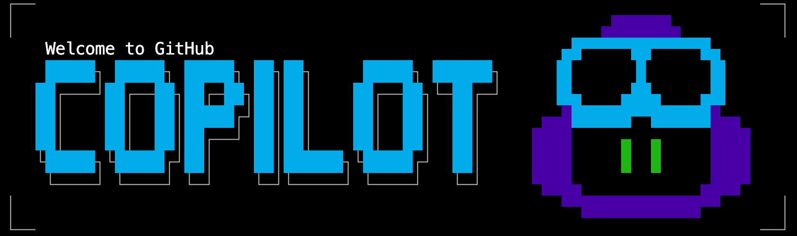
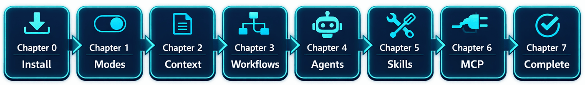

<!--
---
id: CopilotCLI-ROOT
title: !translate GitHub Copilot CLI for Beginners
description: !translate Learn to supercharge your development workflow with AI-powered command-line assistance from your terminal.
audience: Developers / Students / Terminal users
slug: copilot-cli-for-beginners
weight: 0
---
-->

&ensp;
&ensp;
&ensp;

🎯 [Qué aprenderás](#qué-aprenderás) &ensp; ✅ [Requisitos](#requisitos-previos) &ensp; 🤖 [Familia Copilot](#entendiendo-la-familia-github-copilot) &ensp; 📚 [Estructura del curso](#estructura-del-curso) &ensp; 📋 [Referencia de comandos](#referencia-de-comandos-de-github-copilot-cli)

# GitHub Copilot CLI para Principiantes

> **✨ Aprende a potenciar tu flujo de desarrollo con asistencia en la línea de comandos impulsada por IA.**

GitHub Copilot CLI lleva la asistencia de IA directamente a tu terminal. En lugar de cambiar a un navegador o editor de código, puedes hacer preguntas, generar aplicaciones completas, revisar código, generar pruebas y depurar problemas sin salir de la línea de comandos.

Piénsalo como tener un colega experto disponible 24/7 que puede leer tu código, explicar patrones confusos y ayudarte a trabajar más rápido.

> 📘 **¿Prefieres una experiencia web?** Puedes seguir este curso aquí en GitHub, o verlo en [Awesome Copilot](https://awesome-copilot.github.com/learning-hub/cli-for-beginners/) para una experiencia de navegación más tradicional.

Este curso está diseñado para:

- **Desarrolladores de software** que desean usar IA desde la línea de comandos
- **Usuarios de terminal** que prefieren flujos de trabajo impulsados por teclado en lugar de integraciones de IDE
- **Equipos que buscan estandarizar** prácticas de revisión de código y desarrollo asistidas por IA

## 🎯 Qué aprenderás

Este curso práctico te lleva de cero a productivo con GitHub Copilot CLI. Trabajarás con una única aplicación de colección de libros en Python a lo largo de todos los capítulos, mejorándola progresivamente usando flujos de trabajo asistidos por IA. Al final, usarás IA con confianza para revisar código, generar pruebas, depurar problemas y automatizar flujos de trabajo: todo desde tu terminal.

**No se requiere experiencia con IA.** Si puedes usar un terminal, puedes aprender esto.

**Perfecto para:** desarrolladores, estudiantes y cualquier persona con experiencia en desarrollo de software.

## ✅ Requisitos previos

Antes de comenzar, asegúrate de tener:

- **Cuenta de GitHub**: [Crea una gratis](https://github.com/signup) 
- **Acceso a GitHub Copilot**: [Oferta gratuita](https://github.com/features/copilot/plans), [Suscripción mensual](https://github.com/features/copilot/plans), o [Gratis para estudiantes/docentes](https://education.github.com/pack) 
- **Conceptos básicos de terminal**: Cómodo con `cd`, `ls`, ejecutar comandos

## 🤖 Entendiendo la familia GitHub Copilot

GitHub Copilot se ha convertido en una familia de herramientas impulsadas por IA. A continuación se muestra dónde opera cada una:

| Producto | Dónde se ejecuta | Descripción |
|---------|---------------|----------|
| [**GitHub Copilot CLI**](https://docs.github.com/copilot/how-tos/copilot-cli/cli-getting-started) (este curso) | Tu terminal |  Asistente de codificación con IA nativo del terminal  |
| [**GitHub Copilot**](https://docs.github.com/copilot) | VS Code, Visual Studio, JetBrains, etc. | Modo agente, chat, sugerencias en línea  |
| [**Copilot on GitHub.com**](https://github.com/copilot) | GitHub | Chat inmersivo sobre tus repos, crear agentes y más |
| [**GitHub Copilot cloud agent**](https://docs.github.com/copilot/using-github-copilot/using-copilot-coding-agent-to-work-on-tasks) | GitHub  | Asignar issues a agentes, recibir PRs |

Este curso se centra en **GitHub Copilot CLI**, llevando la asistencia de IA directamente a tu terminal.

## 📚 Estructura del curso

| Capítulo | Título | Qué construirás |
|:-------:|-------|-------------------|
| 00 | 🚀 [Inicio rápido](./00-quick-start/README.md) | Instalación y verificación |
| 01 | 👋 [Primeros pasos](./01-setup-and-first-steps/README.md) | Demostraciones en vivo + tres modos de interacción |
| 02 | 🔍 [Contexto y conversaciones](./02-context-conversations/README.md) | Análisis de proyectos de múltiples archivos |
| 03 | ⚡ [Flujos de trabajo de desarrollo](./03-development-workflows/README.md) | Revisión de código, depuración, generación de pruebas |
| 04 | 🤖 [Crear asistentes de IA especializados](./04-agents-custom-instructions/README.md) | Agentes personalizados para tu flujo de trabajo |
| 05 | 🛠️ [Automatizar tareas repetitivas](./05-skills/README.md) | Funciones que se cargan automáticamente |
| 06 | 🔌 [Conectar a GitHub, bases de datos y APIs](./06-mcp-servers/README.md) | Integración con el servidor MCP |
| 07 | 🎯 [Integrándolo todo](./07-putting-it-together/README.md) | Flujos de trabajo completos |

## 📖 Cómo funciona este curso

Cada capítulo sigue el mismo esquema:

1. **Analogía del mundo real**: Entiende el concepto mediante comparaciones familiares
2. **Conceptos clave**: Aprende los conocimientos esenciales
3. **Ejemplos prácticos**: Ejecuta comandos reales y observa los resultados
4. **Ejercicio**: Practica lo que aprendiste
5. **Qué sigue**: Vista previa del siguiente capítulo

**Los ejemplos de código se pueden ejecutar.** Cada copilot text block en este curso puede ser copiado y ejecutado en tu terminal.

## 📋 Referencia de comandos de GitHub Copilot CLI

La **[referencia de comandos de GitHub Copilot CLI](https://docs.github.com/en/copilot/reference/cli-command-reference)** te ayuda a encontrar comandos y atajos de teclado para usar Copilot CLI de forma eficaz.

## 🙋 Obtener ayuda

- 🐛 **¿Encontraste un error?** [Abre un Issue](https://github.com/github/copilot-cli-for-beginners/issues)
- 📚 **Documentación oficial:** [Documentación de GitHub Copilot CLI](https://docs.github.com/copilot/concepts/agents/about-copilot-cli)

## Contribuir

> **Nota**: El código utilizado en el curso está diseñado para generar tipos específicos de salida durante revisiones, explicaciones y depuración por lo que no podemos aceptar PRs que cambien el código existente.

**Cómo contribuir:**

1. Haz fork de este repositorio y clónalo en tu máquina
2. Crea una rama de características (`git checkout -b my-improvement`)
3. Realiza tus cambios
4. Envía un pull request

## Licencia

Este proyecto está licenciado bajo los términos de la licencia de código abierto MIT. Consulta el archivo [LICENSE](../../LICENSE) para ver los términos completos.

---

<!-- CO-OP TRANSLATOR DISCLAIMER START -->
**Descargo de responsabilidad**:
Este documento ha sido traducido utilizando el servicio de traducción automática [Co-op Translator](https://github.com/Azure/co-op-translator). Aunque nos esforzamos por la precisión, tenga en cuenta que las traducciones automatizadas pueden contener errores o inexactitudes. El documento original en su idioma nativo debe considerarse la fuente autorizada. Para información crítica, se recomienda una traducción profesional humana. No somos responsables de cualquier malentendido o interpretación errónea que surja del uso de esta traducción.
<!-- CO-OP TRANSLATOR DISCLAIMER END -->